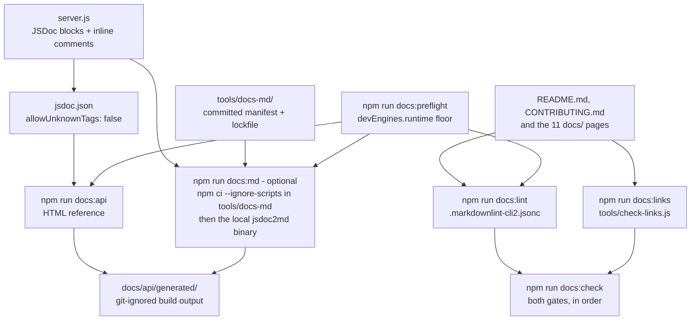

# Contributing

This repository is a documentation-focused project: a 14-line HTTP service plus
the documentation and tooling that describe it. Contributions are almost always
documentation, so this guide covers how to author it, how to validate it, and the
one rule that keeps the service's behaviour fixed.

Source files this guide derives from: `package.json`, `jsdoc.json`,
`.markdownlint-cli2.jsonc`, `.markdown-link-check.json`, `server.js`.

## Scope of contributions

| Change | Status |
| --- | --- |
| Adding or improving a documentation page | Welcome |
| Adding or improving JSDoc annotations and inline comments in `server.js` | Welcome |
| Correcting a factual error, a stale citation, or a broken link | Welcome |
| Improving the documentation tooling in `tools/` or its configuration | Welcome |
| Changing any executable statement in `server.js` | **Not accepted here.** See [The behaviour-preservation rule](#the-behaviour-preservation-rule) |
| Adding a runtime dependency | **Not accepted.** The service imports only Node's built-in `http` module |
| Modifying, repairing, or deleting a repository fixture | **Not accepted.** See [docs/repository-assets.md](docs/repository-assets.md) |
| Replacing the placeholder `test` script | Out of scope; its non-zero exit is intentional |

## Documentation conventions

The repository shipped without a style guide, so these conventions were
established with the documentation corpus and are enforced by the lint gate
wherever a machine can check them.

| Convention | Rule |
| --- | --- |
| Format | Markdown, with diagrams as Mermaid text |
| Headings | ATX style, exactly one H1 per page, never skipping a level, and unique within a page |
| Line length | 80 columns for prose and headings. Tables and code blocks are exempt |
| Code fences | Always fenced, always with a language hint. Permitted: `bash`, `http`, `javascript`, `json`, `mermaid`, `text` |
| Inline HTML | Not permitted in Markdown content |
| Tables | Used for parameter, header, option, and response matrices. Prose is for rationale |
| Citations | Every factual claim about the code carries a plain-text `path:line` citation, for example `Source: server.js:L7` |
| Links | Repository-relative paths only, so they resolve on a hosting platform and in a local preview alike |
| Page structure | Open with a purpose paragraph, name the source files the page derives from, close with a "See also" list |

Two conventions are worth the extra sentence.

**Citations are text, never hyperlinks.** `Source: server.js:L7` survives a file
move and line-number churn by degrading into a stale-but-obvious reference; a
hyperlink to a line number silently rots into a wrong link instead.

**Line references use the original 14-line layout.** `server.js` has 14 content
lines, and every `Lnn` citation in the corpus refers to that unannotated layout,
not to the physical line numbers the comment blocks now produce. Keep new
citations on that basis — the mapping is in
[docs/architecture/code-walkthrough.md](docs/architecture/code-walkthrough.md).

## Authoring JSDoc

The annotations in `server.js` use this tag set, all verified against JSDoc 4.0.5:
`@file`, `@module`, `@description`, `@requires`, `@constant`, `@type`, `@default`,
`@param`, `@returns`, `@callback`, `@typedef`, `@listens`, `@example`, `@see`,
`@author`, `@license`, `@since`.

Two rules apply when extending them.

**Unknown tags fail the build.** `jsdoc.json` sets `tags.allowUnknownTags` to
`false`, so a typo in a tag name is an error rather than a silently dropped
comment. That is deliberate: it makes `npm run docs:api` a parse check as well as
a generator.

**Anonymous functions are documented with `@callback`.** Both functions in
`server.js` are anonymous inline arrow expressions, so neither has an identifier
for an ordinary doc block to attach to. They are documented as the
`RequestHandler` and `ServerStartupCallback` typedefs, which is the
standards-sanctioned way to describe such a function and to make its name usable
as a type. Do not rename a function into existence to make documenting it easier
— that would change executable code.

Every line of code in `server.js` also carries an inline comment, including the
two closing-brace lines. A line-comment convention that skips the structural
lines is not a line-comment convention, so keep new lines annotated the same way.

## Building the API documentation locally

```bash
npm install
npm run docs:api
```

`docs:api` runs JSDoc against `jsdoc.json` and writes an HTML reference to
`docs/api/generated/`. `docs:md` renders the same annotations as Markdown into the
same directory:

```bash
npm run docs:md
```

Three properties of these commands are worth knowing, and the first is the one
that surprises people:

- **They differ in where their packages come from, though both are pinned.**
  `docs:api` runs entirely from the packages `npm install` (or `npm ci`) resolves,
  because `jsdoc` is a declared devDependency pinned and integrity-checked by
  `package-lock.json`. `docs:md` runs from a second, isolated closure: it executes
  `npm ci --ignore-scripts --prefix tools/docs-md` and then the local `jsdoc2md`
  binary. `tools/docs-md` has its own committed `package.json` and
  `package-lock.json`, so `npm ci` installs exactly the 82 packages recorded
  there, each pinned to an exact version with an integrity hash, and the one
  mutable range in the renderer's metadata — an optional `@75lb/nature: latest`
  peer — is never resolved because it is never installed. The first run on a
  machine needs registry access or a populated npm cache; later runs can reuse the
  cache, although `npm ci` still rebuilds the tool directory and does not promise
  to avoid every registry check. Keeping the renderer out of the root manifest is
  deliberate: it is optional to this project, so the three declared
  devDependencies remain the whole of the *required* toolchain, while the lockfile
  beside it keeps the optional path reproducible rather than ad hoc.
  [docs/api/server-module.md](docs/api/server-module.md) documents the mechanism
  in full. It is still not a gate: nothing in the corpus depends on its output.
- **The output directory is disposable.** `docs/api/generated/` is git-ignored
  build output. Neither command prunes stale files from a previous run, so delete
  the directory when you want a guaranteed-clean rebuild:
  `rm -rf docs/api/generated`.
- **A failed `docs:md` leaves a truncated file behind.** The script redirects the
  generator's standard output into
  `docs/api/generated/server-module.md`, and the shell creates that file before
  the generator runs. A run that fails part way therefore leaves a short or empty
  file rather than the previous rendering, so check the exit status rather than
  the file's existence. Delete the directory and re-run once the cause is
  fixed; the file is disposable build output, and the committed reference that
  readers use is [docs/api/server-module.md](docs/api/server-module.md).

Never author a link into `docs/api/generated/`. It is not committed, so such a
link is broken for every reader who has not run the generator.

## Validating documentation

```bash
npm run docs:check
```

That is the aggregate gate: it runs the Markdown lint gate and then the
link-integrity gate, and both must pass. Run them individually while iterating:

```bash
npm run docs:lint
npm run docs:links
```

| Gate | Reads | Fails when |
| --- | --- | --- |
| `docs:lint` | `.markdownlint-cli2.jsonc` | Any Markdown file violates a configured rule |
| `docs:links` | `.markdown-link-check.json` and `tools/check-links.js` | A link is dead, a link could not be checked, a link resolves outside the repository, a planned page is missing, or an unplanned page exists |
| `docs:preflight` | `package.json` `devEngines.runtime` | The Node.js runtime is below the documentation toolchain floor |

Two behaviours of the link gate surprise people, and both are deliberate.

**It never dereferences a web link.** Repository Markdown is untrusted input, and
fetching arbitrary URLs from whichever machine runs the gate is a server-side
request forgery sink. `http`, `https`, and `mailto` links are therefore reported
as ignored, while absolute paths, absolute URLs, opaque schemes, and targets that
resolve outside the repository are rejected outright and fail the gate loudly.

**The page inventory is asserted, not discovered.** `tools/check-links.js` holds
the list of authored pages, and both a missing planned page and an unexpected new
page fail the run. **Adding a page therefore means adding it to that list**,
which is what stops a renamed or forgotten page from passing unnoticed.

## Toolchain pipeline



## The behaviour-preservation rule

**Every edit to `server.js` in this repository is a comment.** The 11 executable
statements stay byte-identical: no reordering, no reformatting, no renaming, no
line wrapping, and no converting an arrow function into a named one. The service's
observable behaviour is what other tooling depends on, so it is fixed.

Verify it before you push:

```bash
node --check server.js
```

```bash
git diff -- server.js
```

The first proves the file still parses. The second must show only added or changed
comment lines. Then confirm the runtime evidence still reproduces: start the
server, check the banner and one response, and stop it.

```bash
node server.js
```

```text
Server running at http://127.0.0.1:3000/
```

```bash
curl --noproxy '*' --include --silent --show-error --max-time 5 http://127.0.0.1:3000/
```

```http
HTTP/1.1 200 OK
Content-Type: text/plain
Date: Tue, 04 Aug 2026 21:58:20 GMT
Connection: keep-alive
Keep-Alive: timeout=5
Content-Length: 14

Hello, World!
```

Only the `Date` header may differ, because its value advances with the clock.

## Documentation evidence rule

Every command shown in this corpus was executed, and its **literal captured
output** was pasted in. Do not write plausible-looking output from memory: if you
cannot run a command, say so and describe the expected behaviour in prose instead
of inventing a transcript. That rule is why the port-conflict section of
[docs/guides/troubleshooting.md](docs/guides/troubleshooting.md) presents
`lsof` and `netstat` as platform tooling without quoted output, and pairs them
with a Node one-liner whose output is captured.

## Checklist before you open a change

- [ ] `node --check server.js` passes, and `git diff -- server.js` shows comments
      only.
- [ ] `npm run docs:check` exits 0.
- [ ] Every new command in the documentation is paired with its captured output.
- [ ] Every new factual claim about the code carries a `path:line` citation.
- [ ] A new page is listed in `tools/check-links.js` and linked from
      [docs/README.md](docs/README.md).
- [ ] A fact that already has an owning page is linked, not restated.
- [ ] No repository fixture was modified, repaired, or deleted.

## See also

- [README](README.md) — the canonical overview.
- [docs/README.md](docs/README.md) — the documentation index and the fact
  ownership table.
- [docs/api/server-module.md](docs/api/server-module.md) — the seven documented
  symbols the JSDoc layer covers.
- [docs/repository-assets.md](docs/repository-assets.md) — the fixtures and their
  preservation policy.
