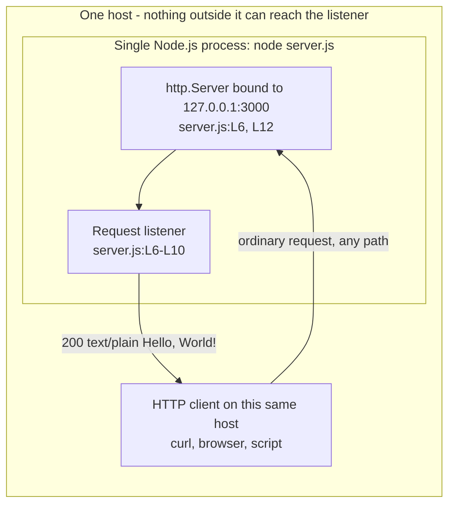
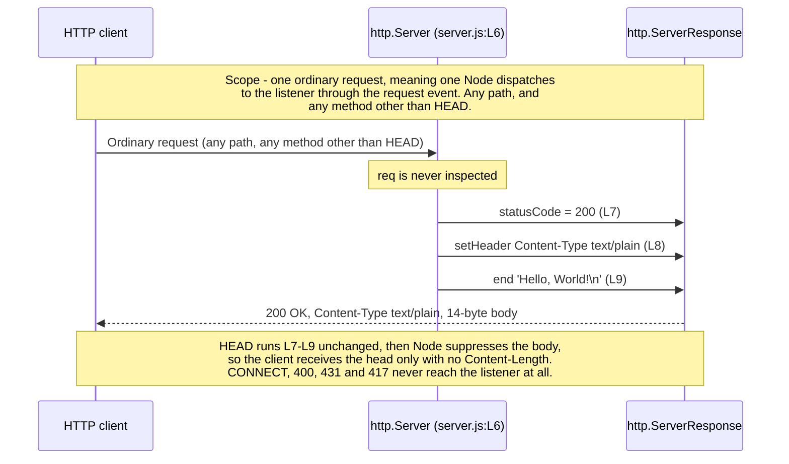

# hao-backprop-test

A minimal, single-module Node.js HTTP service that answers every ordinary
request with the same plain-text greeting. The whole application is
`server.js`: 14 content lines, no framework, no router, and no runtime
dependencies.

## Project identity

This repository is known by two different names, and both are deliberately left
in place.

| Where | Declared name | Source |
| --- | --- | --- |
| This README's title | `hao-backprop-test` | `README.md:L1` in the original two-line file |
| npm manifest | `hello_world` | `package.json` field `name` |
| npm lockfile | `hello_world` | `package-lock.json:L2` |

The mismatch is **documented rather than resolved**. Renaming an npm package
identity is a functional change, the name is mirrored in the lockfile, and the
discrepancy may well be intentional, so this documentation pass records it and
leaves both values untouched. **If you own this repository, please confirm which
name is authoritative** so a later change can reconcile them deliberately.

One further change to this file is worth calling out: the original second line
read `test project for backprop integration. Do not touch!`. That instruction is
superseded by the documentation work this README is part of. The tension is
narrower than it looks — every edit made to `server.js` is a comment, so the
service's behaviour is preserved byte for byte and remains exactly as
deterministic as before.

## Table of contents

- [Project identity](#project-identity)
- [Overview](#overview)
- [Architecture at a glance](#architecture-at-a-glance)
- [Prerequisites](#prerequisites)
- [Installation](#installation)
- [Configuration](#configuration)
- [Running the server](#running-the-server)
- [API documentation](#api-documentation)
- [Code walkthrough](#code-walkthrough)
- [Deployment guide](#deployment-guide)
- [Troubleshooting](#troubleshooting)
- [Project structure and repository assets](#project-structure-and-repository-assets)
- [Known limitations and non-goals](#known-limitations-and-non-goals)
- [License](#license)

## Overview

`server.js` creates one HTTP server, binds it to the IPv4 loopback address on
port 3000, and gives every request Node dispatches through the server's
`request` event the same application-level reply: `Hello, World!` as
`text/plain`. That is the entire feature set, and the following properties are
worth knowing before you read a single line of it.

- **Zero runtime dependencies.** The only import is Node's built-in `http`
  module. Source: `server.js:L1`.
- **No build step.** There is nothing to compile, bundle, or transpile; the file
  runs as written.
- **One catch-all endpoint.** The request listener never inspects the request
  object, so method, path, query string, headers, and body are all ignored.
  Source: `server.js:L6-L10`.
- **Reachable only from the local machine.** The listener is bound to
  `127.0.0.1`, so no other host can connect to it. Source: `server.js:L3`.
- **The module exports nothing.** There is no `module.exports` anywhere in the
  file. Its entire observable contract is a side effect performed at import
  time: requiring the file binds a listening socket. A reader who assumes the
  module is inert on import will bind a port by accident.
- **Both functions in it are anonymous arrow expressions.** Source:
  `server.js:L6` and `server.js:L12`. That is why the JSDoc layer names them
  through `@callback` typedefs rather than through ordinary doc blocks.
- **It is a test fixture, not a production service.** There is no TLS, no
  authentication, no routing, and no graceful shutdown. See
  [Known limitations and non-goals](#known-limitations-and-non-goals).

## Architecture at a glance

The following diagram is mirrored from `docs/architecture/overview.md`, which
owns it. Edit both copies together.



The design is a single process with a single responsibility. Node's event loop
accepts connections and dispatches each request to one listener function; there
is no application worker pool, no cluster, and no shared application state, so
nothing in the listener has to be synchronised. Node still holds per-connection
runtime resources such as sockets, parser buffers, and unread request bodies;
[docs/architecture/overview.md](docs/architecture/overview.md#application-state-versus-runtime-state)
owns that distinction. Every application-level reply is composed from constants
in the source, which is what makes the service stateless: two ordinary requests
that arrive a week apart get the same answer, and restarting the process loses
nothing.

The startup path is equally short. Requiring `http`, reading two configuration
constants, constructing the server, and calling `server.listen()` all happen in
one pass through the file. The call returns immediately; Node completes the bind
and emits the `listening` event afterwards, then the process waits for
connections. Everything after the call is event-driven — the bind completing, a
connection arriving, a request being parsed, a response being flushed. For the
diagrams that break those two paths down step by step, see
[docs/architecture/overview.md](docs/architecture/overview.md) and
[docs/architecture/request-lifecycle.md](docs/architecture/request-lifecycle.md).

## Prerequisites

**Running the service** needs Node.js and nothing else. **Following this
README end to end** needs two more programs, listed rather than assumed because
a minimal container image or a fresh Windows install may have neither: Git, to
clone the repository once, and curl, for the verification request — and curl is
optional, because a Node-only equivalent is given in
[docs/getting-started/installation.md](docs/getting-started/installation.md).

| Requirement | Value | Why |
| --- | --- | --- |
| Node.js floor | `>=18` | Covers the core `http` API surface this module uses, and is declared in `package.json` as `engines.node`. A functional floor only — it says nothing about security support |
| Node.js to actually run | a line still receiving security patches: Node 22, 24 or 26 as this is written | Node 18 and Node 20 satisfy the floor and are **end-of-life**, so they receive no security fixes. Do not use an end-of-life runtime for security-sensitive or network-reachable operation |
| Node.js verified | `v22.23.2` | The version this documentation was written and verified against |
| npm verified | `11.18.0` | Used for the install and script runs quoted throughout |
| Git | any current version | One `git clone`; no floor is declared |
| curl | any current version, optional | One plain `GET`; a Node-only alternative is documented |

The floor is the contract, the verified versions are an observation, and the
second row is a security requirement that no manifest field expresses — nothing
warns you when you are on an end-of-life runtime, because it satisfies `>=18`.
[docs/getting-started/installation.md](docs/getting-started/installation.md)
carries the support dates. Check your toolchain:

```bash
node --version
npm --version
```

Captured output:

```text
v22.23.2
11.18.0
```

`docs/getting-started/installation.md` owns the runtime baseline in full,
including what to do when your Node.js version is older than the floor. See
[docs/getting-started/installation.md](docs/getting-started/installation.md).

## Installation

Clone the repository and enter it. **This block is a template** — the clone URL
depends on where you are reading this from, so paste your own remote into the
first line. Holding it in a quoted variable and naming the destination directory
explicitly is what makes the block copy-pasteable: a bare
`git clone <repository-url>` is not valid shell at all, because `<` and `>` are
redirection operators. The `--` ends Git's option parsing, which quoting cannot
do, so a URL beginning with `-` cannot be read as an option;
[docs/getting-started/installation.md](docs/getting-started/installation.md) owns
the full rationale.

```bash
REPOSITORY_URL="paste your clone URL here"
git clone -- "$REPOSITORY_URL" hao-backprop-test
cd hao-backprop-test
```

Then install:

```bash
npm install
```

Captured output:

```text
added 178 packages, and audited 179 packages in 1s

77 packages are looking for funding
  run `npm fund` for details

found 0 vulnerabilities
```

**Everything that command installed is documentation tooling, not runtime code.**
The manifest declares no `dependencies` at all — only three
`devDependencies` (`jsdoc`, `markdownlint-cli2`, and `markdown-link-check`) that
build and check this documentation. The service itself needs none of them, which
you can confirm without uninstalling anything:

```bash
npm ls --omit=dev --depth=0
```

Captured output, with one substitution marked in the transcript itself — the
absolute path is machine-specific, so `<your repository root>` stands where the
captured run printed this clone's own path:

```text
hello_world@1.0.0 <your repository root>
└── (empty)
```

The practical consequence: `node server.js` runs correctly on a freshly cloned
repository with no `node_modules` directory present. Install only if you intend
to build or lint the documentation.

## Configuration

Configuration consists of two constants in the source. There is no
configuration file, no `.env`, and no environment variable of any kind is read.

| Option | Value | Source | Effect |
| --- | --- | --- | --- |
| `hostname` | `127.0.0.1` | `server.js:L3` | IPv4 loopback. Confines reachability to the local machine |
| `port` | `3000` | `server.js:L4` | TCP port the listener binds |

To change either one, edit the constant and restart the process. After changing
`port` to `8080`, the banner names the new port, because it is interpolated from
the constant rather than written out a second time:

```bash
node server.js
```

```text
Server running at http://127.0.0.1:8080/
```

There is no reload mechanism, so a running process keeps its old values until it
is stopped and started again. The absence of environment-variable support is
deliberate rather than accidental: the module reads `process.env` nowhere, so
`PORT=8080 node server.js` — POSIX syntax, and `$env:PORT=8080; node server.js`
in PowerShell — still binds port 3000. That is a surprise worth knowing before
you debug a port that never changes.
[docs/getting-started/configuration.md](docs/getting-started/configuration.md)
owns this topic and explains what adding environment support would require.

## Running the server

Run the file directly:

```bash
node server.js
```

Captured output, exactly one line:

```text
Server running at http://127.0.0.1:3000/
```

Or use the npm script, which runs the same command:

```bash
npm start
```

Captured output:

```text
> hello_world@1.0.0 start
> node server.js

Server running at http://127.0.0.1:3000/
```

The banner is printed by the startup callback once the socket is bound, and its
text is interpolated from the two configuration constants. Source:
`server.js:L12-L14`.

Stop the server with `Ctrl+C` in the terminal running it. That is an immediate
termination: the module installs **no** signal handler and performs **no**
graceful shutdown, so in-flight requests are not drained and no cleanup runs.

## API documentation

The service exposes exactly one logical endpoint, and it is neither
path-scoped nor method-scoped. Base URL: `http://127.0.0.1:3000`.

### Request matching

| Aspect | Behaviour | Why |
| --- | --- | --- |
| Method | Any that Node dispatches as a request — `GET`, `POST`, `PUT`, `PATCH`, `DELETE`, `OPTIONS`, `HEAD`. `HEAD` gets the head with no body, and `CONNECT` never reaches the listener at all, both being runtime behaviours rather than decisions of this module | The listener never reads `req.method`. Source: `server.js:L6-L10` |
| Path | Any, including `/` and arbitrary depth | The listener never reads `req.url` |
| Query string | Ignored | Never read |
| Request headers | Ignored | Never read |
| Request body | Ignored by the application | The request stream is not read by this module. Node still receives an announced body and discards it after the reply finishes, so an ignored upload costs bandwidth and holds its connection — see [docs/api/http-api.md](docs/api/http-api.md#what-happens-to-a-body-nobody-reads) |

### Response specification

| Field | Value | Source |
| --- | --- | --- |
| Status | `200` | `res.statusCode = 200` at `server.js:L7` |
| `Content-Type` | `text/plain` | `res.setHeader(...)` at `server.js:L8` |
| `Content-Length` | `14` | Framed by Node from the 14-byte body |
| `Connection` | `keep-alive` for an HTTP/1.1 request that permits reuse | Node's default framing |
| `Keep-Alive` | `timeout=5` | Node's default framing |
| `Date` | Current time, regenerated per response | Node sends it by default |
| Body | `Hello, World!` followed by a newline | `res.end('Hello, World!\n')` at `server.js:L9` |

The status and the header are set through the `res.statusCode` property and the
`res.setHeader()` call; no combined status-and-headers helper is used anywhere in
the file, so the head is flushed implicitly by `res.end()`.

**The application defines no error responses.** The listener contains no
conditional logic, so it has no `4xx` or `5xx` branch — not for an unknown path,
not for an unsupported method, not for a malformed body. Node itself can still
answer above the application: a request its HTTP parser rejects is met with a
protocol-level error such as `400` or `431` that this module neither defines nor
can suppress. The three layers that can produce an outcome are separated in
[docs/api/http-api.md](docs/api/http-api.md).

Two request kinds are answered differently by Node itself rather than by this
application: a `HEAD` request receives the status line and headers with no body
and no `Content-Length`, and a `CONNECT` request never reaches the listener at
all because Node routes it to a separate event this file does not handle.

### Request lifecycle diagram

The following diagram is mirrored from `docs/api/http-api.md`, which owns it.
Edit both copies together.



### Worked examples

Three examples are given rather than one, because it takes all three to
demonstrate that neither the path nor the method affects the answer. Each
transcript below was captured from a real run; only the `Date` header differs
between runs, because its value advances with the clock.

Every probe carries `--noproxy '*'`, which is load-bearing rather than
decorative: without it a configured `http_proxy` intercepts the request, and the
proxy's reply is indistinguishable here from the service's own, so the check
would confirm nothing. `--max-time 5` bounds each probe, and
`--silent --show-error` drops the progress meter while keeping any diagnostic.

Request the root path:

```bash
curl --noproxy '*' --include --silent --show-error --max-time 5 http://127.0.0.1:3000/
```

```http
HTTP/1.1 200 OK
Content-Type: text/plain
Date: Tue, 04 Aug 2026 21:43:47 GMT
Connection: keep-alive
Keep-Alive: timeout=5
Content-Length: 14

Hello, World!
```

Request a path that looks like an API route. No such route is defined, and the
answer is unchanged:

```bash
curl --noproxy '*' --include --silent --show-error --max-time 5 http://127.0.0.1:3000/api/anything
```

```http
HTTP/1.1 200 OK
Content-Type: text/plain
Date: Tue, 04 Aug 2026 21:43:47 GMT
Connection: keep-alive
Keep-Alive: timeout=5
Content-Length: 14

Hello, World!
```

Send a `POST` instead of a `GET`. Again unchanged, which is what proves there is
no method discrimination and therefore no `405` path:

```bash
curl --noproxy '*' --include --silent --show-error --max-time 5 --request POST http://127.0.0.1:3000/whatever
```

```http
HTTP/1.1 200 OK
Content-Type: text/plain
Date: Tue, 04 Aug 2026 21:43:47 GMT
Connection: keep-alive
Keep-Alive: timeout=5
Content-Length: 14

Hello, World!
```

The full HTTP contract lives in
[docs/api/http-api.md](docs/api/http-api.md), and the code-level reference for
the module's seven documented symbols lives in
[docs/api/server-module.md](docs/api/server-module.md).

## Code walkthrough

`server.js` is 14 content lines: 11 lines of code and 3 blank separators at L2,
L5, and L11. The line numbers used here — and everywhere else in this
documentation — refer to that original 14-line layout, which is the citation
basis the whole corpus shares. The JSDoc blocks and inline comments now in the
file shift the physical line numbers without changing that basis.

| Line | Code | What it does |
| --- | --- | --- |
| L1 | `const http = require('http');` | Loads Node's built-in HTTP module. It is a core module, so nothing is installed to satisfy this import |
| L2 | *(blank)* | Separates dependency acquisition from configuration |
| L3 | `const hostname = '127.0.0.1';` | The IPv4 loopback literal. This single value is what confines the service to the local machine |
| L4 | `const port = 3000;` | The TCP port the listener will bind |
| L5 | *(blank)* | Separates configuration from server construction |
| L6 | `const server = http.createServer((req, res) => {` | Instantiates an `http.Server` and registers the request listener that runs once per request |
| L7 | `res.statusCode = 200;` | Sets the status line. Must happen before any body byte is written |
| L8 | `res.setHeader('Content-Type', 'text/plain');` | Declares the payload MIME type. Must precede `res.end()` |
| L9 | `res.end('Hello, World!\n');` | Writes the 14-byte body and terminates the response, flushing the implicit head. For a `HEAD` request Node discards the body |
| L10 | `});` | Closes the request-listener body and the `createServer` invocation |
| L11 | *(blank)* | Separates server construction from socket binding |
| L12 | `server.listen(port, hostname, () => {` | Binds the socket and begins accepting connections. Asynchronous: the callback fires on the `listening` event |
| L13 | `console.log(...)` | Emits the readiness banner, interpolating `hostname` and `port` |
| L14 | `});` | Closes the startup callback and the `listen` invocation |

Two observations that the table cannot convey on its own. First, the request
listener is where the catch-all behaviour comes from: it receives `req` and
never touches it, so there is nothing in the code that could branch on a path or
a method. Second, `server.listen()` is what makes requiring this file
consequential — the socket is bound as a side effect of import, before any
caller has a chance to intervene.

The expanded reading, with a structural map from each line to the symbol that
documents it, is in
[docs/architecture/code-walkthrough.md](docs/architecture/code-walkthrough.md).

## Deployment guide

**Start with this: the service is unreachable from any other machine.** The
listener is bound to `127.0.0.1` at `server.js:L3`, which is the loopback
interface, so a request from another host does not arrive at all — it is refused
at the transport layer, with no log line and no response to explain it.

See it for yourself from the host running the service. Derive that host's own
non-loopback address rather than copying an address out of this page — probing
somebody else's address tells you nothing about your bind — and bypass any
configured proxy, or you get the proxy's verdict instead of your service's:

```bash
HOSTIP="$(hostname -I | awk '{print $1}')"
case "$HOSTIP" in
  *[!0-9.]* | 127.*) HOSTIP='' ;;
  [0-9]*.[0-9]*.[0-9]*.[0-9]*) ;;
  *) HOSTIP='' ;;
esac
curl --noproxy '*' --include --silent --show-error --max-time 5 "http://${HOSTIP:?no usable non-loopback IPv4 address}:3000/"
```

The `case` rejects an empty derivation, a loopback address and anything that is
not four dot-separated numeric groups, and `${HOSTIP:?…}` then fails the
expansion so `curl` never runs on a value that failed validation — a warning
alone would let the probe report a connection failure that says nothing about
the bind. Captured output, with the address **redacted** — the value `curl`
printed is the authoring host's own private address, which is
environment-specific, so `<HOSTIP>` stands in for it. Nothing else in the line
was edited, and `curl` exited 7:

```text
curl: (7) Failed to connect to <HOSTIP> port 3000 after 0 ms: Could not connect to server
curl exit code: 7
```

`hostname -I` is Linux-specific, and
[docs/guides/deployment.md](docs/guides/deployment.md) gives the macOS,
PowerShell, and Node-only equivalents alongside the reason each flag is there.

From a genuinely remote client the same cause can surface as a timeout or a
silent drop rather than an immediate refusal, depending on what sits in between;
[docs/guides/deployment.md](docs/guides/deployment.md) owns that detail.

The same request to `http://127.0.0.1:3000/` succeeds, as shown in
[API documentation](#api-documentation). There are two ways to change that, and
they are not equally good:

1. **Front the service with a reverse proxy — preferred.** Run the proxy on the
   externally reachable interface and have it forward to `127.0.0.1:3000`. The
   service keeps its loopback binding, so no **other host** can reach it except
   through the proxy — but that is a remote-access control and nothing more.
   Every local user and process can still connect straight to `127.0.0.1:3000`,
   bypassing the proxy's TLS, authentication, rate limits and access log
   entirely. A proxy also supplies none of those controls until you explicitly
   configure them, and this repository ships no proxy configuration.
2. **Change the bind address.** Editing `hostname` at `server.js:L3` to
   `0.0.0.0` exposes the listener on every interface. That removes the only
   access control this service has, so restrict reachability with a firewall or
   ACL, terminate TLS, require authentication, and log requests outside the
   service first. [docs/guides/deployment.md](docs/guides/deployment.md) lists
   what has to be in place before the bind changes.

Beyond reachability, four operational realities apply:

- **Process supervision is external.** The process does not daemonise and does
  not restart itself. Use whatever supervisor your platform provides so a crash
  or a reboot does not leave the service down.
- **Run it as an unprivileged user.** Port 3000 needs no elevated privilege and
  the process reads no protected path, so a dedicated ordinary account is
  sufficient — never `root`.
- **There is no graceful shutdown.** No signal handler is installed, so
  termination is immediate and in-flight requests are dropped.
- **A port conflict is fatal at startup.** See
  [Troubleshooting](#troubleshooting) for the exact error and how to clear it.

**This service is not production-ready, and it is not intended to be.** It is a
test fixture. It has no TLS, no authentication, no authorisation, no rate
limiting, no routing, no request logging, no health endpoint, and no error
handling. Do not place it on an untrusted network. The full runbook, including
the deployment-topology diagram, is in
[docs/guides/deployment.md](docs/guides/deployment.md).

## Troubleshooting

| Symptom | Cause | What to do |
| --- | --- | --- |
| `Error: listen EADDRINUSE: address already in use 127.0.0.1:3000` on startup | Another process already holds port 3000 | Stop that process, or change `port` at `server.js:L4` and restart |
| The service answers on `127.0.0.1` but not from another machine | The loopback binding at `server.js:L3` | Front it with a reverse proxy, or change the bind address. See [Deployment guide](#deployment-guide) |
| `npm test` fails with `Error: no test specified` | Intended. `scripts.test` is still the npm-init placeholder, and this project has no test suite | Nothing. The non-zero exit is expected and is not a broken environment |
| `npm start` fails with `Missing script: "start"` | Not an old checkout: this manifest declares the script, and npm falls back to `node server.js` regardless whenever the package root holds one. You are either not in the repository root, or the root `server.js` is missing | `cd` to the directory holding `server.js` and `package.json`, or restore that file |
| A `SyntaxError` at startup | `server.js` does not parse, because it was edited or truncated. It is not evidence of an old Node.js — the source uses nothing newer than the `>=18` floor | Run `node --check server.js`, then restore the file from version control |
| No error at all, but `node --version` reports 18 or 20 | Both satisfy `engines.node` and both are end-of-life, so the runtime receives no security patches and nothing warns you | Move to a maintained LTS line — see [Prerequisites](#prerequisites) and [docs/guides/troubleshooting.md](docs/guides/troubleshooting.md) |

The port-conflict failure, captured by starting a second instance while the
first held the port:

```text
node:events:497
      throw er; // Unhandled 'error' event
      ^

Error: listen EADDRINUSE: address already in use 127.0.0.1:3000
    at Server.setupListenHandle [as _listen2] (node:net:1941:16)
    at listenInCluster (node:net:1998:12)
    at node:net:2207:7
    at process.processTicksAndRejections (node:internal/process/task_queues:89:21)
Emitted 'error' event on Server instance at:
    at emitErrorNT (node:net:1977:8)
    at process.processTicksAndRejections (node:internal/process/task_queues:89:21) {
  code: 'EADDRINUSE',
  errno: -98,
  syscall: 'listen',
  address: '127.0.0.1',
  port: 3000
}

Node.js v22.23.2
```

To find the process holding the port, ask specifically for the **listening**
socket, because a query that is not restricted that way also matches
established connections and can name unrelated client processes:
`lsof -nP -iTCP:3000 -sTCP:LISTEN` on Linux and macOS, or
`netstat -ano | findstr "LISTENING" | findstr ":3000"` on Windows. Inspect the
PID it reports — `ps -p <pid> -o pid,user,args`, or `tasklist /FI "PID eq <pid>"`
— and stop it only once you have confirmed that it is yours and that it is the
listener. Ask for a clean exit first with `kill <pid>` or `taskkill /PID <pid>`,
and escalate to `kill -9 <pid>` or `taskkill /PID <pid> /F` only if the process
survives. Never expand a discovery command straight into `kill`: the safe,
step-by-step procedure, including how to handle zero or several matching PIDs,
is in
[docs/guides/troubleshooting.md](docs/guides/troubleshooting.md). Where none of
those tools is installed, this check needs nothing but Node:

```bash
node -e "const s=require('net').connect(3000,'127.0.0.1');s.setTimeout(2000,()=>{console.error('port 3000 on 127.0.0.1: inconclusive (timed out after 2000 ms)');s.destroy();process.exit(2);});s.on('connect',()=>{console.log('port 3000 on 127.0.0.1 is in use');s.end();process.exit(0);});s.on('error',e=>{if(e.code==='ECONNREFUSED'){console.log('port 3000 on 127.0.0.1 is free');process.exit(1);}console.error('port 3000 on 127.0.0.1: inconclusive ('+e.code+')');process.exit(2);});"
```

Captured output while the service was running, exiting `0`:

```text
port 3000 on 127.0.0.1 is in use
```

Captured with nothing listening, exiting `1`:

```text
port 3000 on 127.0.0.1 is free
```

Only `ECONNREFUSED` is reported as free, and only that. Any other failure — a
permission denial, an unreachable route, or the 2 000 ms deadline expiring because
packets are being dropped rather than refused — goes to standard error as
*inconclusive* and exits `2`, because none of those tells you whether the port is
bound. Captured with packets to `127.0.0.1:3000` dropped by a local firewall rule:

```text
port 3000 on 127.0.0.1: inconclusive (timed out after 2000 ms)
```

The deadline is what makes the check usable: without it, a filtered port leaves
the probe waiting on the operating system's own connect timeout.

The full symptom-to-remedy matrix, with a decision tree, is in
[docs/guides/troubleshooting.md](docs/guides/troubleshooting.md).

## Project structure and repository assets

The repository is a flat tree plus the documentation directory this pass added:

```text
.
├── server.js                  The application: 14 content lines
├── package.json               npm manifest, engines, and the doc scripts
├── package-lock.json          Lockfile, lockfileVersion 3
├── jsdoc.json                 JSDoc generator configuration
├── .markdownlint-cli2.jsonc   Markdown lint rules
├── .markdown-link-check.json  Hermetic link-check policy
├── .gitignore                 Excludes node_modules/ and generated docs
├── LICENSE                    MIT licence text
├── CONTRIBUTING.md            Documentation authoring workflow
├── README.md                  This file
├── docs/                      Documentation corpus (11 pages)
├── tools/                     Documentation gate scripts, plus the
│                              docs-md/ manifest and lockfile for the
│                              optional Markdown renderer
├── LoginTest.java             Fixture: intentionally non-compilable
├── industry.csv               Fixture: 44 lines, 1 header + 43 labels
├── test.txt.txt               Fixture: 0 bytes, intentionally empty
├── sample.doc                 Fixture: 98 KB binary DOC
├── demo.jpg                   Fixture: 2.1 MB binary image
└── 100Pages.pdf               Fixture: 9.5 MB binary PDF
```

Six of those files have nothing to do with the service, and they are **not**
abandoned clutter — they are deliberate multi-format fixtures. Two properties
surprise people often enough to state here:

- `LoginTest.java` **will not compile**, and that is intentional. Its `main`
  method body is the bare, unresolved identifier `Web`. Source:
  `LoginTest.java:L7`. It is not a bug awaiting a fix, and nothing in this
  repository compiles it.
- `test.txt.txt` is **0 bytes on purpose**. Its emptiness is the fixture. Do not
  prune it.

Each fixture's verified properties and the preservation policy are in
[docs/repository-assets.md](docs/repository-assets.md).

### Documentation map

| Page | What it covers |
| --- | --- |
| [docs/README.md](docs/README.md) | Documentation index, reading order, and glossary |
| [docs/getting-started/installation.md](docs/getting-started/installation.md) | Prerequisites, install, run, verify, stop |
| [docs/getting-started/configuration.md](docs/getting-started/configuration.md) | The two configuration constants and how to change them |
| [docs/api/http-api.md](docs/api/http-api.md) | The HTTP contract, in full |
| [docs/api/server-module.md](docs/api/server-module.md) | Code-level reference for all seven documented symbols |
| [docs/guides/deployment.md](docs/guides/deployment.md) | Deployment runbook and hardening caveats |
| [docs/guides/troubleshooting.md](docs/guides/troubleshooting.md) | Symptom-to-remedy matrix and decision tree |
| [docs/architecture/overview.md](docs/architecture/overview.md) | Component model, startup flow, lifecycle states |
| [docs/architecture/request-lifecycle.md](docs/architecture/request-lifecycle.md) | Request handling, step by step |
| [docs/architecture/code-walkthrough.md](docs/architecture/code-walkthrough.md) | Annotated reading of all 14 lines |
| [docs/repository-assets.md](docs/repository-assets.md) | The six non-application fixtures |
| [CONTRIBUTING.md](CONTRIBUTING.md) | How to author and validate documentation here |

## Known limitations and non-goals

Every item below is absent by design, not by oversight. Documentation describes
their absence rather than promising them.

- **No TLS or HTTPS.** Traffic is plain HTTP.
- **No authentication or authorisation.** Every caller is equal, and anonymous.
- **No routing.** One response, whatever the path.
- **No method differentiation.** One response, whatever the method.
- **No rate limiting.** Nothing bounds request volume.
- **No graceful shutdown.** No signal handler, no connection draining.
- **No structured logging.** One banner line at startup; requests are not
  logged.
- **No health-check endpoint.** No `/health` or `/ready` route exists. An HTTP
  `GET` is one basic liveness option; a process check and a TCP connect are the
  others.
- **No error-handling middleware.** The listener defines no `4xx` or `5xx`
  branch, though Node can still emit protocol-level errors above it.
- **No environment-variable configuration.** `process.env` is never read.
- **No test suite.** `npm test` is the npm-init placeholder and exits non-zero
  on purpose.
- **No containerisation, CI, or deployment pipeline.** No `Dockerfile`, no
  compose file, no workflow definitions.

## License

Released under the MIT License, matching the `license` field in
`package.json`. The full text is in [LICENSE](LICENSE).
