# Technical Specification

# 1. Introduction

This document provides the technical specification for the **hao-backprop-test** repository, a deliberately minimal Node.js HTTP server designed to serve as a controlled test environment for Backprop integration validation. As explicitly noted in the repository documentation: "test project for backprop integration. Do not touch!" — this codebase functions as a test fixture rather than production software.

---

## 1.1 Executive Summary

### 1.1.1 Project Overview

The hao-backprop-test project (package name: `hello_world`) is a minimal Node.js HTTP server implementation that returns a static "Hello, World!" response. The project serves as a baseline test fixture for validating Backprop, a tool or service likely used for code analysis, refactoring, or AI-assisted development workflows.

| Attribute | Value |
|-----------|-------|
| Package Name | `hello_world` |
| Project Name | `hao-backprop-test` |
| Version | `1.0.0` |
| License | MIT |
| Author | `hxu` |

The repository intentionally includes diverse file types beyond the core JavaScript implementation, suggesting its purpose extends to testing Backprop's multi-format file handling capabilities.

### 1.1.2 Core Business Problem

This project addresses the need for a **controlled, predictable test environment** for Backprop integration testing. The core challenges being solved include:

1. **Integration Validation**: Providing a known-state codebase against which Backprop's code analysis capabilities can be verified
2. **Multi-Format Testing**: Offering diverse file types (JavaScript, Java, CSV, PDF, images, documents) to validate format handling
3. **Baseline Establishment**: Creating a minimal, zero-dependency reference point that eliminates variables when debugging integration issues

### 1.1.3 Key Stakeholders and Users

| Stakeholder Group | Role | Primary Concern |
|-------------------|------|-----------------|
| Backprop Development Team | Primary | Integration validation and tool testing |
| QA Engineers | Secondary | Regression testing of code analysis features |
| Integration Developers | Secondary | Testing Backprop API/SDK functionality |
| DevOps Engineers | Tertiary | CI/CD pipeline validation |

The explicit "Do not touch!" warning in `README.md` indicates this repository operates under strict change control to preserve its value as a consistent test baseline.

### 1.1.4 Expected Business Impact and Value Proposition

The value proposition of this test project centers on **risk reduction and quality assurance** for Backprop development:

| Value Area | Description |
|------------|-------------|
| Predictable Testing | Known codebase state enables reproducible test results |
| Isolation | Zero dependencies eliminate external failure points |
| Format Coverage | Diverse file types enable comprehensive tool validation |
| Simplicity | Minimal complexity reduces debugging overhead |

---

## 1.2 System Overview

### 1.2.1 Project Context

#### Business Context and Market Positioning

This repository exists within the Backprop development ecosystem as a **test fixture**. It is not intended for market deployment, customer use, or production environments. The project serves an internal quality assurance function for the Backprop tooling initiative.

#### Current System Context

The naming discrepancy between the README identifier (`hao-backprop-test`) and the package name (`hello_world`) may be intentional—potentially testing Backprop's ability to handle identifier inconsistencies, or representing an incomplete initial setup. This characteristic itself may serve as a test case.

#### Integration with Existing Landscape

The repository operates as a **standalone test target** with no upstream or downstream system dependencies. Its isolation is by design:

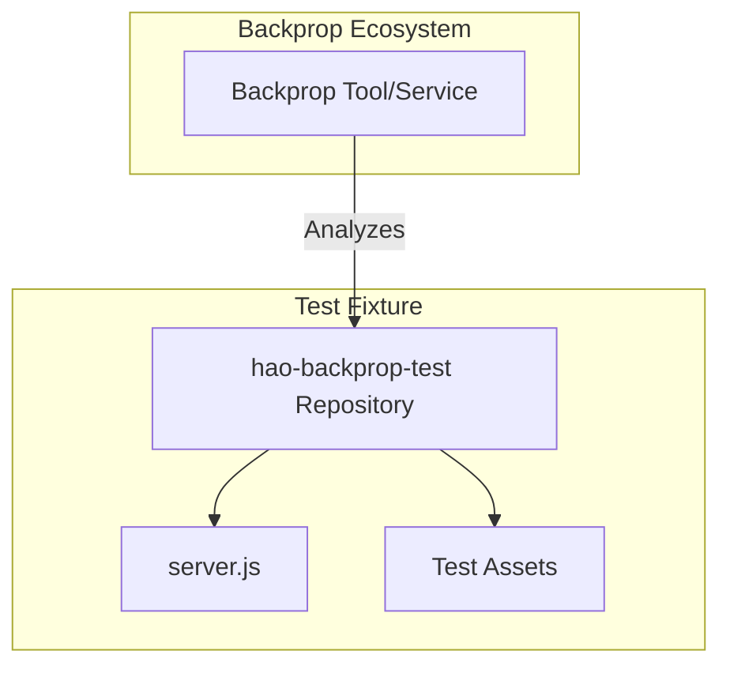

### 1.2.2 High-Level Description

#### Primary System Capabilities

The `server.js` implementation provides exactly one capability: responding to HTTP requests with a static "Hello, World!" message.

| Capability | Implementation | Details |
|------------|----------------|---------|
| HTTP Listening | Node.js `http` module | Binds to `127.0.0.1:3000` |
| Static Response | Synchronous callback | Returns "Hello, World!\n" |
| Console Logging | Built-in `console.log` | Announces server start |

#### Major System Components

The repository contains two categories of components:

**Functional Components:**

| Component | File | Purpose |
|-----------|------|---------|
| HTTP Server | `server.js` | Core application logic |
| Package Manifest | `package.json` | npm metadata and scripts |
| Dependency Lock | `package-lock.json` | Version locking (empty) |
| Documentation | `README.md` | Project identification |

**Test Asset Components:**

| Component | File | Purpose |
|-----------|------|---------|
| Java Source | `LoginTest.java` | Java format testing |
| Structured Data | `industry.csv` | CSV parsing testing |
| Plain Text | `test.txt.txt` | Text file handling |
| Binary Document | `sample.doc` | DOC format testing |
| Binary Image | `demo.jpg` | Image file handling |
| Binary PDF | `100Pages.pdf` | PDF format testing |

#### Core Technical Approach

The server implementation follows a **minimalist philosophy**:

1. **Zero External Dependencies**: Uses only the Node.js built-in `http` module
2. **Single-File Architecture**: All server logic contained in `server.js` (15 lines)
3. **Hardcoded Configuration**: No environment variables or configuration files
4. **Stateless Operation**: No session management, caching, or data persistence
5. **Universal Response**: All HTTP requests receive identical responses regardless of path or method

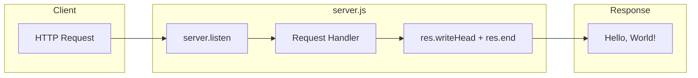

### 1.2.3 Success Criteria

#### Measurable Objectives

Given the test-fixture nature of this project, success is measured against its utility for Backprop validation:

| Objective | Metric | Target |
|-----------|--------|--------|
| Server Operability | Process starts without error | 100% |
| Response Accuracy | Returns expected string | "Hello, World!\n" |
| Port Binding | Successful localhost binding | Port 3000 |
| Analysis Coverage | Backprop processes all files | All file types parsed |

#### Critical Success Factors

1. **Stability**: The codebase must remain unchanged to preserve test consistency (hence "Do not touch!")
2. **Completeness**: All declared file types must be present and accessible
3. **Isolation**: Zero external dependencies to eliminate version conflicts
4. **Determinism**: Identical behavior across all test executions

#### Key Performance Indicators

| KPI | Description | Current Status |
|-----|-------------|----------------|
| Startup Time | Server ready for requests | Immediate (sub-second) |
| Response Time | Time to return response | Negligible (no processing) |
| Memory Footprint | Runtime memory usage | Minimal (Node.js baseline) |
| File Type Coverage | Distinct formats present | 9 file types |

---

## 1.3 Scope

### 1.3.1 In-Scope

#### Core Features and Functionalities

**Must-Have Capabilities:**

| Capability | Description | Evidence |
|------------|-------------|----------|
| HTTP Server | Listen for incoming requests | `server.js` lines 6-11 |
| Static Response | Return "Hello, World!" text | `server.js` lines 7-10 |
| Console Feedback | Log server start message | `server.js` lines 13-15 |

**Primary User Workflow:**

1. User executes `node server.js`
2. Server binds to `127.0.0.1:3000`
3. Console displays: "Server running at http://127.0.0.1:3000/"
4. User sends HTTP request to endpoint
5. Server responds with "Hello, World!"

**Essential Technical Requirements:**

| Requirement | Specification |
|-------------|---------------|
| Runtime | Node.js (version unspecified) |
| Network Interface | Localhost only (127.0.0.1) |
| Port | 3000 |
| Protocol | HTTP (no TLS) |
| Content Type | text/plain |

#### Implementation Boundaries

**System Boundaries:**

- Single process execution
- Local machine deployment only
- No inter-service communication
- No external API consumption

**User Groups Covered:**

- Backprop integration testers
- Local development verification

**Geographic/Market Coverage:**

- Not applicable (internal test fixture)

**Data Domains Included:**

| Domain | File | Records |
|--------|------|---------|
| Industry Categories | `industry.csv` | 43 entries |
| Test Authentication | `LoginTest.java` | Scaffold only |

### 1.3.2 Out-of-Scope

The following elements are explicitly **not implemented** in this project, based on comprehensive `server.js` analysis:

#### Excluded Features and Capabilities

| Category | Excluded Element | Rationale |
|----------|------------------|-----------|
| Security | HTTPS/TLS encryption | Test fixture simplicity |
| Security | Authentication/Authorization | Not required for testing |
| Security | Rate limiting | Not required for testing |
| Routing | Path-based routing | Single response by design |
| Routing | HTTP method differentiation | All methods return same response |
| Configuration | Environment variables | Hardcoded values intentional |
| Configuration | External config files | Minimalist approach |
| Operations | Structured logging | Console.log only |
| Operations | Health check endpoints | Not implemented |
| Operations | Graceful shutdown | Not implemented |
| Operations | Error handling middleware | Node.js defaults only |
| Data | Database connectivity | No persistence layer |
| Data | Session management | Stateless by design |
| Deployment | Containerization | No Dockerfile present |
| Deployment | CI/CD configuration | No pipeline files |
| Testing | Test framework integration | Test script returns error |
| Documentation | API documentation | Not applicable |

#### Future Phase Considerations

This test fixture is designed to remain static. Future enhancements would contradict its purpose as a stable test baseline. Any evolution should occur in separate repositories.

#### Integration Points Not Covered

- External service APIs
- Database systems
- Message queues
- Cache layers
- CDN services
- Monitoring systems

#### Unsupported Use Cases

| Use Case | Status | Alternative |
|----------|--------|-------------|
| Production deployment | Not supported | Use production-ready frameworks |
| Multi-user serving | Not supported | Localhost binding only |
| Dynamic content | Not supported | Static response only |
| API development | Not supported | No routing infrastructure |
| Data processing | Not supported | No input handling |

---

## 1.4 References

#### Files Examined

| File Path | Relevance |
|-----------|-----------|
| `README.md` | Project identity, purpose statement, and maintenance warning ("Do not touch!") |
| `package.json` | Package metadata including name, version, author, license, and scripts |
| `package-lock.json` | Dependency lock confirmation (confirms zero dependencies) |
| `server.js` | Complete HTTP server implementation and technical architecture |
| `LoginTest.java` | Java test scaffold demonstrating multi-language file presence |
| `industry.csv` | Test data file containing 43 industry categories |
| `test.txt.txt` | Empty test file for text format handling |
| `sample.doc` | Binary document test artifact |
| `demo.jpg` | Binary image test artifact |
| `100Pages.pdf` | Binary PDF test artifact |

#### Folders Examined

| Folder Path | Contents |
|-------------|----------|
| Root (`/`) | All 10 tracked files; flat repository structure with no subdirectories |

# 2. Product Requirements

## 2.1 Feature Catalog

This section documents the discrete, testable features present in the hao-backprop-test repository. Given the project's intentional minimalism as a Backprop integration test fixture, the feature set is deliberately limited to two core capabilities.

### 2.1.1 Feature Overview

The repository implements exactly two features designed to serve Backprop integration validation purposes:

| Feature ID | Feature Name | Category | Priority | Status |
|------------|--------------|----------|----------|--------|
| F-001 | HTTP Server | Core Application | Critical | Completed |
| F-002 | Test Asset Repository | Testing Infrastructure | High | Completed |

---

### 2.1.2 F-001: HTTP Server

#### Feature Metadata

| Attribute | Value |
|-----------|-------|
| **Unique ID** | F-001 |
| **Feature Name** | HTTP Server |
| **Feature Category** | Core Application |
| **Priority Level** | Critical |
| **Status** | Completed |
| **Implementation File** | `server.js` |
| **Lines of Code** | 15 |

#### Description

#### Overview

The HTTP Server feature provides a minimal Node.js web server that listens for incoming HTTP requests and returns a static "Hello, World!" response. This server represents the primary functional capability of the repository and serves as a predictable test target for Backprop code analysis validation.

#### Business Value

| Value Dimension | Description |
|-----------------|-------------|
| Integration Validation | Provides a known-state codebase for verifying Backprop's code analysis capabilities |
| Reproducibility | Deterministic behavior ensures consistent test results across executions |
| Debugging Baseline | Minimal complexity reduces variables when troubleshooting integration issues |

#### User Benefits

| Stakeholder | Benefit |
|-------------|---------|
| Backprop Development Team | Reliable test target for integration testing |
| QA Engineers | Predictable behavior for regression testing |
| Integration Developers | Simple reference implementation for API/SDK validation |

#### Technical Context

The server implementation follows a minimalist architecture using only the Node.js built-in `http` module. All configuration values are hardcoded, eliminating external dependencies and configuration complexity.

| Technical Attribute | Implementation |
|--------------------|----------------|
| Runtime Dependency | Node.js built-in `http` module |
| External Dependencies | None (zero npm packages) |
| Configuration Approach | Hardcoded values |
| Architecture Pattern | Single-file, synchronous request handling |
| Response Behavior | Universal (identical for all requests) |

#### Dependencies

#### Prerequisite Features

| Prerequisite | Type | Status |
|--------------|------|--------|
| None | N/A | Feature operates independently |

#### System Dependencies

| Dependency | Type | Required Version |
|------------|------|------------------|
| Node.js Runtime | Platform | Unspecified (any modern version) |
| `http` Module | Built-in | Included with Node.js |

#### External Dependencies

| Dependency Type | Count | Details |
|-----------------|-------|---------|
| npm Packages | 0 | Confirmed via `package-lock.json` |
| External APIs | 0 | No network calls |
| Databases | 0 | No data persistence |

#### Integration Requirements

| Integration Point | Requirement |
|-------------------|-------------|
| Network Interface | Localhost binding (127.0.0.1) |
| Port Availability | Port 3000 must be available |
| Protocol | HTTP (no TLS required) |

---

### 2.1.3 F-002: Test Asset Repository

#### Feature Metadata

| Attribute | Value |
|-----------|-------|
| **Unique ID** | F-002 |
| **Feature Name** | Test Asset Repository |
| **Feature Category** | Testing Infrastructure |
| **Priority Level** | High |
| **Status** | Completed |
| **Implementation** | Root folder file collection |

#### Description

#### Overview

The Test Asset Repository feature provides a curated collection of diverse file types positioned alongside the core HTTP server implementation. These assets enable Backprop to be tested against multiple file formats, validating its multi-format handling capabilities.

#### Business Value

| Value Dimension | Description |
|-----------------|-------------|
| Format Coverage | Enables comprehensive testing of Backprop's file parsing capabilities |
| Edge Case Testing | Includes intentionally incomplete files (e.g., `LoginTest.java`) |
| Data Variety | Provides structured (CSV), source code, and text file samples |

#### User Benefits

| Stakeholder | Benefit |
|-------------|---------|
| Backprop Development Team | Validates multi-language and multi-format support |
| QA Engineers | Comprehensive test coverage for format handling |
| DevOps Engineers | CI/CD pipeline validation across file types |

#### Technical Context

The test assets represent intentionally diverse file types spanning source code, structured data, and text formats. The collection includes both valid and intentionally incomplete files.

| Asset File | File Type | Content Description |
|------------|-----------|---------------------|
| `LoginTest.java` | Java Source | Incomplete scaffold in `com.blitzyTest` package |
| `industry.csv` | CSV Data | 43 industry category labels |
| `test.txt.txt` | Plain Text | Empty file (format handling test) |
| `README.md` | Markdown | Project identifier and maintenance warning |

#### Dependencies

#### Prerequisite Features

| Prerequisite | Type | Status |
|--------------|------|--------|
| None | N/A | Test assets exist independently |

#### System Dependencies

| Dependency | Type | Required |
|------------|------|----------|
| File System | OS | Read access to repository files |

#### External Dependencies

| Dependency Type | Count |
|-----------------|-------|
| None | 0 |

#### Integration Requirements

| Requirement | Description |
|-------------|-------------|
| File Stability | Files must remain unchanged ("Do not touch!") |
| Repository Access | Backprop must have read access to all files |

---

## 2.2 Functional Requirements Tables

### 2.2.1 F-001: HTTP Server Requirements

#### Core Functional Requirements

| Req ID | Description | Priority |
|--------|-------------|----------|
| F-001-RQ-001 | Server Startup | Must-Have |
| F-001-RQ-002 | Port Binding | Must-Have |
| F-001-RQ-003 | HTTP Response | Must-Have |
| F-001-RQ-004 | Response Content | Must-Have |
| F-001-RQ-005 | Content Type Header | Must-Have |
| F-001-RQ-006 | Startup Logging | Should-Have |

---

#### F-001-RQ-001: Server Startup

| Attribute | Specification |
|-----------|---------------|
| **Requirement ID** | F-001-RQ-001 |
| **Description** | Server process starts without error when invoked |
| **Priority** | Must-Have |
| **Complexity** | Low |

| Acceptance Criteria | Validation Method |
|---------------------|-------------------|
| Process starts successfully via `node server.js` | Manual execution |
| No error messages on startup | Console observation |
| Server enters listening state | Startup message confirmation |

| Technical Specification | Value |
|-------------------------|-------|
| **Input Parameters** | None (no command-line arguments) |
| **Output/Response** | Process running, console message |
| **Performance Criteria** | Sub-second startup time |
| **Data Requirements** | None |

| Validation Rule | Specification |
|-----------------|---------------|
| Business Rules | Server must start on first invocation |
| Data Validation | N/A |
| Security Requirements | N/A |
| Compliance Requirements | N/A |

---

#### F-001-RQ-002: Port Binding

| Attribute | Specification |
|-----------|---------------|
| **Requirement ID** | F-001-RQ-002 |
| **Description** | Server binds to localhost on port 3000 |
| **Priority** | Must-Have |
| **Complexity** | Low |

| Acceptance Criteria | Validation Method |
|---------------------|-------------------|
| Server binds to 127.0.0.1 | Network configuration check |
| Server listens on port 3000 | Port availability test |
| Server is accessible locally | HTTP request validation |

| Technical Specification | Value |
|-------------------------|-------|
| **Input Parameters** | Hardcoded: hostname=127.0.0.1, port=3000 |
| **Output/Response** | Bound socket accepting connections |
| **Performance Criteria** | Immediate binding upon startup |
| **Data Requirements** | Port 3000 must be available |

| Validation Rule | Specification |
|-----------------|---------------|
| Business Rules | Port must not conflict with other services |
| Data Validation | N/A |
| Security Requirements | Localhost-only binding (no external access) |
| Compliance Requirements | N/A |

---

#### F-001-RQ-003: HTTP Response

| Attribute | Specification |
|-----------|---------------|
| **Requirement ID** | F-001-RQ-003 |
| **Description** | Server returns HTTP 200 status for all requests |
| **Priority** | Must-Have |
| **Complexity** | Low |

| Acceptance Criteria | Validation Method |
|---------------------|-------------------|
| Response status code is 200 | HTTP client verification |
| Response is returned for any HTTP method | Multi-method testing |
| Response is returned for any URL path | Path variation testing |

| Technical Specification | Value |
|-------------------------|-------|
| **Input Parameters** | Any HTTP request |
| **Output/Response** | HTTP 200 OK |
| **Performance Criteria** | Negligible response time |
| **Data Requirements** | None |

| Validation Rule | Specification |
|-----------------|---------------|
| Business Rules | All requests receive identical treatment |
| Data Validation | No input validation performed |
| Security Requirements | N/A |
| Compliance Requirements | N/A |

---

#### F-001-RQ-004: Response Content

| Attribute | Specification |
|-----------|---------------|
| **Requirement ID** | F-001-RQ-004 |
| **Description** | Server returns exact string "Hello, World!\n" |
| **Priority** | Must-Have |
| **Complexity** | Low |

| Acceptance Criteria | Validation Method |
|---------------------|-------------------|
| Response body equals "Hello, World!\n" | String comparison |
| Newline character is included | Byte-level inspection |
| Response is consistent across requests | Repeated request testing |

| Technical Specification | Value |
|-------------------------|-------|
| **Input Parameters** | N/A (response is static) |
| **Output/Response** | "Hello, World!\n" (14 characters) |
| **Performance Criteria** | Static content, no computation |
| **Data Requirements** | None |

| Validation Rule | Specification |
|-----------------|---------------|
| Business Rules | Response content must never change |
| Data Validation | N/A |
| Security Requirements | N/A |
| Compliance Requirements | N/A |

---

#### F-001-RQ-005: Content Type Header

| Attribute | Specification |
|-----------|---------------|
| **Requirement ID** | F-001-RQ-005 |
| **Description** | Server sets Content-Type header to text/plain |
| **Priority** | Must-Have |
| **Complexity** | Low |

| Acceptance Criteria | Validation Method |
|---------------------|-------------------|
| Content-Type header is present | Header inspection |
| Header value is "text/plain" | String comparison |
| Header is set for all responses | Multi-request testing |

| Technical Specification | Value |
|-------------------------|-------|
| **Input Parameters** | N/A |
| **Output/Response** | Content-Type: text/plain |
| **Performance Criteria** | N/A |
| **Data Requirements** | None |

| Validation Rule | Specification |
|-----------------|---------------|
| Business Rules | MIME type must match response content |
| Data Validation | N/A |
| Security Requirements | N/A |
| Compliance Requirements | N/A |

---

#### F-001-RQ-006: Startup Logging

| Attribute | Specification |
|-----------|---------------|
| **Requirement ID** | F-001-RQ-006 |
| **Description** | Server outputs startup message to console |
| **Priority** | Should-Have |
| **Complexity** | Low |

| Acceptance Criteria | Validation Method |
|---------------------|-------------------|
| Console displays startup message | Visual inspection |
| Message includes server URL | String content check |
| Message format: "Server running at http://127.0.0.1:3000/" | Exact string match |

| Technical Specification | Value |
|-------------------------|-------|
| **Input Parameters** | N/A |
| **Output/Response** | Console log message |
| **Performance Criteria** | Message appears after successful binding |
| **Data Requirements** | None |

| Validation Rule | Specification |
|-----------------|---------------|
| Business Rules | Provides operator feedback |
| Data Validation | N/A |
| Security Requirements | N/A |
| Compliance Requirements | N/A |

---

### 2.2.2 F-002: Test Asset Repository Requirements

#### Core Functional Requirements

| Req ID | Description | Priority |
|--------|-------------|----------|
| F-002-RQ-001 | File Stability | Critical |
| F-002-RQ-002 | Multi-Format Presence | Must-Have |
| F-002-RQ-003 | Zero Dependencies | Must-Have |
| F-002-RQ-004 | Flat Structure | Should-Have |

---

#### F-002-RQ-001: File Stability

| Attribute | Specification |
|-----------|---------------|
| **Requirement ID** | F-002-RQ-001 |
| **Description** | Repository files must remain unchanged |
| **Priority** | Critical |
| **Complexity** | Low |

| Acceptance Criteria | Validation Method |
|---------------------|-------------------|
| No files are modified after initial commit | Version control check |
| "Do not touch!" warning is visible | README.md inspection |
| File checksums remain consistent | Hash comparison |

| Technical Specification | Value |
|-------------------------|-------|
| **Input Parameters** | N/A |
| **Output/Response** | Stable file state |
| **Performance Criteria** | N/A |
| **Data Requirements** | Change control enforcement |

| Validation Rule | Specification |
|-----------------|---------------|
| Business Rules | Preserves test baseline consistency |
| Data Validation | N/A |
| Security Requirements | Read-only access recommended |
| Compliance Requirements | N/A |

---

#### F-002-RQ-002: Multi-Format Presence

| Attribute | Specification |
|-----------|---------------|
| **Requirement ID** | F-002-RQ-002 |
| **Description** | Repository contains diverse file types |
| **Priority** | Must-Have |
| **Complexity** | Low |

| Acceptance Criteria | Validation Method |
|---------------------|-------------------|
| JavaScript files present | File system check |
| Java source files present | File system check |
| CSV data files present | File system check |
| Text/Markdown files present | File system check |

| File Type Inventory | Files Present |
|---------------------|---------------|
| JavaScript (.js) | `server.js` |
| Java (.java) | `LoginTest.java` |
| CSV (.csv) | `industry.csv` |
| Markdown (.md) | `README.md` |
| Text (.txt) | `test.txt.txt` |
| JSON (.json) | `package.json`, `package-lock.json` |

| Validation Rule | Specification |
|-----------------|---------------|
| Business Rules | Enables Backprop multi-format testing |
| Data Validation | Files must be readable |
| Security Requirements | N/A |
| Compliance Requirements | N/A |

---

#### F-002-RQ-003: Zero Dependencies

| Attribute | Specification |
|-----------|---------------|
| **Requirement ID** | F-002-RQ-003 |
| **Description** | No external npm packages required |
| **Priority** | Must-Have |
| **Complexity** | Low |

| Acceptance Criteria | Validation Method |
|---------------------|-------------------|
| `package-lock.json` contains no dependencies | JSON inspection |
| `node_modules` folder not required | Execution test |
| Server runs without `npm install` | Fresh clone test |

| Technical Specification | Value |
|-------------------------|-------|
| **Input Parameters** | N/A |
| **Output/Response** | Self-contained execution |
| **Performance Criteria** | No dependency resolution time |
| **Data Requirements** | None |

| Validation Rule | Specification |
|-----------------|---------------|
| Business Rules | Eliminates external failure points |
| Data Validation | N/A |
| Security Requirements | Reduces supply chain risk |
| Compliance Requirements | N/A |

---

#### F-002-RQ-004: Flat Structure

| Attribute | Specification |
|-----------|---------------|
| **Requirement ID** | F-002-RQ-004 |
| **Description** | Repository has no subdirectories |
| **Priority** | Should-Have |
| **Complexity** | Low |

| Acceptance Criteria | Validation Method |
|---------------------|-------------------|
| All files at root level | Directory listing |
| No nested folders | File system inspection |
| Simple navigation for analysis tools | Backprop integration test |

| Technical Specification | Value |
|-------------------------|-------|
| **Input Parameters** | N/A |
| **Output/Response** | Flat file layout |
| **Performance Criteria** | Simplified traversal |
| **Data Requirements** | None |

| Validation Rule | Specification |
|-----------------|---------------|
| Business Rules | Simplifies test fixture structure |
| Data Validation | N/A |
| Security Requirements | N/A |
| Compliance Requirements | N/A |

---

## 2.3 Feature Relationships

### 2.3.1 Feature Dependencies Map

The hao-backprop-test repository exhibits minimal feature interdependencies, consistent with its design as a simple test fixture. The two features operate largely independently.

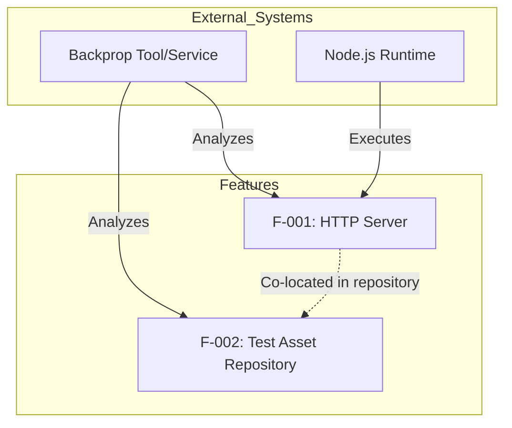

#### Dependency Matrix

| Feature | Depends On | Dependency Type |
|---------|------------|-----------------|
| F-001 | Node.js Runtime | System Dependency |
| F-001 | Built-in `http` module | Module Dependency |
| F-002 | File System | System Dependency |
| F-001 ↔ F-002 | None | No direct dependency |

### 2.3.2 Integration Points

| Integration Point | Features Involved | Description |
|-------------------|-------------------|-------------|
| Repository Co-location | F-001, F-002 | Both features exist in same repository |
| Backprop Analysis Target | F-001, F-002 | Both serve as analysis targets |
| File System | F-001, F-002 | Both require file system access |

### 2.3.3 Shared Components

| Shared Component | Used By | Purpose |
|------------------|---------|---------|
| `package.json` | F-001, F-002 | Package metadata for both features |
| `README.md` | F-001, F-002 | Documentation for entire repository |
| Repository Root | F-001, F-002 | Common file location |

### 2.3.4 Common Services

| Service | Features | Description |
|---------|----------|-------------|
| Node.js Runtime | F-001 | Execution environment |
| File System | F-001, F-002 | File access layer |
| Backprop Analysis | F-001, F-002 | External analysis service |

---

## 2.4 Implementation Considerations

### 2.4.1 F-001: HTTP Server Considerations

#### Technical Constraints

| Constraint | Description | Impact |
|------------|-------------|--------|
| Localhost Only | Server binds to 127.0.0.1 | Not accessible from network |
| Fixed Port | Port 3000 hardcoded | No runtime configuration |
| No TLS | Plain HTTP only | No encryption support |
| Single Process | No clustering | Limited to one CPU core |
| No Routing | Universal response | All paths return same content |

#### Performance Requirements

| Metric | Requirement | Rationale |
|--------|-------------|-----------|
| Startup Time | Sub-second | Minimal initialization |
| Response Time | Negligible | No processing overhead |
| Memory Usage | Node.js baseline | No additional libraries |
| Throughput | Single-threaded | Test fixture, not production |

#### Scalability Considerations

| Aspect | Assessment |
|--------|------------|
| Horizontal Scaling | Not supported (single instance) |
| Vertical Scaling | Limited by Node.js single-thread |
| Load Balancing | Not applicable |
| Clustering | Not implemented |

**Note:** Scalability is intentionally not addressed as this is a test fixture, not a production system.

#### Security Implications

| Security Aspect | Status | Notes |
|-----------------|--------|-------|
| TLS/HTTPS | Not implemented | Plain HTTP only |
| Authentication | Not implemented | No access control |
| Authorization | Not implemented | Universal access |
| Input Validation | Not implemented | No input processing |
| Rate Limiting | Not implemented | Not required for testing |
| CORS | Not implemented | Default browser restrictions apply |

**Risk Assessment:** Security measures are deliberately omitted as the server is localhost-only and serves as a test fixture.

#### Maintenance Requirements

| Requirement | Description |
|-------------|-------------|
| Code Stability | Must not be modified ("Do not touch!") |
| Runtime Updates | Node.js version updates may apply |
| Monitoring | Not required for test fixture |
| Backup | Standard version control sufficient |

---

### 2.4.2 F-002: Test Asset Repository Considerations

#### Technical Constraints

| Constraint | Description | Impact |
|------------|-------------|--------|
| Change Freeze | Files must remain unchanged | Preserves test baseline |
| Flat Structure | No subdirectories | Simple but limited organization |
| Mixed Validity | Some files intentionally incomplete | May trigger analysis warnings |

#### File Integrity Requirements

| Requirement | Description |
|-------------|-------------|
| Content Stability | File contents must not change |
| Checksum Consistency | File hashes should remain stable |
| Presence Guarantee | All files must remain present |

#### Known Anomalies

| Anomaly | Location | Purpose |
|---------|----------|---------|
| Incomplete Java Code | `LoginTest.java` | Tests incomplete code handling |
| Empty Text File | `test.txt.txt` | Tests empty file handling |
| Naming Mismatch | `package.json` vs README | Tests identifier inconsistency |
| Missing Entry Point | `index.js` referenced but absent | Tests missing file detection |

#### Security Implications

| Security Aspect | Status |
|-----------------|--------|
| Sensitive Data | None present |
| Access Control | Read-only recommended |
| Data Privacy | No PII in test files |

#### Maintenance Requirements

| Requirement | Description |
|-------------|-------------|
| Immutability | Files should not be modified |
| Version Control | Git history preservation |
| Access Restriction | Prevent accidental changes |

---

## 2.5 Requirements Traceability Matrix

### 2.5.1 Feature to Requirement Mapping

| Feature ID | Requirement ID | Description | Status |
|------------|----------------|-------------|--------|
| F-001 | F-001-RQ-001 | Server Startup | Implemented |
| F-001 | F-001-RQ-002 | Port Binding | Implemented |
| F-001 | F-001-RQ-003 | HTTP Response | Implemented |
| F-001 | F-001-RQ-004 | Response Content | Implemented |
| F-001 | F-001-RQ-005 | Content Type Header | Implemented |
| F-001 | F-001-RQ-006 | Startup Logging | Implemented |
| F-002 | F-002-RQ-001 | File Stability | Implemented |
| F-002 | F-002-RQ-002 | Multi-Format Presence | Implemented |
| F-002 | F-002-RQ-003 | Zero Dependencies | Implemented |
| F-002 | F-002-RQ-004 | Flat Structure | Implemented |

### 2.5.2 Requirement to Implementation Mapping

| Requirement ID | Implementation File | Code Reference |
|----------------|---------------------|----------------|
| F-001-RQ-001 | `server.js` | Lines 1-14 |
| F-001-RQ-002 | `server.js` | Lines 3-4, 12-14 |
| F-001-RQ-003 | `server.js` | Line 7 |
| F-001-RQ-004 | `server.js` | Line 9 |
| F-001-RQ-005 | `server.js` | Line 8 |
| F-001-RQ-006 | `server.js` | Line 13 |
| F-002-RQ-001 | `README.md` | "Do not touch!" warning |
| F-002-RQ-002 | Root folder | Multiple file types |
| F-002-RQ-003 | `package-lock.json` | Empty dependencies |
| F-002-RQ-004 | Root folder | Flat structure |

### 2.5.3 Priority Distribution

| Priority Level | Count | Percentage |
|----------------|-------|------------|
| Critical | 1 | 10% |
| Must-Have | 8 | 80% |
| Should-Have | 1 | 10% |
| Could-Have | 0 | 0% |

---

## 2.6 Assumptions and Constraints

### 2.6.1 Documented Assumptions

| ID | Assumption | Impact if Invalid |
|----|------------|-------------------|
| A-001 | Node.js is installed on target system | Server cannot start |
| A-002 | Port 3000 is available | Binding will fail |
| A-003 | User has file system read access | Assets cannot be analyzed |
| A-004 | Repository is used for testing only | May be inadequate for production |
| A-005 | Backprop has repository access | Integration testing fails |

### 2.6.2 Documented Constraints

| ID | Constraint | Rationale |
|----|------------|-----------|
| C-001 | No external dependencies | Isolation for testing |
| C-002 | Localhost binding only | Security and simplicity |
| C-003 | Static response only | Predictable behavior |
| C-004 | No file modifications | Preserve test baseline |
| C-005 | Single-file architecture | Minimize complexity |

---

## 2.7 References

#### Files Examined

| File Path | Relevance to Requirements |
|-----------|---------------------------|
| `server.js` | Primary implementation evidence for F-001 requirements |
| `package.json` | Package metadata and dependency confirmation |
| `package-lock.json` | Zero-dependency verification for F-002-RQ-003 |
| `README.md` | File stability requirement ("Do not touch!") |
| `industry.csv` | Multi-format presence evidence (43 industry categories) |
| `LoginTest.java` | Multi-format presence evidence (Java scaffold) |
| `test.txt.txt` | Multi-format presence evidence (empty text file) |

#### Technical Specification Sections Referenced

| Section | Content Used |
|---------|--------------|
| 1.1 Executive Summary | Business value and stakeholder context |
| 1.2 System Overview | Technical capabilities and success criteria |
| 1.3 Scope | In-scope/out-of-scope feature boundaries |
| 1.4 References | File inventory and folder structure |

#### Repository Structure Verified

| Path | Type | Contents |
|------|------|----------|
| Root (`/`) | Directory | 7 tracked files, flat structure |

# 3. Technology Stack

## 3.1 Overview

The hao-backprop-test project employs an intentionally minimalist technology stack designed to serve as a predictable, isolated test fixture for Backprop integration validation. This section documents all technology choices, their justifications, and the explicit exclusions that define this architecture.

### 3.1.1 Stack Philosophy

The technology stack adheres to a **zero-dependency philosophy** that prioritizes:

| Principle | Implementation | Rationale |
|-----------|----------------|-----------|
| Isolation | No external packages | Eliminates version conflict variables |
| Predictability | Hardcoded configuration | Ensures reproducible test results |
| Simplicity | Single-file architecture | Minimizes debugging complexity |
| Stability | Immutable codebase | Preserves baseline test consistency |

### 3.1.2 Technology Stack Summary

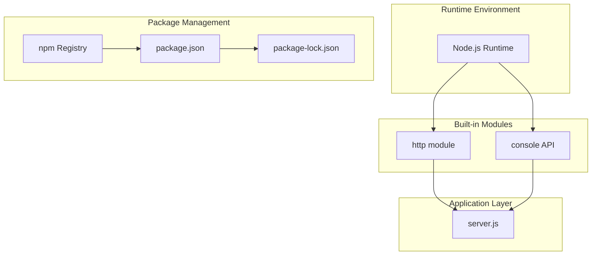

---

## 3.2 Programming Languages

### 3.2.1 Primary Language: JavaScript (ES6+)

| Attribute | Value | Evidence |
|-----------|-------|----------|
| Language | JavaScript | `server.js` syntax analysis |
| ECMAScript Version | ES6+ | Uses `const`, arrow functions implied |
| Module System | CommonJS | `require('http')` import syntax |
| Runtime | Node.js | Server-side execution context |

#### Language Selection Criteria

**Justification for JavaScript:**

1. **Native HTTP Capability**: Node.js provides a built-in `http` module that enables HTTP server creation without external dependencies
2. **Single Runtime Dependency**: Only Node.js installation is required—no compilation, transpilation, or build steps
3. **Test Fixture Alignment**: JavaScript/Node.js is a common analysis target for code analysis tools, making it ideal for Backprop testing
4. **Simplicity**: The entire server implementation requires only 15 lines of code

#### Language Features Utilized

| Feature | Usage | Location |
|---------|-------|----------|
| `const` declarations | Variable binding | `server.js:1-4` |
| Module imports | `require()` syntax | `server.js:1` |
| Function expressions | Request handler | `server.js:6-10` |
| Template literals | Console output | `server.js:13` |

#### Version Constraints and Dependencies

| Constraint | Requirement | Source |
|------------|-------------|--------|
| Node.js Version | Modern (v15+) | `lockfileVersion: 3` in `package-lock.json` |
| Explicit Version Pin | Not specified | No `.nvmrc` or `.node-version` file present |
| npm Version | v7+ | Required for lockfileVersion 3 support |

### 3.2.2 Secondary Language: Java (Test Asset Only)

| Attribute | Value | Evidence |
|-----------|-------|----------|
| File | `LoginTest.java` | Repository file listing |
| Package | `com.blitzyTest` | Declared in source file |
| Status | **Non-functional** | Contains unresolved `Web` identifier |
| Purpose | Format testing | Validates Backprop's Java parsing |

**Important Note**: Java code is present exclusively as a test asset for validating Backprop's multi-format file handling capabilities. The `LoginTest.java` file is intentionally incomplete and non-compilable, serving to test how Backprop handles incomplete code structures.

### 3.2.3 Node.js Runtime Compatibility

Based on current Node.js release schedules:

| Version | Status | Support Period | Recommendation |
|---------|--------|----------------|----------------|
| v24.x | Active LTS 'Krypton' | Until April 2028 | Latest LTS option |
| v22.x | Maintenance LTS 'Jod' | Until April 2027 | Stable production choice |
| v20.x | Maintenance LTS | Until April 2026 | Still supported |
| v18.x | End of Life | Ended April 2025 | Not recommended |

**Recommended Runtime**: Node.js v22.x or v24.x LTS for running this test fixture, ensuring compatibility with `lockfileVersion: 3` and long-term support.

---

## 3.3 Frameworks & Libraries

### 3.3.1 Core Framework Assessment

| Framework Category | Status | Evidence |
|--------------------|--------|----------|
| Web Framework (Express.js, Fastify, Koa) | **Not Used** | No dependencies in `package.json` |
| HTTP Framework | **Not Used** | Raw `http.createServer()` employed |
| Testing Framework | **Not Used** | Test script is placeholder only |
| Build Framework | **Not Used** | No bundler or compiler configured |

### 3.3.2 Built-in Module Dependencies

The only "library" utilized is Node.js's built-in `http` module:

| Module | Version | Purpose | Usage |
|--------|---------|---------|-------|
| `http` | Bundled with Node.js | HTTP server creation | `server.js:1` |

#### http Module Implementation Details

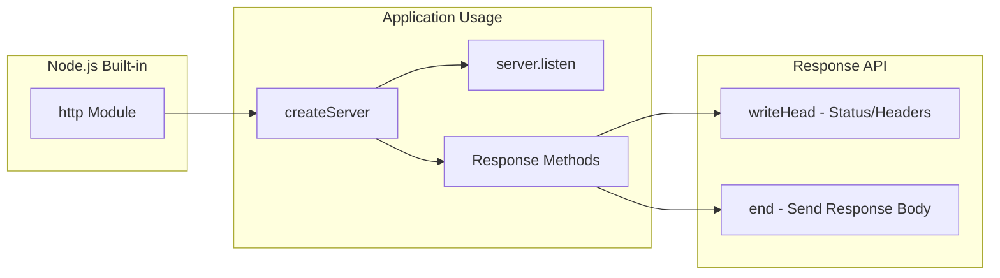

**Methods Utilized from `http` Module:**

| Method | Purpose | Parameters Used |
|--------|---------|-----------------|
| `createServer(callback)` | Creates HTTP server instance | Request handler callback |
| `server.listen(port, hostname, callback)` | Binds server to network interface | `3000`, `127.0.0.1`, startup callback |
| `res.writeHead(statusCode, headers)` | Sets response status and headers | `200`, `{'Content-Type': 'text/plain'}` |
| `res.end(data)` | Sends response body and closes | `'Hello, World!\n'` |

### 3.3.3 Framework Exclusion Justification

| Framework | Reason for Exclusion |
|-----------|----------------------|
| Express.js | Introduces unnecessary dependency; built-in `http` sufficient |
| Fastify | Performance optimization not required for static response |
| Koa | Middleware patterns unnecessary for single-response server |
| Hapi | Enterprise features exceed test fixture requirements |
| TypeScript | Type safety overhead not warranted for 15-line implementation |

---

## 3.4 Open Source Dependencies

### 3.4.1 npm Package Dependencies

**Total External Dependencies: ZERO**

The project explicitly maintains a zero-dependency architecture:

| Dependency Type | Count | Evidence |
|-----------------|-------|----------|
| `dependencies` | 0 | Absent from `package.json` |
| `devDependencies` | 0 | Absent from `package.json` |
| `peerDependencies` | 0 | Absent from `package.json` |
| `optionalDependencies` | 0 | Absent from `package.json` |

### 3.4.2 Package Configuration

**package.json Analysis:**

| Field | Value | Purpose |
|-------|-------|---------|
| `name` | `hello_world` | npm package identifier |
| `version` | `1.0.0` | Semantic version |
| `description` | `Hello world in Node.js` | Package description |
| `main` | `index.js` | Declared entry point (note: references non-existent file) |
| `author` | `hxu` | Package author |
| `license` | `MIT` | Open source license |

**package-lock.json Analysis:**

| Field | Value | Implication |
|-------|-------|-------------|
| `lockfileVersion` | `3` | npm v7+ compatibility required |
| `requires` | `true` | Dependency resolution enabled |
| `packages` | Root only | Confirms zero resolved dependencies |

### 3.4.3 Package Registry

| Attribute | Value |
|-----------|-------|
| Registry | npm (default) |
| Custom Registry | Not configured (no `.npmrc`) |
| Private Packages | None |
| Scoped Packages | None |

### 3.4.4 Dependency Security Posture

| Security Aspect | Status | Impact |
|-----------------|--------|--------|
| Supply Chain Risk | **Eliminated** | No third-party code to compromise |
| Vulnerability Scanning | Not required | No packages to scan |
| License Compliance | Simplified | Only MIT license (this project) |
| Dependency Updates | Not required | No dependencies to update |

---

## 3.5 Third-Party Services

### 3.5.1 External Service Integration

**Total Third-Party Service Integrations: NONE**

| Service Category | Status | Rationale |
|------------------|--------|-----------|
| External APIs | Not implemented | Isolated test fixture by design |
| Authentication Services | Not implemented | No access control required |
| Monitoring Tools | Not implemented | Test fixture does not require observability |
| Cloud Services | Not implemented | Localhost-only operation |
| Analytics | Not implemented | Not applicable for test fixture |
| Logging Services | Not implemented | Uses built-in `console.log` only |

### 3.5.2 Integration Architecture

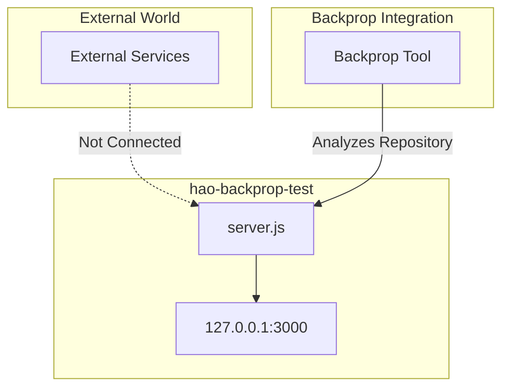

The only external interaction is with Backprop itself, which analyzes the repository as a test target—not through runtime API calls but through static code analysis.

### 3.5.3 Service Exclusion Rationale

| Service Type | Exclusion Reason |
|--------------|------------------|
| AWS/Azure/GCP | No cloud deployment planned |
| Auth0/Okta | No authentication requirements |
| Datadog/New Relic | Monitoring overhead unnecessary |
| Stripe/PayPal | No payment processing |
| SendGrid/Mailgun | No email functionality |
| Twilio | No communication features |

---

## 3.6 Databases & Storage

### 3.6.1 Data Persistence Strategy

**Database Implementation: NONE**

| Database Type | Status | Rationale |
|---------------|--------|-----------|
| Primary Database | Not implemented | Stateless operation by design |
| Secondary Database | Not implemented | No data replication needed |
| Cache Layer | Not implemented | No performance optimization required |
| Session Storage | Not implemented | No user sessions |
| File Storage | Not implemented | No file upload/download |

### 3.6.2 Stateless Architecture

The server operates in a completely stateless manner:

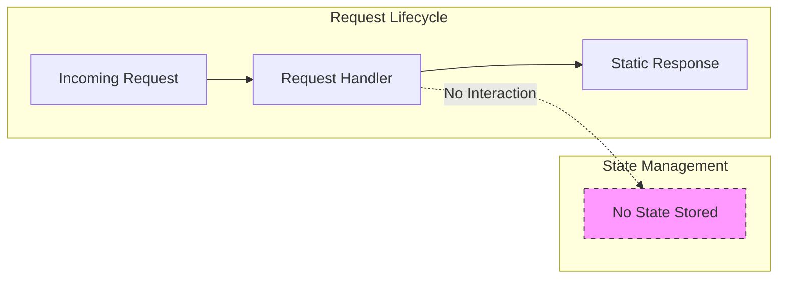

| Stateless Characteristic | Implementation |
|--------------------------|----------------|
| No request tracking | Each request independent |
| No session cookies | No session management |
| No database connections | No persistence layer |
| No in-memory caching | Fresh response each time |
| Universal response | All paths return identical content |

### 3.6.3 Static Data Assets

While no runtime data persistence exists, the repository contains static data files for Backprop format testing:

| File | Type | Records | Purpose |
|------|------|---------|---------|
| `industry.csv` | CSV | 43 rows | Industry category labels for CSV parsing validation |

### 3.6.4 Database Exclusion Justification

| Database Technology | Exclusion Reason |
|---------------------|------------------|
| MongoDB | No document storage requirements |
| PostgreSQL/MySQL | No relational data modeling needed |
| Redis | No caching or session requirements |
| SQLite | No embedded database needs |
| DynamoDB | No cloud storage integration |

---

## 3.7 Development & Deployment

### 3.7.1 Development Tools

#### Version Control

| Tool | Implementation | Evidence |
|------|----------------|----------|
| Git | Active | `.git` directory present |
| Remote Repository | GitHub (inferred) | Project naming convention suggests GitHub hosting |

#### Code Quality Tools

| Tool Category | Status | Rationale |
|---------------|--------|-----------|
| Linter (ESLint) | Not configured | 15-line implementation too simple |
| Formatter (Prettier) | Not configured | Minimal codebase |
| Type Checker (TypeScript) | Not used | Plain JavaScript sufficient |
| Pre-commit Hooks | Not configured | Change freeze policy ("Do not touch!") |

### 3.7.2 Build System

**Build Pipeline: NONE**

| Build Aspect | Status | Rationale |
|--------------|--------|-----------|
| Bundler (webpack, Rollup) | Not used | Single file, no bundling needed |
| Transpiler (Babel) | Not used | Native ES6+ execution |
| Minifier | Not used | Not a production deployment |
| Asset Pipeline | Not used | No static assets served |

#### npm Scripts

| Script | Command | Status |
|--------|---------|--------|
| `test` | `echo "Error: no test specified" && exit 1` | Placeholder only |
| `start` | Not defined | Manual `node server.js` execution |
| `build` | Not defined | No build step required |

### 3.7.3 Containerization

**Container Strategy: NOT IMPLEMENTED**

| Container Tool | Status | Evidence |
|----------------|--------|----------|
| Docker | Not present | No `Dockerfile` in repository |
| docker-compose | Not present | No compose files |
| Container Registry | N/A | No container images |

#### Containerization Exclusion Rationale

| Reason | Impact |
|--------|--------|
| Test fixture purpose | Container overhead unnecessary |
| Zero dependencies | No complex environment to replicate |
| Localhost-only binding | Container networking would complicate setup |
| Immutability requirement | Simple `node server.js` execution preferred |

### 3.7.4 CI/CD Requirements

**CI/CD Pipeline: NOT IMPLEMENTED**

| CI/CD Tool | Status | Evidence |
|------------|--------|----------|
| GitHub Actions | Not configured | No `.github/workflows` directory |
| Jenkins | Not configured | No Jenkinsfile |
| CircleCI | Not configured | No `.circleci` directory |
| GitLab CI | Not configured | No `.gitlab-ci.yml` |

#### CI/CD Exclusion Rationale

| Reason | Explanation |
|--------|-------------|
| Change Freeze | Repository must remain unchanged ("Do not touch!") |
| No Deployments | Localhost-only test fixture |
| No Tests | Test script is placeholder only |
| Baseline Preservation | CI/CD could introduce unwanted modifications |

### 3.7.5 Runtime Execution

The application executes via direct Node.js invocation:

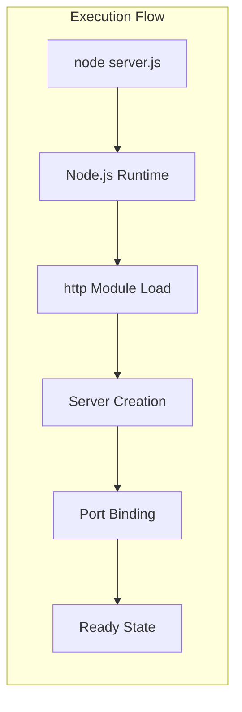

| Execution Parameter | Value |
|---------------------|-------|
| Command | `node server.js` |
| Working Directory | Repository root |
| Environment Variables | None required |
| Arguments | None |

---

## 3.8 Security Considerations

### 3.8.1 Security Architecture

| Security Layer | Implementation Status | Notes |
|----------------|----------------------|-------|
| Transport Security (TLS/HTTPS) | Not implemented | Plain HTTP only |
| Authentication | Not implemented | Universal access |
| Authorization | Not implemented | No access control |
| Input Validation | Not implemented | All requests return same response |
| Rate Limiting | Not implemented | No protection against abuse |
| CORS | Not configured | Browser default restrictions |

### 3.8.2 Security Implications of Technology Choices

| Technology Choice | Security Implication | Mitigation |
|-------------------|----------------------|------------|
| Zero dependencies | Eliminates supply chain attacks | N/A - inherently secure |
| Localhost binding | Network isolation | Server inaccessible remotely |
| No authentication | Open access on localhost | Physical/system access required |
| No TLS | Traffic unencrypted | Localhost traffic only |
| No input processing | No injection vectors | Request data ignored |

### 3.8.3 Risk Assessment

**Overall Risk Level: LOW**

The localhost-only binding (`127.0.0.1`) combined with the test fixture purpose means security measures are deliberately minimal. The server cannot be accessed from other machines on the network, and its sole function is returning a static string.

---

## 3.9 Integration Requirements

### 3.9.1 Component Integration Map

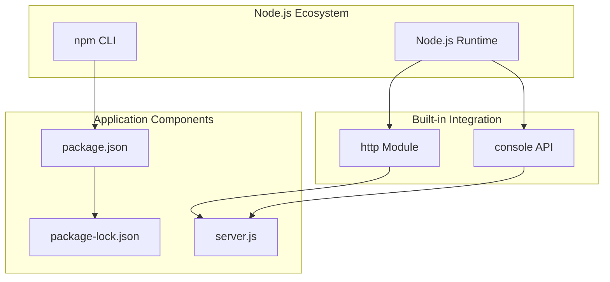

### 3.9.2 Integration Dependencies

| Component A | Component B | Integration Type |
|-------------|-------------|------------------|
| Node.js Runtime | `server.js` | Execution environment |
| `http` module | `server.js` | Built-in import |
| `console` API | `server.js` | Built-in global |
| npm CLI | `package.json` | Package metadata |
| `package.json` | `package-lock.json` | Version locking |

### 3.9.3 External Integration Points

| Integration Point | Connected System | Protocol |
|-------------------|------------------|----------|
| `127.0.0.1:3000` | HTTP Client | HTTP/1.1 |
| Repository Files | Backprop Tool | File System Analysis |

---

## 3.10 Default Technology Stack Applicability Assessment

The prompt provided a default technology stack. This section documents why each component is **not applicable** to this test fixture project:

### 3.10.1 Non-Applicable Components

| Default Component | Category | Applicability | Reason |
|-------------------|----------|---------------|--------|
| AWS | Cloud Platform | ❌ Not Applicable | Localhost-only test fixture |
| Docker | Containerization | ❌ Not Applicable | No Dockerfile present |
| Terraform | Infrastructure as Code | ❌ Not Applicable | No infrastructure to manage |
| GitHub Actions | CI/CD | ❌ Not Applicable | No workflows configured |
| Python/Flask | Backend | ❌ Not Applicable | Node.js is the runtime |
| Auth0 | Authentication | ❌ Not Applicable | No auth requirements |
| MongoDB | Database | ❌ Not Applicable | Stateless operation |
| Langchain | AI Framework | ❌ Not Applicable | No AI functionality |
| React/TypeScript | Frontend | ❌ Not Applicable | No frontend component |
| TailwindCSS | CSS Framework | ❌ Not Applicable | No UI |
| React-Native | Mobile | ❌ Not Applicable | No mobile app |
| Swift | iOS | ❌ Not Applicable | No native iOS |
| Kotlin | Android | ❌ Not Applicable | No native Android |
| Objective-C | MacOS | ❌ Not Applicable | No MacOS app |
| ElectronJS | Desktop | ❌ Not Applicable | No desktop app |

### 3.10.2 Actual Technology Stack Matrix

| Category | Default Stack | Actual Implementation |
|----------|---------------|----------------------|
| **Runtime** | Python + Node.js + Swift + Kotlin | Node.js only |
| **Server Framework** | Flask | Built-in `http` module |
| **Database** | MongoDB | None (stateless) |
| **Authentication** | Auth0 | None |
| **Containerization** | Docker | None |
| **CI/CD** | GitHub Actions | None |
| **Cloud** | AWS | None (localhost) |
| **Frontend** | React + TypeScript | None |

---

## 3.11 Version Summary

### 3.11.1 Component Version Matrix

| Component | Version | Version Source | Update Policy |
|-----------|---------|----------------|---------------|
| Package (`hello_world`) | 1.0.0 | `package.json` | Frozen |
| npm Lockfile Format | 3 | `package-lock.json` | Frozen |
| Node.js Runtime | Not pinned | No version file | System-dependent |
| License | MIT | `package.json` | Static |

### 3.11.2 Recommended Runtime Versions

Based on current LTS schedules, the following Node.js versions are recommended for running this test fixture:

| Node.js Version | LTS Codename | Status | End of Support |
|-----------------|--------------|--------|----------------|
| v24.x | Krypton | Active LTS | April 2028 |
| v22.x | Jod | Maintenance LTS | April 2027 |
| v20.x | Iron | Maintenance LTS | April 2026 |

---

## 3.12 References

### 3.12.1 Repository Files Examined

| File Path | Relevance to Technology Stack |
|-----------|-------------------------------|
| `package.json` | npm package configuration, dependency declaration (zero), metadata |
| `package-lock.json` | Lockfile version (3), confirmed zero resolved dependencies |
| `server.js` | Core implementation, `http` module usage, ES6+ syntax analysis |
| `README.md` | Project identification, maintenance policy ("Do not touch!") |
| `LoginTest.java` | Secondary language (Java) test asset documentation |
| `industry.csv` | Static data asset for format testing |

### 3.12.2 Technical Specification Sections Referenced

| Section | Information Utilized |
|---------|---------------------|
| 1.1 Executive Summary | Project overview, test fixture purpose, stakeholder context |
| 1.2 System Overview | Zero-dependency philosophy, stateless architecture, success criteria |
| 2.4 Implementation Considerations | Technical constraints, security implications, performance requirements |
| 2.6 Assumptions and Constraints | Documented constraints (C-001 through C-005) |

### 3.12.3 External Sources

| Source | Information Retrieved |
|--------|----------------------|
| nodejs.org | Node.js LTS release schedule, version lifecycle information |
| endoflife.date/nodejs | Node.js version end-of-life dates |
| GitHub nodejs/Release | Official Node.js release policy documentation |

# 4. Process Flowchart

## 4.1 Overview

This section documents the process flows and system workflows for the hao-backprop-test repository, a minimal Node.js HTTP server designed as a test fixture for Backprop integration validation. Given the intentional simplicity of this codebase, the process flows are correspondingly straightforward, featuring linear execution paths with no branching logic or decision points.

### 4.1.1 Workflow Characteristics Summary

The system exhibits the following workflow characteristics that inform all flowchart designs:

| Characteristic | Status | Impact on Workflows |
|----------------|--------|---------------------|
| Decision Logic | Not implemented | Linear, single-path execution |
| Error Handling | Node.js defaults only | No custom error paths |
| State Management | Stateless | No state transitions to model |
| Routing | Not implemented | Universal response path |
| Authentication | Not implemented | No authorization checkpoints |
| Input Processing | Not implemented | Request data ignored |

### 4.1.2 Process Flow Categories

The repository implements two distinct categories of workflows:

| Category | Workflow Type | Trigger | Complexity |
|----------|---------------|---------|------------|
| Server Operations | Startup Flow | `node server.js` command | Low |
| Request Handling | Response Flow | Incoming HTTP request | Minimal |
| Integration | Analysis Flow | Backprop tool invocation | External |

---

## 4.2 System Workflows

### 4.2.1 High-Level System Architecture Flow

The following diagram illustrates the overall system context and how the test fixture integrates with the Backprop ecosystem:

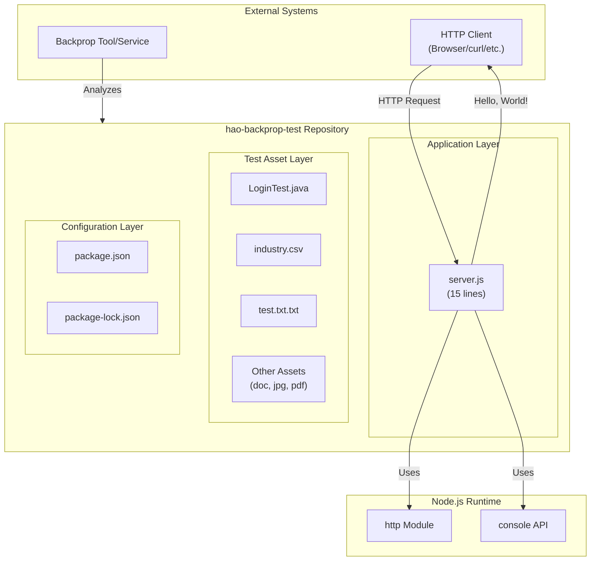

### 4.2.2 Core Business Process: End-to-End User Journey

The primary user workflow encompasses the complete lifecycle from server startup to response delivery:

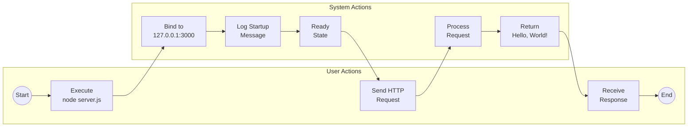

#### User Journey Steps

| Step | Actor | Action | System Response | Duration |
|------|-------|--------|-----------------|----------|
| 1 | User | Execute `node server.js` | Node.js runtime initializes | Sub-second |
| 2 | System | Load http module | Module imported from Node.js built-ins | Immediate |
| 3 | System | Bind to port 3000 | Server listening on localhost | Immediate |
| 4 | System | Log startup message | Console displays URL | Immediate |
| 5 | User | Send HTTP request | Server receives request | Network latency |
| 6 | System | Process request | Handler callback invoked | Negligible |
| 7 | System | Return response | "Hello, World!\n" sent | Immediate |
| 8 | User | Receive response | Response displayed | Network latency |

---

## 4.3 Server Startup Flow

### 4.3.1 Detailed Startup Process

The server startup sequence follows a deterministic, linear path from command invocation to ready state:

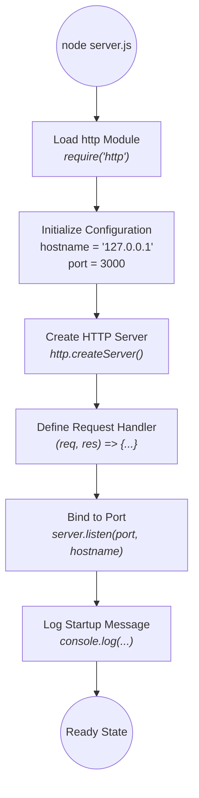

### 4.3.2 Startup Sequence Mapping to Source Code

| Sequence Step | server.js Line | Code Element | Description |
|---------------|----------------|--------------|-------------|
| 1 | Line 1 | `const http = require('http');` | Import Node.js built-in http module |
| 2 | Line 3 | `const hostname = '127.0.0.1';` | Set localhost binding address |
| 3 | Line 4 | `const port = 3000;` | Set listening port number |
| 4 | Lines 6-10 | `http.createServer((req, res) => {...});` | Create server with request handler |
| 5 | Line 12 | `server.listen(port, hostname, ...)` | Bind server to network interface |
| 6 | Lines 13-14 | `console.log(...)` | Output startup confirmation |

### 4.3.3 Startup Error Scenarios

Although no custom error handling is implemented, the following Node.js default behaviors apply:

| Error Scenario | Trigger Condition | Default Behavior | Recovery Path |
|----------------|-------------------|------------------|---------------|
| Port Unavailable | Port 3000 already in use | EADDRINUSE exception thrown | Manual intervention: terminate blocking process |
| Permission Denied | Insufficient permissions | EACCES exception thrown | Manual intervention: run with elevated permissions |
| Module Not Found | Corrupted Node.js installation | MODULE_NOT_FOUND exception | Reinstall Node.js |
| Syntax Error | server.js corruption | SyntaxError thrown | Restore file from version control |

---

## 4.4 Request Processing Flow

### 4.4.1 HTTP Request Lifecycle

Every HTTP request follows an identical processing path regardless of method, path, or payload:

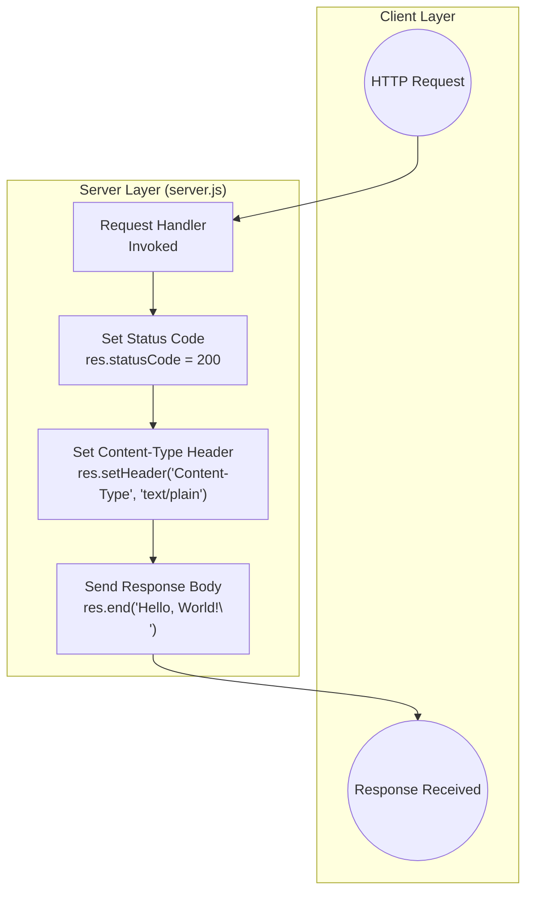

### 4.4.2 Request Handler Internals

The request handler callback processes all incoming requests identically:

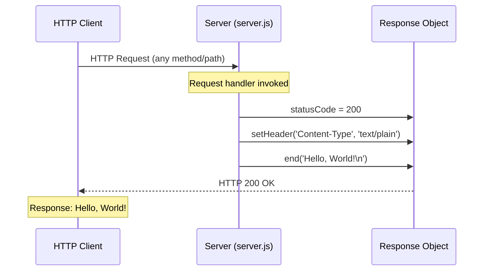

### 4.4.3 Universal Response Behavior

The server implements a universal response strategy where all requests receive identical treatment:

| Request Attribute | Handling | Response Impact |
|-------------------|----------|-----------------|
| HTTP Method (GET, POST, PUT, DELETE, etc.) | Ignored | Same response |
| URL Path (/api, /users, /anything) | Ignored | Same response |
| Query Parameters (?id=1&name=test) | Ignored | Same response |
| Request Headers | Ignored | Same response |
| Request Body | Ignored | Same response |
| Content-Type | Ignored | Same response |
| Authentication Credentials | Ignored | Same response |

### 4.4.4 Response Composition

| Response Component | Value | Source |
|--------------------|-------|--------|
| Status Code | 200 | `res.statusCode = 200` |
| Content-Type | text/plain | `res.setHeader('Content-Type', 'text/plain')` |
| Body | Hello, World!\n | `res.end('Hello, World!\n')` |
| Connection | Keep-Alive (default) | Node.js http module default |

---

## 4.5 Integration Workflows

### 4.5.1 Backprop Integration Flow

The primary integration workflow involves Backprop tool analysis of the repository contents:

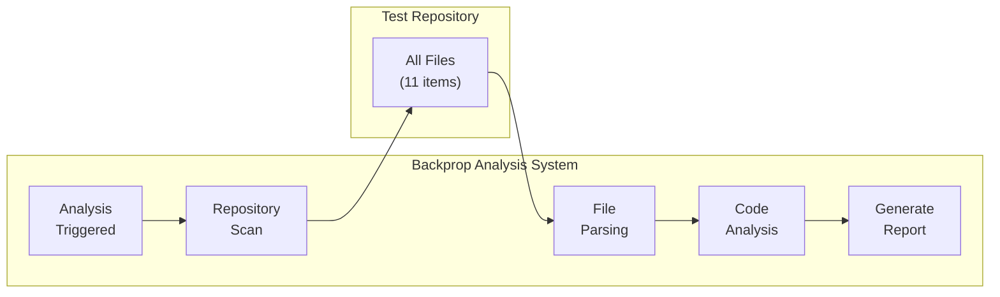

### 4.5.2 Component Integration Sequence

The internal component integration follows this sequence during server execution:

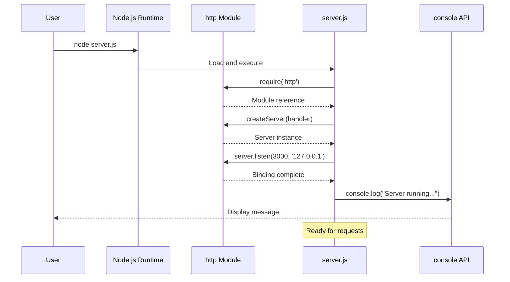

### 4.5.3 Data Flow Between Systems

| Source System | Data Type | Destination System | Protocol | Direction |
|---------------|-----------|-------------------|----------|-----------|
| HTTP Client | HTTP Request | server.js | HTTP/1.1 | Inbound |
| server.js | HTTP Response | HTTP Client | HTTP/1.1 | Outbound |
| Backprop Tool | File Read Request | Repository Files | File System | Inbound |
| Repository Files | File Content | Backprop Tool | File System | Outbound |
| server.js | Log Message | console API | Internal | Outbound |

---

## 4.6 State Management

### 4.6.1 Stateless Architecture Diagram

The server operates without any state persistence, treating each request independently:

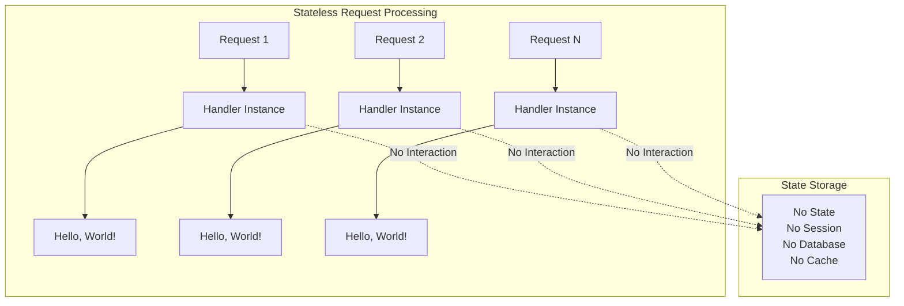

### 4.6.2 State Management Characteristics

| State Category | Implementation | Notes |
|----------------|----------------|-------|
| Session State | Not implemented | No session tracking |
| Application State | Not implemented | No global state variables |
| Database State | Not implemented | No persistence layer |
| Cache State | Not implemented | No caching mechanism |
| Request State | Ephemeral only | Exists only during handler execution |
| Connection State | Node.js managed | Keep-alive handled by http module |

### 4.6.3 Server Lifecycle States

Despite the stateless request handling, the server itself transitions through lifecycle states:

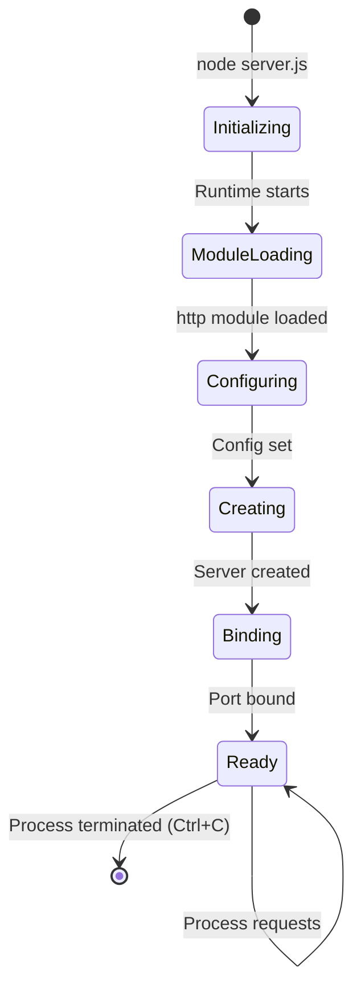

| State | Description | Trigger | Duration |
|-------|-------------|---------|----------|
| Initializing | Node.js runtime starting | Command execution | Milliseconds |
| ModuleLoading | Loading http module | require() call | Milliseconds |
| Configuring | Setting hostname and port | Variable assignments | Immediate |
| Creating | Creating server instance | createServer() call | Immediate |
| Binding | Binding to network interface | listen() call | Immediate |
| Ready | Accepting connections | Binding complete | Indefinite |
| Terminated | Process ended | SIGINT/SIGTERM | N/A |

---

## 4.7 Error Handling Flows

### 4.7.1 Error Handling Architecture

The system relies entirely on Node.js default error handling with no custom error paths:

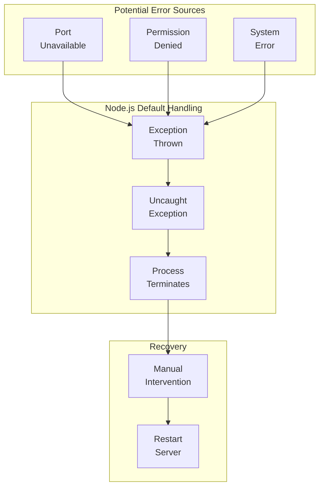

### 4.7.2 Error Scenario Matrix

| Error Category | Scenario | Detection | Handling | Recovery |
|----------------|----------|-----------|----------|----------|
| Startup | Port 3000 in use | EADDRINUSE thrown | Process crash | Free port, restart |
| Startup | Insufficient permissions | EACCES thrown | Process crash | Elevate permissions, restart |
| Runtime | Node.js internal error | Exception thrown | Process crash | Restart server |
| Runtime | Memory exhaustion | Out of memory | Process crash | Increase limits, restart |
| Request | Malformed request | None | Normal response | N/A (all requests succeed) |
| Request | Large payload | None | Normal response | N/A (payload ignored) |

### 4.7.3 No Custom Error Handling Paths

The following error handling mechanisms are explicitly **not implemented**:

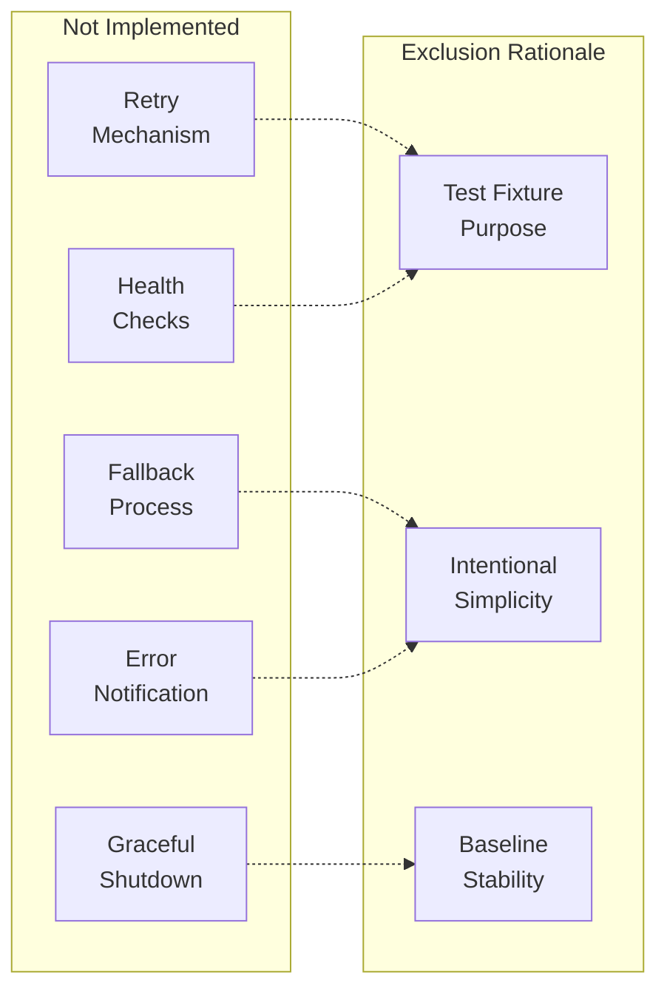

| Mechanism | Status | Rationale |
|-----------|--------|-----------|
| Retry Logic | Not implemented | No transient failure scenarios |
| Fallback Processes | Not implemented | No alternative paths exist |
| Error Notifications | Not implemented | Console output only |
| Graceful Shutdown | Not implemented | Abrupt termination acceptable |
| Circuit Breakers | Not implemented | No external dependencies |
| Health Endpoints | Not implemented | Test fixture does not require monitoring |

---

## 4.8 Timing and SLA Considerations

### 4.8.1 Performance Timing Flow

```mermaid
gantt
    dateFormat  ss.SSS
    title Request Processing Timeline
    axisFormat %L ms
    
    section Startup
    Module Load       :done, 00.000, 00.010
    Config Init       :done, 00.010, 00.011
    Server Create     :done, 00.011, 00.015
    Port Bind         :done, 00.015, 00.025
    Ready State       :milestone, 00.025, 0
    
    section Request
    Receive Request   :active, 00.100, 00.101
    Handler Execute   :active, 00.101, 00.102
    Send Response     :active, 00.102, 00.103
    Complete          :milestone, 00.103, 0
```

### 4.8.2 Performance Metrics

| Metric | Expected Value | Constraint Type | Notes |
|--------|----------------|-----------------|-------|
| Startup Time | < 100ms | Soft | Sub-second per design |
| Response Time | < 5ms | Soft | Negligible processing |
| Time to First Byte | < 2ms | Soft | Immediate response |
| Throughput | Single-threaded | Hard | No clustering |
| Concurrent Connections | Node.js default | Soft | Event loop managed |
| Memory Footprint | ~30-50MB | Soft | Node.js baseline |

### 4.8.3 SLA Considerations

This test fixture does not define formal SLAs due to its non-production nature:

| SLA Category | Status | Rationale |
|--------------|--------|-----------|
| Availability | Undefined | Localhost-only, manual startup |
| Response Time | Undefined | Test fixture, not production |
| Throughput | Undefined | No load requirements |
| Error Rate | Undefined | No error tracking |
| Recovery Time | Undefined | Manual restart only |

---

## 4.9 Validation Rules and Checkpoints

### 4.9.1 Validation Flow (Minimal)

Due to the universal response behavior, validation checkpoints are effectively absent:

```mermaid
flowchart LR
    subgraph Incoming["Incoming Request"]
        ANY["Any HTTP Request<br/>(Method, Path, Body)"]
    end
    
    subgraph Validation["Validation Checkpoints"]
        NONE["No Validation<br/>Performed"]
    end
    
    subgraph Processing["Processing"]
        HANDLER["Request Handler"]
    end
    
    subgraph Response["Response"]
        HELLO["Hello, World!"]
    end
    
    ANY --> NONE
    NONE --> HANDLER
    HANDLER --> HELLO
```

### 4.9.2 Validation Rule Matrix

| Validation Category | Status | Details |
|--------------------|--------|---------|
| Input Validation | Not implemented | Request data completely ignored |
| Schema Validation | Not implemented | No expected request format |
| Authentication | Not implemented | Universal access granted |
| Authorization | Not implemented | No permission checks |
| Rate Limiting | Not implemented | No request throttling |
| Business Rules | Not applicable | No business logic |
| Regulatory Compliance | Not applicable | Test fixture only |

---

## 4.10 Process Flow Summary

### 4.10.1 Complete System Flow Overview

```mermaid
flowchart TB
    subgraph Startup["Startup Phase"]
        S1["node server.js"] --> S2["Load http Module"]
        S2 --> S3["Set Configuration"]
        S3 --> S4["Create Server"]
        S4 --> S5["Bind Port 3000"]
        S5 --> S6["Log to Console"]
        S6 --> S7["Ready State"]
    end
    
    subgraph Runtime["Runtime Phase"]
        R1["HTTP Request<br/>Received"] --> R2["Handler<br/>Invoked"]
        R2 --> R3["Set Status<br/>200"]
        R3 --> R4["Set Header<br/>text/plain"]
        R4 --> R5["Send Body<br/>Hello, World!"]
        R5 --> R6["Response<br/>Complete"]
    end
    
    subgraph Shutdown["Shutdown Phase"]
        X1["SIGINT/SIGTERM"] --> X2["Process<br/>Terminates"]
    end
    
    S7 --> R1
    R6 -.->|"Loop"| R1
    S7 --> X1
```

### 4.10.2 Key Process Flow Characteristics

| Characteristic | Value | Implication |
|----------------|-------|-------------|
| Workflow Complexity | Minimal | Single linear path |
| Decision Points | Zero | No branching logic |
| Error Paths | None custom | Node.js defaults only |
| State Transitions | Lifecycle only | Request handling stateless |
| Integration Points | Two | HTTP client, Backprop tool |
| Validation Steps | None | Universal response |
| SLA Constraints | Undefined | Test fixture purpose |

---

## 4.11 References

#### Files Examined

| File Path | Relevance to Process Flowcharts |
|-----------|--------------------------------|
| `server.js` | Primary application logic, request handling flow, startup sequence |
| `package.json` | npm configuration, script definitions |
| `package-lock.json` | Dependency verification (confirms zero dependencies) |
| `README.md` | Project identification, maintenance policy |

#### Technical Specification Sections Referenced

| Section | Information Extracted |
|---------|----------------------|
| 1.2 System Overview | System context, architecture diagrams, success criteria |
| 1.3 Scope | User workflow, in-scope/out-of-scope features |
| 2.1 Feature Catalog | Feature descriptions, integration requirements |
| 2.4 Implementation Considerations | Technical constraints, performance requirements, security implications |
| 3.3 Frameworks & Libraries | http module usage details, method documentation |
| 3.6 Databases & Storage | Stateless architecture confirmation |
| 3.7 Development & Deployment | Execution flow, runtime parameters |
| 3.8 Security Considerations | Security architecture, risk assessment |
| 3.9 Integration Requirements | Component integration map, external integration points |

# 5. System Architecture

This section documents the architectural design, component structure, and technical decisions of the hao-backprop-test repository—a deliberately minimal Node.js HTTP server serving as a test fixture for Backprop integration validation.

## 5.1 HIGH-LEVEL ARCHITECTURE

### 5.1.1 System Overview

#### Architectural Style and Rationale

The hao-backprop-test system implements a **minimalist single-file monolithic architecture** specifically designed to serve as a predictable, isolated test fixture. This architectural style was chosen to support three core objectives:

| Objective | Architectural Response | Rationale |
|-----------|------------------------|-----------|
| Predictability | Zero external dependencies | Eliminates version conflicts and external failure points |
| Isolation | Localhost-only binding | Prevents unintended network exposure |
| Reproducibility | Hardcoded configuration | Ensures identical behavior across all test executions |

The system operates as a **standalone test target** with no upstream or downstream system dependencies. Its isolation is intentional—the repository exists within the Backprop development ecosystem purely for validation purposes, not for production deployment or customer use.

#### Key Architectural Principles

The architecture adheres to the following principles:

1. **Zero-Dependency Philosophy**: Uses only Node.js built-in modules (`http`, `console`), eliminating supply chain risks
2. **Single-File Design**: All server logic contained in `server.js` (15 lines), minimizing debugging complexity
3. **Stateless Operation**: No session management, caching, or data persistence mechanisms
4. **Universal Response Pattern**: All HTTP requests receive identical treatment regardless of method, path, or payload
5. **Immutable Codebase**: The "Do not touch!" warning preserves baseline test consistency

```mermaid
flowchart TD
    subgraph External["External Systems"]
        BP[Backprop Tool]
        CLIENT[HTTP Client]
    end
    
    subgraph System["hao-backprop-test System"]
        subgraph Runtime["Node.js Runtime"]
            HTTP_MOD[http Module]
            CONSOLE_API[console API]
        end
        
        subgraph Application["Application Layer"]
            SERVER[server.js]
        end
        
        subgraph Assets["Test Assets"]
            JAVA[LoginTest.java]
            CSV[industry.csv]
            TXT[test.txt.txt]
        end
    end
    
    BP -->|File System Analysis| System
    CLIENT -->|HTTP Request| SERVER
    HTTP_MOD --> SERVER
    CONSOLE_API --> SERVER
    SERVER -->|HTTP Response| CLIENT
```

#### System Boundaries and Major Interfaces

The system presents exactly two external interfaces:

| Interface | Type | Direction | Purpose |
|-----------|------|-----------|---------|
| HTTP Endpoint | Network | Bidirectional | Accept HTTP requests, return static response |
| Repository Files | File System | Inbound | Enable Backprop analysis of source and assets |

### 5.1.2 Core Components Table

| Component Name | Primary Responsibility | Key Dependencies | Integration Points |
|----------------|------------------------|------------------|-------------------|
| HTTP Server (`server.js`) | Accept HTTP requests, return static "Hello, World!" response | Node.js `http` module, `console` API | HTTP clients on port 3000 |
| Package Manifest (`package.json`) | Define npm metadata and package identity | npm CLI | npm ecosystem, dependency resolution |
| Dependency Lock (`package-lock.json`) | Version locking (currently empty) | `package.json` | npm install operations |
| Test Assets | Provide diverse file formats for Backprop validation | None | Backprop file analysis |

### 5.1.3 Data Flow Description

#### Primary Data Flows

The system implements an extremely simple unidirectional data flow pattern. All data transformation occurs within the `server.js` request handler, which produces a deterministic output regardless of input characteristics.

**Request Processing Flow:**

```
HTTP Request → Node.js HTTP Server → Request Handler → 
Set Status (200) → Set Header (text/plain) → Send Body ("Hello, World!\n") → HTTP Response
```

#### Integration Patterns and Protocols

| Pattern | Implementation | Details |
|---------|----------------|---------|
| Request-Response | HTTP/1.1 | Synchronous request handling via Node.js `http` module |
| File System Access | Read-only | Backprop analyzes repository files without modification |
| Event-Driven I/O | Node.js Event Loop | Non-blocking connection handling |

#### Data Transformation Points

| Point | Input | Transformation | Output |
|-------|-------|----------------|--------|
| Request Handler | Any HTTP request | Static response generation | `200 OK`, `text/plain`, `"Hello, World!\n"` |

**Key Characteristic:** No input data is processed, transformed, or stored. The universal response pattern means all requests receive identical treatment.

#### Key Data Stores and Caches

| Storage Type | Status | Rationale |
|--------------|--------|-----------|
| Database | Not implemented | Test fixture has no data persistence requirements |
| Session Storage | Not implemented | Stateless by design |
| Caching Layer | Not implemented | No dynamic content to cache |
| File Storage | Read-only assets | Test files are immutable reference data |

### 5.1.4 External Integration Points

| System Name | Integration Type | Data Exchange Pattern | Protocol/Format |
|-------------|------------------|----------------------|-----------------|
| HTTP Client (curl, browser) | Network | Request-Response | HTTP/1.1, text/plain |
| Backprop Tool | File System | Read-only analysis | Local file access |
| Node.js Runtime | Execution Environment | Process lifecycle | Internal runtime |
| npm Registry | Package Management | Metadata retrieval | npm protocol |

---

## 5.2 COMPONENT DETAILS

### 5.2.1 HTTP Server Component

#### Purpose and Responsibilities

The HTTP Server component (`server.js`) is the sole functional component of the application, responsible for:

- Listening for HTTP connections on `127.0.0.1:3000`
- Processing all incoming HTTP requests uniformly
- Returning a static "Hello, World!\n" response
- Logging server startup confirmation to the console

#### Technologies and Frameworks

| Technology | Type | Purpose |
|------------|------|---------|
| Node.js | Runtime | JavaScript execution environment |
| `http` module | Built-in | HTTP server implementation |
| `console` API | Built-in | Startup message logging |
| ES6+ JavaScript | Language | `const` declarations, template literals |
| CommonJS | Module System | `require()` imports |

#### Key Interfaces and APIs

**HTTP Interface:**

| Endpoint | Method | Response Status | Content-Type | Body |
|----------|--------|-----------------|--------------|------|
| `/*` (all paths) | Any HTTP method | 200 | text/plain | Hello, World!\n |

**Request Handling Behavior:**

| Request Attribute | Handling | Response Impact |
|-------------------|----------|-----------------|
| HTTP Method | Ignored | Same response |
| URL Path | Ignored | Same response |
| Query Parameters | Ignored | Same response |
| Request Headers | Ignored | Same response |
| Request Body | Ignored | Same response |

#### Data Persistence Requirements

**Status:** None required or implemented

The server operates in a completely stateless manner with no data persistence mechanisms. Each request is processed independently with no correlation to previous requests.

#### Scaling Considerations

| Consideration | Current State | Implication |
|---------------|---------------|-------------|
| Threading Model | Single-threaded (event loop) | Limited CPU-bound concurrency |
| Clustering | Not implemented | Single process only |
| Load Balancing | Not implemented | No distribution capability |
| Network Binding | Localhost only | Cannot accept external traffic |

### 5.2.2 Package Configuration Component

#### Purpose and Responsibilities

The package configuration (`package.json`) defines npm metadata and establishes the project identity within the Node.js ecosystem.

#### Key Configuration Values

| Property | Value | Notes |
|----------|-------|-------|
| name | `hello_world` | Differs from repository name |
| version | `1.0.0` | Stable release |
| description | "Hello world in Node.js" | Basic project description |
| main | `index.js` | **Anomaly:** Points to non-existent file |
| author | `hxu` | Project owner |
| license | MIT | Open source license |

**Configuration Anomaly:** The `main` property points to `index.js`, which does not exist in the repository. The actual entry point is `server.js`. This inconsistency may be intentional as a test case for Backprop's handling of configuration discrepancies.

### 5.2.3 Test Asset Components

The repository includes diverse file types to enable Backprop's multi-format validation:

| Asset | File Type | Purpose | Content Description |
|-------|-----------|---------|---------------------|
| `LoginTest.java` | Java Source | Multi-language testing | Incomplete scaffold in `com.blitzyTest` package |
| `industry.csv` | CSV Data | Structured data testing | 43 industry category labels |
| `test.txt.txt` | Plain Text | Format handling | Empty file (edge case) |
| `README.md` | Markdown | Documentation | Project identifier and warning |

### 5.2.4 Component Interaction Diagrams

#### Server Request Processing Sequence

```mermaid
sequenceDiagram
    participant C as HTTP Client
    participant S as server.js
    participant HTTP as http Module
    participant R as Response Object
    
    C->>HTTP: HTTP Request (any method/path)
    HTTP->>S: Request Handler Invoked
    S->>R: statusCode = 200
    S->>R: setHeader('Content-Type', 'text/plain')
    S->>R: end('Hello, World!\n')
    R-->>HTTP: Response Prepared
    HTTP-->>C: HTTP 200 OK + Body
```

#### Server Lifecycle State Diagram

```mermaid
stateDiagram-v2
    [*] --> Initializing: node server.js
    Initializing --> ModuleLoading: Runtime starts
    ModuleLoading --> Configuring: http module loaded
    Configuring --> Creating: Config set
    Creating --> Binding: Server created
    Binding --> Ready: Port bound
    Ready --> Ready: Process requests
    Ready --> Terminated: SIGINT/SIGTERM
    Terminated --> [*]
```

#### Complete System Flow Diagram

```mermaid
flowchart TB
    subgraph Startup["Startup Phase"]
        S1["node server.js"]
        S2["Load http Module"]
        S3["Set Configuration"]
        S4["Create Server"]
        S5["Bind Port 3000"]
        S6["Log to Console"]
        S7["Ready State"]
        
        S1 --> S2
        S2 --> S3
        S3 --> S4
        S4 --> S5
        S5 --> S6
        S6 --> S7
    end
    
    subgraph Runtime["Runtime Phase"]
        R1["HTTP Request Received"]
        R2["Handler Invoked"]
        R3["Set Status 200"]
        R4["Set Header text/plain"]
        R5["Send Body Hello World"]
        R6["Response Complete"]
        
        R1 --> R2
        R2 --> R3
        R3 --> R4
        R4 --> R5
        R5 --> R6
    end
    
    subgraph Shutdown["Shutdown Phase"]
        X1["SIGINT/SIGTERM"]
        X2["Process Terminates"]
        
        X1 --> X2
    end
    
    S7 --> R1
    R6 -.->|Loop| R1
    S7 --> X1
```

---

## 5.3 TECHNICAL DECISIONS

### 5.3.1 Architecture Style Decisions

The architecture style selection prioritizes test fixture requirements over production-grade capabilities:

| Decision | Choice | Alternatives Rejected | Rationale |
|----------|--------|----------------------|-----------|
| Architecture Pattern | Single-file monolith | Microservices, modular | Test fixture simplicity |
| Dependency Strategy | Zero external packages | Express.js, Fastify, Koa | Eliminates version variables |
| Configuration Approach | Hardcoded values | Environment variables, config files | Reproducible test results |
| State Management | Stateless | Session, database | No persistence requirements |

#### Architecture Decision Record: Zero-Dependency Philosophy

**Context:** The system requires a predictable test baseline for Backprop integration validation.

**Decision:** Implement using only Node.js built-in modules with no external npm dependencies.

**Consequences:**
- ✅ Eliminates supply chain attack vectors
- ✅ Removes version conflict variables during testing
- ✅ Ensures identical behavior across environments
- ❌ Limits functionality to built-in capabilities
- ❌ Requires manual implementation of common patterns

### 5.3.2 Communication Pattern Choices

| Decision | Choice | Rationale |
|----------|--------|-----------|
| Protocol | HTTP (plain) | HTTPS unnecessary for localhost testing |
| Response Type | Static text | Dynamic content not required |
| Routing | Universal (none) | Path-based routing adds complexity |
| Method Handling | Universal | Method differentiation not needed |

```mermaid
flowchart LR
    subgraph Decision["Communication Pattern Decision"]
        Q1{Protocol?}
        Q2{Response Type?}
        Q3{Routing?}
        
        Q1 -->|Localhost only| HTTP[HTTP Plain]
        Q2 -->|No dynamic needs| STATIC[Static Response]
        Q3 -->|Simplicity| UNIVERSAL[Universal Handler]
    end
```

### 5.3.3 Data Storage Rationale

| Storage Category | Decision | Justification |
|------------------|----------|---------------|
| Database | Not implemented | Test fixture has no persistent data needs |
| Session Storage | Not implemented | Stateless design eliminates session requirements |
| Caching | Not implemented | No cacheable dynamic content |
| File Storage | Read-only assets | Test files must remain immutable |

### 5.3.4 Security Mechanism Selection

| Security Layer | Decision | Rationale |
|----------------|----------|-----------|
| Transport (TLS) | Not implemented | Localhost traffic encryption unnecessary |
| Authentication | Not implemented | Universal access appropriate for test fixture |
| Authorization | Not implemented | No resources requiring access control |
| Input Validation | Not implemented | All input ignored; no injection vectors |
| Rate Limiting | Not implemented | Abuse protection unnecessary for local testing |

**Primary Security Mitigation:** The localhost binding (`127.0.0.1`) prevents network exposure, serving as the sole security boundary.

---

## 5.4 CROSS-CUTTING CONCERNS

### 5.4.1 Monitoring and Observability

#### Implementation Status

| Capability | Status | Evidence |
|------------|--------|----------|
| Health Endpoints | Not implemented | No `/health` or `/ready` routes |
| Metrics Collection | Not implemented | No instrumentation code |
| Distributed Tracing | Not implemented | No trace context propagation |
| Structured Logging | Not implemented | Basic `console.log` only |

#### Current Observability

The only observable output is the startup message logged to `stdout`:
```
Server running at http://127.0.0.1:3000/
```

### 5.4.2 Logging Strategy

| Aspect | Implementation |
|--------|----------------|
| Framework | Built-in `console.log()` |
| Log Events | Startup message only |
| Request Logging | Not implemented |
| Error Logging | Node.js default exception output |
| Log Levels | Not implemented (single level) |
| Log Format | Plain text, unstructured |

### 5.4.3 Error Handling Patterns

The system relies entirely on Node.js default error handling with no custom error paths:

```mermaid
flowchart TD
    subgraph ErrorSources["Error Sources"]
        PORT["Port Unavailable"]
        PERM["Permission Denied"]
        SYS["System Error"]
    end
    
    subgraph DefaultHandling["Default Handling"]
        THROW["Exception Thrown"]
        UNCAUGHT["Uncaught Exception"]
        CRASH["Process Terminates"]
    end
    
    subgraph Recovery["Recovery"]
        MANUAL["Manual Intervention"]
        RESTART["Restart Server"]
    end
    
    PORT --> THROW
    PERM --> THROW
    SYS --> THROW
    THROW --> UNCAUGHT
    UNCAUGHT --> CRASH
    CRASH --> MANUAL
    MANUAL --> RESTART
```

#### Error Scenario Matrix

| Error | Trigger | Detection | Behavior | Recovery Path |
|-------|---------|-----------|----------|---------------|
| EADDRINUSE | Port 3000 occupied | Exception thrown | Process crash | Free port, restart |
| EACCES | Insufficient permissions | Exception thrown | Process crash | Elevate permissions |
| MODULE_NOT_FOUND | Corrupted Node.js | Exception thrown | Process crash | Reinstall Node.js |
| SyntaxError | File corruption | Parse error | Process crash | Restore from VCS |

#### Explicitly Not Implemented Error Handling

| Mechanism | Status | Rationale |
|-----------|--------|-----------|
| Retry Logic | Not implemented | No transient failure scenarios |
| Fallback Processes | Not implemented | No alternative paths exist |
| Circuit Breakers | Not implemented | No external dependencies |
| Graceful Shutdown | Not implemented | Abrupt termination acceptable |
| Health Checks | Not implemented | Test fixture does not require monitoring |

### 5.4.4 Authentication and Authorization

| Security Aspect | Status | Implication |
|-----------------|--------|-------------|
| Authentication | Not implemented | All requests are anonymous |
| Authorization | Not implemented | All requests receive equal treatment |
| Session Management | Not implemented | No user context maintained |
| Token Validation | Not implemented | No credentials processed |

**Design Justification:** As a localhost-only test fixture, authentication and authorization mechanisms are intentionally omitted. The localhost binding serves as the implicit access boundary.

### 5.4.5 Performance Requirements

#### Expected Performance Characteristics

| Metric | Expected Value | Basis |
|--------|----------------|-------|
| Startup Time | <100ms | Sub-second initialization |
| Response Time | <5ms | Negligible processing (static response) |
| Memory Footprint | ~30-50MB | Node.js baseline allocation |
| Throughput | Event loop capacity | Single-threaded processing |

#### SLA Considerations

| SLA Aspect | Status |
|------------|--------|
| Uptime Requirements | Undefined (test fixture) |
| Response Time SLA | Not specified |
| Availability Target | Not applicable |
| Error Rate Threshold | Not applicable |

### 5.4.6 Disaster Recovery

| Recovery Aspect | Implementation |
|-----------------|----------------|
| Backup Strategy | Not implemented (stateless) |
| Recovery Procedure | Manual restart: `node server.js` |
| Graceful Shutdown | Not implemented |
| State Recovery | Not applicable (no state) |
| Failover | Not implemented |

**Recovery Process:** In the event of process termination, recovery consists solely of re-executing `node server.js`. No data restoration is required due to the stateless architecture.

---

## 5.5 ARCHITECTURAL ASSUMPTIONS AND CONSTRAINTS

### 5.5.1 Documented Assumptions

| Assumption | Implication |
|------------|-------------|
| Node.js is installed | Runtime must be pre-configured |
| Port 3000 is available | No fallback port handling |
| Localhost access only | Cannot serve external clients |
| Single-user operation | No concurrent access considerations |

### 5.5.2 Intentional Exclusions

The following capabilities are deliberately excluded to maintain the test fixture's simplicity:

| Category | Excluded Element | Rationale |
|----------|------------------|-----------|
| Security | HTTPS/TLS, Authentication, Authorization | Localhost-only eliminates need |
| Routing | Path-based routing, Method differentiation | Adds unnecessary complexity |
| Configuration | Environment variables, Config files | Hardcoding ensures reproducibility |
| Operations | Structured logging, Health checks | Test fixture does not require monitoring |
| Data | Database, Session management, Caching | Stateless by design |
| Deployment | Containerization, CI/CD pipelines | Not production deployment target |
| Testing | Test framework integration | Self-referential (is a test fixture) |

---

## 5.6 References

### 5.6.1 Source Files Examined

| File | Relevance |
|------|-----------|
| `server.js` | Core HTTP server implementation (15 lines) - primary architecture source |
| `package.json` | npm package manifest defining project identity and (empty) dependencies |
| `package-lock.json` | Lockfile confirming zero external dependencies (lockfileVersion: 3) |
| `README.md` | Project identifier ("hao-backprop-test") and maintenance warning |
| `LoginTest.java` | Java test asset (incomplete scaffold) |
| `industry.csv` | Structured data test asset (43 industry categories) |
| `test.txt.txt` | Empty file test asset for format handling validation |

### 5.6.2 Technical Specification Sections Referenced

- Section 1.1 Executive Summary
- Section 1.2 System Overview
- Section 2.1 Feature Catalog
- Section 3.1 Overview (Technology Stack)
- Section 3.8 Security Considerations
- Section 3.9 Integration Requirements
- Section 4.3 Server Startup Flow
- Section 4.4 Request Processing Flow
- Section 4.6 State Management
- Section 4.7 Error Handling Flows
- Section 4.10 Process Flow Summary

# 6. SYSTEM COMPONENTS DESIGN

## 6.1 Core Services Architecture

#### INFRASTRUCTURE & DEPLOYMENT

## 6.1 Core Services Architecture

### 6.1.1 Applicability Assessment

**Core Services Architecture is NOT APPLICABLE for this system.**

The hao-backprop-test project is a minimalist single-file monolithic application explicitly designed as a test fixture for Backprop integration validation. This system does not require microservices, distributed architecture, or distinct service components due to its intentional design constraints and purpose.

#### Architectural Decision Summary

| Evaluation Criteria | Assessment | Evidence |
|---------------------|------------|----------|
| Architecture Pattern | Single-file Monolith | `server.js` (15 lines total) |
| Service Components | None | Zero modular services defined |
| External Dependencies | None | `package.json` declares zero dependencies |
| Inter-Service Communication | Not Applicable | Single process execution only |
| Distribution Requirements | Not Required | Localhost-only test fixture |

The following diagram illustrates the actual architectural simplicity of the system compared to what a microservices architecture would entail:

```mermaid
flowchart TB
    subgraph ActualArchitecture["Actual Architecture: Single-File Monolith"]
        direction TB
        CLIENT1[HTTP Client]
        subgraph SingleProcess["Single Node.js Process"]
            SERVER["server.js<br/>(15 lines)"]
            HTTP_MOD["http module<br/>(built-in)"]
        end
        CLIENT1 -->|"HTTP Request"| SERVER
        HTTP_MOD --> SERVER
        SERVER -->|"Hello, World!"| CLIENT1
    end

    subgraph NotApplicable["NOT Applicable: Microservices Pattern"]
        direction TB
        CLIENT2[HTTP Client]
        LB[Load Balancer]
        GATEWAY[API Gateway]
        SVC1[Service A]
        SVC2[Service B]
        SVC3[Service C]
        DISC[Service Discovery]
        MQ[Message Queue]
        CACHE[Distributed Cache]
        
        CLIENT2 --> LB
        LB --> GATEWAY
        GATEWAY --> SVC1
        GATEWAY --> SVC2
        GATEWAY --> SVC3
        SVC1 <--> MQ
        SVC2 <--> MQ
        SVC3 <--> MQ
        SVC1 <--> CACHE
        DISC -.-> SVC1
        DISC -.-> SVC2
        DISC -.-> SVC3
    end
```

### 6.1.2 Rationale for Non-Applicability

The system's design explicitly rejects microservices patterns in favor of deliberate simplicity. The following sections document why each core services architecture component is not applicable.

#### 6.1.2.1 Service Components Analysis

The project implements a **zero-service architecture** by design. All functionality resides within a single 15-line JavaScript file with no service decomposition.

| Service Component Topic | Applicability | Technical Justification |
|-------------------------|---------------|-------------------------|
| Service Boundaries | Not Applicable | Single monolithic file contains all logic |
| Service Responsibilities | Not Applicable | Universal request handler, no differentiation |
| Inter-Service Communication | Not Applicable | No services exist to communicate |
| Service Discovery | Not Applicable | Single localhost process, nothing to discover |
| Load Balancing | Not Applicable | Single instance, localhost-only binding |
| Circuit Breaker Patterns | Not Applicable | No external dependencies to protect against |
| Retry Mechanisms | Not Applicable | No transient failure scenarios possible |
| Fallback Mechanisms | Not Applicable | No alternative execution paths defined |

**Architecture Decision Record Evidence:**

The Technical Decisions documentation (Section 5.3) explicitly records the architectural choice:

| Decision | Choice | Alternatives Rejected | Rationale |
|----------|--------|----------------------|-----------|
| Architecture Pattern | Single-file monolith | Microservices, modular | Test fixture simplicity |
| Dependency Strategy | Zero external packages | Express.js, Fastify, Koa | Eliminates version variables |

#### 6.1.2.2 Scalability Design Analysis

Scalability patterns are intentionally excluded from this system as it serves as a static test baseline rather than a production deployment target.

| Scalability Topic | Applicability | Technical Justification |
|-------------------|---------------|-------------------------|
| Horizontal Scaling | Not Applicable | Single-threaded event loop, no clustering |
| Vertical Scaling | Not Applicable | Minimal resource requirements (~30-50MB) |
| Auto-Scaling Triggers | Not Applicable | No deployment infrastructure exists |
| Resource Allocation | Not Applicable | Node.js baseline allocation sufficient |
| Performance Optimization | Not Applicable | Static response requires no optimization |
| Capacity Planning | Not Applicable | Test fixture has no capacity targets |

**Scaling Constraints from Component Details (Section 5.2):**

| Consideration | Current State | Implication |
|---------------|---------------|-------------|
| Threading Model | Single-threaded (event loop) | Limited CPU-bound concurrency |
| Clustering | Not implemented | Single process only |
| Load Balancing | Not implemented | No distribution capability |
| Network Binding | Localhost only (127.0.0.1) | Cannot accept external traffic |

```mermaid
flowchart LR
    subgraph CurrentState["Current Scaling State"]
        direction LR
        SINGLE["Single Process"]
        LOCAL["Localhost Binding"]
        SINGLE --> LOCAL
        LOCAL --> RESPONSE["Static Response"]
    end
    
    subgraph NotImplemented["Not Implemented (By Design)"]
        direction LR
        CLUSTER["Clustering"]
        LB["Load Balancing"]
        AUTOSCALE["Auto-Scaling"]
        DISTRIBUTED["Distributed Processing"]
        
        CLUSTER -.->|"Excluded"| X1["❌"]
        LB -.->|"Excluded"| X2["❌"]
        AUTOSCALE -.->|"Excluded"| X3["❌"]
        DISTRIBUTED -.->|"Excluded"| X4["❌"]
    end
```

#### 6.1.2.3 Resilience Patterns Analysis

Resilience and fault tolerance mechanisms are explicitly excluded as the system operates as a controlled test environment where predictable behavior (including predictable failures) is desirable.

| Resilience Topic | Applicability | Technical Justification |
|------------------|---------------|-------------------------|
| Fault Tolerance | Not Applicable | Node.js default error handling only |
| Disaster Recovery | Not Applicable | Manual restart is the sole recovery procedure |
| Data Redundancy | Not Applicable | Stateless architecture—no data to replicate |
| Failover Configuration | Not Applicable | Single instance, no redundancy |
| Service Degradation | Not Applicable | Binary state only: running or terminated |

**Explicitly Excluded Mechanisms from Cross-Cutting Concerns (Section 5.4):**

| Mechanism | Status | Rationale |
|-----------|--------|-----------|
| Retry Logic | Not implemented | No transient failure scenarios |
| Fallback Processes | Not implemented | No alternative paths exist |
| Circuit Breakers | Not implemented | No external dependencies |
| Graceful Shutdown | Not implemented | Abrupt termination acceptable |
| Health Checks | Not implemented | Test fixture does not require monitoring |

**Disaster Recovery Approach:**

| Recovery Aspect | Implementation |
|-----------------|----------------|
| Backup Strategy | Not implemented (stateless system) |
| Recovery Procedure | Manual restart: `node server.js` |
| Graceful Shutdown | Not implemented |
| State Recovery | Not applicable (no state) |
| Failover | Not implemented |

```mermaid
flowchart TD
    subgraph ErrorHandling["Error Handling Model"]
        direction TB
        ERROR["Error Occurs"]
        THROW["Exception Thrown"]
        UNCAUGHT["Uncaught Exception"]
        CRASH["Process Terminates"]
        MANUAL["Manual Intervention"]
        RESTART["node server.js"]
        
        ERROR --> THROW
        THROW --> UNCAUGHT
        UNCAUGHT --> CRASH
        CRASH --> MANUAL
        MANUAL --> RESTART
    end
    
    subgraph NotImplemented["Resilience Patterns NOT Implemented"]
        direction TB
        CB["Circuit Breakers"]
        RETRY["Retry Logic"]
        FALLBACK["Fallback Handlers"]
        HEALTH["Health Checks"]
        GRACEFUL["Graceful Shutdown"]
    end
```

### 6.1.3 System Scope and Boundaries

The Technical Specification Scope (Section 1.3) explicitly defines the system boundaries that preclude core services architecture:

#### 6.1.3.1 Implementation Boundaries

| System Boundary | Constraint |
|-----------------|------------|
| Process Model | Single process execution only |
| Deployment Scope | Local machine deployment only |
| Communication | No inter-service communication |
| Integration | No external API consumption |

#### 6.1.3.2 Integration Points NOT Covered

The following integration patterns commonly found in microservices architectures are explicitly out of scope:

| Integration Pattern | Status |
|---------------------|--------|
| External Service APIs | Not implemented |
| Database Systems | Not implemented |
| Message Queues | Not implemented |
| Cache Layers | Not implemented |
| CDN Services | Not implemented |
| Monitoring Systems | Not implemented |

#### 6.1.3.3 Unsupported Use Cases

| Use Case | Status | Alternative |
|----------|--------|-------------|
| Production deployment | Not supported | Use production-ready frameworks |
| Multi-user serving | Not supported | Localhost binding prevents external access |
| Dynamic content | Not supported | Static response only |
| API development | Not supported | No routing infrastructure |
| Data processing | Not supported | All input is ignored |

### 6.1.4 Architectural Principles

The system follows these explicit architectural principles that preclude microservices adoption:

#### 6.1.4.1 Zero-Dependency Philosophy

| Principle | Implementation | Benefit |
|-----------|----------------|---------|
| Built-in Only | Uses only Node.js `http` and `console` modules | Eliminates supply chain risks |
| No NPM Packages | Zero dependencies in `package.json` | Removes version conflict variables |
| Self-Contained | All logic in single file | Minimizes debugging complexity |

#### 6.1.4.2 Stateless Operation

| Aspect | Status |
|--------|--------|
| Session Management | Not implemented |
| Caching Layer | Not implemented |
| Data Persistence | Not implemented |
| Request Correlation | Not implemented |

#### 6.1.4.3 Universal Response Pattern

All HTTP requests receive identical treatment regardless of:
- HTTP Method (GET, POST, PUT, DELETE, etc.)
- URL Path (/, /api, /users, etc.)
- Query Parameters
- Request Headers
- Request Body

### 6.1.5 What Would Be Required for Microservices

For reference, the following components would need to be implemented if this system were to adopt a microservices architecture. These serve as a comparison point for understanding why such patterns are inappropriate for this test fixture:

| Component | Not Applicable Because |
|-----------|------------------------|
| API Gateway | Single endpoint returns static response |
| Service Registry | Only one service exists |
| Message Broker | No asynchronous processing needs |
| Distributed Tracing | No distributed components to trace |
| Container Orchestration | No containerization implemented |
| Service Mesh | No service-to-service communication |
| Centralized Logging | Single console.log statement suffices |
| Configuration Server | Hardcoded values are intentional |

### 6.1.6 Actual System Architecture Summary

The following diagram represents the complete actual architecture of the system:

```mermaid
flowchart TB
    subgraph ExternalSystems["External Systems"]
        BP["Backprop Tool"]
        CLIENT["HTTP Client<br/>(curl, browser)"]
    end
    
    subgraph HaoBackpropTest["hao-backprop-test System"]
        subgraph NodeRuntime["Node.js Runtime"]
            HTTP_MODULE["http Module<br/>(built-in)"]
            CONSOLE_API["console API<br/>(built-in)"]
        end
        
        subgraph Application["Application Layer"]
            SERVER["server.js<br/>• const http = require('http')<br/>• Bind to 127.0.0.1:3000<br/>• Return 'Hello, World!'"]
        end
        
        subgraph TestAssets["Test Assets"]
            JAVA["LoginTest.java"]
            CSV["industry.csv"]
            TXT["test.txt.txt"]
        end
    end
    
    BP -->|"File System Analysis"| HaoBackpropTest
    CLIENT -->|"HTTP Request"| SERVER
    HTTP_MODULE --> SERVER
    CONSOLE_API --> SERVER
    SERVER -->|"HTTP 200 OK<br/>Hello, World!"| CLIENT
```

### 6.1.7 Conclusion

The hao-backprop-test project intentionally implements the simplest possible architecture to serve its purpose as a predictable, isolated test fixture for Backprop integration validation. The explicit design decisions documented throughout the Technical Specification confirm that:

1. **Microservices architecture was explicitly rejected** in favor of a single-file monolith
2. **Zero external dependencies** eliminates the need for service coordination
3. **Localhost-only binding** prevents any distributed deployment scenarios
4. **Stateless design** removes the need for data consistency patterns
5. **Test fixture purpose** makes production-grade resilience patterns inappropriate

Any attempt to implement core services architecture patterns would contradict the fundamental purpose of this repository as a minimal, unchanging test baseline. The "Do not touch!" warning in `README.md` reinforces that the codebase must remain static to preserve its value for consistent integration testing.

#### References

The following sources were examined to compile this assessment:

- `server.js` - Core HTTP server implementation (15 lines, uses only built-in `http` module)
- `package.json` - Package metadata confirming zero dependencies
- `package-lock.json` - Confirms no external dependency tree
- `README.md` - Project identifier and "Do not touch!" warning
- Technical Specification Section 1.1 (Executive Summary) - Project purpose and value proposition
- Technical Specification Section 1.3 (Scope) - System boundaries and exclusions
- Technical Specification Section 5.1 (HIGH-LEVEL ARCHITECTURE) - Architectural style and rationale
- Technical Specification Section 5.2 (COMPONENT DETAILS) - Scaling considerations
- Technical Specification Section 5.3 (TECHNICAL DECISIONS) - Architecture decision records
- Technical Specification Section 5.4 (CROSS-CUTTING CONCERNS) - Error handling and disaster recovery
- Technical Specification Section 5.5 (ARCHITECTURAL ASSUMPTIONS AND CONSTRAINTS) - Intentional exclusions

## 6.2 Database Design

### 6.2.1 Applicability Assessment

**Database Design is NOT APPLICABLE for this system.**

The hao-backprop-test project is a minimalist "Hello World" Node.js HTTP server explicitly designed as a test fixture for Backprop integration validation. This system implements a **completely stateless architecture** with **zero external dependencies** and **no database or persistent storage** by deliberate design choice.

#### 6.2.1.1 Assessment Summary

| Evaluation Criteria | Assessment | Evidence |
|---------------------|------------|----------|
| Database Implementation | None | `server.js` contains no database imports or connections |
| Data Persistence | Not implemented | Section 3.6 explicitly declares "NONE" |
| External Dependencies | Zero | `package.json` declares no database drivers |
| State Management | Stateless | All requests are independent and ephemeral |
| Storage Requirements | None | Static response requires no data storage |

#### 6.2.1.2 Architectural Context

The system's stateless nature eliminates all database requirements:

```mermaid
flowchart TB
    subgraph ActualArchitecture["Actual Architecture: Zero Database Layer"]
        direction TB
        CLIENT[HTTP Client]
        subgraph NodeProcess["Node.js Process"]
            SERVER["server.js<br/>(15 lines)"]
            HTTP_MOD["http module<br/>(built-in)"]
        end
        CLIENT -->|"HTTP Request"| SERVER
        HTTP_MOD --> SERVER
        SERVER -->|"Hello, World!"| CLIENT
    end

    subgraph NotApplicable["NOT Applicable: Database Architecture"]
        direction TB
        APP[Application Layer]
        DAL[Data Access Layer]
        ORM[ORM/Query Builder]
        PRIMARY[(Primary Database)]
        REPLICA[(Read Replica)]
        CACHE[(Cache Layer)]
        
        APP --> DAL
        DAL --> ORM
        ORM --> PRIMARY
        ORM --> REPLICA
        ORM --> CACHE
    end
```

### 6.2.2 Rationale for Non-Applicability

The system's design explicitly rejects database integration in favor of deliberate simplicity. The following sections document why each database design component is not applicable.

#### 6.2.2.1 Schema Design Analysis

Schema design topics are not applicable because no data entities exist within the system.

| Schema Design Topic | Applicability | Technical Justification |
|---------------------|---------------|-------------------------|
| Entity Relationships | Not Applicable | No entities defined—universal static response |
| Data Models | Not Applicable | No data structures beyond HTTP response string |
| Indexing Strategy | Not Applicable | No queryable data exists |
| Partitioning Approach | Not Applicable | No dataset to partition |
| Replication Configuration | Not Applicable | Stateless system has nothing to replicate |
| Backup Architecture | Not Applicable | No persistent data to backup |

**Evidence from Section 3.6 (Databases & Storage):**

| Database Type | Status | Rationale |
|---------------|--------|-----------|
| Primary Database | Not implemented | Stateless operation by design |
| Secondary Database | Not implemented | No data replication needed |
| Cache Layer | Not implemented | No performance optimization required |
| Session Storage | Not implemented | No user sessions |
| File Storage | Not implemented | No file upload/download |

#### 6.2.2.2 Data Management Analysis

Data management procedures are not applicable as the system does not generate, store, or process persistent data.

| Data Management Topic | Applicability | Technical Justification |
|-----------------------|---------------|-------------------------|
| Migration Procedures | Not Applicable | No schema exists to migrate |
| Versioning Strategy | Not Applicable | No data versions to track |
| Archival Policies | Not Applicable | No historical data to archive |
| Data Storage Mechanisms | Not Applicable | Response string is hardcoded |
| Data Retrieval | Not Applicable | No stored data to retrieve |
| Caching Policies | Not Applicable | Static response requires no caching |

**Evidence from Section 4.6 (State Management):**

| State Category | Implementation | Notes |
|----------------|----------------|-------|
| Session State | Not implemented | No session tracking |
| Application State | Not implemented | No global state variables |
| Database State | Not implemented | No persistence layer |
| Cache State | Not implemented | No caching mechanism |
| Request State | Ephemeral only | Exists only during handler execution |

#### 6.2.2.3 Compliance Considerations Analysis

Compliance-related database controls are not applicable as no user data is collected, processed, or retained.

| Compliance Topic | Applicability | Technical Justification |
|------------------|---------------|-------------------------|
| Data Retention Rules | Not Applicable | No data is retained |
| Backup Policies | Not Applicable | Stateless—nothing to backup |
| Fault Tolerance | Not Applicable | Binary state: running or terminated |
| Privacy Controls | Not Applicable | No personal data collected |
| Audit Mechanisms | Not Applicable | Single console.log statement only |
| Access Controls | Not Applicable | No data access to control |

**Privacy Consideration:**
The server does not log, store, or process any request data including:
- Client IP addresses
- Request headers
- Request bodies
- Query parameters
- Session identifiers

#### 6.2.2.4 Performance Optimization Analysis

Database performance optimization patterns are not applicable as there are no database queries to optimize.

| Performance Topic | Applicability | Technical Justification |
|-------------------|---------------|-------------------------|
| Query Optimization | Not Applicable | No queries executed |
| Caching Strategy | Not Applicable | Static response hardcoded |
| Connection Pooling | Not Applicable | No database connections |
| Read/Write Splitting | Not Applicable | No read or write operations |
| Batch Processing | Not Applicable | No batch data operations |

### 6.2.3 Database Technology Exclusions

The following database technologies were explicitly excluded from this system as documented in Section 3.6:

| Database Technology | Category | Exclusion Reason |
|---------------------|----------|------------------|
| MongoDB | Document Store | No document storage requirements |
| PostgreSQL | Relational | No relational data modeling needed |
| MySQL | Relational | No structured data persistence |
| Redis | Cache/Key-Value | No caching or session requirements |
| SQLite | Embedded | No embedded database needs |
| DynamoDB | Cloud NoSQL | No cloud storage integration |

### 6.2.4 Stateless Architecture Diagram

The following diagram illustrates the complete absence of database interactions in the request lifecycle:

```mermaid
flowchart TB
    subgraph RequestLifecycle["Stateless Request Processing"]
        REQ1["Request 1"]
        REQ2["Request 2"]
        REQ3["Request N"]
        
        HANDLER1["Handler Instance"]
        HANDLER2["Handler Instance"]
        HANDLER3["Handler Instance"]
        
        RESP1["Hello, World!"]
        RESP2["Hello, World!"]
        RESP3["Hello, World!"]
    end
    
    subgraph NoDatabase["Database Layer"]
        NONE["NO DATABASE<br/>No ORM<br/>No Cache<br/>No Session Store"]
    end
    
    REQ1 --> HANDLER1
    REQ2 --> HANDLER2
    REQ3 --> HANDLER3
    
    HANDLER1 --> RESP1
    HANDLER2 --> RESP2
    HANDLER3 --> RESP3
    
    HANDLER1 -.->|"No Interaction"| NONE
    HANDLER2 -.->|"No Interaction"| NONE
    HANDLER3 -.->|"No Interaction"| NONE
    
    style NONE fill:#f9f,stroke:#333,stroke-dasharray:5 5
```

### 6.2.5 Static Data Assets

While no runtime data persistence exists, the repository contains static data files for Backprop format testing. These files are **not used by the server application** and do not constitute a database.

#### 6.2.5.1 Static File Inventory

| File | Type | Records | Purpose |
|------|------|---------|---------|
| `industry.csv` | CSV | 43 rows | Industry category labels for CSV parsing validation |

#### 6.2.5.2 Static vs. Database Distinction

The `industry.csv` file differs fundamentally from database storage:

| Characteristic | industry.csv | Database |
|----------------|--------------|----------|
| Runtime Usage | Not loaded by server.js | Would be queried on requests |
| Modification | Read-only test asset | Would support CRUD operations |
| Access Method | File system (Backprop only) | Database driver/ORM |
| Purpose | Test file format parsing | Persistent data storage |
| Integration | None with HTTP server | Would require connection management |

```mermaid
flowchart LR
    subgraph ServerApplication["server.js Execution"]
        HTTP["HTTP Request"]
        HANDLER["Request Handler"]
        RESPONSE["Static Response"]
        HTTP --> HANDLER
        HANDLER --> RESPONSE
    end
    
    subgraph TestAssets["Test Assets (Unused at Runtime)"]
        CSV["industry.csv"]
        JAVA["LoginTest.java"]
        TXT["test.txt.txt"]
    end
    
    subgraph Backprop["Backprop Analysis"]
        BP["Backprop Tool"]
    end
    
    BP -->|"File System Analysis"| TestAssets
    ServerApplication -.->|"No Interaction"| TestAssets
```

### 6.2.6 What Would Be Required for Database Integration

For reference, the following components would need to be implemented if this system were to adopt a database layer. These serve as a comparison point for understanding why such patterns are inappropriate for this test fixture:

#### 6.2.6.1 Schema Design Requirements

| Component | Not Applicable Because |
|-----------|------------------------|
| Entity-Relationship Model | No business entities to model |
| Table Definitions | No structured data to store |
| Primary/Foreign Keys | No entity relationships exist |
| Indexes | No queries to optimize |
| Constraints | No data integrity requirements |
| Stored Procedures | No complex data operations |

#### 6.2.6.2 Infrastructure Requirements

| Component | Not Applicable Because |
|-----------|------------------------|
| Database Server | No data persistence needed |
| Connection Strings | No database connections |
| ORM Configuration | No data mapping required |
| Migration Framework | No schema evolution |
| Backup Infrastructure | Nothing to backup |
| Monitoring/Alerting | No database metrics to track |

#### 6.2.6.3 Data Flow Requirements

| Data Flow Pattern | Not Applicable Because |
|-------------------|------------------------|
| CRUD Operations | All responses are read-only static strings |
| Transactions | No multi-step data operations |
| Query Execution | No data retrieval requirements |
| Result Mapping | No database results to map |
| Connection Management | No connections to manage |

### 6.2.7 Comparison: Current Architecture vs. Database-Enabled

The following diagram contrasts the actual zero-database architecture with what a database-enabled system would require:

```mermaid
flowchart TB
    subgraph Current["Current: Zero-Database Architecture"]
        direction LR
        C_REQ["HTTP Request"]
        C_HANDLER["server.js Handler"]
        C_RESP["Hello, World!"]
        C_REQ --> C_HANDLER
        C_HANDLER --> C_RESP
    end
    
    subgraph Hypothetical["Hypothetical: Database-Enabled Architecture"]
        direction LR
        H_REQ["HTTP Request"]
        H_HANDLER["Request Handler"]
        H_DAL["Data Access Layer"]
        H_POOL["Connection Pool"]
        H_DB[(Database)]
        H_CACHE[(Cache)]
        H_RESP["Dynamic Response"]
        
        H_REQ --> H_HANDLER
        H_HANDLER --> H_DAL
        H_DAL --> H_POOL
        H_POOL --> H_DB
        H_DAL --> H_CACHE
        H_DB --> H_DAL
        H_DAL --> H_HANDLER
        H_HANDLER --> H_RESP
    end
```

### 6.2.8 Architectural Decision Record

The decision to exclude database functionality is documented across multiple Technical Specification sections:

| Decision | Choice | Alternatives Rejected | Rationale |
|----------|--------|----------------------|-----------|
| Data Persistence | None | MongoDB, PostgreSQL, SQLite | Test fixture has no persistent data needs |
| State Management | Stateless | Session storage, caching | Stateless design eliminates session requirements |
| Caching | None | Redis, in-memory cache | No cacheable dynamic content |
| ORM/Data Access | None | Sequelize, TypeORM, Prisma | Zero-dependency philosophy |

**Zero-Dependency Philosophy Decision:**
The system deliberately uses only Node.js built-in modules, which provides:

| Benefit | Description |
|---------|-------------|
| Supply Chain Security | No third-party database drivers to audit |
| Version Consistency | Eliminates database driver version conflicts |
| Environment Parity | Identical behavior across all test environments |
| Reduced Attack Surface | No database connection vulnerabilities |

### 6.2.9 Conclusion

The hao-backprop-test project intentionally implements a zero-database architecture to serve its purpose as a predictable, isolated test fixture for Backprop integration validation. The explicit design decisions documented throughout the Technical Specification confirm that:

1. **Database storage was explicitly excluded** in favor of stateless operation
2. **Zero external dependencies** eliminates all database drivers and ORMs
3. **Localhost-only binding** prevents any production deployment scenarios requiring persistence
4. **Static response pattern** makes data storage fundamentally unnecessary
5. **Test fixture purpose** requires unchanging, predictable behavior incompatible with dynamic data

The static `industry.csv` file present in the repository serves exclusively as a test asset for Backprop's file format parsing capabilities and is **not accessed, loaded, or queried by the server.js application** at runtime.

Any attempt to implement database functionality would contradict the fundamental purpose of this repository as a minimal, unchanging test baseline. The "Do not touch!" warning in `README.md` reinforces that the codebase must remain static to preserve its value for consistent integration testing.

### 6.2.10 References

The following sources were examined to compile this assessment:

#### Source Files

- `server.js` - Core HTTP server implementation (15 lines, no database imports)
- `package.json` - Package manifest confirming zero dependencies
- `package-lock.json` - Lock file confirming empty dependency tree
- `industry.csv` - Static test asset (43 industry category labels)
- `README.md` - Project identifier with "Do not touch!" warning

#### Technical Specification Sections

- Section 1.2 (System Overview) - High-level description and technical approach
- Section 1.3 (Scope) - Explicit out-of-scope items including database connectivity
- Section 3.6 (Databases & Storage) - Explicit "NONE" database status and exclusion justifications
- Section 4.6 (State Management) - Stateless architecture confirmation
- Section 6.1 (Core Services Architecture) - Zero-service architecture pattern

## 6.3 Integration Architecture

### 6.3.1 Applicability Assessment

**Integration Architecture is NOT APPLICABLE for this system.**

The hao-backprop-test project is a minimalist "Hello World" Node.js HTTP server explicitly designed as a test fixture for Backprop integration validation. This system implements a **completely isolated architecture** with **zero external dependencies**, **no third-party service integrations**, and **no message processing systems** by deliberate design choice.

#### 6.3.1.1 Assessment Summary

| Evaluation Criteria | Assessment | Evidence |
|---------------------|------------|----------|
| External API Integrations | None | `server.js` contains no API client imports |
| Third-Party Services | None | Section 3.5 explicitly declares "NONE" |
| Message Queues | Not implemented | Section 1.3 lists as out-of-scope |
| Authentication Services | Not implemented | No identity providers integrated |
| External Dependencies | Zero | `package.json` declares no dependencies |
| API Gateway | Not implemented | Single static endpoint only |

#### 6.3.1.2 Architectural Context

The system's isolation eliminates all integration architecture requirements:

```mermaid
flowchart TB
    subgraph ActualArchitecture["Actual Architecture: Zero Integration Layer"]
        direction TB
        CLIENT[HTTP Client]
        subgraph NodeProcess["Node.js Process"]
            SERVER["server.js<br/>(15 lines)"]
            HTTP_MOD["http module<br/>(built-in)"]
        end
        CLIENT -->|"HTTP Request"| SERVER
        HTTP_MOD --> SERVER
        SERVER -->|"Hello, World!"| CLIENT
    end

    subgraph NotApplicable["NOT Applicable: Integration Architecture"]
        direction TB
        APP[Application Layer]
        GW[API Gateway]
        AUTH[Auth Service]
        MQ[Message Queue]
        EXT1[External API 1]
        EXT2[External API 2]
        CACHE[(Cache Layer)]
        
        APP --> GW
        GW --> AUTH
        GW --> EXT1
        GW --> EXT2
        APP --> MQ
        MQ --> EXT1
        GW --> CACHE
    end
```

### 6.3.2 Rationale for Non-Applicability

The system's design explicitly rejects integration patterns in favor of deliberate simplicity. The following sections document why each integration architecture component is not applicable.

#### 6.3.2.1 API Design Analysis

API design topics are not applicable because the system does not expose a production API or consume external APIs.

#### Protocol Specifications

| Protocol Topic | Applicability | Technical Justification |
|----------------|---------------|-------------------------|
| Protocol Selection | Minimal | HTTP/1.1 only via built-in `http` module |
| API Standards | Not Applicable | No REST/GraphQL/gRPC implementation |
| Request Schemas | Not Applicable | All requests ignored, universal response |
| Response Contracts | Not Applicable | Single static response for all requests |
| Content Negotiation | Not Applicable | Fixed `text/plain` content type |
| Error Response Standards | Not Applicable | No error payloads defined |

#### Authentication Methods

| Authentication Topic | Applicability | Technical Justification |
|---------------------|---------------|-------------------------|
| Authentication Strategy | Not Applicable | All requests are anonymous by design |
| Identity Providers | Not Applicable | No external auth services integrated |
| Token Validation | Not Applicable | No credential processing |
| Session Management | Not Applicable | Stateless architecture |
| API Keys | Not Applicable | No key-based access control |
| OAuth/OIDC Flows | Not Applicable | No authorization server integration |

**Design Justification from Section 5.4:** As a localhost-only test fixture, authentication and authorization mechanisms are intentionally omitted. The localhost binding (`127.0.0.1`) serves as the implicit access boundary.

#### Authorization Framework

| Authorization Topic | Applicability | Technical Justification |
|--------------------|---------------|-------------------------|
| Access Control Model | Not Applicable | All requests receive equal treatment |
| Role-Based Access | Not Applicable | No user roles defined |
| Permission Scopes | Not Applicable | No resource permissions |
| Policy Enforcement | Not Applicable | No authorization policies |
| Resource Protection | Not Applicable | Single unprotected endpoint |

#### Rate Limiting Strategy

| Rate Limiting Topic | Applicability | Technical Justification |
|--------------------|---------------|-------------------------|
| Request Throttling | Not Applicable | Test fixture simplicity |
| Quota Management | Not Applicable | No usage tiers or limits |
| Rate Limit Headers | Not Applicable | No rate limit response headers |
| Circuit Breaking | Not Applicable | No external dependencies to protect |
| Backpressure Handling | Not Applicable | No upstream systems |

#### Versioning Approach

| Versioning Topic | Applicability | Technical Justification |
|-----------------|---------------|-------------------------|
| API Versioning Strategy | Not Applicable | Single unchanging response |
| URL Path Versioning | Not Applicable | No URL path routing |
| Header-Based Versioning | Not Applicable | Headers are ignored |
| Deprecation Policy | Not Applicable | Test fixture remains static |
| Backward Compatibility | Not Applicable | No API evolution planned |

#### Documentation Standards

| Documentation Topic | Applicability | Technical Justification |
|--------------------|---------------|-------------------------|
| API Documentation | Not Applicable | No API to document |
| OpenAPI/Swagger Spec | Not Applicable | No API schema to define |
| Interactive Documentation | Not Applicable | No endpoints to explore |
| SDK Generation | Not Applicable | No client libraries needed |

#### 6.3.2.2 Message Processing Analysis

Message processing patterns are not applicable as the system implements only synchronous request-response handling with no asynchronous capabilities.

#### Event Processing Patterns

| Event Processing Topic | Applicability | Technical Justification |
|-----------------------|---------------|-------------------------|
| Event-Driven Architecture | Not Applicable | Synchronous request-response only |
| Event Sourcing | Not Applicable | No events generated or consumed |
| Domain Events | Not Applicable | No domain model exists |
| Event Bus | Not Applicable | No publish-subscribe mechanism |
| Webhook Support | Not Applicable | No outbound event delivery |

#### Message Queue Architecture

| Message Queue Topic | Applicability | Technical Justification |
|--------------------|---------------|-------------------------|
| Queue Implementation | Not Applicable | No asynchronous processing needs |
| Message Brokers | Not Applicable | No RabbitMQ, Kafka, SQS integration |
| Dead Letter Queues | Not Applicable | No message failure handling |
| Message Persistence | Not Applicable | Stateless system |
| Queue Monitoring | Not Applicable | No queues to monitor |

```mermaid
flowchart TB
    subgraph Implemented["Implemented: Synchronous Processing"]
        direction LR
        REQ[HTTP Request]
        HANDLER[Request Handler]
        RESP[Static Response]
        REQ --> HANDLER
        HANDLER --> RESP
    end
    
    subgraph NotImplemented["NOT Implemented: Message Processing"]
        direction LR
        PRODUCER[Message Producer]
        QUEUE[(Message Queue)]
        CONSUMER[Message Consumer]
        DLQ[(Dead Letter Queue)]
        
        PRODUCER --> QUEUE
        QUEUE --> CONSUMER
        QUEUE -.->|"Failures"| DLQ
    end
    
    style NotImplemented fill:#f5f5f5,stroke:#999,stroke-dasharray:5 5
```

#### Stream Processing Design

| Stream Processing Topic | Applicability | Technical Justification |
|------------------------|---------------|-------------------------|
| Data Streaming | Not Applicable | No continuous data flows |
| Stream Processing Engines | Not Applicable | No Kafka Streams, Flink integration |
| Real-time Analytics | Not Applicable | No analytics requirements |
| Change Data Capture | Not Applicable | No database to capture changes |
| Event Time Processing | Not Applicable | No temporal event handling |

#### Batch Processing Flows

| Batch Processing Topic | Applicability | Technical Justification |
|-----------------------|---------------|-------------------------|
| Batch Job Scheduling | Not Applicable | No batch operations |
| Bulk Data Processing | Not Applicable | No data to process |
| ETL Pipelines | Not Applicable | No data transformation needs |
| Batch Error Handling | Not Applicable | No batch jobs to fail |
| Job Orchestration | Not Applicable | No workflow coordination |

#### Error Handling Strategy

| Error Handling Topic | Applicability | Technical Justification |
|---------------------|---------------|-------------------------|
| Retry Mechanisms | Not Applicable | No transient failures possible |
| Error Classification | Not Applicable | Binary success/failure only |
| Compensation Logic | Not Applicable | No transactions to compensate |
| Error Reporting | Not Applicable | Node.js default output only |
| Dead Letter Processing | Not Applicable | No failed messages to process |

**Error Handling Model from Section 5.4:**

```mermaid
flowchart TD
    subgraph CurrentErrorHandling["Current: Node.js Default Error Handling"]
        ERROR[Error Occurs]
        THROW[Exception Thrown]
        UNCAUGHT[Uncaught Exception]
        CRASH[Process Terminates]
        MANUAL[Manual Intervention]
        RESTART["node server.js"]
        
        ERROR --> THROW
        THROW --> UNCAUGHT
        UNCAUGHT --> CRASH
        CRASH --> MANUAL
        MANUAL --> RESTART
    end
    
    subgraph NotImplemented["NOT Implemented: Advanced Error Patterns"]
        RETRY[Retry Logic]
        CIRCUIT[Circuit Breakers]
        FALLBACK[Fallback Handlers]
        DLQ[Dead Letter Queues]
    end
    
    style NotImplemented fill:#f5f5f5,stroke:#999,stroke-dasharray:5 5
```

#### 6.3.2.3 External Systems Analysis

External system integration patterns are not applicable as the system operates in complete isolation with no external service dependencies.

#### Third-Party Integration Patterns

| Integration Pattern | Applicability | Technical Justification |
|--------------------|---------------|-------------------------|
| REST Client Integration | Not Applicable | No external API consumption |
| SDK Integration | Not Applicable | Zero external dependencies |
| Webhook Receivers | Not Applicable | No inbound event handling |
| Adapter Pattern | Not Applicable | No external services to adapt |
| Anti-Corruption Layer | Not Applicable | No legacy system boundaries |

**Service Exclusion Table from Section 3.5:**

| Service Type | Exclusion Reason |
|--------------|------------------|
| AWS/Azure/GCP | No cloud deployment planned |
| Auth0/Okta | No authentication requirements |
| Datadog/New Relic | Monitoring overhead unnecessary |
| Stripe/PayPal | No payment processing |
| SendGrid/Mailgun | No email functionality |
| Twilio | No communication features |

#### Legacy System Interfaces

| Legacy Integration Topic | Applicability | Technical Justification |
|-------------------------|---------------|-------------------------|
| Legacy System Connectivity | Not Applicable | Standalone test fixture |
| Data Migration | Not Applicable | No data to migrate |
| Protocol Translation | Not Applicable | Single protocol (HTTP) |
| Legacy API Wrappers | Not Applicable | No legacy systems |
| Gradual Migration Patterns | Not Applicable | No migration path required |

#### API Gateway Configuration

| API Gateway Topic | Applicability | Technical Justification |
|------------------|---------------|-------------------------|
| Gateway Implementation | Not Applicable | Single localhost endpoint |
| Route Configuration | Not Applicable | No routing logic exists |
| Request Transformation | Not Applicable | Requests are ignored |
| Response Transformation | Not Applicable | Static response only |
| Gateway Policies | Not Applicable | No policies to apply |
| Service Discovery | Not Applicable | Single service, nothing to discover |

#### External Service Contracts

| Contract Topic | Applicability | Technical Justification |
|---------------|---------------|-------------------------|
| Contract Definitions | Not Applicable | No external services |
| Contract Testing | Not Applicable | No contracts to test |
| Schema Registry | Not Applicable | No schemas to manage |
| Version Compatibility | Not Applicable | No external dependencies |
| SLA Management | Not Applicable | No service agreements |

### 6.3.3 Minimal Integration Points

While comprehensive integration architecture is not applicable, the system does present exactly two minimal external interfaces for reference:

#### 6.3.3.1 Existing Integration Points

| Interface | Type | Direction | Protocol | Purpose |
|-----------|------|-----------|----------|---------|
| HTTP Endpoint (`127.0.0.1:3000`) | Network | Bidirectional | HTTP/1.1 | Accept requests, return static response |
| Repository Files | File System | Inbound | Local File Access | Enable Backprop tool analysis |

#### 6.3.3.2 Integration Flow Diagram

```mermaid
flowchart TB
    subgraph ExternalSystems["External Systems"]
        BP["Backprop Tool"]
        CLIENT["HTTP Client<br/>(curl, browser)"]
    end
    
    subgraph HaoBackpropTest["hao-backprop-test System"]
        subgraph NodeRuntime["Node.js Runtime"]
            HTTP_MODULE["http Module<br/>(built-in)"]
            CONSOLE_API["console API<br/>(built-in)"]
        end
        
        subgraph Application["Application Layer"]
            SERVER["server.js<br/>• const http = require('http')<br/>• Bind to 127.0.0.1:3000<br/>• Return 'Hello, World!'"]
        end
        
        subgraph TestAssets["Test Assets"]
            JAVA["LoginTest.java"]
            CSV["industry.csv"]
            TXT["test.txt.txt"]
        end
    end
    
    BP -->|"File System Analysis"| HaoBackpropTest
    CLIENT -->|"HTTP Request"| SERVER
    HTTP_MODULE --> SERVER
    CONSOLE_API --> SERVER
    SERVER -->|"HTTP 200 OK<br/>Hello, World!"| CLIENT
```

#### 6.3.3.3 Internal Component Integration

Based on Section 3.9, the internal component integration is minimal:

| Component A | Component B | Integration Type |
|-------------|-------------|------------------|
| Node.js Runtime | `server.js` | Execution environment |
| `http` module | `server.js` | Built-in import |
| `console` API | `server.js` | Built-in global |
| npm CLI | `package.json` | Package metadata |
| `package.json` | `package-lock.json` | Version locking |

#### 6.3.3.4 Data Flow Between Systems

| Source System | Data Type | Destination | Protocol | Direction |
|---------------|-----------|-------------|----------|-----------|
| HTTP Client | HTTP Request | server.js | HTTP/1.1 | Inbound |
| server.js | HTTP Response | HTTP Client | HTTP/1.1 | Outbound |
| Backprop Tool | File Read Request | Repository Files | File System | Inbound |
| Repository Files | File Content | Backprop Tool | File System | Outbound |
| server.js | Log Message | console API | Internal | Outbound |

#### 6.3.3.5 HTTP Request-Response Sequence

```mermaid
sequenceDiagram
    participant C as HTTP Client
    participant S as server.js
    participant HTTP as http Module
    participant R as Response Object
    
    C->>HTTP: HTTP Request (any method/path)
    HTTP->>S: Request Handler Invoked
    Note over S: All request attributes ignored
    S->>R: statusCode = 200
    S->>R: setHeader('Content-Type', 'text/plain')
    S->>R: end('Hello, World!\n')
    R-->>HTTP: Response Prepared
    HTTP-->>C: HTTP 200 OK + Body
```

#### 6.3.3.6 Backprop Integration Flow

The primary integration workflow involves Backprop tool analysis of the repository:

```mermaid
flowchart LR
    subgraph Backprop["Backprop Analysis System"]
        TRIGGER["Analysis<br/>Triggered"]
        SCAN["Repository<br/>Scan"]
        PARSE["File<br/>Parsing"]
        ANALYZE["Code<br/>Analysis"]
        REPORT["Generate<br/>Report"]
    end
    
    subgraph Repository["Test Repository"]
        FILES["All Files<br/>(7 items)"]
    end
    
    TRIGGER --> SCAN
    SCAN --> FILES
    FILES --> PARSE
    PARSE --> ANALYZE
    ANALYZE --> REPORT
```

### 6.3.4 API Specification Summary

For documentation completeness, the following table describes the minimal HTTP interface:

#### 6.3.4.1 Single Endpoint Specification

| Attribute | Value | Notes |
|-----------|-------|-------|
| Endpoint | `/*` (all paths) | No routing implemented |
| Methods | Any HTTP method | Method is ignored |
| Request Body | Any | Body is ignored |
| Response Status | 200 OK | Always successful |
| Response Content-Type | text/plain | Fixed header |
| Response Body | `Hello, World!\n` | Static string |

#### 6.3.4.2 Universal Response Behavior

| Request Attribute | Handling | Response Impact |
|-------------------|----------|-----------------|
| HTTP Method (GET, POST, etc.) | Ignored | Same response |
| URL Path (/api, /users, etc.) | Ignored | Same response |
| Query Parameters | Ignored | Same response |
| Request Headers | Ignored | Same response |
| Request Body | Ignored | Same response |
| Authentication Credentials | Ignored | Same response |

### 6.3.5 What Would Be Required for Integration Architecture

For reference, the following components would need to be implemented if this system were to adopt full integration architecture. These serve as a comparison point for understanding why such patterns are inappropriate for this test fixture:

#### 6.3.5.1 API Design Requirements

| Component | Not Applicable Because |
|-----------|------------------------|
| API Gateway | Single endpoint returns static response |
| Authentication Service | All requests are anonymous by design |
| Rate Limiter | Test fixture has no throughput concerns |
| API Documentation (OpenAPI) | No API endpoints to document |
| Request Validation | All input is ignored |
| Response Serialization | Fixed string response |

#### 6.3.5.2 Message Processing Requirements

| Component | Not Applicable Because |
|-----------|------------------------|
| Message Broker | No asynchronous processing needs |
| Event Bus | No event-driven communication |
| Stream Processor | No data streams to process |
| Batch Scheduler | No batch operations defined |
| Dead Letter Queue | No message failures to handle |

#### 6.3.5.3 External Integration Requirements

| Component | Not Applicable Because |
|-----------|------------------------|
| HTTP Client Library | No external API consumption |
| Service Registry | Single service, nothing to register |
| Circuit Breaker | No external dependencies to protect |
| Retry Library | No transient failure scenarios |
| Contract Testing | No external contracts to validate |

#### 6.3.5.4 Comparison Diagram

```mermaid
flowchart TB
    subgraph Current["Current: Zero-Integration Architecture"]
        direction LR
        C_REQ[HTTP Request]
        C_HANDLER[server.js Handler]
        C_RESP["Hello, World!"]
        C_REQ --> C_HANDLER
        C_HANDLER --> C_RESP
    end
    
    subgraph Hypothetical["Hypothetical: Full Integration Architecture"]
        direction TB
        H_CLIENT[Client]
        H_GW[API Gateway]
        H_AUTH[Auth Service]
        H_APP[Application]
        H_MQ[(Message Queue)]
        H_EXT[External Services]
        H_CACHE[(Cache)]
        H_DB[(Database)]
        
        H_CLIENT --> H_GW
        H_GW --> H_AUTH
        H_AUTH --> H_APP
        H_APP --> H_MQ
        H_MQ --> H_EXT
        H_APP --> H_CACHE
        H_APP --> H_DB
    end
    
    style Hypothetical fill:#f5f5f5,stroke:#999,stroke-dasharray:5 5
```

### 6.3.6 Architectural Decision Record

The decision to exclude integration architecture is documented across multiple Technical Specification sections:

| Decision | Choice | Alternatives Rejected | Rationale |
|----------|--------|----------------------|-----------|
| External Integrations | None | REST clients, SDKs, webhooks | Test fixture has no external needs |
| Authentication | None | OAuth, JWT, API keys | Localhost binding is implicit boundary |
| Message Processing | None | RabbitMQ, Kafka, SQS | No asynchronous requirements |
| API Gateway | None | Kong, AWS API Gateway | Single static endpoint |
| Service Discovery | None | Consul, Eureka | Only one service exists |

#### 6.3.6.1 Zero-Dependency Philosophy Impact

The system deliberately uses only Node.js built-in modules, which provides:

| Benefit | Description |
|---------|-------------|
| Supply Chain Security | No third-party integration libraries to audit |
| Version Consistency | Eliminates client library version conflicts |
| Environment Parity | Identical behavior across all test environments |
| Reduced Attack Surface | No external API connection vulnerabilities |
| Predictable Behavior | No dependency on external service availability |

### 6.3.7 Conclusion

The hao-backprop-test project intentionally implements a zero-integration architecture to serve its purpose as a predictable, isolated test fixture for Backprop integration validation. The explicit design decisions documented throughout the Technical Specification confirm that:

1. **External API integrations were explicitly excluded** in favor of complete isolation
2. **Zero external dependencies** eliminates all HTTP client libraries and SDKs
3. **Localhost-only binding** prevents any production deployment scenarios requiring integration
4. **Stateless design** removes the need for external state management services
5. **Test fixture purpose** requires unchanging, predictable behavior incompatible with external service dependencies
6. **Message processing was explicitly excluded** as the system requires only synchronous request-response handling

The only external interaction is with Backprop itself, which analyzes the repository as a test target—not through runtime API calls but through static code analysis. This relationship represents file system access, not traditional integration architecture.

Any attempt to implement integration architecture would contradict the fundamental purpose of this repository as a minimal, unchanging test baseline. The "Do not touch!" warning in `README.md` reinforces that the codebase must remain static to preserve its value for consistent integration testing.

### 6.3.8 References

The following sources were examined to compile this assessment:

#### Source Files

- `server.js` - Core HTTP server implementation (15 lines, uses only built-in `http` module, no external integrations)
- `package.json` - Package manifest confirming zero dependencies
- `package-lock.json` - Lock file confirming empty dependency tree
- `README.md` - Project identifier with "Do not touch!" warning

#### Technical Specification Sections

- Section 1.3 (Scope) - Explicit out-of-scope items including all integration points
- Section 3.5 (Third-Party Services) - Explicit "NONE" third-party service status
- Section 3.9 (Integration Requirements) - Minimal internal component integration only
- Section 4.4 (Request Processing Flow) - Universal response behavior documentation
- Section 4.5 (Integration Workflows) - Backprop file analysis and internal component integration
- Section 5.1 (HIGH-LEVEL ARCHITECTURE) - Zero-dependency philosophy and system boundaries
- Section 5.2 (COMPONENT DETAILS) - HTTP server component interfaces
- Section 5.4 (CROSS-CUTTING CONCERNS) - Authentication, authorization, and error handling status
- Section 6.1 (Core Services Architecture) - NOT APPLICABLE determination pattern
- Section 6.2 (Database Design) - NOT APPLICABLE determination pattern

## 6.4 Security Architecture

### 6.4.1 Applicability Assessment

**Detailed Security Architecture is NOT APPLICABLE for this system.**

The hao-backprop-test project is a minimal "Hello World" Node.js HTTP server that serves exclusively as a **test fixture for Backprop integration validation**. This system is intentionally designed with **zero security infrastructure** due to its isolated, non-production nature. Security mechanisms such as authentication, authorization, encryption, and data protection are deliberately excluded as documented across multiple technical specification sections.

#### 6.4.1.1 Assessment Summary

| Security Component | Implementation Status | Technical Justification |
|-------------------|----------------------|------------------------|
| Authentication Framework | Not Implemented | All requests are anonymous by design |
| Authorization System | Not Implemented | All requests receive equal treatment |
| Transport Security (TLS) | Not Implemented | Localhost-only binding eliminates need |
| Data Protection | Not Implemented | No sensitive data processed or stored |
| Session Management | Not Implemented | Stateless architecture |
| Input Validation | Not Implemented | All request data is ignored |

#### 6.4.1.2 Design Rationale

The decision to exclude security architecture is deliberate and intentional, based on the following factors:

| Design Factor | Implication for Security |
|--------------|-------------------------|
| Test Fixture Purpose | Production-grade security adds unnecessary complexity |
| Localhost-Only Binding | Network isolation eliminates remote attack surface |
| Zero External Dependencies | Eliminates supply chain vulnerabilities |
| Static Response Only | No user input processed, eliminating injection vectors |
| Stateless Operation | No sessions, credentials, or data to protect |
| README Warning: "Do not touch!" | System must remain unchanged for test consistency |

#### 6.4.1.3 System Context Diagram

```mermaid
flowchart TB
    subgraph SecurityContext["Security Context: Implicit Boundary Only"]
        direction TB
        
        subgraph ExternalZone["External Zone: Unreachable"]
            REMOTE["Remote Clients<br/>(Cannot Connect)"]
            INTERNET["Internet"]
            ATTACKERS["External Threat Actors"]
        end
        
        subgraph ImplicitBoundary["Implicit Security Boundary: 127.0.0.1"]
            direction TB
            LOCAL["Local HTTP Client"]
            
            subgraph NodeProcess["Node.js Process"]
                SERVER["server.js<br/>• Zero dependencies<br/>• Static response<br/>• No input processing"]
            end
        end
        
        REMOTE -.->|"BLOCKED"| ImplicitBoundary
        INTERNET -.->|"BLOCKED"| ImplicitBoundary
        ATTACKERS -.->|"BLOCKED"| ImplicitBoundary
        LOCAL -->|"HTTP Request"| SERVER
        SERVER -->|"Hello, World!"| LOCAL
    end
    
    style ExternalZone fill:#ffcccc,stroke:#cc0000,stroke-dasharray:5 5
    style ImplicitBoundary fill:#ccffcc,stroke:#00cc00
```

### 6.4.2 Security Boundaries and Zones

While comprehensive security architecture is not implemented, the system inherently establishes a minimal security posture through its architectural constraints.

#### 6.4.2.1 Network Security Boundary

The **localhost binding** (`127.0.0.1:3000`) serves as the sole and explicit security boundary for the system:

| Boundary Characteristic | Implementation | Security Effect |
|------------------------|----------------|-----------------|
| IP Address Binding | `127.0.0.1` (hardcoded in `server.js`) | Blocks all non-local network access |
| Network Interface | Loopback adapter only | Cannot be reached from external networks |
| Port Exposure | Port 3000 on localhost | Accessible only from same machine |
| Access Requirement | Physical/system access to host | Remote exploitation not possible |

#### 6.4.2.2 Security Zone Classification

```mermaid
flowchart LR
    subgraph ZoneClassification["Security Zone Classification"]
        direction TB
        
        subgraph UntrustedZone["UNTRUSTED ZONE"]
            EXTERNAL["External Networks"]
            REMOTE_USERS["Remote Users"]
        end
        
        subgraph DMZ["DEMILITARIZED ZONE"]
            NOTE1["NOT APPLICABLE<br/>No DMZ exists"]
        end
        
        subgraph TrustedZone["TRUSTED ZONE: Localhost Only"]
            HOST["Host Machine"]
            LOCAL_USER["Local User"]
            SERVER_PROC["server.js Process"]
        end
        
        EXTERNAL -.->|"NO ACCESS"| DMZ
        DMZ -.->|"NO ACCESS"| TrustedZone
        LOCAL_USER -->|"127.0.0.1:3000"| SERVER_PROC
    end
    
    style UntrustedZone fill:#ffcccc
    style DMZ fill:#f5f5f5,stroke:#999,stroke-dasharray:5 5
    style TrustedZone fill:#ccffcc
```

#### 6.4.2.3 Implicit Access Control Model

| Access Control Aspect | Status | Description |
|----------------------|--------|-------------|
| Network-Level Control | Implicit via localhost binding | Only local processes can connect |
| Application-Level Control | None | All local requests are served equally |
| Authentication | None | Anonymous access only |
| Authorization | None | Universal permission for all requests |
| Resource Protection | None | Single static resource with no access restrictions |

### 6.4.3 Standard Security Practices Followed

Despite the absence of explicit security implementation, the following standard security practices are inherently followed through the system's architectural design:

#### 6.4.3.1 Security Best Practices Matrix

| Security Practice | Implementation Method | Benefit |
|------------------|----------------------|---------|
| **Network Isolation** | `127.0.0.1` binding | Eliminates remote attack surface |
| **Supply Chain Protection** | Zero external dependencies | No third-party library vulnerabilities |
| **Minimal Attack Surface** | 15-line single-file implementation | Reduced code complexity |
| **Stateless Design** | No session, cache, or database | No persistent data exposure risk |
| **Input Ignorance** | All request data discarded | Eliminates injection attack vectors |
| **Immutable Response** | Static "Hello, World!" output | No dynamic content vulnerabilities |

#### 6.4.3.2 Supply Chain Security

The zero-dependency architecture provides inherent supply chain security:

```mermaid
flowchart TB
    subgraph SupplyChainSecurity["Supply Chain Security Model"]
        direction TB
        
        subgraph Dependencies["Dependency Analysis"]
            PKG["package.json"]
            LOCK["package-lock.json"]
            ZERO["Dependencies: ZERO"]
            
            PKG --> ZERO
            LOCK --> ZERO
        end
        
        subgraph Threats["Supply Chain Threats Eliminated"]
            T1["Malicious Package Injection"]
            T2["Dependency Confusion Attack"]
            T3["Version Conflict Exploits"]
            T4["Transitive Vulnerability"]
        end
        
        ZERO -->|"MITIGATED"| T1
        ZERO -->|"MITIGATED"| T2
        ZERO -->|"MITIGATED"| T3
        ZERO -->|"MITIGATED"| T4
    end
    
    style Threats fill:#ccffcc
```

| Supply Chain Aspect | Status | Evidence |
|--------------------|--------|----------|
| External npm Packages | None | Empty `dependencies` field in `package.json` |
| Transitive Dependencies | None | `package-lock.json` contains only project metadata |
| Third-Party Services | None | No API clients, SDKs, or service integrations |
| Vulnerability Audit Requirement | None | No packages to audit |

#### 6.4.3.3 Defense-in-Depth Analysis

| Defense Layer | Standard Practice | This System |
|--------------|------------------|-------------|
| Perimeter | Firewall, WAF, DDoS protection | Localhost binding only |
| Network | TLS/HTTPS, network segmentation | Not required (loopback only) |
| Application | Input validation, output encoding | Not applicable (static response) |
| Data | Encryption at rest/in transit | Not applicable (no data stored) |
| Identity | Authentication, authorization | Not implemented (test fixture) |
| Monitoring | Logging, alerting, SIEM | Console startup log only |

### 6.4.4 Security Risk Assessment

#### 6.4.4.1 Risk Level Determination

**Overall Security Risk Level: LOW**

The risk assessment is based on the deliberate constraints of this test fixture system:

| Risk Factor | Assessment | Justification |
|------------|------------|---------------|
| **External Exposure** | None | Localhost-only binding prevents network access |
| **Data Sensitivity** | None | No sensitive data processed or stored |
| **Attack Surface** | Minimal | Single static endpoint, no input processing |
| **Dependency Risk** | None | Zero external dependencies |
| **Privilege Level** | Low | No elevated permissions required |
| **Business Impact** | Negligible | Test fixture, not production system |

#### 6.4.4.2 Threat Analysis Matrix

| Threat Category | Applicability | Mitigation Factor |
|-----------------|---------------|-------------------|
| SQL Injection | Not Applicable | No database connectivity |
| Cross-Site Scripting (XSS) | Not Applicable | Static text response only |
| Cross-Site Request Forgery (CSRF) | Not Applicable | No state-changing operations |
| Man-in-the-Middle (MITM) | Minimal Risk | Localhost traffic only |
| Denial of Service (DoS) | Low Risk | Localhost access required |
| Supply Chain Attack | Not Applicable | Zero dependencies |
| Authentication Bypass | Not Applicable | No authentication to bypass |
| Privilege Escalation | Not Applicable | No authorization levels |
| Data Exfiltration | Not Applicable | No data to exfiltrate |
| Session Hijacking | Not Applicable | No sessions implemented |

#### 6.4.4.3 Security Implications of Technology Choices

| Technology Choice | Security Implication | Risk Level |
|-------------------|----------------------|------------|
| Node.js `http` module (built-in) | Well-maintained, no third-party risk | Low |
| Hardcoded `127.0.0.1` binding | Prevents accidental external exposure | Positive |
| No authentication | Open access for local users | Acceptable for test fixture |
| No TLS encryption | Traffic is unencrypted | Acceptable (localhost only) |
| No input processing | Eliminates all injection vectors | Positive |
| Static response | No dynamic content vulnerabilities | Positive |

### 6.4.5 Authentication Framework Status

#### 6.4.5.1 Implementation Status

Authentication is **NOT IMPLEMENTED** in this system. This is an intentional design decision for a localhost-only test fixture.

| Authentication Capability | Status | Rationale |
|--------------------------|--------|-----------|
| Identity Management | Not Implemented | No user identities required |
| Multi-Factor Authentication | Not Implemented | No authentication layer exists |
| Session Management | Not Implemented | Stateless architecture |
| Token Handling (JWT, OAuth) | Not Implemented | No credential processing |
| Password Policies | Not Implemented | No passwords accepted |
| Single Sign-On (SSO) | Not Implemented | No identity providers |

#### 6.4.5.2 Authentication Flow (Not Applicable)

```mermaid
flowchart TB
    subgraph AuthenticationStatus["Authentication Status: NOT IMPLEMENTED"]
        direction TB
        
        subgraph Current["Current: Anonymous Access"]
            REQ["HTTP Request<br/>(Any Credentials)"]
            HANDLER["Request Handler"]
            RESP["Hello, World!<br/>(Always 200 OK)"]
            
            REQ -->|"Credentials IGNORED"| HANDLER
            HANDLER --> RESP
        end
        
        subgraph NotImplemented["NOT Implemented: Authentication Flow"]
            LOGIN["Login Request"]
            VERIFY["Credential Verification"]
            TOKEN["Token Generation"]
            SESSION["Session Creation"]
            
            LOGIN --> VERIFY
            VERIFY --> TOKEN
            TOKEN --> SESSION
        end
    end
    
    style NotImplemented fill:#f5f5f5,stroke:#999,stroke-dasharray:5 5
```

#### 6.4.5.3 Implicit Access Boundary

The localhost binding (`127.0.0.1`) serves as the implicit access control mechanism:

| Access Boundary | Mechanism | Effect |
|----------------|-----------|--------|
| Physical Access | Host machine required | Only authorized machine users can access |
| System Access | OS-level user account | Process visibility limited to same machine |
| Network Access | Loopback interface only | No remote access possible |

### 6.4.6 Authorization System Status

#### 6.4.6.1 Implementation Status

Authorization is **NOT IMPLEMENTED** in this system. All requests receive identical treatment regardless of any credentials or roles.

| Authorization Capability | Status | Technical Evidence |
|-------------------------|--------|-------------------|
| Role-Based Access Control (RBAC) | Not Implemented | No roles defined in codebase |
| Permission Management | Not Implemented | No permission checking logic |
| Resource Authorization | Not Implemented | Single resource, universal access |
| Policy Enforcement Points | Not Implemented | No policy engine integrated |
| Audit Logging | Not Implemented | Console startup log only |

#### 6.4.6.2 Authorization Flow (Not Applicable)

```mermaid
flowchart TB
    subgraph AuthorizationStatus["Authorization Status: NOT IMPLEMENTED"]
        direction TB
        
        subgraph Current["Current: Universal Access"]
            REQUEST["Any Request"]
            UNIVERSAL["Universal Handler"]
            STATIC["Static Response"]
            
            REQUEST --> UNIVERSAL
            UNIVERSAL --> STATIC
        end
        
        subgraph NotImplemented["NOT Implemented: Authorization Flow"]
            AUTH_REQ["Authenticated Request"]
            ROLE_CHECK["Role Verification"]
            PERMISSION["Permission Check"]
            POLICY["Policy Evaluation"]
            RESOURCE["Protected Resource"]
            
            AUTH_REQ --> ROLE_CHECK
            ROLE_CHECK --> PERMISSION
            PERMISSION --> POLICY
            POLICY --> RESOURCE
        end
    end
    
    style NotImplemented fill:#f5f5f5,stroke:#999,stroke-dasharray:5 5
```

#### 6.4.6.3 Request Handling Behavior

| Request Attribute | Authorization Treatment | Response |
|-------------------|------------------------|----------|
| Any HTTP Method | No method restrictions | 200 OK |
| Any URL Path | No path-based authorization | 200 OK |
| Any Headers | Headers ignored | 200 OK |
| Any Credentials | Credentials ignored | 200 OK |
| Any Request Body | Body ignored | 200 OK |

### 6.4.7 Data Protection Status

#### 6.4.7.1 Implementation Status

Data protection mechanisms are **NOT IMPLEMENTED** because no sensitive data is processed, stored, or transmitted by this system.

| Data Protection Capability | Status | Justification |
|---------------------------|--------|---------------|
| Encryption at Rest | Not Applicable | No data storage |
| Encryption in Transit (TLS) | Not Implemented | Localhost traffic only |
| Key Management | Not Applicable | No encryption keys required |
| Data Masking | Not Applicable | No sensitive data fields |
| Secure Communication | Not Implemented | Plain HTTP acceptable for localhost |
| Compliance Controls | Not Applicable | Test fixture not subject to regulations |

#### 6.4.7.2 Data Classification

| Data Category | Presence | Classification |
|---------------|----------|----------------|
| User Credentials | None | Not Applicable |
| Personal Identifiable Information (PII) | None | Not Applicable |
| Financial Data | None | Not Applicable |
| Session Data | None | Not Applicable |
| Application Secrets | None | Not Applicable |
| Response Content | "Hello, World!" | Public, Non-Sensitive |

#### 6.4.7.3 Data Flow Security Analysis

```mermaid
flowchart LR
    subgraph DataFlowSecurity["Data Flow Security Analysis"]
        direction LR
        
        subgraph Inbound["Inbound Data (IGNORED)"]
            IN_HEADERS["Request Headers"]
            IN_BODY["Request Body"]
            IN_PARAMS["URL Parameters"]
        end
        
        subgraph Processing["Processing (NONE)"]
            HANDLER["Request Handler<br/>All input discarded"]
        end
        
        subgraph Outbound["Outbound Data (STATIC)"]
            OUT_STATUS["HTTP 200 OK"]
            OUT_HEADER["Content-Type: text/plain"]
            OUT_BODY["Hello, World!"]
        end
        
        IN_HEADERS -.->|"Discarded"| HANDLER
        IN_BODY -.->|"Discarded"| HANDLER
        IN_PARAMS -.->|"Discarded"| HANDLER
        HANDLER --> OUT_STATUS
        HANDLER --> OUT_HEADER
        HANDLER --> OUT_BODY
    end
```

### 6.4.8 Security Control Matrix

#### 6.4.8.1 Control Implementation Summary

| Security Control Category | Control | Status | Implementation Notes |
|--------------------------|---------|--------|---------------------|
| **Access Control** | Network Isolation | ✅ Implicit | Localhost binding (127.0.0.1) |
| **Access Control** | Authentication | ❌ Not Implemented | Intentionally omitted |
| **Access Control** | Authorization | ❌ Not Implemented | Intentionally omitted |
| **Data Security** | TLS/HTTPS | ❌ Not Implemented | Not required for localhost |
| **Data Security** | Encryption at Rest | ❌ Not Applicable | No data storage |
| **Data Security** | Input Validation | ❌ Not Implemented | All input ignored |
| **Supply Chain** | Dependency Security | ✅ Inherent | Zero dependencies |
| **Supply Chain** | Vulnerability Scanning | ❌ Not Required | No packages to scan |
| **Operations** | Security Logging | ❌ Not Implemented | Console startup only |
| **Operations** | Intrusion Detection | ❌ Not Implemented | Test fixture simplicity |

#### 6.4.8.2 Security Policies

| Policy Area | Applicable | Policy Statement |
|-------------|------------|------------------|
| Password Policy | No | Not applicable - no password authentication |
| Access Control Policy | Minimal | Localhost binding provides implicit access control |
| Data Classification | No | No sensitive data processed |
| Encryption Policy | No | Not applicable - localhost traffic only |
| Audit Policy | No | Not applicable - test fixture |
| Incident Response | No | Manual restart is the recovery procedure |

### 6.4.9 Compliance Considerations

#### 6.4.9.1 Regulatory Applicability

| Regulation/Standard | Applicability | Rationale |
|--------------------|---------------|-----------|
| GDPR | Not Applicable | No personal data processed |
| HIPAA | Not Applicable | No healthcare data |
| PCI DSS | Not Applicable | No payment card data |
| SOC 2 | Not Applicable | Test fixture, not service organization |
| ISO 27001 | Not Applicable | Internal test tool |
| OWASP Top 10 | Minimal Relevance | Most vulnerabilities not applicable |

#### 6.4.9.2 Security Standards Alignment

The system inherently aligns with minimal security standards through its constrained architecture:

| Standard Principle | Alignment Method |
|-------------------|------------------|
| Least Privilege | Minimal Node.js process privileges |
| Defense in Depth | Single implicit boundary (localhost) |
| Secure by Default | No configuration required |
| Fail Securely | Process terminates on error |

### 6.4.10 Security Architecture Decision Records

#### 6.4.10.1 Decision: Exclude Security Infrastructure

| ADR Attribute | Value |
|---------------|-------|
| **Decision ID** | SEC-001 |
| **Title** | Exclude Authentication, Authorization, and Encryption |
| **Status** | Accepted |
| **Context** | System serves as test fixture for Backprop integration validation |
| **Decision** | Deliberately omit all security infrastructure |
| **Rationale** | Security complexity contradicts test fixture purpose; localhost binding provides implicit isolation |
| **Consequences** | System cannot be deployed to production; suitable only for local testing |

#### 6.4.10.2 Decision: Zero-Dependency Philosophy for Security

| ADR Attribute | Value |
|---------------|-------|
| **Decision ID** | SEC-002 |
| **Title** | Eliminate Supply Chain Vulnerabilities via Zero Dependencies |
| **Status** | Accepted |
| **Context** | External npm packages introduce version conflicts and security risks |
| **Decision** | Use only Node.js built-in modules |
| **Rationale** | Eliminates supply chain attack vectors; ensures reproducible test results |
| **Consequences** | Limited to built-in capabilities; no third-party security libraries available |

#### 6.4.10.3 Decision: Localhost-Only Binding

| ADR Attribute | Value |
|---------------|-------|
| **Decision ID** | SEC-003 |
| **Title** | Bind to Localhost Only as Implicit Security Boundary |
| **Status** | Accepted |
| **Context** | HTTP server requires network binding |
| **Decision** | Hardcode binding to `127.0.0.1` |
| **Rationale** | Prevents accidental external exposure; serves as sole access control |
| **Consequences** | Cannot serve external clients; physical/system access required |

### 6.4.11 What Would Be Required for Security Architecture

For reference, if this system were to transition to a production-grade application, the following security components would need to be implemented:

#### 6.4.11.1 Authentication Requirements

| Component | Current | Production Requirement |
|-----------|---------|----------------------|
| Identity Provider | None | OAuth 2.0 / OIDC integration |
| Credential Storage | None | Secure password hashing (bcrypt, Argon2) |
| Session Management | None | JWT or server-side sessions |
| MFA Support | None | TOTP, WebAuthn, or SMS-based |

#### 6.4.11.2 Authorization Requirements

| Component | Current | Production Requirement |
|-----------|---------|----------------------|
| RBAC System | None | Role definitions and permission matrices |
| Policy Engine | None | Policy-as-code (e.g., OPA, Casbin) |
| Audit Logging | None | Comprehensive access logging |

#### 6.4.11.3 Data Protection Requirements

| Component | Current | Production Requirement |
|-----------|---------|----------------------|
| TLS Termination | None | TLS 1.3 with valid certificates |
| Encryption at Rest | None | AES-256 for stored data |
| Key Management | None | HSM or cloud KMS integration |

### 6.4.12 References

#### 6.4.12.1 Source Files Examined

| File Path | Security Relevance |
|-----------|-------------------|
| `server.js` | Core HTTP server - confirmed no authentication, authorization, encryption, or security middleware implementation |
| `package.json` | Package manifest - confirmed zero dependencies (no security libraries) |
| `package-lock.json` | Lock file - confirmed empty dependency tree |
| `README.md` | Project identification - confirmed test fixture purpose with "Do not touch!" warning |

#### 6.4.12.2 Technical Specification Sections Referenced

| Section | Information Provided |
|---------|---------------------|
| 1.2 System Overview | System purpose as Backprop test fixture; non-production context |
| 1.3 Scope | Explicit out-of-scope security items (HTTPS, authentication, rate limiting) |
| 3.8 Security Considerations | Security layer implementation status, risk assessment (LOW) |
| 5.3 Technical Decisions | Security mechanism selection rationale |
| 5.4 Cross-Cutting Concerns | Authentication and authorization NOT IMPLEMENTED status |
| 6.3 Integration Architecture | Zero-dependency philosophy and security benefits |

## 6.5 Monitoring and Observability

### 6.5.1 Applicability Assessment

**Detailed Monitoring Architecture is NOT APPLICABLE for this system.**

The hao-backprop-test project is a minimalist 15-line HTTP server explicitly designed as a test fixture for Backprop integration validation. This system does not require monitoring infrastructure, observability tooling, or alerting mechanisms due to its intentional design constraints, localhost-only operation, and purpose as an unchanging test baseline.

#### 6.5.1.1 Monitoring Implementation Status

| Monitoring Capability | Implementation Status | Evidence |
|----------------------|----------------------|----------|
| Metrics Collection | Not Implemented | No instrumentation code in `server.js` |
| Log Aggregation | Not Implemented | Single `console.log` for startup only |
| Distributed Tracing | Not Implemented | No trace context propagation |
| Alert Management | Not Implemented | No alerting configuration |
| Dashboard Design | Not Implemented | No dashboard files or configuration |
| Health Endpoints | Not Implemented | No `/health` or `/ready` routes |

#### 6.5.1.2 Monitoring Architecture Decision

The following diagram illustrates the comparison between the actual monitoring state and what a production monitoring architecture would typically entail:

```mermaid
flowchart TB
    subgraph ActualState["ACTUAL STATE: No Monitoring Infrastructure"]
        direction TB
        SERVER_ACTUAL["server.js"]
        CONSOLE["console.log()<br/>Startup Message Only"]
        STDOUT["stdout<br/>(Terminal Output)"]
        
        SERVER_ACTUAL --> CONSOLE
        CONSOLE --> STDOUT
    end
    
    subgraph NotApplicable["NOT APPLICABLE: Production Monitoring Stack"]
        direction TB
        SERVER_NA["Application Server"]
        METRICS["Metrics Agent<br/>(Prometheus/StatsD)"]
        LOGS["Log Aggregator<br/>(ELK/Splunk)"]
        TRACES["Distributed Tracing<br/>(Jaeger/Zipkin)"]
        ALERTS["Alert Manager<br/>(PagerDuty/OpsGenie)"]
        DASH["Dashboards<br/>(Grafana/Datadog)"]
        
        SERVER_NA --> METRICS
        SERVER_NA --> LOGS
        SERVER_NA --> TRACES
        METRICS --> DASH
        LOGS --> DASH
        TRACES --> DASH
        DASH --> ALERTS
    end
```

#### 6.5.1.3 Rationale for Non-Applicability

| Design Characteristic | Impact on Monitoring |
|----------------------|---------------------|
| Test Fixture Purpose | Exists solely as a test target for Backprop validation |
| Zero External Dependencies | No `package.json` dependencies means no monitoring libraries |
| Localhost-Only Binding | 127.0.0.1 binding prevents external network access |
| Stateless Architecture | No data persistence eliminates need for data monitoring |
| Immutability Requirement | "Do not touch!" warning means baseline must remain unchanged |
| 15-Line Implementation | Minimal complexity provides no meaningful metrics to collect |

---

### 6.5.2 Current Observability State

#### 6.5.2.1 Observable System Outputs

The system provides exactly one observable output—the startup confirmation message logged to standard output:

```
Server running at http://127.0.0.1:3000/
```

#### 6.5.2.2 Logging Implementation Details

| Logging Aspect | Current Implementation |
|----------------|------------------------|
| Framework | Built-in `console.log()` |
| Log Events | Startup message only (1 total) |
| Request Logging | Not implemented |
| Error Logging | Node.js default exception output |
| Log Levels | Not implemented (single level) |
| Log Format | Plain text, unstructured |
| Log Rotation | Not implemented |
| Log Persistence | Terminal session only |

#### 6.5.2.3 Observability Flow Diagram

```mermaid
flowchart LR
    subgraph Startup["Startup Phase"]
        NODE["node server.js"]
        BIND["Port Binding"]
        LOG["console.log()"]
    end
    
    subgraph Observable["Observable Output"]
        TERMINAL["Terminal/stdout"]
    end
    
    subgraph NotObservable["Not Observable"]
        REQUESTS["HTTP Requests"]
        ERRORS["Error Events"]
        PERF["Performance Data"]
        HEALTH["Health Status"]
    end
    
    NODE --> BIND
    BIND --> LOG
    LOG --> TERMINAL
    
    REQUESTS -.->|"No Logging"| NotObservable
    ERRORS -.->|"No Tracking"| NotObservable
    PERF -.->|"No Collection"| NotObservable
    HEALTH -.->|"No Endpoint"| NotObservable
```

---

### 6.5.3 Monitoring Infrastructure Assessment

#### 6.5.3.1 Metrics Collection: Not Implemented

No metrics collection infrastructure exists in the system. The following metrics categories are not captured:

| Metric Category | Status | Rationale |
|-----------------|--------|-----------|
| Request Count | Not collected | No request logging instrumentation |
| Response Times | Not collected | No timing instrumentation |
| Error Rates | Not collected | No error categorization |
| Memory Usage | Not collected | No memory profiling |
| CPU Utilization | Not collected | No resource monitoring |
| Active Connections | Not collected | No connection tracking |

#### 6.5.3.2 Log Aggregation: Not Implemented

| Log Aggregation Aspect | Status | Alternative |
|------------------------|--------|-------------|
| Centralized Logging | Not implemented | Terminal output only |
| Log Shipping | Not implemented | Manual observation required |
| Log Parsing | Not implemented | Unstructured plain text |
| Log Retention | Not implemented | Session-bound output |
| Log Searching | Not implemented | No log persistence |

#### 6.5.3.3 Distributed Tracing: Not Applicable

| Tracing Component | Status | Reason for Non-Applicability |
|-------------------|--------|------------------------------|
| Trace ID Propagation | Not implemented | Single-process, no distribution |
| Span Collection | Not implemented | No service boundaries to trace |
| Context Headers | Not implemented | No downstream services |
| Trace Visualization | Not implemented | No traces to visualize |

#### 6.5.3.4 Alert Management: Not Implemented

| Alerting Capability | Status | Rationale |
|--------------------|--------|-----------|
| Alert Rules | Not defined | No metrics to trigger alerts |
| Alert Routing | Not configured | No alerting infrastructure |
| Escalation Policies | Not defined | Test fixture scope |
| Notification Channels | Not configured | Manual observation only |

#### 6.5.3.5 Dashboard Design: Not Applicable

No dashboards are implemented or required for this test fixture.

| Dashboard Type | Status | Reason |
|----------------|--------|--------|
| Operational Dashboard | Not applicable | No operational metrics |
| Performance Dashboard | Not applicable | No performance data |
| Business Dashboard | Not applicable | No business metrics |
| SLA Dashboard | Not applicable | No SLA requirements |

---

### 6.5.4 Observability Patterns Assessment

#### 6.5.4.1 Health Checks: Not Implemented

The system does not implement dedicated health check endpoints:

| Health Check Type | Status | Evidence |
|-------------------|--------|----------|
| Liveness Probe | Not implemented | No `/health` route |
| Readiness Probe | Not implemented | No `/ready` route |
| Startup Probe | Not implemented | No startup verification endpoint |
| Deep Health Check | Not implemented | No dependency health aggregation |

```mermaid
flowchart TB
    subgraph HealthCheckStatus["Health Check Status"]
        direction LR
        
        subgraph NotImplemented["NOT IMPLEMENTED"]
            LIVENESS["Liveness Probe<br/>/health"]
            READINESS["Readiness Probe<br/>/ready"]
            STARTUP["Startup Probe<br/>/startup"]
        end
        
        subgraph ManualVerification["Manual Verification Only"]
            CURL["curl localhost:3000"]
            PS["ps aux | grep node"]
            PROCESS["Process Running Check"]
        end
    end
    
    LIVENESS -.->|"❌"| NotImplemented
    READINESS -.->|"❌"| NotImplemented
    STARTUP -.->|"❌"| NotImplemented
    
    CURL --> ManualVerification
    PS --> ManualVerification
    PROCESS --> ManualVerification
```

#### 6.5.4.2 Performance Metrics: Not Monitored

Expected performance characteristics exist but are not actively monitored:

| Performance Metric | Expected Value | Monitoring Status |
|-------------------|----------------|-------------------|
| Startup Time | < 100ms | Not monitored |
| Response Time | < 5ms | Not monitored |
| Time to First Byte | < 2ms | Not monitored |
| Memory Footprint | ~30-50MB | Not monitored |
| Throughput | Event loop capacity | Not monitored |

#### 6.5.4.3 Business Metrics: Not Applicable

| Business Metric Type | Status | Rationale |
|---------------------|--------|-----------|
| Transaction Volume | Not applicable | Test fixture, not business system |
| User Sessions | Not applicable | No user session management |
| Conversion Rates | Not applicable | No business transactions |
| Revenue Tracking | Not applicable | No financial operations |

#### 6.5.4.4 SLA Monitoring: Not Defined

This test fixture does not define formal SLAs due to its non-production nature:

| SLA Category | Status | Rationale |
|--------------|--------|-----------|
| Availability | Undefined | Localhost-only, manual startup |
| Response Time | Undefined | Test fixture, not production |
| Throughput | Undefined | No load requirements |
| Error Rate | Undefined | No error tracking |
| Recovery Time | Undefined | Manual restart only |

#### 6.5.4.5 Capacity Tracking: Not Applicable

| Capacity Dimension | Status | Rationale |
|--------------------|--------|-----------|
| Request Capacity | Not tracked | Single-threaded event loop default |
| Memory Capacity | Not tracked | Node.js baseline allocation |
| Connection Capacity | Not tracked | No connection pooling |
| Storage Capacity | Not tracked | Stateless, no storage |

---

### 6.5.5 Incident Response Framework

#### 6.5.5.1 Error Detection Model

The system relies entirely on Node.js default error handling with no custom error detection mechanisms:

```mermaid
flowchart TD
    subgraph ErrorSources["Error Sources"]
        PORT["EADDRINUSE<br/>Port 3000 Occupied"]
        PERM["EACCES<br/>Permission Denied"]
        MODULE["MODULE_NOT_FOUND<br/>Corrupted Node.js"]
        SYNTAX["SyntaxError<br/>File Corruption"]
    end
    
    subgraph Detection["Detection Method"]
        EXCEPTION["Exception Thrown<br/>(Node.js Default)"]
        STDERR["stderr Output"]
    end
    
    subgraph Outcome["Outcome"]
        CRASH["Process Terminates"]
        MANUAL["Manual Observation<br/>Required"]
    end
    
    PORT --> EXCEPTION
    PERM --> EXCEPTION
    MODULE --> EXCEPTION
    SYNTAX --> EXCEPTION
    EXCEPTION --> STDERR
    STDERR --> CRASH
    CRASH --> MANUAL
```

#### 6.5.5.2 Error Scenario Matrix

| Error Code | Trigger Condition | Detection Method | System Behavior | Recovery Path |
|------------|-------------------|------------------|-----------------|---------------|
| EADDRINUSE | Port 3000 occupied | Exception thrown | Process crash | Free port, restart |
| EACCES | Insufficient permissions | Exception thrown | Process crash | Elevate permissions |
| MODULE_NOT_FOUND | Corrupted Node.js | Exception thrown | Process crash | Reinstall Node.js |
| SyntaxError | File corruption | Parse error | Process crash | Restore from VCS |

#### 6.5.5.3 Alert Routing: Not Implemented

| Alert Routing Aspect | Status | Alternative |
|---------------------|--------|-------------|
| Alert Rules | Not configured | Manual process monitoring |
| Routing Policies | Not defined | Direct observation required |
| On-Call Integration | Not configured | Not applicable for test fixture |
| Notification Channels | Not configured | Terminal output only |

#### 6.5.5.4 Escalation Procedures: Not Defined

No formal escalation procedures exist for this test fixture:

| Escalation Level | Status | Rationale |
|------------------|--------|-----------|
| L1 Support | Not defined | Test fixture scope |
| L2 Engineering | Not defined | Single-developer context |
| L3 Architecture | Not defined | Minimal complexity |
| Management | Not defined | Internal test project |

#### 6.5.5.5 Runbooks: Not Applicable

Given the system's simplicity, operational runbooks consist of a single recovery procedure:

| Situation | Runbook Procedure |
|-----------|-------------------|
| Server Not Running | Execute `node server.js` |
| Port Conflict | Identify process using port 3000, terminate it, restart server |
| Server Crash | Review stderr output, address root cause, restart server |

#### 6.5.5.6 Post-Mortem Processes: Not Applicable

| Post-Mortem Aspect | Status | Rationale |
|--------------------|--------|-----------|
| Incident Documentation | Not applicable | Test fixture, no production incidents |
| Root Cause Analysis | Ad-hoc | Manual investigation only |
| Action Item Tracking | Not applicable | System should remain unchanged |
| Improvement Cycles | Not applicable | "Do not touch!" requirement |

---

### 6.5.6 Basic Monitoring Practices

Given the test fixture nature of this system, the following minimal manual observation practices represent the extent of monitoring capabilities:

#### 6.5.6.1 Manual Verification Methods

| Verification Type | Method | Expected Result |
|-------------------|--------|-----------------|
| Startup Confirmation | Observe terminal output | "Server running at http://127.0.0.1:3000/" |
| Process Health | `ps aux \| grep node` | Node.js process visible |
| Response Verification | `curl http://127.0.0.1:3000` | "Hello, World!" response |
| Port Binding | `lsof -i :3000` or `netstat -an \| grep 3000` | Port 3000 in LISTEN state |

#### 6.5.6.2 Manual Monitoring Flow

```mermaid
flowchart LR
    subgraph Verification["Manual Verification Steps"]
        direction TB
        START["Start Server"]
        CHECK_OUTPUT["Check Terminal Output"]
        VERIFY_PROCESS["Verify Process Running"]
        TEST_RESPONSE["Test HTTP Response"]
        CONFIRM["Confirm Operational"]
    end
    
    subgraph Methods["Verification Methods"]
        TERMINAL["Terminal Observation"]
        PS["ps / Task Manager"]
        CURL["curl / Browser"]
    end
    
    START --> CHECK_OUTPUT
    CHECK_OUTPUT --> TERMINAL
    CHECK_OUTPUT --> VERIFY_PROCESS
    VERIFY_PROCESS --> PS
    VERIFY_PROCESS --> TEST_RESPONSE
    TEST_RESPONSE --> CURL
    CURL --> CONFIRM
```

#### 6.5.6.3 Failure Detection and Recovery

| Detection Method | Indicator | Recovery Action |
|------------------|-----------|-----------------|
| No startup message | Server failed to start | Check stderr for error details |
| HTTP connection refused | Server not running | Restart with `node server.js` |
| Process not found | Server crashed | Investigate cause, restart |
| Wrong response | File corruption | Restore `server.js` from version control |

---

### 6.5.7 Monitoring Tools Exclusion

#### 6.5.7.1 Explicitly Excluded Services

The following monitoring tools and services were explicitly excluded from this system:

| Service Type | Excluded Tool Examples | Exclusion Rationale |
|--------------|----------------------|---------------------|
| APM Solutions | Datadog, New Relic | Monitoring overhead unnecessary |
| Log Management | ELK Stack, Splunk | No log aggregation requirements |
| Metrics Platforms | Prometheus, Grafana | No metrics to collect |
| Tracing Systems | Jaeger, Zipkin | No distributed components |
| Alerting Services | PagerDuty, OpsGenie | No alerting requirements |

#### 6.5.7.2 Dependency Avoidance Rationale

| Principle | Implementation | Monitoring Impact |
|-----------|----------------|-------------------|
| Zero Dependencies | No npm packages | No monitoring libraries available |
| Minimal Footprint | 15-line implementation | No instrumentation hooks |
| Test Baseline | Must remain unchanged | Cannot add monitoring code |
| Isolation | Localhost-only | No external service integration |

---

### 6.5.8 Disaster Recovery Model

#### 6.5.8.1 Recovery Architecture

| Recovery Aspect | Implementation | Details |
|-----------------|----------------|---------|
| Backup Strategy | Not implemented | Stateless system, no data to back up |
| Recovery Procedure | Manual restart | Execute `node server.js` |
| Graceful Shutdown | Not implemented | Abrupt termination acceptable |
| State Recovery | Not applicable | No state to recover |
| Failover | Not implemented | Single instance only |

#### 6.5.8.2 Recovery Flow Diagram

```mermaid
flowchart TD
    subgraph FailureState["Failure State"]
        CRASH["Process Terminated"]
        DETECT["Failure Detected<br/>(Manual Observation)"]
    end
    
    subgraph Investigation["Investigation"]
        STDERR["Review stderr Output"]
        DIAGNOSE["Diagnose Root Cause"]
    end
    
    subgraph Resolution["Resolution"]
        FIX["Address Root Cause"]
        RESTART["node server.js"]
        VERIFY["Verify Response"]
    end
    
    subgraph Recovered["Recovered State"]
        OPERATIONAL["Server Operational"]
    end
    
    CRASH --> DETECT
    DETECT --> STDERR
    STDERR --> DIAGNOSE
    DIAGNOSE --> FIX
    FIX --> RESTART
    RESTART --> VERIFY
    VERIFY --> OPERATIONAL
```

---

### 6.5.9 Monitoring Architecture Summary

#### 6.5.9.1 Implementation Status Overview

```mermaid
flowchart TB
    subgraph MonitoringCapabilities["Monitoring & Observability Assessment"]
        direction TB
        
        subgraph Implemented["✓ IMPLEMENTED"]
            CONSOLE_LOG["console.log<br/>Startup Message"]
            STDERR_OUT["stderr<br/>Error Output"]
        end
        
        subgraph NotImplemented["✗ NOT IMPLEMENTED"]
            METRICS["Metrics Collection"]
            LOGGING["Log Aggregation"]
            TRACING["Distributed Tracing"]
            ALERTING["Alert Management"]
            DASHBOARDS["Dashboard Design"]
            HEALTH["Health Endpoints"]
            APMTOOLS["APM Integration"]
        end
        
        subgraph ManualOnly["⚡ MANUAL ONLY"]
            PROCESS_CHECK["Process Verification"]
            HTTP_TEST["HTTP Response Test"]
            PORT_CHECK["Port Binding Check"]
        end
    end
```

#### 6.5.9.2 Capability Matrix

| Monitoring Domain | Standard Implementation | This System |
|-------------------|------------------------|-------------|
| Metrics | Prometheus, StatsD, custom | None |
| Logging | ELK, Splunk, CloudWatch | console.log only |
| Tracing | Jaeger, Zipkin, X-Ray | None |
| Alerting | PagerDuty, OpsGenie, SNS | None |
| Health Checks | /health, /ready endpoints | None |
| Dashboards | Grafana, Datadog, custom | None |
| Incident Response | Runbooks, escalation | Manual restart |
| SLA Monitoring | Availability tracking | Undefined |

---

### 6.5.10 Conclusion

The hao-backprop-test system intentionally operates without monitoring and observability infrastructure. This design decision aligns with its purpose as a minimal, unchanging test fixture for Backprop integration validation.

#### 6.5.10.1 Key Determinations

| Determination | Status | Justification |
|---------------|--------|---------------|
| Monitoring Infrastructure | Not Required | Test fixture purpose, no production deployment |
| Observability Tooling | Not Required | Zero dependencies philosophy |
| Health Endpoints | Not Required | Localhost-only, manual verification sufficient |
| Alerting Integration | Not Required | No on-call or escalation requirements |
| SLA Definitions | Not Applicable | Non-production test environment |

#### 6.5.10.2 Monitoring Recommendations

For this test fixture, the following minimal practices are sufficient:

1. **Startup Verification**: Observe terminal for startup confirmation message
2. **Response Testing**: Use `curl http://127.0.0.1:3000` to verify server responds
3. **Process Monitoring**: Use `ps` or equivalent to verify Node.js process exists
4. **Failure Recovery**: Restart server with `node server.js` upon any failure

Any implementation of formal monitoring infrastructure would contradict the project's fundamental purpose as an unchanging test baseline, as indicated by the "Do not touch!" directive in the README.

---

### 6.5.11 References

The following sources were examined to compile this monitoring and observability assessment:

#### Repository Files

- `server.js` - Core HTTP server implementation (15 lines, single `console.log` statement)
- `package.json` - Package manifest confirming zero dependencies (no monitoring libraries)
- `README.md` - Project identifier with "Do not touch!" warning

#### Technical Specification Sections

- Section 5.4 (CROSS-CUTTING CONCERNS) - Monitoring status, logging strategy, error handling patterns
- Section 4.7 (Error Handling Flows) - Error architecture and scenario matrix
- Section 4.8 (Timing and SLA Considerations) - Performance metrics and SLA status
- Section 1.3 (Scope) - Explicit out-of-scope items including health check endpoints
- Section 3.5 (Third-Party Services) - Excluded services including Datadog, New Relic
- Section 6.1 (Core Services Architecture) - Resilience patterns and disaster recovery assessment
- Section 1.2 (System Overview) - Project context and system capabilities

## 6.6 Testing Strategy

### 6.6.1 Applicability Assessment

**Detailed Testing Strategy is NOT APPLICABLE for this system.**

The hao-backprop-test project is a minimal 15-line "Hello World" Node.js HTTP server that serves exclusively as a **test fixture for Backprop integration validation**. This system is intentionally designed with **zero testing infrastructure** due to its nature as a static, unchanging baseline for external tool validation.

#### 6.6.1.1 Assessment Summary

| Testing Component | Implementation Status | Technical Justification |
|-------------------|----------------------|-------------------------|
| Unit Testing Framework | Not Implemented | Placeholder npm test script only |
| Integration Testing | Not Applicable | Zero external dependencies |
| End-to-End Testing | Not Applicable | Single static response |
| CI/CD Pipeline | Not Implemented | Immutability requirement |
| Code Coverage | Not Measured | No test execution environment |
| Test Automation | Not Configured | Test fixtures are test targets, not tested code |

#### 6.6.1.2 Design Rationale for Testing Exclusion

The decision to exclude comprehensive testing infrastructure is deliberate and intentional, based on the following factors documented throughout the technical specification:

| Design Factor | Implication for Testing |
|---------------|------------------------|
| Test Fixture Purpose | System exists to BE tested by Backprop, not to HAVE tests |
| README Warning: "Do not touch!" | Immutability requirement prevents test infrastructure addition |
| Zero External Dependencies | No testing libraries (Jest, Mocha, Chai) installed |
| 15-Line Implementation | Minimal complexity offers trivial verification requirements |
| Localhost-Only Binding | No network or integration complexity to test |
| Stateless Architecture | No state transitions requiring test validation |
| Static Response Only | Deterministic output requires no behavioral testing |

#### 6.6.1.3 Testing Exclusion Flow

```mermaid
flowchart TB
    subgraph Context["System Context Assessment"]
        PURPOSE["Test Fixture Purpose<br/>(Target FOR Backprop testing)"]
        IMMUTABLE["Immutability Requirement<br/>('Do not touch!')"]
        MINIMAL["Minimal Implementation<br/>(15 lines, 0 dependencies)"]
    end
    
    subgraph Decision["Testing Decision"]
        QUESTION{"Does system<br/>require testing<br/>infrastructure?"}
        NO["NO - Testing infrastructure<br/>would contradict purpose"]
    end
    
    subgraph Outcome["Resulting State"]
        PLACEHOLDER["Placeholder test script<br/>(npm test returns error)"]
        MANUAL["Manual verification<br/>only approach"]
    end
    
    PURPOSE --> QUESTION
    IMMUTABLE --> QUESTION
    MINIMAL --> QUESTION
    QUESTION -->|"Test fixture<br/>nature"| NO
    NO --> PLACEHOLDER
    NO --> MANUAL
```

---

### 6.6.2 Current Testing Infrastructure State

#### 6.6.2.1 npm Test Script Configuration

The `package.json` file contains the default npm placeholder test script that explicitly confirms no testing is configured:

| Script Field | Command | Behavior |
|--------------|---------|----------|
| `test` | `echo "Error: no test specified" && exit 1` | Outputs error message, exits with code 1 |

This placeholder script confirms that:
- No testing framework is installed
- No test files exist to execute
- Running `npm test` produces an intentional error state

#### 6.6.2.2 Testing Dependencies Analysis

| Dependency Category | Package Count | Evidence |
|---------------------|---------------|----------|
| Production Dependencies | 0 | Empty `dependencies` field in `package.json` |
| Development Dependencies | 0 | No `devDependencies` field present |
| Testing Libraries | 0 | No Jest, Mocha, Chai, or Jasmine |
| Assertion Libraries | 0 | No Chai, expect, or assert packages |
| Mocking Libraries | 0 | No Sinon, nock, or mock-fs packages |
| Coverage Tools | 0 | No Istanbul, c8, or nyc |

#### 6.6.2.3 Testing Infrastructure Comparison

```mermaid
flowchart TB
    subgraph ActualState["ACTUAL STATE: No Testing Infrastructure"]
        direction TB
        PKG_ACTUAL["package.json"]
        PLACEHOLDER["test: 'echo Error...'"]
        ERROR["exit 1<br/>(Intentional Failure)"]
        
        PKG_ACTUAL --> PLACEHOLDER
        PLACEHOLDER --> ERROR
    end
    
    subgraph NotApplicable["NOT APPLICABLE: Standard Testing Stack"]
        direction TB
        PKG_NA["package.json"]
        JEST["Jest/Mocha Framework"]
        TESTS["Test Suites"]
        COVERAGE["Coverage Reports"]
        CICD["CI/CD Integration"]
        
        PKG_NA --> JEST
        JEST --> TESTS
        TESTS --> COVERAGE
        COVERAGE --> CICD
    end
    
    style ActualState fill:#e6ffe6,stroke:#00cc00
    style NotApplicable fill:#f5f5f5,stroke:#999,stroke-dasharray:5 5
```

---

### 6.6.3 Manual Verification Approach

Given the system's nature as a minimal test fixture, manual verification represents the only applicable "testing" methodology. This approach is sufficient due to the system's deterministic, single-function behavior.

#### 6.6.3.1 Verification Requirements Matrix

| Requirement ID | Verification Target | Manual Method | Expected Result |
|----------------|---------------------|---------------|-----------------|
| F-001-RQ-001 | Server Startup | Execute `node server.js` | Process starts |
| F-001-RQ-002 | Port Binding | Terminal observation | "Server running at..." message |
| F-001-RQ-003 | HTTP Response | `curl http://127.0.0.1:3000` | HTTP 200 OK |
| F-001-RQ-004 | Response Content | Output inspection | "Hello, World!\n" |
| F-001-RQ-005 | Content Type Header | `curl -v` header check | Content-Type: text/plain |
| F-001-RQ-006 | Startup Logging | Console observation | Exact message format |

#### 6.6.3.2 Manual Test Execution Flow

```mermaid
flowchart LR
    subgraph Preparation["Test Preparation"]
        PREREQ["Verify Node.js<br/>installed"]
        PORT["Ensure port<br/>3000 available"]
    end
    
    subgraph Execution["Test Execution"]
        START["node server.js"]
        OBSERVE["Observe terminal<br/>output"]
        REQUEST["curl localhost:3000"]
    end
    
    subgraph Validation["Validation"]
        MSG["Startup message<br/>displayed?"]
        RESP["Hello, World!<br/>returned?"]
        STATUS["HTTP 200<br/>received?"]
    end
    
    subgraph Result["Result"]
        PASS["✓ PASS"]
        FAIL["✗ FAIL"]
    end
    
    PREREQ --> PORT
    PORT --> START
    START --> OBSERVE
    OBSERVE --> MSG
    MSG -->|Yes| REQUEST
    MSG -->|No| FAIL
    REQUEST --> RESP
    RESP -->|Yes| STATUS
    RESP -->|No| FAIL
    STATUS -->|Yes| PASS
    STATUS -->|No| FAIL
```

#### 6.6.3.3 Command-Line Verification Steps

| Step | Command | Expected Output | Pass Criteria |
|------|---------|-----------------|---------------|
| 1 | `node --version` | Version number displayed | Node.js is installed |
| 2 | `node server.js` | Startup message | Server binds successfully |
| 3 | `curl http://127.0.0.1:3000` | "Hello, World!" | Response body matches |
| 4 | `curl -I http://127.0.0.1:3000` | HTTP 200, Content-Type | Headers correct |

#### 6.6.3.4 Process Verification Methods

| Verification Type | Command (Unix/Linux) | Command (Windows) | Purpose |
|-------------------|---------------------|-------------------|---------|
| Process Running | `ps aux \| grep node` | `tasklist \| findstr node` | Confirm process exists |
| Port Binding | `lsof -i :3000` | `netstat -an \| findstr 3000` | Confirm port listening |
| Response Check | `curl http://127.0.0.1:3000` | `curl http://127.0.0.1:3000` | Validate HTTP response |

---

### 6.6.4 Testable Behaviors Assessment

Despite the absence of formal testing infrastructure, the following behaviors represent the complete testable surface of the application if testing were to be implemented:

#### 6.6.4.1 Functional Behavior Matrix

| Behavior Category | Specific Behavior | Verification Approach |
|-------------------|-------------------|----------------------|
| Server Lifecycle | Starts on `node server.js` | Process execution |
| Server Lifecycle | Binds to port 3000 | Port availability check |
| Server Lifecycle | Logs startup message | Console output |
| HTTP Response | Returns status 200 | HTTP client verification |
| HTTP Response | Returns "Hello, World!\n" | String comparison |
| HTTP Response | Sets text/plain Content-Type | Header inspection |
| Request Handling | Responds to any HTTP method | Multi-method testing |
| Request Handling | Responds to any URL path | Path variation testing |
| Request Handling | Ignores request body | Payload testing |

#### 6.6.4.2 Error Behavior Matrix

| Error Scenario | Trigger Condition | Expected Behavior | Verification Method |
|----------------|-------------------|-------------------|---------------------|
| EADDRINUSE | Port 3000 occupied | Process terminates with error | stderr observation |
| EACCES | Permission denied | Process terminates with error | stderr observation |
| MODULE_NOT_FOUND | Corrupted Node.js | Parse error, process terminates | stderr observation |
| SyntaxError | Corrupted server.js | Syntax error, process terminates | stderr observation |

#### 6.6.4.3 Test Coverage Mapping

```mermaid
flowchart TB
    subgraph TestableCode["Testable Code Surface (server.js)"]
        direction TB
        LINE1["const http = require('http')"]
        LINE2["const hostname = '127.0.0.1'"]
        LINE3["const port = 3000"]
        LINE4["server.createServer()"]
        LINE5["res.statusCode = 200"]
        LINE6["res.setHeader()"]
        LINE7["res.end('Hello, World!')"]
        LINE8["server.listen()"]
        LINE9["console.log()"]
    end
    
    subgraph Verification["Verification Mapping"]
        V1["Module import success"]
        V2["Localhost binding confirmed"]
        V3["Port 3000 confirmed"]
        V4["Server creation verified"]
        V5["HTTP 200 returned"]
        V6["Header present"]
        V7["Content verified"]
        V8["Server accepts connections"]
        V9["Message displayed"]
    end
    
    LINE1 --> V1
    LINE2 --> V2
    LINE3 --> V3
    LINE4 --> V4
    LINE5 --> V5
    LINE6 --> V6
    LINE7 --> V7
    LINE8 --> V8
    LINE9 --> V9
```

---

### 6.6.5 Test Environment Architecture

#### 6.6.5.1 Environment Requirements

Given the minimal nature of the system, the test environment is identical to the development and execution environment:

| Environment Aspect | Requirement | Rationale |
|-------------------|-------------|-----------|
| Operating System | Any with Node.js support | Cross-platform compatibility |
| Node.js Runtime | Any modern version | No version-specific features used |
| Network | Loopback interface (127.0.0.1) | Localhost-only binding |
| Port Availability | Port 3000 free | Hardcoded port configuration |
| File System | Read access to server.js | Execution requirement |
| Memory | Node.js baseline (~30-50MB) | Minimal footprint |

#### 6.6.5.2 Environment Architecture Diagram

```mermaid
flowchart TB
    subgraph Environment["Test/Execution Environment"]
        direction TB
        
        subgraph HostMachine["Host Machine"]
            OS["Operating System<br/>(Windows/Linux/macOS)"]
            
            subgraph NodeRuntime["Node.js Runtime"]
                V8["V8 JavaScript Engine"]
                HTTP_MOD["http Module (built-in)"]
            end
            
            subgraph Network["Network Layer"]
                LOOPBACK["Loopback Interface<br/>127.0.0.1:3000"]
            end
            
            subgraph FileSystem["File System"]
                SERVERJS["server.js"]
                PKGJSON["package.json"]
            end
        end
        
        subgraph TestClient["Test Client"]
            CURL["curl / HTTP client"]
            BROWSER["Browser (optional)"]
        end
    end
    
    SERVERJS --> NodeRuntime
    NodeRuntime --> LOOPBACK
    CURL --> LOOPBACK
    BROWSER --> LOOPBACK
```

#### 6.6.5.3 No External Test Services Required

| Service Category | Status | Rationale |
|------------------|--------|-----------|
| Test Databases | Not Required | Stateless system, no data persistence |
| Mock Servers | Not Required | No external service dependencies |
| Test Containers | Not Required | Single-process localhost execution |
| Selenium/Playwright | Not Required | No UI to test |
| Load Testing Services | Not Required | Not a production system |

---

### 6.6.6 Test Data Management

#### 6.6.6.1 Test Data Assessment

The system produces a single static output and requires no input test data:

| Data Category | Status | Description |
|---------------|--------|-------------|
| Input Test Data | Not Applicable | All request input is ignored |
| Output Test Data | Static | "Hello, World!\n" (14 characters) |
| State Data | Not Applicable | Stateless architecture |
| Configuration Data | Hardcoded | hostname, port values in source |
| Fixture Data | Read-Only | CSV, Java, TXT files for Backprop |

#### 6.6.6.2 Test Assets Present in Repository

The repository contains test assets intended for Backprop integration testing, not for testing the server itself:

| Asset | File | Purpose |
|-------|------|---------|
| CSV Data | `industry.csv` | Backprop CSV parsing validation |
| Java Source | `LoginTest.java` | Backprop Java parsing validation |
| Text File | `test.txt.txt` | Backprop text handling validation |
| Package Manifest | `package.json` | Backprop JSON parsing validation |

#### 6.6.6.3 Test Data Flow

```mermaid
flowchart LR
    subgraph Input["Test Input (Ignored)"]
        HEADERS["Request Headers"]
        BODY["Request Body"]
        PARAMS["URL Parameters"]
    end
    
    subgraph Processing["Server Processing"]
        HANDLER["Request Handler<br/>(All input discarded)"]
    end
    
    subgraph Output["Test Output (Static)"]
        STATUS["HTTP 200 OK"]
        CONTENT["'Hello, World!\n'"]
        HEADER["Content-Type: text/plain"]
    end
    
    HEADERS -.->|Ignored| HANDLER
    BODY -.->|Ignored| HANDLER
    PARAMS -.->|Ignored| HANDLER
    HANDLER --> STATUS
    HANDLER --> CONTENT
    HANDLER --> HEADER
```

---

### 6.6.7 Test Automation Status

#### 6.6.7.1 Automation Implementation Status

All test automation capabilities are explicitly NOT IMPLEMENTED:

| Automation Capability | Status | Evidence |
|----------------------|--------|----------|
| CI/CD Pipeline | Not Configured | No `.github/workflows`, Jenkinsfile, or pipeline files |
| Automated Test Execution | Not Configured | Placeholder npm test script only |
| Scheduled Test Runs | Not Configured | No scheduling infrastructure |
| Parallel Test Execution | Not Applicable | No tests to parallelize |
| Test Reporting | Not Implemented | No test output generated |
| Failed Test Handling | Not Applicable | No test execution to fail |
| Flaky Test Management | Not Applicable | No tests to exhibit flakiness |

#### 6.6.7.2 CI/CD Exclusion Rationale

| Exclusion Reason | Explanation |
|------------------|-------------|
| Change Freeze Policy | "Do not touch!" requirement prohibits modifications |
| No Deployments | Localhost-only test fixture has no deployment target |
| No Tests to Run | Test script is placeholder only |
| Baseline Preservation | CI/CD could introduce unwanted modifications |
| Immutability Requirement | System must remain unchanged for test consistency |

#### 6.6.7.3 Automation Decision Flow

```mermaid
flowchart TD
    subgraph Decision["CI/CD Decision Process"]
        Q1{"Does system<br/>need CI/CD?"}
        Q2{"Are there<br/>tests to run?"}
        Q3{"Is deployment<br/>required?"}
        Q4{"Can code<br/>be modified?"}
    end
    
    subgraph Answers["System Answers"]
        A1["No - Test fixture purpose"]
        A2["No - Placeholder script only"]
        A3["No - Localhost only"]
        A4["No - 'Do not touch!'"]
    end
    
    subgraph Conclusion["Conclusion"]
        EXCLUDE["CI/CD Pipeline EXCLUDED"]
    end
    
    Q1 -->|"Test fixture"| A1
    Q2 -->|"npm test = error"| A2
    Q3 -->|"127.0.0.1 only"| A3
    Q4 -->|"Immutable baseline"| A4
    A1 --> EXCLUDE
    A2 --> EXCLUDE
    A3 --> EXCLUDE
    A4 --> EXCLUDE
```

---

### 6.6.8 Quality Metrics Status

#### 6.6.8.1 Quality Metrics Assessment

| Metric Category | Status | Current Value | Notes |
|-----------------|--------|---------------|-------|
| Code Coverage | Not Measured | N/A | No test execution environment |
| Test Success Rate | Not Applicable | N/A | No automated tests |
| Performance Thresholds | Not Defined | N/A | No load requirements |
| Quality Gates | Not Configured | N/A | No CI/CD pipeline |
| Documentation Coverage | Partial | This document | Technical specification exists |

#### 6.6.8.2 Implicit Quality Indicators

While formal quality metrics are not implemented, the following implicit quality indicators apply:

| Indicator | Assessment Method | Current Status |
|-----------|------------------|----------------|
| Server Starts Successfully | Manual execution | Verified through startup message |
| Response Content Correct | Manual curl test | "Hello, World!\n" returned |
| Zero Dependencies | package.json inspection | Confirmed empty |
| File Integrity | Version control | Git tracking active |

#### 6.6.8.3 Quality Assurance Model

```mermaid
flowchart TB
    subgraph QualityAssurance["Quality Assurance Model"]
        direction TB
        
        subgraph NotApplicable["NOT APPLICABLE"]
            COV["Code Coverage Tools"]
            STATIC["Static Analysis"]
            LINT["Linting"]
            GATE["Quality Gates"]
        end
        
        subgraph Manual["MANUAL VERIFICATION"]
            EXEC["Manual Execution Test"]
            CURL_TEST["HTTP Response Check"]
            VISUAL["Visual Inspection"]
        end
        
        subgraph Implicit["IMPLICIT QUALITY"]
            VCS["Version Control (Git)"]
            ZERO_DEP["Zero Dependencies"]
            MINIMAL["Minimal Codebase"]
        end
    end
    
    style NotApplicable fill:#f5f5f5,stroke:#999,stroke-dasharray:5 5
    style Manual fill:#e6ffe6,stroke:#00cc00
    style Implicit fill:#e6f0ff,stroke:#0066cc
```

---

### 6.6.9 Security Testing Considerations

#### 6.6.9.1 Security Testing Status

Security testing is NOT APPLICABLE for this system due to its intentional security-free design:

| Security Test Category | Status | Rationale |
|----------------------|--------|-----------|
| Authentication Testing | Not Applicable | No authentication implemented |
| Authorization Testing | Not Applicable | No authorization implemented |
| Penetration Testing | Not Applicable | Localhost-only, no external exposure |
| Vulnerability Scanning | Not Required | Zero external dependencies |
| Input Validation Testing | Not Applicable | All input is ignored |
| Injection Testing (SQL, XSS) | Not Applicable | No data processing or storage |

#### 6.6.9.2 Implicit Security Through Design

| Security Characteristic | Implementation | Verification |
|------------------------|----------------|--------------|
| Network Isolation | 127.0.0.1 binding | Port scan shows localhost only |
| Supply Chain Protection | Zero dependencies | package.json inspection |
| Attack Surface Minimization | 15-line implementation | Code review |
| Input Ignorance | All request data discarded | Request testing |

---

### 6.6.10 Hypothetical Testing Implementation

For reference purposes, if this system were to require formal testing infrastructure, the following approach would be recommended:

#### 6.6.10.1 Recommended Testing Stack

| Tool Category | Recommended Tool | Purpose |
|---------------|-----------------|---------|
| Unit Testing Framework | Jest or Mocha | JavaScript test execution |
| HTTP Testing | Supertest | HTTP endpoint testing |
| Assertion Library | Jest expect or Chai | Test assertions |
| Coverage Tool | Istanbul (nyc) or c8 | Code coverage measurement |

#### 6.6.10.2 Hypothetical Unit Test Patterns

If tests were implemented, they would follow these patterns:

| Test Scenario | Test Approach | Assertion |
|---------------|---------------|-----------|
| Server Starts | Spawn process, check for startup | Message logged |
| Response Status | HTTP request to localhost:3000 | Status === 200 |
| Response Body | HTTP request, check body | Body === "Hello, World!\n" |
| Content-Type Header | HTTP request, check headers | Header === "text/plain" |
| Universal Path Handling | Test multiple paths | All return same response |
| Universal Method Handling | Test GET, POST, PUT, DELETE | All return same response |

#### 6.6.10.3 Hypothetical Test File Structure

If a testing structure were to be implemented (which would contradict the system's purpose):

```
hao-backprop-test/
├── server.js                 # Application code
├── package.json              # Would include Jest as devDependency
├── __tests__/               # Test directory
│   └── server.test.js       # Server unit tests
├── jest.config.js           # Jest configuration
└── .github/
    └── workflows/
        └── test.yml         # CI workflow (if permitted)
```

#### 6.6.10.4 Hypothetical Coverage Targets

If code coverage were measured:

| Metric | Target | Rationale |
|--------|--------|-----------|
| Line Coverage | 100% | 15 lines, all should be covered |
| Branch Coverage | 100% | No conditional branches exist |
| Function Coverage | 100% | Single handler function |
| Statement Coverage | 100% | All statements reachable |

---

### 6.6.11 Testing Strategy Summary

#### 6.6.11.1 Implementation Status Overview

```mermaid
flowchart TB
    subgraph TestingStatus["Testing Strategy Implementation Status"]
        direction TB
        
        subgraph Implemented["✓ IMPLEMENTED"]
            MANUAL_V["Manual Verification<br/>Approach"]
        end
        
        subgraph NotImplemented["✗ NOT IMPLEMENTED"]
            UNIT["Unit Testing Framework"]
            INTEGRATION["Integration Testing"]
            E2E["End-to-End Testing"]
            CICD["CI/CD Pipeline"]
            COVERAGE["Code Coverage"]
            SECURITY["Security Testing"]
            PERF["Performance Testing"]
            AUTO["Test Automation"]
        end
        
        subgraph NotApplicable["⊘ NOT APPLICABLE"]
            DB_TEST["Database Testing"]
            API_TEST["API Contract Testing"]
            UI_TEST["UI Automation"]
            LOAD["Load Testing"]
        end
    end
    
    style Implemented fill:#e6ffe6,stroke:#00cc00
    style NotImplemented fill:#ffe6e6,stroke:#cc0000
    style NotApplicable fill:#f5f5f5,stroke:#999,stroke-dasharray:5 5
```

#### 6.6.11.2 Capability Matrix Summary

| Testing Domain | Standard Implementation | This System |
|----------------|------------------------|-------------|
| Unit Testing | Jest, Mocha, Jasmine | Not Implemented |
| Integration Testing | Supertest, API clients | Not Applicable |
| E2E Testing | Cypress, Playwright | Not Applicable |
| CI/CD | GitHub Actions, Jenkins | Not Implemented |
| Coverage | Istanbul, c8 | Not Measured |
| Security Testing | OWASP ZAP, Burp Suite | Not Applicable |
| Performance Testing | k6, JMeter | Not Applicable |
| Test Automation | Automated pipelines | Not Configured |
| Quality Metrics | Coverage gates, SLOs | Not Defined |

#### 6.6.11.3 Key Determinations

| Determination | Status | Justification |
|---------------|--------|---------------|
| Comprehensive Testing Required | **NO** | Test fixture purpose contradicts testing infrastructure |
| Manual Verification Sufficient | **YES** | Deterministic single-function behavior |
| CI/CD Pipeline Required | **NO** | Immutability requirement, no deployment needs |
| Security Testing Required | **NO** | Localhost-only, zero dependencies, input ignored |
| Performance Testing Required | **NO** | Non-production test fixture |

---

### 6.6.12 Conclusion

The hao-backprop-test system intentionally operates without testing infrastructure. This design decision aligns with its fundamental purpose as a minimal, unchanging test fixture for Backprop integration validation.

#### 6.6.12.1 Summary Statement

**Detailed Testing Strategy is NOT APPLICABLE for this system** because:

1. **Purpose Conflict**: The system exists to BE tested by Backprop, not to HAVE tests
2. **Immutability Requirement**: The "Do not touch!" directive prohibits adding test infrastructure
3. **Zero Dependencies Philosophy**: No testing libraries are installed or permitted
4. **Minimal Complexity**: A 15-line static response server requires no complex testing
5. **No CI/CD Need**: Localhost-only execution with no deployment pipeline

#### 6.6.12.2 Verification Recommendations

For this test fixture, manual verification is the only appropriate "testing" approach:

1. **Startup Verification**: Execute `node server.js` and observe startup message
2. **Response Testing**: Use `curl http://127.0.0.1:3000` to verify server responds correctly
3. **Process Monitoring**: Use `ps` or equivalent to verify Node.js process exists
4. **Failure Recovery**: Restart server with `node server.js` upon any failure

Any implementation of formal testing infrastructure would contradict the project's fundamental purpose as an unchanging test baseline, as indicated by the "Do not touch!" directive documented in the README.

---

### 6.6.13 References

#### 6.6.13.1 Repository Files Examined

| File Path | Testing Relevance |
|-----------|-------------------|
| `server.js` | Core 15-line HTTP server - only testable code surface |
| `package.json` | Confirmed placeholder test script, zero dependencies |
| `package-lock.json` | Confirmed empty dependency tree |
| `README.md` | Project identification with "Do not touch!" immutability warning |
| `LoginTest.java` | Non-functional Java test stub - test asset for Backprop |
| `industry.csv` | Test data file - test asset for Backprop |
| `test.txt.txt` | Empty placeholder file - test asset for Backprop |

#### 6.6.13.2 Technical Specification Sections Referenced

| Section | Information Provided |
|---------|---------------------|
| 1.2 System Overview | System purpose as Backprop test fixture; success criteria |
| 1.3 Scope | Testing explicitly listed as out-of-scope; future phase restrictions |
| 2.2 Functional Requirements Tables | Manual verification criteria for each requirement |
| 2.6 Assumptions and Constraints | Immutability requirements (C-004: No file modifications) |
| 3.7 Development & Deployment | CI/CD exclusion rationale; placeholder test script confirmation |
| 4.7 Error Handling Flows | Error scenarios and Node.js default behavior |
| 5.3 Technical Decisions | Zero-dependency philosophy; architecture decisions |
| 6.4 Security Architecture | Security testing not applicable assessment |
| 6.5 Monitoring and Observability | Manual verification as only observability approach |

# 7. User Interface Design

## 7.1 Applicability Assessment

**User Interface Design is NOT APPLICABLE for this system.**

The hao-backprop-test project is a minimal "Hello World" Node.js HTTP server explicitly designed as a test fixture for Backprop integration validation. This system operates as a **backend-only service** that returns plain text responses directly to HTTP clients without any visual presentation layer, web-based interfaces, or graphical user interface components.

### 7.1.1 Assessment Summary

| Evaluation Criteria | Assessment | Evidence |
|---------------------|------------|----------|
| HTML Templates | None | No `.html`, `.ejs`, `.hbs`, or `.pug` files present |
| CSS Stylesheets | None | No `.css`, `.scss`, or `.sass` files present |
| Frontend JavaScript | None | No client-side JavaScript frameworks or libraries |
| UI Frameworks | None | No React, Vue, Angular, or other UI frameworks |
| Static Assets | None | No `/public`, `/static`, or `/views` directories |
| Visual Design Files | None | No design assets, icons, or images |
| Response Type | `text/plain` | Server returns plain text, not HTML |

### 7.1.2 Technical Justification

The system's architecture explicitly excludes any user interface layer. The `server.js` implementation demonstrates this through its response handling:

| Server Attribute | Implementation | UI Implication |
|------------------|----------------|----------------|
| Content-Type Header | `text/plain` | No HTML rendering to browser |
| Response Body | Static string `"Hello, World!\n"` | No visual formatting or structure |
| Response Behavior | Universal (identical for all requests) | No dynamic page generation |
| URL Routing | Not implemented | No page navigation or views |
| Template Engine | Not configured | No server-side view rendering |

### 7.1.3 Dependency Analysis

The `package.json` file confirms zero external dependencies, which explicitly rules out any UI framework integration:

| Dependency Type | Expected for UI | Present | Status |
|-----------------|-----------------|---------|--------|
| React/React-DOM | Frontend rendering | No | Not applicable |
| Vue.js | Frontend rendering | No | Not applicable |
| Angular | Frontend rendering | No | Not applicable |
| EJS/Handlebars/Pug | Server-side templating | No | Not applicable |
| Bootstrap/Tailwind | CSS frameworks | No | Not applicable |
| Webpack/Vite | Frontend bundling | No | Not applicable |

---

## 7.2 No User Interface Required

This project intentionally implements no user interface due to its specific purpose and design philosophy.

### 7.2.1 Rationale for UI Exclusion

| Design Principle | Description | UI Impact |
|------------------|-------------|-----------|
| Test Fixture Purpose | Repository exists for Backprop integration validation | No end-user interaction required |
| Zero-Dependency Philosophy | Uses only Node.js built-in modules | No UI framework dependencies |
| Predictable Behavior | Deterministic output for consistent testing | Dynamic UI would introduce variability |
| Minimal Complexity | Single-file, 15-line implementation | UI layer would add unnecessary complexity |
| Immutable Codebase | "Do not touch!" warning in README.md | UI modifications would violate design intent |

### 7.2.2 System Interaction Model

Instead of a graphical user interface, the system provides a programmatic interface for HTTP clients:

```mermaid
flowchart LR
    subgraph Clients["HTTP Clients (No UI Required)"]
        CURL["curl Command"]
        POSTMAN["API Testing Tools"]
        BROWSER["Browser Raw Request"]
        BACKPROP["Backprop Tool"]
    end
    
    subgraph System["hao-backprop-test"]
        SERVER["server.js<br/>HTTP Server"]
    end
    
    subgraph Response["Plain Text Response"]
        TEXT["text/plain<br/>Hello, World!"]
    end
    
    CURL -->|"HTTP Request"| SERVER
    POSTMAN -->|"HTTP Request"| SERVER
    BROWSER -->|"HTTP Request"| SERVER
    SERVER --> TEXT
    TEXT -->|"Raw Text"| Clients
    
    BACKPROP -->|"File System Analysis"| System
```

### 7.2.3 Interaction Boundaries

The system's external interfaces are limited to non-visual programmatic access:

| Interface | Type | Direction | Purpose | Visual Component |
|-----------|------|-----------|---------|------------------|
| HTTP Endpoint | Network | Bidirectional | Accept requests, return static text | None |
| Repository Files | File System | Inbound | Enable Backprop code analysis | None |

---

## 7.3 Alternative User Interactions

While no user interface exists, the following methods are available for interacting with the system:

### 7.3.1 Command Line Interface

Users interact with the server through terminal commands:

| Action | Command | Output |
|--------|---------|--------|
| Start Server | `node server.js` | Console message: "Server running at http://127.0.0.1:3000/" |
| Test Endpoint | `curl http://127.0.0.1:3000` | Plain text: "Hello, World!" |
| Stop Server | `Ctrl+C` | Process termination |

### 7.3.2 HTTP Client Interaction

Any HTTP client can interact with the server endpoint:

```mermaid
sequenceDiagram
    participant Client as HTTP Client
    participant Server as server.js
    participant Response as Response Object
    
    Client->>Server: HTTP Request (any method, any path)
    Note over Server: All request attributes ignored
    Server->>Response: statusCode = 200
    Server->>Response: setHeader('Content-Type', 'text/plain')
    Server->>Response: end('Hello, World!\n')
    Response-->>Client: HTTP 200 OK + Plain Text Body
    Note over Client: Text displayed in terminal/client
```

### 7.3.3 Browser Behavior

When accessed via a web browser, the response renders as raw text rather than a formatted web page:

| Browser Action | Result | Visual Appearance |
|----------------|--------|-------------------|
| Navigate to `http://127.0.0.1:3000` | Plain text displayed | Unformatted "Hello, World!" text |
| View Page Source | Same plain text | No HTML structure |
| Developer Tools (Network) | Single request/response | Content-Type: text/plain |

---

## 7.4 Comparison: Current vs. UI-Enabled Architecture

For reference, the following comparison illustrates the difference between the current architecture and a hypothetical UI-enabled version:

### 7.4.1 Architectural Comparison

```mermaid
flowchart TB
    subgraph Current["Current Architecture: No UI Layer"]
        direction LR
        C_REQ["HTTP Request"]
        C_SERVER["server.js"]
        C_RESP["text/plain<br/>Hello, World!"]
        C_REQ --> C_SERVER
        C_SERVER --> C_RESP
    end
    
    subgraph Hypothetical["Hypothetical: With UI Layer (NOT IMPLEMENTED)"]
        direction TB
        H_CLIENT["Web Browser"]
        H_STATIC["Static Assets<br/>(HTML/CSS/JS)"]
        H_RENDER["Template Engine"]
        H_SERVER["Application Server"]
        H_DATA["Data Layer"]
        
        H_CLIENT --> H_STATIC
        H_STATIC --> H_RENDER
        H_RENDER --> H_SERVER
        H_SERVER --> H_DATA
    end
    
    style Hypothetical fill:#f5f5f5,stroke:#999,stroke-dasharray:5 5
```

### 7.4.2 Component Comparison

| Component | UI-Enabled Application | hao-backprop-test |
|-----------|------------------------|-------------------|
| HTML Templates | Required | Not implemented |
| CSS Stylesheets | Required | Not implemented |
| Frontend JavaScript | Required | Not implemented |
| Template Engine | Required | Not implemented |
| Static File Server | Required | Not implemented |
| View Controllers | Required | Not implemented |
| Response Content-Type | `text/html` | `text/plain` |
| Browser Rendering | Formatted page | Raw text display |

### 7.4.3 What Would Be Required for UI Implementation

If a user interface were to be added (not recommended for this test fixture), the following components would need to be implemented:

| Component | Purpose | Status |
|-----------|---------|--------|
| HTML Templates | Page structure and content | Not required |
| CSS Framework | Visual styling and layout | Not required |
| Frontend Framework | Interactive UI components | Not required |
| Template Engine | Server-side HTML generation | Not required |
| Static File Middleware | Serve CSS, JS, image assets | Not required |
| View Routes | Page navigation handlers | Not required |
| Form Handlers | User input processing | Not required |
| Session Management | User state tracking | Not required |

---

## 7.5 Design Decision Documentation

### 7.5.1 Architectural Decision Record

The decision to exclude user interface components is documented as follows:

| Decision | Choice | Alternatives Rejected | Rationale |
|----------|--------|----------------------|-----------|
| UI Framework | None | React, Vue, Angular | Test fixture has no user-facing requirements |
| Server-Side Templating | None | EJS, Handlebars, Pug | Plain text response is intentional |
| CSS Framework | None | Bootstrap, Tailwind | No HTML to style |
| Static Asset Serving | None | express.static, serve-static | No assets to serve |
| Response Type | text/plain | text/html | Simplest possible response format |

### 7.5.2 Design Philosophy Alignment

The absence of a user interface aligns with the project's core design principles:

| Principle | UI Alignment |
|-----------|--------------|
| Zero-Dependency Philosophy | UI frameworks would require npm packages |
| Single-File Design | UI components would add multiple files |
| Stateless Operation | UI typically requires session/state management |
| Predictable Behavior | Dynamic UI introduces test variability |
| Immutable Codebase | UI would require ongoing modifications |

---

## 7.6 Future Considerations

### 7.6.1 UI Implementation Guidance (Not Recommended)

While a user interface is explicitly not required for this test fixture, if future requirements mandate UI capabilities, the following guidance applies:

| Consideration | Recommendation |
|---------------|----------------|
| Preserve Test Baseline | Create separate UI-enabled project; do not modify this repository |
| Maintain Isolation | Keep Backprop test fixture unchanged |
| Consider Purpose | This project's value lies in its minimal, unchanging nature |

### 7.6.2 Warning

The `README.md` file contains an explicit "Do not touch!" warning, indicating that any modifications—including adding a user interface—would contradict the repository's intended purpose as a stable test baseline for Backprop integration validation.

---

## 7.7 Summary

| Aspect | Status |
|--------|--------|
| User Interface Required | **No** |
| HTML/CSS/JS Files | Not present |
| Frontend Frameworks | Not installed |
| Template Engine | Not configured |
| Static Asset Serving | Not implemented |
| Browser Rendering | Raw text only |
| Primary Interaction Mode | Command line and HTTP clients |
| Response Content-Type | `text/plain` |
| Visual Design | Not applicable |

This project is a backend-only HTTP server that serves as a test fixture for Backprop integration testing. It returns plain text responses directly to HTTP clients without any visual presentation layer. No user interface is required, implemented, or recommended for this system.

---

## 7.8 References

The following sources were examined to compile this assessment:

### 7.8.1 Source Files

| File | Relevance |
|------|-----------|
| `server.js` | Confirmed `text/plain` content type and static string response |
| `package.json` | Verified zero npm dependencies, no UI frameworks |
| `package-lock.json` | Confirmed empty dependency tree |
| `README.md` | Project identifier with "Do not touch!" warning |

### 7.8.2 Repository Structure Analysis

| Search Criteria | Result |
|-----------------|--------|
| HTML files (`.html`, `.htm`) | None found |
| CSS files (`.css`, `.scss`) | None found |
| Frontend JavaScript (`.jsx`, `.tsx`, `.vue`) | None found |
| Template files (`.ejs`, `.hbs`, `.pug`) | None found |
| Static asset directories (`/public`, `/static`, `/views`) | None found |

### 7.8.3 Technical Specification Sections

| Section | Relevance |
|---------|-----------|
| 1.1 Executive Summary | Confirmed test fixture purpose with minimal implementation |
| 2.1 Feature Catalog | Documented two features only (HTTP Server, Test Assets)—no UI features |
| 5.1 High-Level Architecture | Confirmed zero-dependency philosophy and plain text response |
| 6.3 Integration Architecture | Confirmed text/plain content type and backend-only design |

# 8. Infrastructure

## 8.1 APPLICABILITY ASSESSMENT

**Detailed Infrastructure Architecture is NOT APPLICABLE for this system.**

The hao-backprop-test project is a minimalist 15-line "Hello World" Node.js HTTP server explicitly designed as a **test fixture for Backprop integration validation**. This system intentionally excludes all deployment infrastructure components because it operates as a static test baseline rather than a production-deployable application.

### 8.1.1 Infrastructure Exclusion Summary

| Infrastructure Component | Implementation Status | Technical Justification |
|--------------------------|----------------------|------------------------|
| Cloud Services (AWS, GCP, Azure) | ❌ Not Applicable | Localhost-only binding (127.0.0.1) |
| Containerization (Docker) | ❌ Not Applicable | No Dockerfile present in repository |
| Container Orchestration (Kubernetes) | ❌ Not Applicable | No container images to orchestrate |
| CI/CD Pipeline | ❌ Not Applicable | Immutability requirement ("Do not touch!") |
| Infrastructure as Code (Terraform) | ❌ Not Applicable | No infrastructure to provision |
| Monitoring Infrastructure | ❌ Not Applicable | Single console.log statement only |
| Load Balancing | ❌ Not Applicable | Single-instance localhost operation |
| Auto-Scaling | ❌ Not Applicable | No deployment target exists |

### 8.1.2 Non-Applicability Rationale

The following diagram illustrates why infrastructure architecture is not applicable by comparing the system's actual state with what a production infrastructure would require:

```mermaid
flowchart TB
    subgraph ActualState["ACTUAL STATE: No Infrastructure Required"]
        direction TB
        DEV[Developer Workstation]
        NODE[Node.js Runtime]
        SERVER["server.js<br/>(15 lines)"]
        LOCAL[127.0.0.1:3000]
        
        DEV -->|"node server.js"| NODE
        NODE --> SERVER
        SERVER --> LOCAL
    end
    
    subgraph NotApplicable["NOT APPLICABLE: Production Infrastructure"]
        direction TB
        VCS[Version Control]
        CICD[CI/CD Pipeline]
        REGISTRY[Container Registry]
        CLOUD[Cloud Platform]
        K8S[Kubernetes Cluster]
        LB[Load Balancer]
        MONITOR[Monitoring Stack]
        
        VCS --> CICD
        CICD --> REGISTRY
        REGISTRY --> CLOUD
        CLOUD --> K8S
        K8S --> LB
        K8S --> MONITOR
    end
```

#### Design Characteristics Precluding Infrastructure

| Design Characteristic | Impact on Infrastructure |
|----------------------|--------------------------|
| **Test Fixture Purpose** | Exists solely as a test target for Backprop validation—no deployment required |
| **Zero External Dependencies** | No package.json dependencies means no complex build process |
| **Localhost-Only Binding** | 127.0.0.1 binding prevents external network access |
| **Stateless Architecture** | No data persistence eliminates database infrastructure needs |
| **Immutability Requirement** | "Do not touch!" warning prohibits CI/CD automation |
| **15-Line Implementation** | Minimal complexity requires no infrastructure support |

---

## 8.2 DEPLOYMENT ENVIRONMENT

### 8.2.1 Target Environment Assessment

The system operates exclusively in a **local development environment** with no production deployment target. Infrastructure deployment is explicitly out of scope based on the system's test fixture purpose.

#### 8.2.1.1 Environment Type Analysis

| Assessment Criteria | Determination | Evidence |
|---------------------|---------------|----------|
| Environment Type | Local only | No deployment configuration files present |
| Geographic Distribution | Not applicable | Localhost binding prevents distribution |
| Multi-Environment Support | Not applicable | No dev/staging/prod environments defined |
| Network Accessibility | Loopback only | Hardcoded 127.0.0.1 binding in `server.js` |

#### 8.2.1.2 Resource Requirements

The system has minimal resource requirements consistent with its test fixture purpose:

| Resource Category | Requirement | Notes |
|-------------------|-------------|-------|
| **Compute** | Any Node.js-capable machine | No version-specific features used |
| **Memory** | ~30-50MB | Node.js baseline allocation |
| **Storage** | <1MB | Repository size with all assets |
| **Network** | Loopback interface only | Port 3000 must be available |
| **CPU** | Single core sufficient | Single-threaded event loop |

#### 8.2.1.3 Compliance and Regulatory Requirements

| Compliance Category | Status | Rationale |
|---------------------|--------|-----------|
| Data Protection (GDPR, CCPA) | Not applicable | No user data collection or processing |
| Security Compliance (SOC 2, ISO 27001) | Not applicable | Localhost-only test fixture |
| Industry Regulations | Not applicable | No production deployment |
| Audit Requirements | Not applicable | No compliance scope |

### 8.2.2 Environment Management

#### 8.2.2.1 Infrastructure as Code (IaC) Status

**Infrastructure as Code is NOT IMPLEMENTED.**

| IaC Component | Status | Evidence |
|---------------|--------|----------|
| Terraform | Not present | No `.tf` files in repository |
| CloudFormation | Not present | No CloudFormation templates |
| Pulumi | Not present | No Pulumi configuration |
| Ansible | Not present | No playbooks or inventories |
| Helm Charts | Not present | No Kubernetes charts |

#### 8.2.2.2 Configuration Management Strategy

The system employs **hardcoded configuration** as an intentional design decision to ensure reproducible test results:

| Configuration Aspect | Implementation | Value |
|---------------------|----------------|-------|
| Server Hostname | Hardcoded | `127.0.0.1` |
| Server Port | Hardcoded | `3000` |
| Response Content | Hardcoded | `"Hello, World!\n"` |
| Content-Type | Hardcoded | `text/plain` |
| Status Code | Hardcoded | `200` |

**Configuration Decision Record:**

| Decision | Choice | Alternatives Rejected | Rationale |
|----------|--------|----------------------|-----------|
| Configuration Approach | Hardcoded values | Environment variables, config files | Ensures reproducibility |

#### 8.2.2.3 Environment Promotion Strategy

**Environment promotion is NOT APPLICABLE** for this system.

```mermaid
flowchart LR
    subgraph NotApplicable["NOT APPLICABLE: Standard Promotion Flow"]
        direction LR
        DEV[Development]
        STAGING[Staging]
        PROD[Production]
        
        DEV -->|"Promote"| STAGING
        STAGING -->|"Promote"| PROD
    end
    
    subgraph ActualState["ACTUAL STATE: No Promotion Required"]
        direction LR
        LOCAL["Local Execution Only<br/>(node server.js)"]
    end
```

| Promotion Stage | Status | Rationale |
|-----------------|--------|-----------|
| Development | Local execution only | Single environment |
| Staging | Not applicable | No staging environment exists |
| Production | Not applicable | Not a production deployment |
| Rollback | Manual restart | `node server.js` only |

#### 8.2.2.4 Backup and Disaster Recovery Plans

**Disaster Recovery Architecture is NOT APPLICABLE** for this stateless test fixture.

| Recovery Aspect | Implementation | Details |
|-----------------|----------------|---------|
| Backup Strategy | Not implemented | Stateless system—no data to back up |
| Recovery Procedure | Manual restart | Execute `node server.js` |
| Graceful Shutdown | Not implemented | Abrupt termination acceptable |
| State Recovery | Not applicable | No state to recover |
| Failover | Not implemented | Single instance only |
| RTO (Recovery Time Objective) | Undefined | Not a production system |
| RPO (Recovery Point Objective) | Undefined | No data persistence |

**Recovery Flow Diagram:**

```mermaid
flowchart TD
    subgraph FailureState["Failure State"]
        CRASH["Process Terminated"]
        DETECT["Failure Detected<br/>(Manual Observation)"]
    end
    
    subgraph Investigation["Investigation"]
        STDERR["Review stderr Output"]
        DIAGNOSE["Diagnose Root Cause"]
    end
    
    subgraph Resolution["Resolution"]
        FIX["Address Root Cause"]
        RESTART["node server.js"]
        VERIFY["Verify Response"]
    end
    
    subgraph Recovered["Recovered State"]
        OPERATIONAL["Server Operational"]
    end
    
    CRASH --> DETECT
    DETECT --> STDERR
    STDERR --> DIAGNOSE
    DIAGNOSE --> FIX
    FIX --> RESTART
    RESTART --> VERIFY
    VERIFY --> OPERATIONAL
```

---

## 8.3 CLOUD SERVICES

**Cloud Services are NOT APPLICABLE for this system.**

The hao-backprop-test project operates exclusively on localhost (127.0.0.1) and has no cloud deployment requirements. The system's test fixture purpose and localhost-only network binding explicitly preclude cloud infrastructure adoption.

### 8.3.1 Cloud Services Exclusion Assessment

| Cloud Service Category | Status | Technical Justification |
|------------------------|--------|------------------------|
| Compute (EC2, VMs) | ❌ Not Applicable | Localhost binding prevents external access |
| Storage (S3, Blob) | ❌ Not Applicable | Stateless system, no storage needs |
| Database (RDS, DynamoDB) | ❌ Not Applicable | No data persistence requirements |
| Networking (VPC, Load Balancers) | ❌ Not Applicable | Single-instance localhost operation |
| Container Services (ECS, EKS) | ❌ Not Applicable | No containerization implemented |
| Serverless (Lambda, Functions) | ❌ Not Applicable | Persistent HTTP server model |
| CDN Services | ❌ Not Applicable | No static assets to distribute |
| Monitoring (CloudWatch) | ❌ Not Applicable | No cloud infrastructure to monitor |

### 8.3.2 Cloud Provider Comparison (Reference Only)

For documentation purposes, the following comparison illustrates what would typically be evaluated if cloud deployment were required:

| Evaluation Criteria | Typical Considerations | This System |
|---------------------|----------------------|-------------|
| Cloud Provider Selection | AWS, GCP, Azure | Not applicable |
| Core Services Required | Compute, storage, networking | None required |
| High Availability Design | Multi-AZ, replicas | Not applicable |
| Cost Optimization | Reserved instances, spot pricing | No cloud costs |
| Security Compliance | IAM, encryption, VPC | Implicit via localhost |

### 8.3.3 Infrastructure Cost Assessment

| Cost Category | Monthly Estimate | Notes |
|---------------|------------------|-------|
| Cloud Compute | $0.00 | No cloud infrastructure |
| Cloud Storage | $0.00 | No cloud storage |
| Cloud Network | $0.00 | No cloud networking |
| Monitoring Services | $0.00 | No monitoring infrastructure |
| **Total Infrastructure Cost** | **$0.00** | Test fixture runs locally only |

---

## 8.4 CONTAINERIZATION

**Containerization is NOT APPLICABLE for this system.**

The repository contains no Docker configuration files, and container deployment would contradict the system's design as a simple localhost test fixture.

### 8.4.1 Container Implementation Status

| Container Component | Status | Evidence |
|--------------------|--------|----------|
| Dockerfile | ❌ Not Present | No Dockerfile in repository root |
| docker-compose.yml | ❌ Not Present | No compose files |
| .dockerignore | ❌ Not Present | No Docker ignore configuration |
| Container Registry | ❌ Not Configured | No container images |
| Multi-stage Builds | ❌ Not Applicable | No Dockerfile to optimize |
| Base Image Strategy | ❌ Not Applicable | No container images |

### 8.4.2 Containerization Exclusion Rationale

| Exclusion Reason | Impact |
|------------------|--------|
| **Test fixture purpose** | Container overhead unnecessary for test baseline |
| **Zero dependencies** | No complex environment to replicate |
| **Localhost-only binding** | Container networking would complicate setup |
| **Immutability requirement** | Simple `node server.js` execution preferred |
| **15-line implementation** | Containerization adds unneeded complexity |

### 8.4.3 Container Architecture Comparison

```mermaid
flowchart TB
    subgraph ActualState["ACTUAL STATE: No Containerization"]
        direction TB
        HOST_OS["Host Operating System"]
        NODE_RUNTIME["Node.js Runtime"]
        APP["server.js"]
        
        HOST_OS --> NODE_RUNTIME
        NODE_RUNTIME --> APP
    end
    
    subgraph NotApplicable["NOT APPLICABLE: Container Architecture"]
        direction TB
        HOST2["Host Operating System"]
        DOCKER["Docker Engine"]
        CONTAINER["Container"]
        NODE2["Node.js Image"]
        APP2["Application"]
        
        HOST2 --> DOCKER
        DOCKER --> CONTAINER
        CONTAINER --> NODE2
        NODE2 --> APP2
    end
```

### 8.4.4 Hypothetical Container Specification (Reference Only)

If containerization were required (which it is not), the following minimal specification would apply:

| Container Aspect | Hypothetical Value | Rationale |
|------------------|-------------------|-----------|
| Base Image | `node:alpine` | Minimal footprint |
| Exposed Port | `3000` | Match application binding |
| Working Directory | `/app` | Standard convention |
| Entry Point | `["node", "server.js"]` | Direct execution |
| Image Size | ~50MB | Minimal dependencies |
| Security Scanning | Not required | Zero dependencies to scan |

---

## 8.5 ORCHESTRATION

**Container Orchestration is NOT APPLICABLE for this system.**

The system does not utilize containers and therefore has no orchestration requirements. Kubernetes, Docker Swarm, and similar orchestration platforms are not implemented.

### 8.5.1 Orchestration Implementation Status

| Orchestration Component | Status | Evidence |
|------------------------|--------|----------|
| Kubernetes Manifests | ❌ Not Present | No YAML deployment files |
| Helm Charts | ❌ Not Present | No chart directory |
| Docker Compose | ❌ Not Present | No compose files |
| Docker Swarm | ❌ Not Configured | No swarm configuration |
| Service Mesh | ❌ Not Applicable | No inter-service communication |
| Auto-Scaling | ❌ Not Applicable | Single-instance operation |

### 8.5.2 Orchestration Exclusion Rationale

| Exclusion Factor | Technical Justification |
|------------------|------------------------|
| No Container Images | Cannot orchestrate non-existent containers |
| Single Instance | Orchestration unnecessary for one process |
| Localhost Binding | Cannot distribute across nodes |
| Test Fixture Purpose | Production orchestration inappropriate |
| Zero Dependencies | No microservices to coordinate |

### 8.5.3 Orchestration Architecture Comparison

```mermaid
flowchart TB
    subgraph ActualState["ACTUAL STATE: No Orchestration"]
        direction TB
        SINGLE["Single Node.js Process<br/>127.0.0.1:3000"]
    end
    
    subgraph NotApplicable["NOT APPLICABLE: Kubernetes Orchestration"]
        direction TB
        subgraph ControlPlane["Control Plane"]
            API[API Server]
            SCHED[Scheduler]
            CM[Controller Manager]
        end
        
        subgraph DataPlane["Data Plane"]
            NODE1[Worker Node 1]
            NODE2[Worker Node 2]
            NODE3[Worker Node 3]
        end
        
        subgraph Services["Services"]
            LB[Load Balancer]
            INGRESS[Ingress Controller]
        end
        
        API --> SCHED
        SCHED --> CM
        CM --> DataPlane
        LB --> INGRESS
        INGRESS --> NODE1
        INGRESS --> NODE2
        INGRESS --> NODE3
    end
```

---

## 8.6 CI/CD PIPELINE

**CI/CD Pipeline is NOT IMPLEMENTED for this system.**

The system explicitly excludes continuous integration and continuous deployment infrastructure due to its immutability requirement and test fixture purpose.

### 8.6.1 CI/CD Implementation Status

| CI/CD Platform | Status | Evidence |
|----------------|--------|----------|
| GitHub Actions | ❌ Not Configured | No `.github/workflows` directory |
| Jenkins | ❌ Not Configured | No `Jenkinsfile` present |
| CircleCI | ❌ Not Configured | No `.circleci` directory |
| GitLab CI | ❌ Not Configured | No `.gitlab-ci.yml` file |
| Azure DevOps | ❌ Not Configured | No `azure-pipelines.yml` |
| Travis CI | ❌ Not Configured | No `.travis.yml` file |

### 8.6.2 CI/CD Exclusion Rationale

| Exclusion Reason | Explanation |
|------------------|-------------|
| **Change Freeze** | Repository must remain unchanged ("Do not touch!") |
| **No Deployments** | Localhost-only test fixture has no deployment target |
| **No Tests** | npm test script is placeholder only (returns error) |
| **Baseline Preservation** | CI/CD could introduce unwanted modifications |
| **Immutability Requirement** | System must remain static for test consistency |

### 8.6.3 CI/CD Decision Flow

```mermaid
flowchart TD
    subgraph Decision["CI/CD Decision Process"]
        Q1{"Does system<br/>need CI/CD?"}
        Q2{"Are there<br/>tests to run?"}
        Q3{"Is deployment<br/>required?"}
        Q4{"Can code<br/>be modified?"}
    end
    
    subgraph Answers["System Answers"]
        A1["No - Test fixture purpose"]
        A2["No - Placeholder script only"]
        A3["No - Localhost only"]
        A4["No - 'Do not touch!'"]
    end
    
    subgraph Conclusion["Conclusion"]
        EXCLUDE["CI/CD Pipeline EXCLUDED"]
    end
    
    Q1 -->|"Test fixture"| A1
    Q2 -->|"npm test = error"| A2
    Q3 -->|"127.0.0.1 only"| A3
    Q4 -->|"Immutable baseline"| A4
    A1 --> EXCLUDE
    A2 --> EXCLUDE
    A3 --> EXCLUDE
    A4 --> EXCLUDE
```

### 8.6.4 Build Pipeline (Not Implemented)

#### 8.6.4.1 Build System Status

| Build Aspect | Status | Rationale |
|--------------|--------|-----------|
| Bundler (webpack, Rollup) | Not used | Single file, no bundling needed |
| Transpiler (Babel) | Not used | Native ES6+ execution in Node.js |
| Minifier | Not used | Not a production deployment |
| Asset Pipeline | Not used | No static assets served |
| TypeScript Compilation | Not used | Plain JavaScript sufficient |

#### 8.6.4.2 npm Scripts Configuration

| Script | Command | Status |
|--------|---------|--------|
| `test` | `echo "Error: no test specified" && exit 1` | Placeholder only |
| `start` | Not defined | Manual `node server.js` execution |
| `build` | Not defined | No build step required |
| `lint` | Not defined | No linting configured |

#### 8.6.4.3 Dependency Management

| Dependency Category | Package Count | Evidence |
|---------------------|---------------|----------|
| Production Dependencies | 0 | Empty `dependencies` field |
| Development Dependencies | 0 | No `devDependencies` field |
| Total Dependencies | 0 | Zero external packages |

#### 8.6.4.4 Artifact Generation

| Artifact Type | Status | Notes |
|---------------|--------|-------|
| Build Artifacts | None | No build process |
| Container Images | None | No Dockerfile |
| Distribution Packages | None | No npm publish configured |
| Documentation Artifacts | None | No doc generation |

### 8.6.5 Deployment Pipeline (Not Implemented)

#### 8.6.5.1 Deployment Strategy Assessment

| Deployment Strategy | Applicability | Rationale |
|---------------------|---------------|-----------|
| Blue-Green | ❌ Not Applicable | No deployment infrastructure |
| Canary | ❌ Not Applicable | Single localhost instance |
| Rolling Update | ❌ Not Applicable | No orchestration platform |
| Recreate | ❌ Not Applicable | No container deployment |
| A/B Testing | ❌ Not Applicable | No traffic routing |

#### 8.6.5.2 Environment Promotion Workflow

**No environment promotion workflow exists.** The system operates in a single local environment only.

```mermaid
flowchart LR
    subgraph NotImplemented["NOT IMPLEMENTED: Promotion Workflow"]
        direction LR
        DEV["Development"]
        TEST["Testing"]
        STAGING["Staging"]
        PROD["Production"]
        
        DEV -->|"Automated"| TEST
        TEST -->|"Approval"| STAGING
        STAGING -->|"Release"| PROD
    end
    
    subgraph ActualState["ACTUAL STATE: Local Execution Only"]
        LOCAL["Local Development<br/>node server.js"]
    end
```

#### 8.6.5.3 Rollback Procedures

| Rollback Scenario | Procedure | Notes |
|-------------------|-----------|-------|
| Server crash | `node server.js` | Manual restart only |
| Code corruption | `git checkout server.js` | Restore from version control |
| Port conflict | Free port 3000, restart | Identify blocking process |

#### 8.6.5.4 Post-Deployment Validation

| Validation Type | Status | Alternative |
|-----------------|--------|-------------|
| Health Check | Not implemented | Manual curl verification |
| Smoke Tests | Not implemented | Manual response check |
| Integration Tests | Not applicable | Zero external dependencies |
| Automated Validation | Not configured | Manual verification only |

### 8.6.6 Hypothetical CI/CD Architecture (Reference Only)

If CI/CD were implemented (which it is not), the following workflow would apply:

```mermaid
flowchart LR
    subgraph Hypothetical["HYPOTHETICAL: CI/CD Workflow"]
        direction LR
        COMMIT["Git Commit"]
        TRIGGER["Pipeline Trigger"]
        INSTALL["npm install"]
        LINT["Lint Check"]
        TEST["Run Tests"]
        BUILD["Build Artifacts"]
        DEPLOY["Deploy"]
        
        COMMIT --> TRIGGER
        TRIGGER --> INSTALL
        INSTALL --> LINT
        LINT --> TEST
        TEST --> BUILD
        BUILD --> DEPLOY
    end
    
    subgraph ActualState["ACTUAL STATE"]
        MANUAL["Manual Execution<br/>node server.js"]
    end
```

---

## 8.7 INFRASTRUCTURE MONITORING

**Infrastructure Monitoring is NOT APPLICABLE for this system.**

The system operates without monitoring infrastructure due to its test fixture nature, localhost-only operation, and zero external dependencies.

### 8.7.1 Monitoring Implementation Status

| Monitoring Capability | Implementation Status | Evidence |
|----------------------|----------------------|----------|
| Metrics Collection | ❌ Not Implemented | No instrumentation code |
| Log Aggregation | ❌ Not Implemented | Single `console.log` for startup only |
| Distributed Tracing | ❌ Not Implemented | No trace context propagation |
| Alert Management | ❌ Not Implemented | No alerting configuration |
| Dashboard Design | ❌ Not Implemented | No dashboard files |
| Health Endpoints | ❌ Not Implemented | No `/health` or `/ready` routes |
| APM Integration | ❌ Not Implemented | No monitoring libraries |

### 8.7.2 Resource Monitoring Approach

#### 8.7.2.1 Current Observability State

The system provides exactly one observable output—the startup confirmation message:

```
Server running at http://127.0.0.1:3000/
```

| Observable Output | Source | Destination |
|-------------------|--------|-------------|
| Startup Message | `console.log()` | Terminal stdout |
| Error Messages | Node.js default | Terminal stderr |
| Response Data | HTTP handler | HTTP client |

#### 8.7.2.2 Manual Verification Methods

| Verification Type | Method | Expected Result |
|-------------------|--------|-----------------|
| Startup Confirmation | Observe terminal output | "Server running at http://127.0.0.1:3000/" |
| Process Health | `ps aux \| grep node` | Node.js process visible |
| Response Verification | `curl http://127.0.0.1:3000` | "Hello, World!" response |
| Port Binding | `lsof -i :3000` | Port 3000 in LISTEN state |

### 8.7.3 Performance Metrics Collection

#### 8.7.3.1 Metrics Assessment

| Metric Category | Status | Alternative |
|-----------------|--------|-------------|
| Request Count | Not collected | Manual observation |
| Response Times | Not collected | Manual timing |
| Error Rates | Not collected | stderr observation |
| Memory Usage | Not collected | OS monitoring tools |
| CPU Utilization | Not collected | OS monitoring tools |
| Active Connections | Not collected | `netstat` or `lsof` |

#### 8.7.3.2 Expected Performance Characteristics

| Performance Metric | Expected Value | Monitoring Status |
|-------------------|----------------|-------------------|
| Startup Time | < 100ms | Not monitored |
| Response Time | < 5ms | Not monitored |
| Time to First Byte | < 2ms | Not monitored |
| Memory Footprint | ~30-50MB | Not monitored |
| Throughput | Event loop capacity | Not monitored |

### 8.7.4 Cost Monitoring and Optimization

| Cost Category | Status | Notes |
|---------------|--------|-------|
| Cloud Resource Costs | Not applicable | No cloud infrastructure |
| Monitoring Service Costs | Not applicable | No monitoring services |
| Third-Party Service Costs | Not applicable | Zero external dependencies |
| **Total Monitoring Cost** | **$0.00** | No monitoring infrastructure |

### 8.7.5 Security Monitoring

| Security Monitoring Aspect | Status | Rationale |
|---------------------------|--------|-----------|
| Intrusion Detection | Not implemented | Localhost-only, no external access |
| Access Logging | Not implemented | No authentication |
| Vulnerability Scanning | Not required | Zero external dependencies |
| Security Information and Event Management (SIEM) | Not implemented | No security events to aggregate |

### 8.7.6 Compliance Auditing

| Audit Capability | Status | Rationale |
|------------------|--------|-----------|
| Access Audit Trail | Not implemented | No access control |
| Change Audit Log | Git history only | Version control provides audit trail |
| Compliance Reporting | Not applicable | No compliance requirements |
| Regulatory Logging | Not applicable | Not a production system |

### 8.7.7 Monitoring Architecture Comparison

```mermaid
flowchart TB
    subgraph ActualState["ACTUAL STATE: No Monitoring Infrastructure"]
        direction TB
        SERVER_ACTUAL["server.js"]
        CONSOLE["console.log()<br/>Startup Message Only"]
        STDOUT["stdout<br/>(Terminal Output)"]
        
        SERVER_ACTUAL --> CONSOLE
        CONSOLE --> STDOUT
    end
    
    subgraph NotApplicable["NOT APPLICABLE: Production Monitoring Stack"]
        direction TB
        SERVER_NA["Application Server"]
        METRICS["Metrics Agent<br/>(Prometheus/StatsD)"]
        LOGS["Log Aggregator<br/>(ELK/Splunk)"]
        TRACES["Distributed Tracing<br/>(Jaeger/Zipkin)"]
        ALERTS["Alert Manager<br/>(PagerDuty/OpsGenie)"]
        DASH["Dashboards<br/>(Grafana/Datadog)"]
        
        SERVER_NA --> METRICS
        SERVER_NA --> LOGS
        SERVER_NA --> TRACES
        METRICS --> DASH
        LOGS --> DASH
        TRACES --> DASH
        DASH --> ALERTS
    end
```

---

## 8.8 MINIMAL BUILD AND DISTRIBUTION REQUIREMENTS

While comprehensive infrastructure is not applicable, the system has minimal execution requirements documented in this section.

### 8.8.1 Execution Requirements

| Requirement | Value | Notes |
|-------------|-------|-------|
| **Runtime** | Node.js (any modern version) | No version-specific features used |
| **Command** | `node server.js` | Direct execution |
| **Working Directory** | Repository root | server.js must be accessible |
| **Environment Variables** | None required | All values hardcoded |
| **Arguments** | None | No command-line options |
| **Port** | 3000 (hardcoded) | Must be available |
| **Network Interface** | Localhost only (127.0.0.1) | Cannot bind to external interfaces |

### 8.8.2 Execution Flow

```mermaid
flowchart LR
    subgraph ExecutionFlow["Execution Flow"]
        CMD["node server.js"]
        NODE["Node.js Runtime"]
        HTTP["http Module Load"]
        SERVER["Server Creation"]
        BIND["Port Binding"]
        READY["Ready State"]
    end
    
    CMD --> NODE
    NODE --> HTTP
    HTTP --> SERVER
    SERVER --> BIND
    BIND --> READY
```

### 8.8.3 Build Step Assessment

**No build step is required.**

| Build Consideration | Status | Rationale |
|---------------------|--------|-----------|
| Compilation | Not required | JavaScript is interpreted |
| Transpilation | Not required | Native ES6+ supported by Node.js |
| Bundling | Not required | Single source file |
| Minification | Not required | Not a production deployment |
| Dependency Installation | Not required | Zero dependencies |

### 8.8.4 Distribution Methods

| Distribution Method | Applicability | Procedure |
|---------------------|---------------|-----------|
| **Git Clone** | ✅ Primary | `git clone <repository-url>` |
| **Direct Download** | ✅ Alternative | Download ZIP from repository |
| **File Copy** | ✅ Alternative | Copy server.js to target machine |
| npm Publish | ❌ Not configured | No npm publishing setup |
| Container Distribution | ❌ Not applicable | No container images |

### 8.8.5 Prerequisites Checklist

| Prerequisite | Verification Command | Expected Result |
|--------------|---------------------|-----------------|
| Node.js installed | `node --version` | Version number displayed |
| Port 3000 available | `lsof -i :3000` | No existing process |
| server.js accessible | `ls server.js` | File exists |
| Read permissions | `cat server.js` | File contents displayed |

### 8.8.6 Quick Start Guide

| Step | Command | Expected Outcome |
|------|---------|------------------|
| 1. Clone Repository | `git clone <repo-url>` | Repository downloaded |
| 2. Navigate to Directory | `cd hao-backprop-test` | In repository root |
| 3. Start Server | `node server.js` | Startup message displayed |
| 4. Verify Response | `curl http://127.0.0.1:3000` | "Hello, World!" returned |
| 5. Stop Server | `Ctrl+C` | Process terminated |

### 8.8.7 Startup Verification Flow

```mermaid
flowchart TD
    subgraph Verification["Manual Verification Steps"]
        direction TB
        START["Start Server"]
        CHECK_OUTPUT["Check Terminal Output"]
        VERIFY_PROCESS["Verify Process Running"]
        TEST_RESPONSE["Test HTTP Response"]
        CONFIRM["Confirm Operational"]
    end
    
    subgraph Methods["Verification Methods"]
        TERMINAL["Terminal Observation"]
        PS["ps / Task Manager"]
        CURL["curl / Browser"]
    end
    
    START --> CHECK_OUTPUT
    CHECK_OUTPUT --> TERMINAL
    CHECK_OUTPUT --> VERIFY_PROCESS
    VERIFY_PROCESS --> PS
    VERIFY_PROCESS --> TEST_RESPONSE
    TEST_RESPONSE --> CURL
    CURL --> CONFIRM
```

---

## 8.9 INFRASTRUCTURE ARCHITECTURE SUMMARY

### 8.9.1 Implementation Status Overview

```mermaid
flowchart TB
    subgraph InfraStatus["Infrastructure Implementation Status"]
        direction TB
        
        subgraph Implemented["✓ IMPLEMENTED"]
            EXEC["Direct Execution<br/>node server.js"]
            VCS["Version Control<br/>(Git)"]
        end
        
        subgraph NotImplemented["✗ NOT IMPLEMENTED"]
            CLOUD["Cloud Services"]
            DOCKER["Containerization"]
            K8S["Orchestration"]
            CICD["CI/CD Pipeline"]
            IaC["Infrastructure as Code"]
            MONITOR["Monitoring"]
            BACKUP["Backup/DR"]
        end
        
        subgraph NotApplicable["⊘ NOT APPLICABLE"]
            MULTI_ENV["Multi-Environment"]
            SCALING["Auto-Scaling"]
            HA["High Availability"]
            LB["Load Balancing"]
        end
    end
```

### 8.9.2 Capability Matrix Summary

| Infrastructure Domain | Standard Implementation | This System |
|----------------------|------------------------|-------------|
| **Deployment Environment** | Cloud/Hybrid | Local only |
| **Cloud Services** | AWS/GCP/Azure | None |
| **Containerization** | Docker | None |
| **Orchestration** | Kubernetes | None |
| **CI/CD** | GitHub Actions, Jenkins | None |
| **IaC** | Terraform, Ansible | None |
| **Monitoring** | Prometheus, Grafana | console.log only |
| **Disaster Recovery** | Automated failover | Manual restart |
| **Compliance** | SOC 2, ISO 27001 | Not applicable |

### 8.9.3 Cost Summary

| Cost Category | Monthly Estimate |
|---------------|------------------|
| Cloud Infrastructure | $0.00 |
| Container Services | $0.00 |
| CI/CD Platform | $0.00 |
| Monitoring Tools | $0.00 |
| Third-Party Services | $0.00 |
| **Total Infrastructure Cost** | **$0.00** |

### 8.9.4 Key Determinations

| Determination | Status | Justification |
|---------------|--------|---------------|
| Cloud Deployment Required | **NO** | Localhost-only test fixture |
| Containerization Required | **NO** | No Dockerfile, simple execution |
| Orchestration Required | **NO** | Single process, no containers |
| CI/CD Pipeline Required | **NO** | Immutability requirement |
| Monitoring Required | **NO** | Manual verification sufficient |
| Disaster Recovery Required | **NO** | Stateless, manual restart only |
| Compliance Required | **NO** | Not a production system |

---

## 8.10 CONCLUSION

The hao-backprop-test system intentionally operates without deployment infrastructure. This design decision aligns with its fundamental purpose as a minimal, unchanging test fixture for Backprop integration validation.

### 8.10.1 Summary Statement

**Detailed Infrastructure Architecture is NOT APPLICABLE for this system** because:

1. **Purpose Conflict**: The system exists as a test target for Backprop validation, not for production deployment
2. **Immutability Requirement**: The "Do not touch!" directive prohibits adding infrastructure automation
3. **Zero Dependencies Philosophy**: No external packages means no complex build or deployment processes
4. **Localhost-Only Operation**: The hardcoded 127.0.0.1 binding prevents any distributed deployment
5. **Minimal Complexity**: A 15-line static response server requires no infrastructure support

### 8.10.2 Infrastructure Recommendations

For this test fixture, the following minimal practices are sufficient:

| Practice | Implementation |
|----------|----------------|
| **Execution** | Run `node server.js` directly |
| **Distribution** | Clone repository via Git |
| **Recovery** | Manual restart upon failure |
| **Verification** | Manual curl or browser test |
| **Version Control** | Git for code management |

Any implementation of formal infrastructure architecture would contradict the project's fundamental purpose as an unchanging test baseline, as indicated by the "Do not touch!" directive in the README.

---

## 8.11 References

### 8.11.1 Repository Files Examined

| File Path | Infrastructure Relevance |
|-----------|--------------------------|
| `server.js` | Core HTTP server implementation (15 lines, localhost binding) |
| `package.json` | Package manifest confirming zero dependencies, placeholder test script |
| `package-lock.json` | Empty dependency tree confirmation |
| `README.md` | Project identifier with "Do not touch!" immutability warning |

### 8.11.2 Technical Specification Sections Referenced

| Section | Information Provided |
|---------|---------------------|
| 1.2 System Overview | System purpose as Backprop test fixture; non-production context |
| 1.3 Scope | Explicit out-of-scope items: containerization, CI/CD |
| 3.7 Development & Deployment | Build system, containerization, CI/CD all NOT IMPLEMENTED |
| 3.10 Default Technology Stack Applicability | AWS, Docker, Terraform, GitHub Actions NOT APPLICABLE |
| 5.1 HIGH-LEVEL ARCHITECTURE | Single-file monolithic architecture |
| 5.3 TECHNICAL DECISIONS | Zero-dependency philosophy, stateless design |
| 5.5 ARCHITECTURAL ASSUMPTIONS AND CONSTRAINTS | Intentional exclusions documented |
| 6.1 Core Services Architecture | Resilience patterns, disaster recovery assessment |
| 6.5 Monitoring and Observability | Monitoring implementation status |
| 6.6 Testing Strategy | CI/CD exclusion rationale, automation status |

### 8.11.3 Infrastructure Components Verified as Absent

| Component | Verification |
|-----------|--------------|
| `.github/workflows/` | Directory not present - no GitHub Actions |
| `Dockerfile` | File not present - no containerization |
| `docker-compose.yml` | File not present - no compose configuration |
| `Jenkinsfile` | File not present - no Jenkins pipeline |
| `.circleci/` | Directory not present - no CircleCI |
| `.gitlab-ci.yml` | File not present - no GitLab CI |
| `*.tf` | No Terraform files - no IaC |
| `kubernetes/` | Directory not present - no K8s manifests |
| `helm/` | Directory not present - no Helm charts |

# 9. Appendices

## 9.1 Additional Technical Information

This section provides supplementary technical details not captured in the main body of the Technical Specification, consolidating reference material essential for understanding and operating the hao-backprop-test system.

### 9.1.1 Complete File Inventory

The repository contains seven files in a flat directory structure with no subdirectories. The following table provides a complete inventory:

| File | Type | Purpose | Status |
|------|------|---------|--------|
| `server.js` | JavaScript | Core HTTP server implementation (15 lines) | Functional |
| `package.json` | JSON | npm package manifest | Complete |
| `package-lock.json` | JSON | Dependency lockfile (empty dependency tree) | Valid |
| `README.md` | Markdown | Project identifier with "Do not touch!" warning | Static |
| `LoginTest.java` | Java | Test asset for Backprop Java parsing | Intentional scaffold |
| `industry.csv` | CSV | Industry category labels (43 entries) | Complete data |
| `test.txt.txt` | Text | Empty placeholder file | Intentional |

### 9.1.2 Server Technical Configuration

All server configuration values are hardcoded in `server.js`:

| Parameter | Value | Source Location |
|-----------|-------|-----------------|
| Hostname | `127.0.0.1` | `server.js` line 3 |
| Port | `3000` | `server.js` line 4 |
| Protocol | HTTP | No HTTPS configuration |
| Response Body | `"Hello, World!\n"` | `server.js` line 9 |
| Content-Type | `text/plain` | `server.js` line 8 |
| HTTP Status | `200` | `server.js` line 7 |

### 9.1.3 Package Configuration Matrix

| Field | Value | Notes |
|-------|-------|-------|
| Package Name | `hello_world` | npm package identifier |
| Project Name | `hao-backprop-test` | Repository/project identifier |
| Version | `1.0.0` | Semantic version (frozen) |
| License | MIT | Open source license |
| Author | `hxu` | Package author |
| Main Entry (Declared) | `index.js` | Note: File does not exist |
| Actual Entry | `server.js` | Functional entry point |
| npm Lockfile Version | `3` | Requires npm v7+ |

### 9.1.4 Runtime Requirements

| Requirement | Specification |
|-------------|---------------|
| Node.js | Modern LTS version (v20+, v22+, or v24+) |
| npm | Version 7+ (for lockfileVersion 3 support) |
| Memory | ~30-50MB (Node.js baseline) |
| Storage | <1MB (all repository files) |
| Network | Loopback interface only |
| Port | 3000 must be available |

### 9.1.5 Node.js LTS Version Reference

The following table provides current Node.js LTS version information relevant to running this test fixture:

| Version | Codename | Status | End of Life |
|---------|----------|--------|-------------|
| v24.x | Krypton | Active LTS | April 2028 |
| v22.x | Jod | Maintenance LTS | April 2027 |
| v20.x | Iron | Maintenance LTS | April 2026 |

```mermaid
gantt
    title Node.js LTS Support Timeline
    dateFormat YYYY-MM
    section v20.x Iron
    Maintenance LTS :active, v20, 2024-10, 2026-04
    section v22.x Jod
    Active/Maintenance LTS :active, v22, 2024-10, 2027-04
    section v24.x Krypton
    Active LTS :active, v24, 2025-10, 2028-04
```

### 9.1.6 Architecture Decision Records Summary

The following architectural decisions are documented throughout this specification:

| Decision ID | Title | Status |
|-------------|-------|--------|
| SEC-001 | Exclude Security Infrastructure | Accepted |
| SEC-002 | Zero-Dependency Philosophy for Security | Accepted |
| SEC-003 | Localhost-Only Binding as Security Boundary | Accepted |

### 9.1.7 Features Excluded by Design

The following capabilities are intentionally not implemented to preserve the test fixture's simplicity and immutability:

| Category | Excluded Items |
|----------|----------------|
| Security | HTTPS/TLS, Authentication, Authorization, Rate limiting |
| Routing | Path-based routing, HTTP method differentiation |
| Configuration | Environment variables, External config files |
| Operations | Structured logging, Health checks, Graceful shutdown |
| Infrastructure | Containerization, CI/CD pipelines |
| Testing | Unit tests, Integration tests, Code coverage |
| Monitoring | Metrics collection, Alerting, Dashboards |

---

## 9.2 Glossary

This glossary defines key terms used throughout this Technical Specification document.

### 9.2.1 Core Terminology

| Term | Definition |
|------|------------|
| **Backprop** | A tool or service used for code analysis, refactoring, or AI-assisted development workflows; the target integration system for this test fixture |
| **CommonJS** | The module system used by Node.js, utilizing `require()` syntax for importing modules |
| **Event Loop** | Node.js's single-threaded mechanism for handling non-blocking I/O operations asynchronously |
| **Hello World** | A minimal program or script used to demonstrate basic functionality of a programming language or framework |
| **HTTP Server** | A software component that accepts incoming HTTP requests and returns HTTP responses |

### 9.2.2 Architecture Terminology

| Term | Definition |
|------|------------|
| **Immutable Codebase** | A code repository intentionally kept unchanged to serve as a stable baseline for testing |
| **Monolithic Architecture** | A software design pattern where all components are unified into a single program |
| **Request Handler** | A callback function that processes incoming HTTP requests and generates responses |
| **Stateless Operation** | A system design where no session or request data is retained between requests |
| **Static Response** | A fixed, unchanging output returned regardless of input parameters |

### 9.2.3 Network Terminology

| Term | Definition |
|------|------------|
| **Localhost** | The loopback network interface (127.0.0.1) that allows a computer to connect to itself |
| **Loopback Interface** | A virtual network interface that routes traffic back to the same host, accessible only locally |
| **Port Binding** | The process of associating a network service with a specific port number |

### 9.2.4 Package Management Terminology

| Term | Definition |
|------|------------|
| **Package Manifest** | A configuration file (`package.json`) that defines metadata and dependencies for an npm package |
| **Placeholder Script** | A default or stub script that serves as a marker for future implementation |
| **Semantic Versioning (SemVer)** | A versioning scheme using MAJOR.MINOR.PATCH format to convey compatibility information |
| **Zero-Dependency Philosophy** | A design approach that avoids external packages to eliminate version conflicts and supply chain risks |

### 9.2.5 Testing Terminology

| Term | Definition |
|------|------------|
| **Test Asset** | Files included in a repository specifically for testing purposes (format validation, parsing tests, etc.) |
| **Test Fixture** | A fixed state or environment used as a baseline for running tests |
| **Manual Verification** | The process of testing system behavior through direct human observation and interaction |

### 9.2.6 Security Terminology

| Term | Definition |
|------|------------|
| **Supply Chain Security** | Practices that protect software from vulnerabilities introduced through third-party dependencies |
| **Attack Surface** | The sum of all points where an unauthorized user can attempt to enter or extract data |
| **Implicit Security Boundary** | A security control that exists as a consequence of architectural choices rather than explicit implementation |

---

## 9.3 Acronyms

This section provides expanded forms of all acronyms used throughout this Technical Specification.

### 9.3.1 Core Technology Acronyms

| Acronym | Expansion | Context |
|---------|-----------|---------|
| **API** | Application Programming Interface | Programmatic interface for software interaction |
| **CLI** | Command Line Interface | Text-based interface for executing commands |
| **CPU** | Central Processing Unit | Computer processor |
| **CSV** | Comma-Separated Values | Tabular data format |
| **HTTP** | Hypertext Transfer Protocol | Web communication protocol |
| **HTTPS** | HTTP Secure (TLS-encrypted HTTP) | Secure web protocol |
| **I/O** | Input/Output | Data transfer operations |
| **JSON** | JavaScript Object Notation | Data interchange format |
| **npm** | Node Package Manager | JavaScript package manager |
| **URL** | Uniform Resource Locator | Web address |

### 9.3.2 Node.js Error Codes

| Acronym | Expansion | Context |
|---------|-----------|---------|
| **EACCES** | Error: Access Denied | Permission denied for port binding |
| **EADDRINUSE** | Error: Address Already In Use | Port already occupied by another process |

### 9.3.3 Security Acronyms

| Acronym | Expansion | Context |
|---------|-----------|---------|
| **CSRF** | Cross-Site Request Forgery | Web security vulnerability (not applicable) |
| **DoS** | Denial of Service | Attack type (low risk due to localhost) |
| **HSM** | Hardware Security Module | Secure key storage (not applicable) |
| **JWT** | JSON Web Token | Token-based authentication (not implemented) |
| **KMS** | Key Management Service | Cryptographic key management (not applicable) |
| **MITM** | Man-in-the-Middle | Attack type (minimal risk - localhost only) |
| **MFA** | Multi-Factor Authentication | Authentication method (not implemented) |
| **OAuth** | Open Authorization | Authorization framework (not implemented) |
| **OIDC** | OpenID Connect | Identity layer on OAuth 2.0 (not implemented) |
| **OWASP** | Open Web Application Security Project | Web security standards organization |
| **PII** | Personally Identifiable Information | Sensitive personal data (none processed) |
| **RBAC** | Role-Based Access Control | Authorization model (not implemented) |
| **SSO** | Single Sign-On | Centralized authentication (not implemented) |
| **TLS** | Transport Layer Security | Encryption protocol (not implemented) |
| **TOTP** | Time-based One-Time Password | MFA method (not implemented) |
| **WAF** | Web Application Firewall | Security layer (not implemented) |
| **XSS** | Cross-Site Scripting | Web security vulnerability (not applicable) |

### 9.3.4 Infrastructure Acronyms

| Acronym | Expansion | Context |
|---------|-----------|---------|
| **APM** | Application Performance Monitoring | Performance monitoring tools |
| **CDN** | Content Delivery Network | Distributed content serving (not implemented) |
| **CI/CD** | Continuous Integration/Continuous Deployment | Automated pipeline (not implemented) |
| **DMZ** | Demilitarized Zone | Network security zone (not applicable) |
| **IaC** | Infrastructure as Code | Programmatic infrastructure (not implemented) |

### 9.3.5 Monitoring Acronyms

| Acronym | Expansion | Context |
|---------|-----------|---------|
| **ELK** | Elasticsearch, Logstash, Kibana | Log management stack (not implemented) |
| **KPI** | Key Performance Indicator | Measurable performance metric |
| **SIEM** | Security Information and Event Management | Security monitoring (not implemented) |
| **SLA** | Service Level Agreement | Performance commitment (not defined) |
| **SLO** | Service Level Objective | Performance target (not defined) |

### 9.3.6 Compliance Acronyms

| Acronym | Expansion | Context |
|---------|-----------|---------|
| **CCPA** | California Consumer Privacy Act | Data privacy regulation (not applicable) |
| **GDPR** | General Data Protection Regulation | EU data privacy regulation (not applicable) |
| **HIPAA** | Health Insurance Portability and Accountability Act | Healthcare regulation (not applicable) |
| **PCI DSS** | Payment Card Industry Data Security Standard | Payment data regulation (not applicable) |
| **SOC** | Service Organization Control | Compliance framework (not applicable) |

### 9.3.7 Development Acronyms

| Acronym | Expansion | Context |
|---------|-----------|---------|
| **ADR** | Architecture Decision Record | Documentation of architectural choices |
| **ES6** | ECMAScript 2015 | JavaScript language specification version |
| **IDE** | Integrated Development Environment | Software development application |
| **LTS** | Long-Term Support | Extended support version of software |
| **QA** | Quality Assurance | Testing and validation processes |
| **RPO** | Recovery Point Objective | Data loss tolerance metric |
| **RTO** | Recovery Time Objective | Recovery time target |
| **SDK** | Software Development Kit | Development tools package |
| **VCS** | Version Control System | Code versioning (Git) |
| **V8** | V8 JavaScript Engine | Chrome/Node.js JavaScript runtime |

### 9.3.8 Standard Output Acronyms

| Acronym | Expansion | Context |
|---------|-----------|---------|
| **stderr** | Standard Error | Error output stream |
| **stdout** | Standard Output | Normal output stream |

---

## 9.4 Quick Reference Commands

This section provides essential commands for operating and verifying the hao-backprop-test system.

### 9.4.1 Server Operations

| Action | Command |
|--------|---------|
| Start Server | `node server.js` |
| Stop Server | `Ctrl+C` (in terminal) |

### 9.4.2 Verification Commands

| Action | Command | Expected Output |
|--------|---------|-----------------|
| Test Response | `curl http://127.0.0.1:3000` | `Hello, World!` |
| Check Headers | `curl -I http://127.0.0.1:3000` | HTTP 200, Content-Type: text/plain |
| Verbose Request | `curl -v http://127.0.0.1:3000` | Full request/response details |

### 9.4.3 Environment Verification

| Action | Command |
|--------|---------|
| Check Node Version | `node --version` |
| Check npm Version | `npm --version` |

### 9.4.4 Process Monitoring

| Platform | Command |
|----------|---------|
| Unix/Linux/macOS | `ps aux \| grep node` |
| Windows | `tasklist \| findstr node` |

### 9.4.5 Port Binding Verification

| Platform | Command |
|----------|---------|
| Linux | `lsof -i :3000` |
| macOS | `lsof -i :3000` |
| Windows | `netstat -an \| findstr 3000` |

### 9.4.6 Error Resolution Commands

| Error Scenario | Resolution Command |
|----------------|-------------------|
| Port 3000 in use (Linux/macOS) | `kill $(lsof -t -i:3000)` |
| Port 3000 in use (Windows) | `netstat -ano \| findstr :3000` then `taskkill /PID <pid> /F` |

---

## 9.5 System Verification Flowchart

The following diagram illustrates the complete verification process for the test fixture:

```mermaid
flowchart TD
    subgraph Preparation["Preparation Phase"]
        A[Check Node.js Installation] --> B{Node.js Installed?}
        B -->|No| C[Install Node.js LTS]
        B -->|Yes| D[Verify Port 3000 Available]
        C --> D
        D --> E{Port Available?}
        E -->|No| F[Free Port 3000]
        E -->|Yes| G[Ready to Start]
        F --> G
    end

    subgraph Execution["Execution Phase"]
        G --> H[Run: node server.js]
        H --> I{Startup Message<br/>Displayed?}
        I -->|No| J[Check stderr for Errors]
        I -->|Yes| K[Server Running]
    end

    subgraph Verification["Verification Phase"]
        K --> L[Run: curl localhost:3000]
        L --> M{Response =<br/>'Hello, World!'?}
        M -->|No| N[Check server.js Integrity]
        M -->|Yes| O[Verification Complete ✓]
    end

    subgraph ErrorResolution["Error Resolution"]
        J --> P[Identify Error Code]
        N --> P
        P --> Q{Error Type?}
        Q -->|EADDRINUSE| F
        Q -->|EACCES| R[Elevate Permissions]
        Q -->|Other| S[Consult Error Documentation]
        R --> G
        S --> G
    end
```

---

## 9.6 Comparison Matrix: Current vs. Production Implementation

For reference, this matrix compares the current test fixture implementation against what would be required for a production-grade system:

| Capability | Current Implementation | Production Requirement |
|------------|----------------------|----------------------|
| HTTP Protocol | Plain HTTP | HTTPS with TLS 1.3 |
| Authentication | None (anonymous access) | OAuth 2.0/OIDC or JWT |
| Authorization | None (universal access) | RBAC/ABAC policies |
| Routing | Single static response | Express/Fastify router |
| Configuration | Hardcoded values | Environment variables |
| Logging | `console.log()` startup only | Structured JSON logging |
| Monitoring | None | Prometheus metrics |
| Health Checks | None | `/health`, `/ready` endpoints |
| Dependencies | Zero | Framework + utilities |
| Testing | Manual verification | Jest + Supertest suite |
| CI/CD | None | GitHub Actions/Jenkins |
| Containerization | None | Docker + orchestration |
| Error Handling | Node.js defaults | Custom error middleware |

---

## 9.7 Industry Categories Reference Data

The `industry.csv` file contains 43 industry category labels used as test data for Backprop format validation:

| Category Count | File Size | Format |
|----------------|-----------|--------|
| 43 entries | < 1KB | Comma-Separated Values |

This file serves as a test asset for validating Backprop's CSV parsing capabilities and is not used by the HTTP server functionality.

---

## 9.8 Document Cross-Reference Index

The following index maps key topics to their primary locations in this Technical Specification:

| Topic | Primary Section(s) |
|-------|-------------------|
| Architecture Overview | 5.1 HIGH-LEVEL ARCHITECTURE |
| CI/CD Configuration | 8.6 CI/CD PIPELINE |
| Containerization | 8.4 CONTAINERIZATION |
| Dependencies | 3.4 Open Source Dependencies |
| Deployment | 8.2 DEPLOYMENT ENVIRONMENT |
| Error Handling | 4.7 Error Handling Flows |
| Feature Catalog | 2.1 Feature Catalog |
| Monitoring | 6.5 Monitoring and Observability |
| Programming Languages | 3.2 Programming Languages |
| Request Processing | 4.4 Request Processing Flow |
| Scope | 1.3 Scope |
| Security | 6.4 Security Architecture |
| Server Startup | 4.3 Server Startup Flow |
| System Overview | 1.2 System Overview |
| Testing Strategy | 6.6 Testing Strategy |
| Version Information | 3.11 Version Summary |

---

## 9.9 References

### 9.9.1 Repository Files Examined

| File Path | Relevance to Appendices |
|-----------|------------------------|
| `server.js` | Core implementation details, configuration values, technical parameters |
| `package.json` | Package metadata, version information, npm configuration |
| `package-lock.json` | Lockfile version, npm version requirements |
| `README.md` | Project identification, "Do not touch!" immutability warning |
| `LoginTest.java` | Test asset inventory, multi-format file presence |
| `industry.csv` | Test data reference, format testing documentation |
| `test.txt.txt` | File inventory, placeholder documentation |

### 9.9.2 Technical Specification Sections Referenced

| Section | Information Extracted |
|---------|----------------------|
| 1.1 Executive Summary | Project metadata, stakeholder identification |
| 1.3 Scope | In-scope/out-of-scope feature lists |
| 3.2 Programming Languages | JavaScript/ES6+ configuration, CommonJS module system |
| 3.4 Open Source Dependencies | Zero-dependency philosophy confirmation |
| 3.11 Version Summary | Node.js LTS recommendations, component versions |
| 4.7 Error Handling Flows | Error codes (EADDRINUSE, EACCES), recovery procedures |
| 5.1 HIGH-LEVEL ARCHITECTURE | Architectural principles, data flow patterns |
| 6.4 Security Architecture | Security decision records, threat analysis terminology |
| 6.5 Monitoring and Observability | Manual verification procedures, monitoring exclusions |
| 6.6 Testing Strategy | Testing terminology, manual verification approach |

### 9.9.3 External Sources Consulted

| Source | Information Retrieved |
|--------|----------------------|
| Node.js GitHub Releases | Node.js 24.x transition to LTS with codename 'Krypton', supported until April 2028 |
| Node.js v22.11.0 Release Notes | Node.js 22.x Active LTS status until October 2025, then Maintenance until April 2027 |
| endoflife.date Node.js | LTS provides 30 months of support; production applications should only use Active LTS or Maintenance LTS releases |
| LogRocket Node.js 24 Guide | Node.js 22.x is fully stable and the right choice for production; Node.js 20.x has entered Maintenance LTS stage |

---