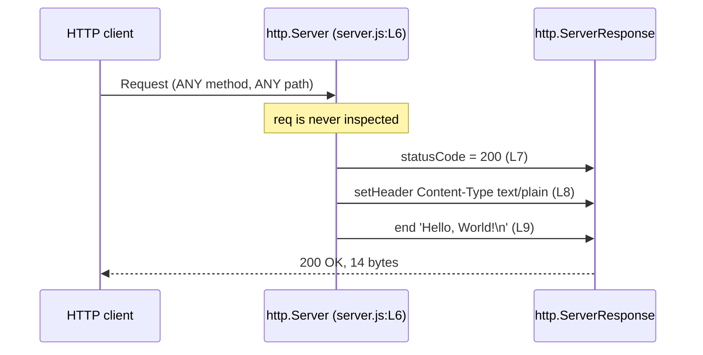

# HTTP API

The complete externally observable contract of the service. This page owns the
**HTTP response contract** and the **request lifecycle diagram** for the whole
documentation corpus.

Source files this page derives from: `server.js:L6-L10`, plus responses captured
by running the service.

## Overview

One logical endpoint exists, and it is neither path-scoped nor method-scoped. It
is reached at:

```text
http://127.0.0.1:3000
```

Any request to any path with any method receives the same application-level
reply. That is not a simplification for the sake of documentation — the request
listener at `server.js:L6-L10` never reads the request object at all, so there
is no code that could branch on a path or a method.

## Request matching

| Aspect | Behaviour | Evidence |
| --- | --- | --- |
| Method | Any: `GET`, `POST`, `PUT`, `PATCH`, `DELETE`, `OPTIONS`, `HEAD` | `req.method` is never read. Verified: `POST /whatever` returns the same reply as `GET /` |
| Path | Any, including `/` and arbitrary depth | `req.url` is never read. Verified: `GET /api/anything` returns the same reply as `GET /` |
| Query string | Ignored | Never read |
| Request headers | Ignored | Never read |
| Request body | Ignored, and never consumed | The request stream is never read |
| Content negotiation | None | `Accept` is ignored; the response is always `text/plain` |

## Response specification

| Field | Value | Source |
| --- | --- | --- |
| Status | `200` | `res.statusCode = 200` at `server.js:L7` |
| `Content-Type` | `text/plain` | `res.setHeader('Content-Type', 'text/plain')` at `server.js:L8` |
| `Content-Length` | `14` | Framed by Node from the 14-byte body |
| `Connection` | `keep-alive` when the request permits reuse, otherwise `close` | Node's framing, derived from the request |
| `Keep-Alive` | `timeout=5` when the connection is kept alive | Node's default |
| `Date` | The current time, regenerated per response | Sent by `http.Server` by default |
| Body | `Hello, World!` followed by a newline, 14 bytes | `res.end('Hello, World!\n')` at `server.js:L9` |

The reply is composed in three ordered steps: status code, then response header,
then payload plus termination. Status and header are set through the
`res.statusCode` property and the `res.setHeader()` call; **no combined
status-and-headers helper is used anywhere in the file**, so the head is flushed
implicitly when `res.end()` runs at `server.js:L9`.

### What the application controls, and what Node controls

The application-level reply is invariant. The **bytes on the wire are not**, and
conflating the two leads to wrong expectations:

- The `Date` header advances with the clock, so two responses emitted in
  different seconds are never byte-identical.
- `Connection` and `Keep-Alive` are derived from the request. An HTTP/1.1
  request that permits reuse is answered with `Connection: keep-alive` and
  `Keep-Alive: timeout=5`; a request carrying `Connection: close`, and any
  HTTP/1.0 request, is answered with `Connection: close` and no `Keep-Alive`. An
  HTTP/1.0 reply is close-delimited, so it carries no `Content-Length` at all.
- A `HEAD` request receives the head only. Node knows a `HEAD` response carries
  no body, so the greeting handed to `res.end()` is discarded and no
  `Content-Length` is framed. The request listener itself still runs unchanged.
- A `CONNECT` request never reaches the request listener. Node routes it to a
  separate `connect` event that this module does not handle, so the socket is
  closed without a single response byte.

## Request lifecycle diagram

This page owns this diagram. It is reproduced in the root
[README](../../README.md) so that file stays readable without following a link;
edit both copies together.



A narrated walk through the same four steps, including what happens beneath them
inside Node, is in
[../architecture/request-lifecycle.md](../architecture/request-lifecycle.md).

## Worked examples

Three examples, because it takes all three to establish the catch-all behaviour:
one alone would only show that the root path works. Each transcript was captured
from a real run against `node server.js`; only `Date` differs between runs.

### Example 1: the root path

```bash
curl -i http://127.0.0.1:3000/
```

```http
HTTP/1.1 200 OK
Content-Type: text/plain
Date: Tue, 04 Aug 2026 14:50:38 GMT
Connection: keep-alive
Keep-Alive: timeout=5
Content-Length: 14

Hello, World!
```

### Example 2: a path that looks like an API route

No such route is defined. The answer is unchanged, which is what demonstrates
that no routing exists:

```bash
curl -i http://127.0.0.1:3000/api/anything
```

```http
HTTP/1.1 200 OK
Content-Type: text/plain
Date: Tue, 04 Aug 2026 14:50:38 GMT
Connection: keep-alive
Keep-Alive: timeout=5
Content-Length: 14

Hello, World!
```

### Example 3: a different method

Unchanged again, which is what demonstrates that no method discrimination
exists — and therefore that no `405` code path exists either:

```bash
curl -i -X POST http://127.0.0.1:3000/whatever
```

```http
HTTP/1.1 200 OK
Content-Type: text/plain
Date: Tue, 04 Aug 2026 14:50:38 GMT
Connection: keep-alive
Keep-Alive: timeout=5
Content-Length: 14

Hello, World!
```

## Error responses

**There are none.** The request listener contains no conditional logic, no
`try`/`catch`, and no validation, so the module has no `4xx` and no `5xx` code
path:

| Situation a caller might expect to fail | What actually happens |
| --- | --- |
| Unknown path | `200` with the same body |
| Unsupported method | `200` with the same body |
| Malformed or oversized body | `200` with the same body; the body is never read |
| Missing or wrong `Accept` header | `200` with the same body |
| Any request at all, from the local machine | `200` with the same body |

The one way to get no response is to be somewhere else: a request from another
host never arrives, because of the loopback binding described in
[../guides/deployment.md](../guides/deployment.md). A malformed HTTP request
line is rejected by Node's parser before the listener runs, which is the
runtime's behaviour rather than this module's.

## Transport limitations

| Limitation | Consequence |
| --- | --- |
| Plain HTTP only, no TLS | Traffic is unencrypted; there is no HTTPS listener |
| Loopback binding | No other host can connect. See [../guides/deployment.md](../guides/deployment.md) |
| No authentication | Every local caller is equal and anonymous |
| No rate limiting | Request volume is bounded only by the machine |
| No compression | Responses are sent as-is; `Accept-Encoding` is ignored |
| HTTP/1.1 | No HTTP/2 and no WebSocket upgrade handling |

## See also

- [../../README.md](../../README.md) — the canonical overview, whose API
  documentation section this page expands.
- [server-module.md](server-module.md) — the code-level reference for the symbols
  behind this contract.
- [../architecture/request-lifecycle.md](../architecture/request-lifecycle.md) —
  the same exchange, narrated step by step.
- [../guides/deployment.md](../guides/deployment.md) — owner of the
  loopback-binding constraint.
