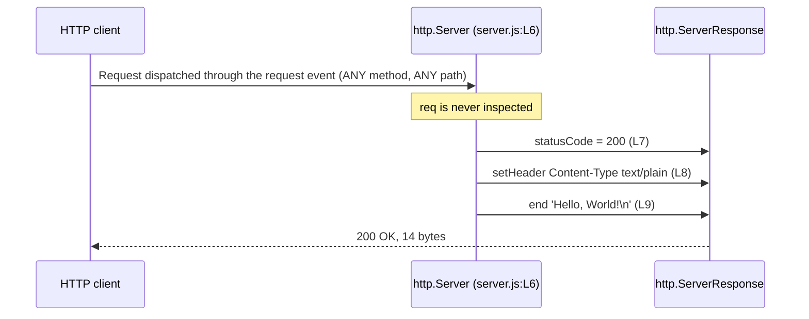

# HTTP API

This page is the complete reference for the service's externally observable
HTTP contract, and it owns that contract for the whole documentation corpus.
Every code fact stated here derives from `server.js`, and every response
transcript was captured by executing the server and pasting its literal
output — no transcript on this page was written by hand.

> **This endpoint is not production-ready, and it is not intended to be.** It
> is a local test fixture. There is no TLS, no authentication, no
> authorisation, no rate limiting, no request or error logging, no error
> handling, and no graceful shutdown; the listener is reachable only over
> loopback, and every request receives the same `200`. Do not expose it to an
> untrusted network, and do not put a proxy in front of it and treat the result
> as a service. The consequences, and what would have to be added, are under
> [Not production-ready](#not-production-ready) and in
> [../guides/deployment.md](../guides/deployment.md).

## Overview

The service exposes exactly one logical endpoint, and this page documents
**1 of 1**. That endpoint is a *catch-all response*: it is neither
path-scoped nor method-scoped.

The base URL is:

```text
http://127.0.0.1:3000
```

Every request that Node dispatches to the *request listener* through the
server's `request` event receives the same application-level reply, whatever
its method and whatever its path. That is not a simplification made for
brevity: the *request listener* never reads its request argument at all, so no
code exists that could branch on a method, a path, a query string, a header or
a body. `Source: server.js:L6-L10`

Two qualifications belong with that sentence rather than somewhere below it,
because both are load-bearing.

- **Not every request reaches the listener.** A `CONNECT` is dispatched to a
  different event that this module does not handle, so it receives no reply of
  any kind — not an error, not an empty body, nothing; and a request carrying an
  unsupported `Expect` header is answered by Node before the listener is
  consulted. Such requests are outside the contract documented here, and each one
  is enumerated in
  [the exceptions table](#requests-that-do-not-follow-this-contract).
- **The same application-level reply is not the same bytes.** The runtime, not
  this file, frames the transport per request, so `Date`, the
  `Connection`/`Keep-Alive` pair, `Content-Length` and even the presence of a
  body vary between responses: a `HEAD` request receives the head alone and an
  HTTP/1.0 request is close-delimited. The observed variations are in
  [the framing table](#framing-that-varies-with-the-request-observed-behaviour).

Read the rest of this page with that boundary in mind: the module's guarantee is
what the *application* contributes to an ordinary request, and everything else on
the wire is the runtime's.

## Request matching

The table below applies to every request Node dispatches to the *request
listener* through the server's `request` event. Nothing in it is configurable
and nothing in it is negotiated. Every row rests on the same single piece of
evidence: the *request listener* contains no read of `req` whatsoever, so
there is no mechanism by which any of these inputs could reach the response.

| Request aspect | How it is treated | Source |
| --- | --- | --- |
| Method | Any method that Node dispatches as a request matches — `GET`, `POST`, `PUT`, `DELETE`, `PATCH`, `HEAD`, `OPTIONS` and the rest. `req.method` is never read. `HEAD` is answered with the head only, and `CONNECT` is never dispatched to the listener at all; both are transport behaviours of the runtime, tabulated below | `Source: server.js:L6-L10` |
| Path | Any path matches, including `/` and arbitrary depth such as `/api/anything` or `/deep/nested/path`. `req.url` is never read | `Source: server.js:L6-L10` |
| Query string | Ignored. It arrives as part of `req.url`, which is never read | `Source: server.js:L6-L10` |
| Request headers | Ignored by the listener, `Accept` included, so no content negotiation occurs. `req.headers` is never read. `Connection` and `Expect` are nonetheless acted on by Node beneath the listener, as the table above records | `Source: server.js:L6-L10` |
| Request body | Ignored by the listener, and never consumed. The request stream is never read | `Source: server.js:L6-L10` |

There is therefore no route table to document, no path parameter to describe
and no supported-method list to enumerate. The matrix above is the whole of
the request-matching behaviour for a dispatched request.

### Requests that do not follow this contract

Node decides which requests become a `request` event in the first place, and
it answers some of them itself. Nothing in `server.js` participates in those
decisions and nothing in it can override them: the module registers no
`connect`, `upgrade`, `checkContinue`, `checkExpectation` or `clientError`
listener, so Node's defaults apply unchanged. `Source: server.js:L1-L14`

Every row below was observed against this module during verification on Node
`v22.23.2`. The captured transcripts are in
[Node-generated protocol responses](#node-generated-protocol-responses-observed).

| Request | What happens | Reaches the listener? |
| --- | --- | --- |
| `CONNECT` | Node dispatches it to the server's `connect` event, which this module does not handle, so the socket is closed without a single response byte | No |
| Unsupported `Expect` header | Node answers `417 Expectation Failed` itself, with an empty chunked body | No |
| `Expect: 100-continue` | Node writes an interstitial `HTTP/1.1 100 Continue`, then the listener runs and the ordinary reply follows | Yes, after the interstitial |
| Malformed request line, or an unparseable HTTP version | Node's parser answers `400 Bad Request` and closes the connection | No |
| Header block above Node's `maxHeaderSize` | Node's parser answers `431 Request Header Fields Too Large` and closes the connection | No |
| HTTP/2 prior-knowledge preface (`PRI * HTTP/2.0`) | Answered `400 Bad Request`; this is an HTTP/1.x server only | No |
| Upgrade handshake (`Connection: Upgrade` with an `Upgrade` header) | No protocol switch is possible, because no `upgrade` listener exists. Verified: the handshake was answered with the ordinary `200`, never a `101` | Yes |
| `HEAD` | The listener runs unchanged, but Node discards the payload, so the client receives the head only, with no `Content-Length` and no body | Yes, body suppressed |
| HTTP/1.0 | The listener runs unchanged; the reply is close-delimited, so it carries no `Content-Length` | Yes |

The five rows answered `No` are the reason the catch-all contract is scoped to
dispatched requests rather than to "any request": for those, not one line of
`server.js` executes, and whatever the client receives — a status code, or
silence — is Node's doing rather than the module's. The rows answered `Yes` do
run the listener, so the application-level reply is the documented one; what
differs is the framing Node puts around it.

## Response specification

A response has two authors, and separating them is the single most useful
thing this page can do for a caller. Three values come from the module and are
guaranteed; everything else on the wire is composed by Node and varies with the
request, the protocol version and the runtime.

### Guaranteed by the module

These three values are written by application code. They are identical on
every reply the *request listener* composes, and they are the only part of the
response this repository controls.

| Field | Value | Source |
| --- | --- | --- |
| Status | `200` | `Source: server.js:L7` |
| `Content-Type` | `text/plain` | `Source: server.js:L8` |
| Body | `Hello, World!` followed by a newline, 14 bytes | `Source: server.js:L9` |

### Supplied by Node (observed defaults, not a module guarantee)

No code in the module produces any of the following. Each is Node's own
behaviour, and each is request-, protocol- or runtime-dependent: the values
below are what an HTTP/1.1 client that permits connection reuse was observed to
receive from Node v22.23.2, and they are what every worked example on this page
reproduces. Treat them as the defaults you should expect, not as a contract to
depend on.

| Field | Observed value | Why it can differ |
| --- | --- | --- |
| `Content-Length` | `14` | Framed by Node from the 14-byte body. Absent on an HTTP/1.0 reply, which is close-delimited, and absent for `HEAD` — `Source: server.js:L9` |
| `Connection` | `keep-alive` | Derived from the request: `close` for an HTTP/1.0 request or one carrying `Connection: close` |
| `Keep-Alive` | `timeout=5` | Sent only when the connection is kept alive, and the timeout reflects Node's server defaults rather than any setting in this repository |
| `Date` | A timestamp | Regenerated per response. See [The `Date` header](#the-date-header) |

The full observed variation is tabulated under
[Framing that varies with the request](#framing-that-varies-with-the-request-observed-behaviour).

The body length was measured rather than counted by eye. Measure it with
pipeline failure propagation switched on, so that a request which fails cannot
report a successful `0`:

```bash
set -o pipefail
curl --fail --silent --show-error --noproxy '*' http://127.0.0.1:3000/ | wc -c
```

```text
14
```

Every part of that command earns its place. `--fail` makes `curl` exit non-zero
on an HTTP error status instead of piping an error page into `wc`;
`--show-error` keeps the diagnostic visible even though `--silent` has
suppressed the progress meter; `--noproxy '*'` stops a configured proxy
answering on the service's behalf; and `set -o pipefail` gives the pipeline
`curl`'s exit status rather than `wc`'s. That last one is what stops a failure
being reported as a byte count. Captured from the same command aimed at a port
with nothing behind it — the pipeline printed `0` and exited **7** rather than
exiting 0:

```text
curl: (7) Failed to connect to 127.0.0.1 port 3999 after 0 ms: Could not connect to server
0
```

A byte dump accounts for all fourteen: thirteen characters of greeting and one
trailing line feed.

```bash
curl --fail --silent --show-error --noproxy '*' http://127.0.0.1:3000/ | od -c
```

```text
0000000   H   e   l   l   o   ,       W   o   r   l   d   !  \n
0000016
```

The reply is composed in exactly three ordered steps:

1. The status code is assigned to the `res.statusCode` property.
   `Source: server.js:L7`
2. The one response header the module sets is applied with `res.setHeader()`.
   `Source: server.js:L8`
3. The body is written and the response terminated with `res.end()`, which
   flushes the head implicitly. `Source: server.js:L9`

No combined status-and-headers helper is called anywhere in the module, so
steps 1 and 2 must both precede step 3. Once `res.end()` has run the head is
already on the wire, and neither the status nor a header can be changed.

## Response headers

Five headers appear on the wire in the observed HTTP/1.1 case, and only one of
them — `Content-Type` — is set by the module. The other four are Node's, and
`Date` is the one whose value is never fixed, so it gets its own section.

### The `Date` header

`Date` is a per-request volatile value that Node supplies automatically. It
records the moment the response was generated, so it advances with the clock:
it **may** differ between any two responses, and it always differs across a
second boundary. Two responses generated within the same second carry the same
value. That is exactly why it appears among the Node-supplied defaults above
rather than among the module's guarantees: there is no fixed value to document,
only a behaviour.

Its resolution on the wire is one second, which is what makes the behaviour
worth stating rather than assuming. Two responses generated in the same second
carry an identical `Date`; two responses generated either side of a second
boundary do not. Both cases were observed. Two responses captured two seconds
apart show the differing case directly:

```text
Date: Tue, 04 Aug 2026 17:06:56 GMT
Date: Tue, 04 Aug 2026 17:06:58 GMT
```

The three worked examples further down were all served inside a single second
and share one `Date` value, which is the coinciding case.

The practical consequence is the one a caller cares about: two responses are
byte-identical only when they are generated within the same second, so no
client should compare whole responses for equality. Every transcript in the
worked examples below keeps its `Date` line exactly as captured.

### Header order on the wire

The verified order in which the five headers are emitted is:

| Position | Header |
| --- | --- |
| 1 | `Content-Type` |
| 2 | `Date` |
| 3 | `Connection` |
| 4 | `Keep-Alive` |
| 5 | `Content-Length` |

That order is Node's rather than the module's: of the five, only
`Content-Type` is set by application code. `Source: server.js:L8`

HTTP header order carries no semantic meaning, so no client should depend on
it. It is recorded here only so that the transcripts below can be compared
against a real response without the order looking like an inconsistency.

### Framing that varies with the request (observed behaviour)

For a request that reaches the *request listener* the application-level reply
never varies, but the bytes Node frames around it do. Each row below was
observed against this module during verification. These are behaviours of the
Node runtime, not guarantees of this module: no code in the module produces any
of them.

| Request | Observed response framing |
| --- | --- |
| HTTP/1.1, connection reuse permitted | `Connection: keep-alive`, `Keep-Alive: timeout=5`, `Content-Length: 14` |
| HTTP/1.1 carrying `Connection: close` | `Connection: close`, no `Keep-Alive`, `Content-Length: 14` still present |
| HTTP/1.0 | `Connection: close`, no `Keep-Alive`, and no `Content-Length` — the body is close-delimited |
| `HEAD` | The head only, with no `Content-Length` and no body. The request listener still runs unchanged |
| `CONNECT` | No response whatsoever — not one byte was received, because Node dispatches `CONNECT` to an event this module does not handle. It never reaches the listener, so it is also listed in [the exceptions table](#requests-that-do-not-follow-this-contract) |

The first row is the case the Node-supplied defaults table above records, and it
is the case all three worked examples below exercise. The module's three
guaranteed values are unchanged in every row.

## Worked examples

Three examples are given rather than one, because it takes all three together
to establish the catch-all behaviour. One alone would only show that the root
path answers; it would say nothing about whether a different path or a
different method is treated differently.

Each transcript below was captured from a real run against `node server.js`.
The server was started in the background, probed, and stopped again, and the
output is pasted exactly as `curl` printed it. The startup banner observed on
stdout for that run was:

```text
Server running at http://127.0.0.1:3000/
```

`Source: server.js:L13`

All three probes carry `--noproxy '*'` for the reason given under
[Response specification](#response-specification): without it a configured
`http_proxy` intercepts the request, and the proxy's answer — a `200`, a `403`
or a cached body — is indistinguishable in this transcript from the service's
own. A probe that a proxy answered would establish nothing about the endpoint.
`--max-time 5` bounds each probe so a filtered address fails instead of
hanging, and `--silent --show-error` prints the response without the progress
meter while keeping any diagnostic visible.

### Example 1: the root path

```bash
curl --noproxy '*' --include --silent --show-error --max-time 5 http://127.0.0.1:3000/
```

```http
HTTP/1.1 200 OK
Content-Type: text/plain
Date: Tue, 04 Aug 2026 21:43:47 GMT
Connection: keep-alive
Keep-Alive: timeout=5
Content-Length: 14

Hello, World!
```

### Example 2: a path that looks like an API route

No such route is defined anywhere. The answer is unchanged, and that is what
demonstrates that no routing exists:

```bash
curl --noproxy '*' --include --silent --show-error --max-time 5 http://127.0.0.1:3000/api/anything
```

```http
HTTP/1.1 200 OK
Content-Type: text/plain
Date: Tue, 04 Aug 2026 21:43:47 GMT
Connection: keep-alive
Keep-Alive: timeout=5
Content-Length: 14

Hello, World!
```

### Example 3: a different method

Unchanged again, which is what demonstrates that no method discrimination
exists — and therefore that no `405` code path exists either:

```bash
curl --noproxy '*' --include --silent --show-error --max-time 5 --request POST http://127.0.0.1:3000/whatever
```

```http
HTTP/1.1 200 OK
Content-Type: text/plain
Date: Tue, 04 Aug 2026 21:43:47 GMT
Connection: keep-alive
Keep-Alive: timeout=5
Content-Length: 14

Hello, World!
```

### What the three examples establish

The three responses are byte-identical apart from `Date`, which is the
empirical confirmation that there is no routing and no method discrimination.
In the capture above all three requests were served within the same second, so
even `Date` coincides and the three transcripts are byte-identical outright;
across a second boundary only the `Date` line would differ.

The same conclusion was confirmed under harder input. A `POST` to a nested
path carrying a query string, a `Content-Type: application/json` header, an
`Accept: application/xml` header, a custom header and a JSON body returned a
response identical to Example 1 once `Date` was excluded. Query string,
request headers and request body are therefore ignored in fact, not merely in
principle. `Source: server.js:L6-L10`

## No application-defined error responses

**The module defines none.** It has no `4xx` branch and no `5xx` branch,
because the *request listener* contains no conditional logic, no `try`/`catch`
and no validation of any kind. Every request that reaches the listener is
answered with the response specified above, and no input can make the
*application* emit a different status code. `Source: server.js:L6-L10`

That is a statement about this repository's code, not about everything a client
can ever receive from this port. Three distinct layers can produce an outcome,
and only the first is the module's:

| Layer | Who produces it | What a client sees |
| --- | --- | --- |
| Application | The *request listener* | Always `200` with the documented body. No other status is reachable — `Source: server.js:L6-L10` |
| Node's HTTP parser and protocol handling | The runtime, above the listener | A protocol-level error response that this module neither defines nor can suppress, such as `400 Bad Request` for a malformed request line or headers, `431 Request Header Fields Too Large` when the header block exceeds Node's limit, or `417 Expectation Failed` for an expectation the runtime will not honour. The listener does not run in these cases, so no line of `server.js` is involved |
| Process | The operating system and the module's absent error handling | No response at all. The process may never have bound its port — a failed bind emits an `error` event that this module does not handle, so it exits — or it may have been stopped. A client sees a connection refusal rather than an HTTP status |

### Node-generated protocol responses (observed)

These are runtime defaults, and they apply precisely because the module opts
out of every hook that could change them: no `clientError`, `checkExpectation`
or `checkContinue` listener is registered anywhere in the file.
`Source: server.js:L1-L14`

| Trigger | Status Node generates | Listener runs? |
| --- | --- | --- |
| Malformed request line | `400 Bad Request` | No |
| Unparseable HTTP version | `400 Bad Request` | No |
| HTTP/2 prior-knowledge preface | `400 Bad Request` | No |
| Header block above `maxHeaderSize` | `431 Request Header Fields Too Large` | No |
| Unsupported `Expect` header | `417 Expectation Failed` | No |
| `Expect: 100-continue` | `100 Continue`, then the ordinary `200` | Yes |

Each transcript below was captured by sending raw bytes to a running instance
and pasting exactly what came back. A malformed request line produced a bare
error head with no `Date` and no body:

```http
HTTP/1.1 400 Bad Request
Connection: close
```

A 20 KB header field exceeded Node's default `maxHeaderSize` and produced:

```http
HTTP/1.1 431 Request Header Fields Too Large
Connection: close
```

An unsupported expectation — `Expect: bogus` — was refused by Node itself, and
the greeting never appeared, which is the direct evidence that the listener
never ran. These were the request bytes, and they carry no `Connection` header,
so the request expressed no framing preference:

```http
POST / HTTP/1.1
Host: 127.0.0.1:3000
Expect: bogus
Content-Length: 0
```

```http
HTTP/1.1 417 Expectation Failed
Date: Wed, 05 Aug 2026 01:04:32 GMT
Connection: keep-alive
Keep-Alive: timeout=5
Transfer-Encoding: chunked

0
```

The connection is **kept alive** after a `417`. The status is Node's, but the
framing wrapped around it is the ordinary HTTP/1.1 framing recorded in
[Framing that varies with the request](#framing-that-varies-with-the-request-observed-behaviour).
Adding `Connection: close` to that same request replaces those two headers with
a single `Connection: close`, exactly as the second row of that table describes,
and that is the only way to obtain a close-framed `417` from this service. The
status also depends on the protocol version: an HTTP/1.0 request carrying
`Expect: bogus` is answered with the ordinary `200` instead, because HTTP/1.0
defines no expectation for the runtime to refuse. Every other request shape
tried — `GET` with no body, `POST` with the body withheld, sent, or chunked, and
`Expect: 999-continue` — produced that same head apart from `Date`.

`Expect: 100-continue` is the one expectation Node honours by default. It
writes an interstitial informational response and then hands the request to the
listener, so the exchange carries two status lines:

```http
HTTP/1.1 100 Continue

HTTP/1.1 200 OK
Content-Type: text/plain
Date: Tue, 04 Aug 2026 20:04:41 GMT
Connection: keep-alive
Keep-Alive: timeout=5
Content-Length: 14

Hello, World!
```

There is also one way to receive no response at all, and it is not an error
response: either the request never arrives, or Node dispatches it to an event
this module does not handle. A `CONNECT` is the second case — the socket closes
without a byte. Both are covered in
[the exceptions table](#requests-that-do-not-follow-this-contract) and in the
transport limitations below.

Two consequences are worth stating plainly. First, no error-response table for
the *application* is possible, and inventing one would document nothing.
Second, seeing a status other than `200` from `127.0.0.1:3000` does not mean
this module produced it: it means either the runtime answered below the
application, or something else is listening on the port. The process-level
failures, and how to tell them apart, are owned by
[../guides/troubleshooting.md](../guides/troubleshooting.md).

## Transport limitations

| Limitation | Consequence |
| --- | --- |
| Plain HTTP only, no TLS | There is no HTTPS listener, so all traffic is unencrypted and unauthenticated in both directions |
| *Loopback binding* | No other host can reach the service — `Source: server.js:L3` |
| No authentication | Every caller is anonymous; no credential is requested or checked |
| No authorization | There is no permission model, so the application refuses no request on authorization grounds |
| No rate limiting | Request volume is bounded only by the machine |
| No routing | One catch-all response, so no path can be addressed separately |
| No request or error logging | After the startup banner the process is silent, so a request leaves no trace anywhere — there is nothing to audit or alert on |
| No error handling | The listener has no `try`/`catch` and the server has no `error` listener, so a failure is an unhandled event rather than a `5xx` |
| No graceful shutdown | No `SIGTERM` or `SIGINT` handler and no `server.close()`, so in-flight requests are dropped on termination |
| No security headers | Nothing sets `Strict-Transport-Security`, `X-Content-Type-Options`, `Content-Security-Policy` or any other hardening header; the only header the module sets is `Content-Type` — `Source: server.js:L8` |
| No timeouts or body limits | Node's defaults are whatever the runtime ships; the module configures nothing, and it never reads a request body |
| No compression | `Accept-Encoding` is ignored and the body is sent as-is |
| HTTP/1.x only; no HTTP/2 | Both HTTP/1.1 and HTTP/1.0 requests are served, and the framing differs between them — see [the framing table](#framing-that-varies-with-the-request-observed-behaviour). An HTTP/2 prior-knowledge preface is answered `400 Bad Request` |
| No upgrade handling | No `upgrade` listener exists, so no WebSocket or other protocol switch is ever completed; an upgrade handshake receives the ordinary `200` |

The *loopback binding* is the limitation most likely to be met first: a
request to the host's non-loopback address on port 3000 receives no response
at all, because nothing is listening there. `Source: server.js:L3` That
constraint is owned and analysed in
[../guides/deployment.md](../guides/deployment.md), which also covers how to
front the service with a reverse proxy.

### Not production-ready

**Every row above is an absence, and together they are why this endpoint must
not be treated as a service.** The table is not a list of features postponed to
a later version; it is the complete security posture of a fixture whose purpose
is to answer one request identically, so that documentation and tooling have
something deterministic to point at.

Three consequences are worth stating plainly, because each is easy to reach by
accident:

- **Anything that can open a TCP connection to the port is fully authorised.**
  There is no credential, no permission model and no refusal path, so "who is
  calling" is a question the service cannot ask. Access control is entirely a
  property of the environment — today, only the loopback interface.
- **Nothing is recorded.** No access log, no error log, no metric and no health
  endpoint, so misuse leaves no evidence and an operator has nothing to inspect
  after the fact.
- **A reverse proxy in front does not fix this.** It can add TLS, credentials
  and rate limits for *remote* callers, and it cannot mediate a local process
  connecting straight to `127.0.0.1:3000`. Every hardening control listed above
  is still missing behind it.

Treat the service as a local, single-user fixture. Do not put it on an
untrusted network, do not point real clients at it, and do not carry its
response contract into anything that matters.
[../guides/deployment.md](../guides/deployment.md) owns the full hardening
checklist and the deployment advisory, and
[../guides/troubleshooting.md](../guides/troubleshooting.md) owns the
operational failure modes.

## Request lifecycle diagram

This page owns this diagram. It is mirrored in the root
[README](../../README.md) and in
[../architecture/request-lifecycle.md](../architecture/request-lifecycle.md),
so that each of those pages reads without following a link. All three copies
are identical and must be edited together.



A narrated walk through the same four steps, including what Node does beneath
them, is in
[../architecture/request-lifecycle.md](../architecture/request-lifecycle.md).

## See also

- [../../README.md](../../README.md) — the canonical overview, whose API
  documentation section this page expands.
- [server-module.md](server-module.md) — the code-level reference for the
  symbols behind this contract, including the *request listener* and the
  *startup callback*.
- [../architecture/request-lifecycle.md](../architecture/request-lifecycle.md)
  — the same exchange, narrated step by step.
- [../guides/deployment.md](../guides/deployment.md) — owner of the *loopback
  binding* constraint and the reverse-proxy guidance.
- [../guides/troubleshooting.md](../guides/troubleshooting.md) — owner of
  port-conflict remediation and the other operational failure modes.
- [../getting-started/installation.md](../getting-started/installation.md) —
  how to start the server that serves this contract.
