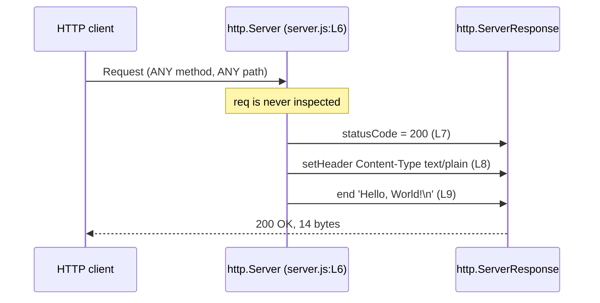

# HTTP API

This page is the complete reference for the service's externally observable
HTTP contract, and it owns that contract for the whole documentation corpus.
Every code fact stated here derives from `server.js`, and every response
transcript was captured by executing the server and pasting its literal
output — no transcript on this page was written by hand.

## Overview

The service exposes exactly one logical endpoint, and this page documents
**1 of 1**. That endpoint is a *catch-all response*: it is neither
path-scoped nor method-scoped.

The base URL is:

```text
http://127.0.0.1:3000
```

Any request, using any method, to any path receives the same reply. That is
not a simplification made for brevity. The *request listener* never reads its
request argument at all, so no code exists that could branch on a method, a
path, a query string, a header or a body. `Source: server.js:L6-L10`

## Request matching

Nothing in the table below is configurable and nothing in it is negotiated.
Every row rests on the same single piece of evidence: the *request listener*
contains no read of `req` whatsoever, so there is no mechanism by which any
of these inputs could reach the response.

| Request aspect | How it is treated | Source |
| --- | --- | --- |
| Method | Any method matches — `GET`, `POST`, `PUT`, `DELETE`, `PATCH`, `HEAD`, `OPTIONS` and any other. `req.method` is never read | `Source: server.js:L6-L10` |
| Path | Any path matches, including `/` and arbitrary depth such as `/api/anything` or `/deep/nested/path`. `req.url` is never read | `Source: server.js:L6-L10` |
| Query string | Ignored. It arrives as part of `req.url`, which is never read | `Source: server.js:L6-L10` |
| Request headers | Ignored, `Accept` included, so no content negotiation occurs. `req.headers` is never read | `Source: server.js:L6-L10` |
| Request body | Ignored, and never consumed. The request stream is never read | `Source: server.js:L6-L10` |

There is therefore no route table to document, no path parameter to describe
and no supported-method list to enumerate. The matrix above is the whole of
the request-matching behaviour.

## Response specification

The stable application-level contract is the status code, the four headers
listed below, and the body. These are the values every worked example on this
page reproduces, and they are what an HTTP/1.1 client that permits connection
reuse receives.

| Field | Value | Source |
| --- | --- | --- |
| Status | `200` | `Source: server.js:L7` |
| `Content-Type` | `text/plain` | `Source: server.js:L8` |
| `Content-Length` | `14` | Framed by Node from the 14-byte body — `Source: server.js:L9` |
| `Connection` | `keep-alive` | Node's HTTP/1.1 default; not set by the module |
| `Keep-Alive` | `timeout=5` | Node's default; not set by the module |
| Body | `Hello, World!` followed by a newline, 14 bytes | `Source: server.js:L9` |

The body length was confirmed rather than counted by eye:
`curl -s http://127.0.0.1:3000/ | wc -c` returns `14`, and a byte dump shows
`Hello, World!` followed by a single line feed.

The reply is composed in exactly three ordered steps:

1. The status code is assigned to the `res.statusCode` property.
   `Source: server.js:L7`
2. The one response header the module sets is applied with `res.setHeader()`.
   `Source: server.js:L8`
3. The body is written and the response terminated with `res.end()`, which
   flushes the head implicitly. `Source: server.js:L9`

No combined status-and-headers helper is called anywhere in the module, so
steps 1 and 2 must both precede step 3. Once `res.end()` has run the head is
already on the wire, and neither the status nor a header can be changed.

## Response headers

Five headers appear on the wire, not four. The four in the contract table
above are stable. The fifth, `Date`, is not, and it is documented separately
here so that it does not contaminate the stable contract.

### The `Date` header

`Date` is a per-request volatile value that Node supplies automatically. It
records the moment the response was generated, so it advances with the clock
and is expected to differ on every response. That is exactly why it is absent
from the contract table above: there is no fixed value to document, only a
behaviour.

Two responses captured two seconds apart during verification show it directly:

```text
Date: Tue, 04 Aug 2026 17:06:56 GMT
Date: Tue, 04 Aug 2026 17:06:58 GMT
```

The practical consequence is that two responses are byte-identical only when
they are generated within the same second. Every transcript in the worked
examples below therefore keeps its `Date` line exactly as captured.

### Header order on the wire

The verified order in which the five headers are emitted is:

| Position | Header |
| --- | --- |
| 1 | `Content-Type` |
| 2 | `Date` |
| 3 | `Connection` |
| 4 | `Keep-Alive` |
| 5 | `Content-Length` |

That order is Node's rather than the module's: of the five, only
`Content-Type` is set by application code. `Source: server.js:L8`

HTTP header order carries no semantic meaning, so no client should depend on
it. It is recorded here only so that the transcripts below can be compared
against a real response without the order looking like an inconsistency.

### Framing that varies with the request (observed behaviour)

The application-level reply never varies, but the bytes Node frames around it
do. Each row below was observed against this module during verification.
These are behaviours of the Node runtime, not guarantees of this module: no
code in the module produces any of them.

| Request | Observed response framing |
| --- | --- |
| HTTP/1.1, connection reuse permitted | `Connection: keep-alive`, `Keep-Alive: timeout=5`, `Content-Length: 14` |
| HTTP/1.1 carrying `Connection: close` | `Connection: close`, no `Keep-Alive`, `Content-Length: 14` still present |
| HTTP/1.0 | `Connection: close`, no `Keep-Alive`, and no `Content-Length` — the body is close-delimited |
| `HEAD` | The head only, with no `Content-Length` and no body. The request listener still runs unchanged |
| `CONNECT` | No response whatsoever — not one byte was received, because Node dispatches `CONNECT` to an event this module does not handle |

The first row is the case the contract table documents, and it is the case all
three worked examples below exercise.

## Worked examples

Three examples are given rather than one, because it takes all three together
to establish the catch-all behaviour. One alone would only show that the root
path answers; it would say nothing about whether a different path or a
different method is treated differently.

Each transcript below was captured from a real run against `node server.js`.
The server was started in the background, probed, and stopped again, and the
output is pasted exactly as `curl` printed it. The startup banner observed on
stdout for that run was:

```text
Server running at http://127.0.0.1:3000/
```

`Source: server.js:L13`

### Example 1: the root path

```bash
curl -i http://127.0.0.1:3000/
```

```http
HTTP/1.1 200 OK
Content-Type: text/plain
Date: Tue, 04 Aug 2026 17:06:40 GMT
Connection: keep-alive
Keep-Alive: timeout=5
Content-Length: 14

Hello, World!
```

### Example 2: a path that looks like an API route

No such route is defined anywhere. The answer is unchanged, and that is what
demonstrates that no routing exists:

```bash
curl -i http://127.0.0.1:3000/api/anything
```

```http
HTTP/1.1 200 OK
Content-Type: text/plain
Date: Tue, 04 Aug 2026 17:06:40 GMT
Connection: keep-alive
Keep-Alive: timeout=5
Content-Length: 14

Hello, World!
```

### Example 3: a different method

Unchanged again, which is what demonstrates that no method discrimination
exists — and therefore that no `405` code path exists either:

```bash
curl -i -X POST http://127.0.0.1:3000/whatever
```

```http
HTTP/1.1 200 OK
Content-Type: text/plain
Date: Tue, 04 Aug 2026 17:06:40 GMT
Connection: keep-alive
Keep-Alive: timeout=5
Content-Length: 14

Hello, World!
```

### What the three examples establish

The three responses are byte-identical apart from `Date`, which is the
empirical confirmation that there is no routing and no method discrimination.
In the capture above all three requests were served within the same second, so
even `Date` coincides and the three transcripts are byte-identical outright;
across a second boundary only the `Date` line would differ.

The same conclusion was confirmed under harder input. A `POST` to a nested
path carrying a query string, a `Content-Type: application/json` header, an
`Accept: application/xml` header, a custom header and a JSON body returned a
response identical to Example 1 once `Date` was excluded. Query string,
request headers and request body are therefore ignored in fact, not merely in
principle. `Source: server.js:L6-L10`

## Error responses

**There are none.** The module has no `4xx` code path and no `5xx` code path,
because the *request listener* contains no conditional logic, no `try`/`catch`
and no validation of any kind. `Source: server.js:L6-L10`

This is not a gap in this page. An error-response table would have to be
invented to exist, and nothing would be documented by inventing it: every
request that reaches the *request listener* is answered with the response
specified above, and there is no input that can produce any other status code.

There is one way to receive no response at all, and it is not an error
response — the request never arrives. See the transport limitations below.

## Transport limitations

| Limitation | Consequence |
| --- | --- |
| Plain HTTP only, no TLS | There is no HTTPS listener, so all traffic is unencrypted |
| *Loopback binding* | No other host can reach the service — `Source: server.js:L3` |
| No authentication | Every caller is anonymous; no credential is requested or checked |
| No authorization | There is no permission model, so no request can be refused |
| No rate limiting | Request volume is bounded only by the machine |
| No routing | One catch-all reply, so no path can be addressed separately |
| No compression | `Accept-Encoding` is ignored and the body is sent as-is |
| HTTP/1.1 | No HTTP/2, and no WebSocket upgrade handling |

The *loopback binding* is the limitation most likely to be met first: a
request to the host's non-loopback address on port 3000 receives no response
at all, because nothing is listening there. `Source: server.js:L3` That
constraint is owned and analysed in
[../guides/deployment.md](../guides/deployment.md), which also covers how to
front the service with a reverse proxy.

## Request lifecycle diagram

This page owns this diagram. It is mirrored in the root
[README](../../README.md) and in
[../architecture/request-lifecycle.md](../architecture/request-lifecycle.md),
so that each of those pages reads without following a link. All three copies
are identical and must be edited together.



A narrated walk through the same four steps, including what Node does beneath
them, is in
[../architecture/request-lifecycle.md](../architecture/request-lifecycle.md).

## See also

- [../../README.md](../../README.md) — the canonical overview, whose API
  documentation section this page expands.
- [server-module.md](server-module.md) — the code-level reference for the
  symbols behind this contract, including the *request listener* and the
  *startup callback*.
- [../architecture/request-lifecycle.md](../architecture/request-lifecycle.md)
  — the same exchange, narrated step by step.
- [../guides/deployment.md](../guides/deployment.md) — owner of the *loopback
  binding* constraint and the reverse-proxy guidance.
- [../guides/troubleshooting.md](../guides/troubleshooting.md) — owner of
  port-conflict remediation and the other operational failure modes.
- [../getting-started/installation.md](../getting-started/installation.md) —
  how to start the server that serves this contract.
