# Code walkthrough

Every line of `server.js`, in order, including the blank ones. This is the
expanded form of the inline comments in the source: the same explanations with
room for the reasoning that will not fit at the end of a line of code.

Source files this page derives from: `server.js:L1` through `server.js:L14`.

## How to read this walkthrough

`server.js` has **14 content lines**: 11 lines of code and 3 blank separators at
L2, L5, and L11. Every `Lnn` reference here and throughout the documentation
corpus refers to that original 14-line layout, which is the citation basis the
whole corpus shares. The JSDoc blocks and inline comments now in the file shift
the physical position of those statements without changing the citation basis, so
`server.js:L7` means "the statement that was on line 7 of the unannotated file"
wherever it physically sits today.

The file divides into four blocks, and the blank lines are what divide them.

## Block 1: dependency acquisition

```javascript
const http = require('http');
```

Source: `server.js:L1`.

Loads Node's built-in HTTP module. Three things follow from it being a **core**
module: nothing is installed to satisfy this import, it appears in no dependency
manifest, and the application's runtime dependency tree is genuinely empty — a
claim you can verify with `npm ls --omit=dev --depth=0`, as shown in
[../getting-started/installation.md](../getting-started/installation.md).

L2 is blank. It separates dependency acquisition from configuration, which is the
only structural signal the file gives about its own layout.

## Block 2: configuration constants

```javascript
const hostname = '127.0.0.1';
const port = 3000;
```

Source: `server.js:L3` and `server.js:L4`.

`hostname` is the IPv4 loopback literal, and it is the most consequential value
in the file: binding loopback rather than `0.0.0.0` confines the service to the
local machine, so no other host can reach it at all. `port` is the TCP port the
listener will bind, and a conflict on it is the module's one routine startup
failure.

Both values are read exactly twice — once by `server.listen()` at `server.js:L12`
and once by the banner at `server.js:L13`. Neither is read from the environment,
which is why `PORT=8080 node server.js` has no effect. The options, their
override procedure, and that surprise are owned by
[../getting-started/configuration.md](../getting-started/configuration.md).

L5 is blank, separating configuration from server construction.

## Block 3: server construction and the request listener

```javascript
const server = http.createServer((req, res) => {
  res.statusCode = 200;
  res.setHeader('Content-Type', 'text/plain');
  res.end('Hello, World!\n');
});
```

Source: `server.js:L6` through `server.js:L10`.

**L6** instantiates an `http.Server` and registers the request listener in the
same expression. This constructs; it does not listen. No socket exists yet and
nothing is reachable until L12 runs. The listener passed here is an anonymous
inline arrow expression, which is precisely why the annotations document it
through a `@callback` typedef named `RequestHandler` — there is no identifier for
an ordinary doc block to bind to. See
[../api/server-module.md](../api/server-module.md).

**L7** sets the status line. Assigning `res.statusCode` mutates the pending
response head, so it must happen before any body byte is written.

**L8** declares the payload's MIME type. Same constraint: `setHeader()` mutates
the pending head, so it must precede `res.end()`. This is the only header the
application sets; `Date`, `Content-Length`, `Connection`, and `Keep-Alive` all
come from Node.

**L9** writes the 14-byte body and terminates the response, flushing the implicit
head — the status from L7 and the header from L8 — in the process. No combined
status-and-headers helper is used anywhere in this file. For a `HEAD` request Node
discards this payload before it reaches the wire.

**L10** closes the listener body and the `createServer` invocation. It is a
closing brace and a parenthesis, and it is annotated in the source like every
other line, because a line-level comment mandate that skips the structural lines
is not a line-level mandate.

Note what is absent from this block: any read of `req`. Method, path, query
string, headers, and body are all ignored, which is the whole reason the service
answers every request identically. The consequences for callers are in
[request-lifecycle.md](request-lifecycle.md).

L11 is blank, separating construction from binding.

## Block 4: socket binding and the startup callback

```javascript
server.listen(port, hostname, () => {
  console.log(`Server running at http://${hostname}:${port}/`);
});
```

Source: `server.js:L12` through `server.js:L14`.

**L12** binds the socket and begins accepting connections. It is asynchronous: the
call returns immediately, and the callback runs later, when the `listening` event
fires. This line is also what makes importing the module consequential — the bind
happens as a side effect of evaluating the file, before any caller can intervene.
If the bind fails, the server emits an `error` event that nothing here handles,
so the process exits with an unhandled `EADDRINUSE`; see
[../guides/troubleshooting.md](../guides/troubleshooting.md).

**L13** emits the readiness banner, interpolating both configuration constants
into a template literal. Because the values are interpolated rather than
duplicated, the banner always reports the address actually in force:

```text
Server running at http://127.0.0.1:3000/
```

**L14** closes the startup callback and the `listen` invocation.

The startup callback is the file's second anonymous arrow expression, documented
as the `ServerStartupCallback` typedef. It takes no parameters, returns nothing,
and exists solely for that one line of output.

## Line-by-line table

| Line | Content | Role |
| --- | --- | --- |
| L1 | `const http = require('http');` | Loads Node's built-in HTTP module; core, so nothing is installed |
| L2 | *(blank)* | Separates dependency acquisition from configuration |
| L3 | `const hostname = '127.0.0.1';` | IPv4 loopback literal; confines reachability to this machine |
| L4 | `const port = 3000;` | TCP port the listener will bind |
| L5 | *(blank)* | Separates configuration from server construction |
| L6 | `const server = http.createServer((req, res) => {` | Constructs the `http.Server` and registers the request listener |
| L7 | `res.statusCode = 200;` | Sets the status line; must precede any body byte |
| L8 | `res.setHeader('Content-Type', 'text/plain');` | Declares the payload MIME type; must precede `res.end()` |
| L9 | `res.end('Hello, World!\n');` | Writes the 14-byte body, terminates the response, flushes the implicit head |
| L10 | `});` | Closes the request-listener body and the `createServer` invocation |
| L11 | *(blank)* | Separates construction from binding |
| L12 | `server.listen(port, hostname, () => {` | Binds the socket; asynchronous, callback fires on `listening` |
| L13 | `console.log(...)` | Emits the readiness banner from the two constants |
| L14 | `});` | Closes the startup callback and the `listen` invocation |

## Line-to-symbol map

```mermaid
flowchart TD
    subgraph B1["Block 1 - dependency acquisition"]
        L1["L1 require('http')"]
    end
    subgraph B2["Block 2 - configuration"]
        L3["L3 hostname = '127.0.0.1'"]
        L4["L4 port = 3000"]
    end
    subgraph B3["Block 3 - construction and request listener"]
        L6["L6 createServer(listener)"]
        L7["L7 res.statusCode = 200"]
        L8["L8 res.setHeader Content-Type"]
        L9["L9 res.end body"]
        L10["L10 close listener"]
    end
    subgraph B4["Block 4 - binding and startup callback"]
        L12["L12 server.listen"]
        L13["L13 banner"]
        L14["L14 close callback"]
    end
    S1["@constant http"]
    S2["@constant hostname"]
    S3["@constant port"]
    S4["@constant server : http.Server"]
    S5["@callback RequestHandler"]
    S6["@callback ServerStartupCallback"]
    L1 --> S1
    L3 --> S2
    L4 --> S3
    L6 --> S4
    L6 --> S5
    L7 --> S5
    L8 --> S5
    L9 --> S5
    L10 --> S5
    L12 --> S4
    L13 --> S6
    L14 --> S6
%% Blank lines L2, L5 and L11 carry no symbol; they are the block boundaries.
```



## Cross-reference: line to documenting symbol

| Lines | Documented by | Reference |
| --- | --- | --- |
| L1 | `@constant http` | [../api/server-module.md](../api/server-module.md) |
| L3 | `@constant hostname` | [../getting-started/configuration.md](../getting-started/configuration.md) |
| L4 | `@constant port` | [../getting-started/configuration.md](../getting-started/configuration.md) |
| L6, L12 | `@constant server` of type `http.Server` | [../api/server-module.md](../api/server-module.md) |
| L6-L10 | `@callback RequestHandler` | [request-lifecycle.md](request-lifecycle.md) |
| L12-L14 | `@callback ServerStartupCallback` | [../api/server-module.md](../api/server-module.md) |
| L1-L14 | The module doc block: `@file`, `@module`, `@description` | [../api/server-module.md](../api/server-module.md) |

## See also

- [../../README.md](../../README.md) — the canonical overview, whose Code
  walkthrough section this page expands.
- [overview.md](overview.md) — the component model and startup flow these lines
  implement.
- [request-lifecycle.md](request-lifecycle.md) — L7 to L9 in the context of one
  request.
- [../api/server-module.md](../api/server-module.md) — the reference for all
  seven documented symbols.
