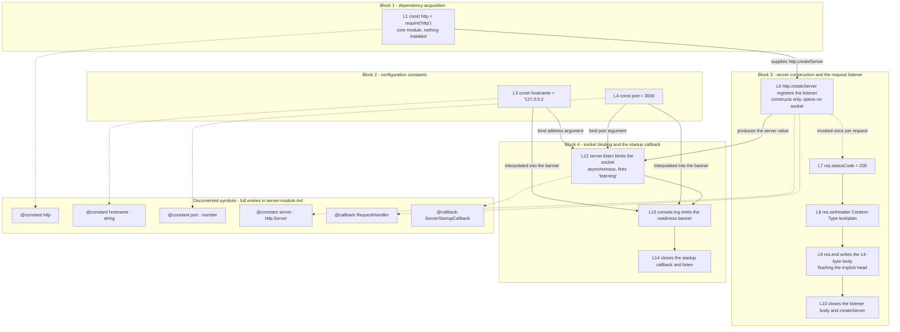

# Code walkthrough

Every line of `server.js`, in order, including the three blank ones. This page
is the reader-facing expansion of the per-line comments that live in the source
itself — the same explanation of the same line, given the room that the end of a
line of code cannot offer.

Source files this page derives from: `server.js:L1-L14`, that module in its
entirety and nothing else.

This page is also the corpus's line-number anchor. Every
`Source: server.js:Lnn` citation on every other page resolves against the
[Line-by-line reference](#line-by-line-reference) table below, which makes the
numbering here a contract rather than a convenience.

## How to read this walkthrough

`server.js` is **14 content lines**: 11 lines of code at L1, L3, L4, L6, L7, L8,
L9, L10, L12, L13 and L14, plus 3 blank separators at L2, L5 and L11. The blanks
are not filler. They are the only structural signal the file gives about its own
layout, so they get rows and explanations here exactly like the code lines do.

The whole module, in that numbering:

```text
L1   const http = require('http');
L2
L3   const hostname = '127.0.0.1';
L4   const port = 3000;
L5
L6   const server = http.createServer((req, res) => {
L7     res.statusCode = 200;
L8     res.setHeader('Content-Type', 'text/plain');
L9     res.end('Hello, World!\n');
L10  });
L11
L12  server.listen(port, hostname, () => {
L13    console.log(`Server running at http://${hostname}:${port}/`);
L14  });
```

Four blocks follow, and the blank lines are what divide them. After them come
three views over the same 14 lines: a row-per-line table, a map from each line
to the JSDoc symbol that documents it, and a diagram of how the blocks feed one
another.

### These line numbers are anchored, and they are not the ones in your editor

Every `Lnn` reference here and across this corpus points at the original,
unannotated layout printed above. The file on disk now also carries a module
JSDoc header, two `@callback` typedefs, four `@constant` blocks and an inline
comment on every line of code, all of which push the statements they describe
further down the file. Your editor will therefore show `res.statusCode = 200` at
a physical line well past 7, and that is expected rather than wrong:
`server.js:L7` means *the statement that was on line 7 of the unannotated
module*, wherever it physically sits today.

**Do not renumber these citations to match an editor.** Every other page in this
corpus resolves its citations against the table below, so renumbering here would
break all of them at once, and silently.

### Verifying the counts

The layout above is the module as first committed, which is still the citation
basis, so both counts come straight out of it:

```bash
orig="$(git log --diff-filter=A --format=%H -- server.js | tail -1):server.js"
git show "$orig" | wc -l
git show "$orig" | awk 'NF==0{print NR}'
```

```text
14
2
5
11
```

Fourteen content lines, with the blanks at 2, 5 and 11. A line-numbering viewer
will often draw one row more than that, because the file's final byte is a
newline and the viewer renders the empty position after it; `sed -n '15p'` on
that same file prints nothing at all. Count content, not viewer rows.

All 11 code lines are still present in the annotated file, and the command that
isolates them also shows how far they have moved:

```bash
grep -nvE '^\s*(\*|/\*|//|$)' server.js
```

```text
201:const http = require('http'); // Loads Node's built-in HTTP module; a core module, so no npm install is involved.
220:const hostname = '127.0.0.1'; // The IPv4 loopback literal; scopes reachability to this machine only.
236:const port = 3000; // The TCP port the listener will bind.
261:const server = http.createServer((req, res) => { // Instantiates an http.Server and registers the per-request listener.
262:  res.statusCode = 200; // Sets the status line; must precede any body byte written.
263:  res.setHeader('Content-Type', 'text/plain'); // Declares the payload MIME type; must precede res.end.
264:  res.end('Hello, World!\n'); // Supplies the 14-byte body and terminates the response, flushing the implicit head; for a HEAD, Node discards that body.
265:}); // Closes the request-listener body and the createServer invocation.
267:server.listen(port, hostname, () => { // Binds the socket and begins accepting connections; async, fires on 'listening'.
269:  console.log(`Server running at http://${hostname}:${port}/`);
270:}); // Closes the startup callback and the listen invocation.
```

Eleven lines, at eleven physical positions that no longer match their
citations — the anchoring rule demonstrated rather than asserted.

## Block 1 — Dependency acquisition (L1) and the separator (L2)

```javascript
const http = require('http');
```

L1 loads Node's built-in HTTP module and binds it to `http`.
`Source: server.js:L1`

`http` is a **core** module: it ships inside the Node.js runtime rather than
being fetched from a registry. Three things follow, and the third is the one
that catches people out:

- **No `npm install` is involved.** Nothing has to be installed to satisfy this
  import, and it cannot be missing from a working Node installation.
- **It appears in no dependency manifest.** `package.json` declares no runtime
  dependency, and this line is why that is accurate rather than an omission.
- **The application's runtime dependency tree is genuinely empty.** Readers
  routinely go looking for the package that provides `http`; there is none to
  find. Installing in this repository resolves only the optional documentation
  toolchain, which
  [../getting-started/installation.md](../getting-started/installation.md) owns.

The constant this line creates is the namespace that supplies
`http.createServer()` at L6, and the canonical Node classes named throughout
this page — `http.Server`, `http.IncomingMessage` and `http.ServerResponse` —
are its members.

L2 is blank, and it is the first of the three separators that give the file its
shape: it divides dependency acquisition from configuration.
`Source: server.js:L2`

## Block 2 — Configuration constants (L3–L4)

```javascript
const hostname = '127.0.0.1';
const port = 3000;
```

L3 is the IPv4 loopback literal, and it scopes reachability to this machine
only. `Source: server.js:L3` L4 is the TCP port the listener will bind.
`Source: server.js:L4`

Three properties of the pair matter more than the values themselves.

**Both are `const`, so neither can be reassigned at runtime.** No code path in
the module could give either a different value once the file has been evaluated.
Changing one means editing the line and restarting the process.

**Neither is read from the environment.** There is no `process.env` lookup
anywhere in the file, which is why `PORT=8080 node server.js` has no effect at
all. The option matrix, the override procedure and that surprise are owned by
[../getting-started/configuration.md](../getting-started/configuration.md).

**Each is read exactly twice** — once as an argument to `server.listen()` at
L12, and once interpolated into the readiness banner at L13. That second read is
what makes an override observable: because the banner is interpolated from the
constants rather than restating their values as text, it always reports the
address actually in force, so an edited constant shows up in stdout immediately.

The consequence of L3 in particular is the *loopback binding*, and it is the
most consequential single value in the file: binding the loopback address rather
than a wildcard means no other machine can reach the service at all. That
constraint, and why fronting the service with a reverse proxy is preferable to
widening the bind address, are owned by
[../guides/deployment.md](../guides/deployment.md).

L5 is blank, separating configuration from server construction.
`Source: server.js:L5`

## Block 3 — Server construction and the request listener (L6–L10)

```javascript
const server = http.createServer((req, res) => {
  res.statusCode = 200;
  res.setHeader('Content-Type', 'text/plain');
  res.end('Hello, World!\n');
});
```

**L6** instantiates an `http.Server` and registers the *request listener* that
is invoked once per request, both in the same expression. `Source: server.js:L6`
Registration is not invocation: this line constructs and registers, and it opens
no socket. Nothing is reachable until L12 runs.

The listener it registers is an anonymous inline arrow expression, which is
exactly why the annotation layer documents it through a `@callback` typedef
named `RequestHandler` — an anonymous function offers no identifier for an
ordinary doc block to bind to. Node registers it for the server's `request`
event, so it runs once per request dispatched through that event, which is not
the same as once per inbound connection.

**L7** sets the status line. `Source: server.js:L7` Assigning `res.statusCode`
mutates the response head that Node holds pending, so it must happen **before
any body byte** is written: once the head has gone to the socket, HTTP offers no
way to revise a status line the client has already received.

**L8** declares the payload MIME type, and it carries the same ordering
constraint for the same reason — `setHeader()` stages the header on that pending
head, so it must precede `res.end()`. `Source: server.js:L8` This is the only
header the application sets.

**L9** writes the 14-byte body and terminates the response, flushing the
implicit head — the status from L7 and the header from L8 — as it goes.
`Source: server.js:L9` The head is *implicit* precisely because no combined
status-and-headers helper is called anywhere in this module: the status arrives
through a property assignment and the one header through a method call, and
neither of those puts the head on the wire. `res.end()` is what does. For a
`HEAD` request Node discards this payload before it reaches the wire, so the
client receives the head alone.

**L10** closes the *request listener* body and the `http.createServer()`
invocation at once. `Source: server.js:L10` It is a closing brace and a closing
parenthesis, and it is explained here — and commented in the source — like every
other line, because a line-level comment mandate that skips the structural lines
is not a line-level mandate.

Note what is absent from this block: any read of `req`. Method, path, query
string, headers and body are all ignored, and that single omission is the whole
origin of the *catch-all response* — with nothing read from the request, no code
exists that could branch on a path or a method. The per-step treatment of L7 to
L9 in the context of one request is owned by
[request-lifecycle.md](request-lifecycle.md), and the response contract those
three lines produce is owned by [../api/http-api.md](../api/http-api.md).

Captured from a running instance, which is what the three statements add up to
on the wire:

```bash
curl --noproxy '*' --include --silent --show-error --max-time 5 http://127.0.0.1:3000/
```

```text
HTTP/1.1 200 OK
Content-Type: text/plain
Date: Wed, 05 Aug 2026 03:05:29 GMT
Connection: keep-alive
Keep-Alive: timeout=5
Content-Length: 14

Hello, World!
```

Only the status line, the `Content-Type` line and the body come from this block.
`Content-Length` is derived by Node from the body it was handed at L9, and the
`Connection`/`Keep-Alive` pair is framed by the runtime from the request's own
protocol version. `Date` is a per-request volatile value Node supplies — it
advances with the clock, so two responses produced in different seconds cannot
carry the same one — and it is emphatically *not* set by this module, which sets
exactly one header. `Source: server.js:L8` It is reproduced above as captured,
because deleting it would misrepresent what the wire actually carries.

L11 is blank, separating server construction from socket binding.
`Source: server.js:L11`

## Block 4 — Socket binding and the startup callback (L12–L14)

```javascript
server.listen(port, hostname, () => {
  console.log(`Server running at http://${hostname}:${port}/`);
});
```

**L12** binds the socket and begins accepting connections.
`Source: server.js:L12` It is **asynchronous**: the call starts the bind and
returns immediately, and the socket becomes ready afterwards, on a later turn of
the event loop. Node signals that moment by emitting the `'listening'` event,
which is what invokes the *startup callback*. If the bind cannot succeed — port
3000 already held by another process, for instance — the failure surfaces as an
`error` event that this file registers no handler for, so the process exits
without ever printing the banner. Remediation is owned by
[../guides/troubleshooting.md](../guides/troubleshooting.md).

**L13** emits the human-readable readiness banner, interpolating `hostname` and
`port` into a template literal. `Source: server.js:L13` It is the callback's
entire body and its only effect: one line on stdout, with no health check, no
validation and no return value. Captured from a background run that is stopped
by the PID taken at spawn, with its log written outside the repository so no
untracked file is left behind:

```bash
node server.js > "${TMPDIR:-/tmp}/walkthrough.log" 2>&1 &
server_pid=$!
sleep 1
cat "${TMPDIR:-/tmp}/walkthrough.log"
kill "$server_pid"
rm -f "${TMPDIR:-/tmp}/walkthrough.log"
```

```text
Server running at http://127.0.0.1:3000/
```

Because the banner is interpolated rather than written out as fixed text, it
always reports the address actually in force. That makes it *proof* that the
bind succeeded rather than the thing that caused it, and makes its absence the
most reliable signal that the bind failed.

**L14** closes the *startup callback* and the `server.listen()` invocation.
`Source: server.js:L14` Like L10 it is structural, and like L10 it is explained
rather than skipped.

### The module ends here without exporting anything

> `server.js` contains **no `module.exports`** and no `exports.*` assignment
> anywhere in its 14 lines. Its entire observable contract is the **import-time
> side effect** of L12: requiring or importing the file binds a listening
> socket. A reader who assumes the module is importable **will bind a port by
> accident** — `require('./server.js')` hands back CommonJS's default, empty
> exports object, having already started the server on the way. There is no
> exported factory to call and no `require.main` guard that would defer the
> bind. Importing *is* starting the server, so anything that needs this module's
> behaviour must run it as a process — `node server.js` — rather than require
> it.

`require()` returning is not a readiness signal either, because L12 is
asynchronous: at that instant the bind may still be in flight, and a request
issued immediately afterwards can be refused. Wait for the banner, or poll the
port, instead. The full treatment of the module contract is owned by
[../api/server-module.md](../api/server-module.md).

## Line-by-line reference

One row per line, L1 through L14, with the blank lines and the closing braces
included rather than exempted. The explanations are the fuller form of the
inline comments in the source and say the same thing about the same line by
design: the two are meant to be read interchangeably, so a change to either is a
change to both.

| Line | Code | Explanation |
| --- | --- | --- |
| L1 | `const http = require('http');` | Loads Node's built-in HTTP module; a **core** module, so no `npm install` is involved |
| L2 | *(blank)* | Separator between dependency acquisition and configuration |
| L3 | `const hostname = '127.0.0.1';` | The IPv4 loopback literal; scopes reachability to this machine only |
| L4 | `const port = 3000;` | The TCP port the listener will bind |
| L5 | *(blank)* | Separator between configuration and server construction |
| L6 | `const server = http.createServer((req, res) => {` | Instantiates an `http.Server` and registers the *request listener* invoked once per request |
| L7 | `res.statusCode = 200;` | Sets the status line, which must happen **before any body byte** is written |
| L8 | `res.setHeader('Content-Type', 'text/plain');` | Declares the payload MIME type; must precede `res.end()` |
| L9 | `res.end('Hello, World!\n');` | Writes the 14-byte body and terminates the response, flushing the implicit head; for a `HEAD` request Node discards that body |
| L10 | `});` | Closes the *request listener* body and the `createServer` invocation |
| L11 | *(blank)* | Separator between server construction and socket binding |
| L12 | `server.listen(port, hostname, () => {` | Binds the socket and begins accepting connections; asynchronous, the callback fires on `'listening'` |
| L13 | ``console.log(`Server running at http://${hostname}:${port}/`);`` | Emits the human-readable readiness banner, interpolating `hostname` and `port` |
| L14 | `});` | Closes the *startup callback* and the `listen` invocation |

## Line-to-symbol cross-reference

Seven symbols carry documentation in `server.js`, and this table maps each line
to the one that documents it. The names, kinds and types are exactly as
[../api/server-module.md](../api/server-module.md) defines them: that page owns
the seven-symbol inventory, and the full reference entries live there rather
than being restated here.

| Line(s) | JSDoc symbol that documents it | Kind |
| --- | --- | --- |
| L1–L14 | The module as a whole, declared `@module server` and linkable as `module:server` | CommonJS module |
| L1 | `http` | Constant, require binding — a Node core module, type `module:http` |
| L3 | `hostname` | Constant, `{string}`, default `'127.0.0.1'` |
| L4 | `port` | Constant, `{number}`, default `3000` |
| L6 | `server` | Constant, `{http.Server}` |
| L6–L10 | `@callback RequestHandler` — `@param {http.IncomingMessage} req`, `@param {http.ServerResponse} res`, `@returns {void}` | Callback typedef, namepath `module:server~RequestHandler` |
| L12–L14 | `@callback ServerStartupCallback` — `@returns {void}`, documenting the stdout side effect | Callback typedef, namepath `module:server~ServerStartupCallback` |

The last two rows are `@callback` typedefs rather than ordinary JSDoc blocks for
a structural reason, not a stylistic one. Both functions are anonymous inline
arrow expressions — the *request listener* at L6–L10 and the *startup callback*
at L12–L14 — so neither has an identifier that a conventional doc block could
bind to. `@callback` is the sanctioned way to give such a function a documented
name, describe its parameters and return value, and make that name usable as a
type. Without it, the two most interesting functions in the module would be
undocumentable.

Two things the table cannot convey on its own. The first row and the L6 row both
name `server` without colliding: one is the JSDoc module name declared in the
file header, the other a constant declared inside it, and JSDoc distinguishes
them by namepath. And **the three blank lines document no symbol at all** — L2,
L5 and L11 are block boundaries rather than declarations, which is why they
carry rows in the line-by-line table above but none here.

This page and the module reference are a pair rather than alternatives. One
reads the module by line and the other by symbol, and neither is a shorter
version of the other.

## Structural map

The map groups the 14 lines into the four blocks and shows what each block hands
to the next. Solid arrows are values flowing between lines; dotted arrows point
from a line to the symbol that documents it.



Three dependencies are what make the grouping more than a visual convenience.
Block 1 exists to supply `http.createServer` to Block 3, so L1 must precede L6.
Block 2 is consumed twice by Block 4 — as the two bind arguments at L12 and as
the two interpolated values at L13 — which is why the constants sit above both.
And Block 3 produces the `server` value that Block 4 acts on, so construction
strictly precedes binding: reversing them would call `listen()` on nothing.

Within Block 3 the three statements are ordered by mechanism rather than by
preference: L7 and L8 stage the pending head, and L9 is what flushes it, so both
must run first.

## See also

- [../../README.md](../../README.md) — the canonical overview, whose Code
  walkthrough section this page expands rather than replaces.
- [../api/server-module.md](../api/server-module.md) — owner of the seven
  documented symbols, and the reference the cross-reference table above maps
  into. It sits **alongside** this page: one view is organised by line, the
  other by symbol.
- [request-lifecycle.md](request-lifecycle.md) — L7 to L9 read as the steps of a
  single request, from socket accept to response flush.
- [overview.md](overview.md) — owner of the component model, of the startup flow
  these lines perform, and of the lifecycle states they move the process
  through.
- [../api/http-api.md](../api/http-api.md) — owner of the HTTP contract that L7
  to L9 produce, including the request-matching matrix and the full response
  specification.
- [../getting-started/configuration.md](../getting-started/configuration.md) —
  owner of the two configuration options at L3 and L4, and of the procedure for
  changing them.
- [../guides/deployment.md](../guides/deployment.md) — owner of the *loopback
  binding* constraint that L3 creates, and of the reverse-proxy guidance.
- [../guides/troubleshooting.md](../guides/troubleshooting.md) — owner of the
  operational failure modes, including the bind failure L12 can hit.
- [../README.md](../README.md) — the documentation index, the glossary of the
  four fixed terms this page uses, and the fact-ownership table.
