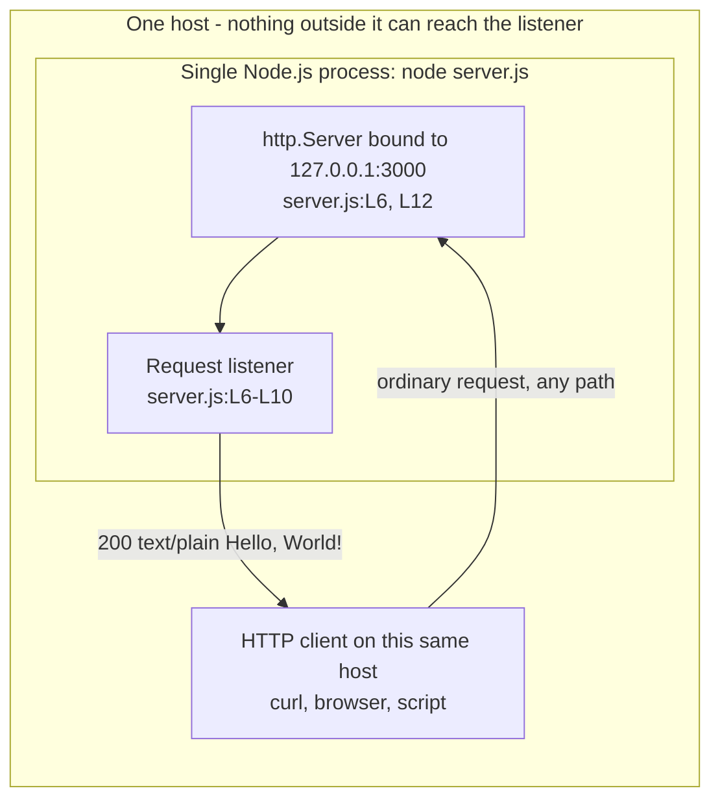
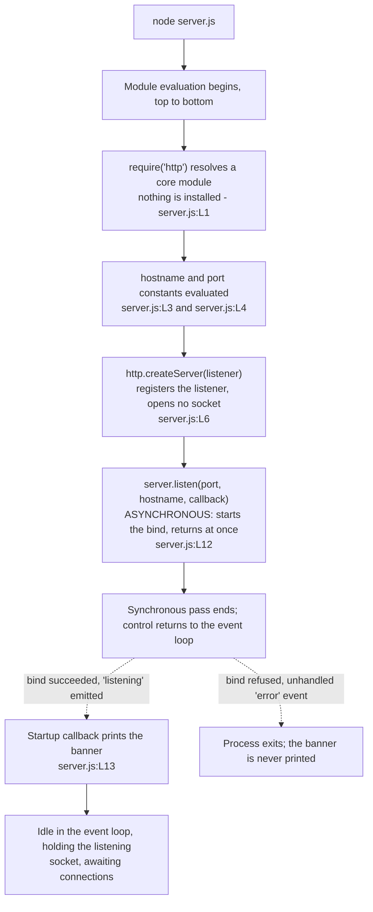
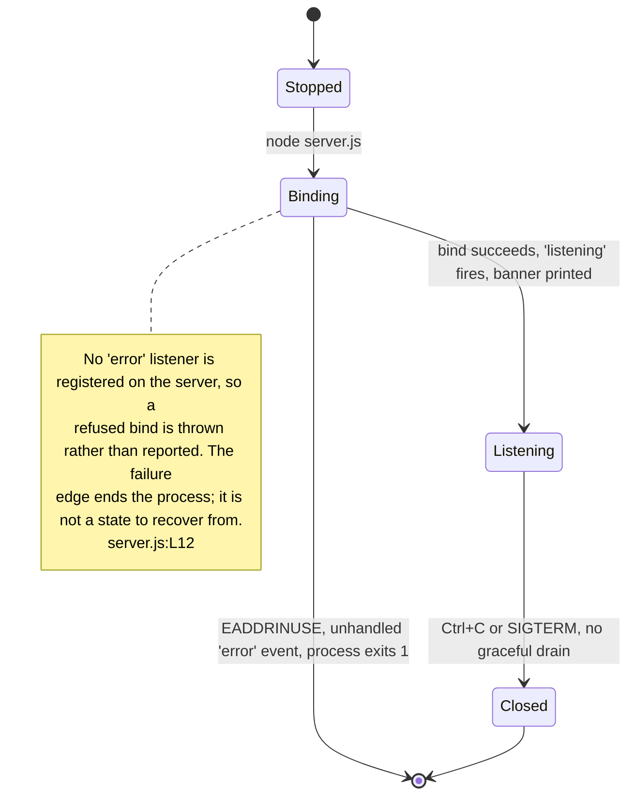

# Architecture overview

The shape of this system, how it starts, what states it can be in, and why it
was built the way it was. This page **owns the component model diagram** for the
whole documentation corpus, and it expands the Architecture at a glance section
of the root [README](../../README.md) rather than replacing it: the README stays
self-sufficient, and the depth lives here.

Source files this page derives from: `server.js:L1-L14`, the whole module. Every
runtime claim below was produced by executing that file, and every transcript is
pasted exactly as the run printed it.

## Line-number citation basis

Every `Lnn` citation on this page — `Source: server.js:L7` and the rest —
names a statement by its position in the **original, unannotated 14-line
layout** of `server.js`: 11 code lines with blank separators at L2, L5 and
L11. That layout is the citation basis the whole documentation corpus
shares. It is a stable anchor rather than a physical file offset, because
the JSDoc blocks and inline comments now in the source move every statement
further down the file without changing which statement is meant. The
convention is stated in full by
[code-walkthrough.md](code-walkthrough.md), whose 14-row table is what
every citation resolves against, and restated by the symbol owner at
[../api/server-module.md](../api/server-module.md).

## Architectural style

Four adjectives describe the design. Each is a claim about the source rather
than a label, so each is stated against the lines that support it.

**Single-process.** One `node` invocation is the entire deployment unit. The
module never forks a cluster worker, never constructs a worker thread and never
spawns a child process, so there is nothing to orchestrate, nothing to discover
and no inter-process channel to secure. `Source: server.js:L1-L14`

**Single-file.** The whole application is 14 content lines in one module — 11
lines of code and 3 blank separators — with no framework and no router to read
alongside it. [code-walkthrough.md](code-walkthrough.md) reads all 14 of them,
one at a time.

**Event-driven.** Nothing polls and nothing blocks. `server.listen()` is
asynchronous: it starts the bind, returns immediately, and its callback runs
later, when Node emits the `listening` event. `Source: server.js:L12` From that
point the event loop drives everything — a connection arriving, a request being
parsed, and the *request listener* being dispatched through the server's
`request` event. `Source: server.js:L6`

**Stateless.** No variable is mutated per request. The reply is composed from
source constants on every call, so no request can influence another, two
requests a week apart receive the same **application-level** reply — the
same status, the same one header this module sets and the same body — and
restarting the process loses nothing: there is no cache to prime, no session
to migrate and no warm-up period. `Source: server.js:L6-L10` The bytes on
the wire still vary, because `Date` advances and Node frames the reply from
the request's own protocol version; that split is owned by
[../api/http-api.md](../api/http-api.md).

| Property | Value | Consequence |
| --- | --- | --- |
| Deployment unit | One operating-system process | Nothing to orchestrate and nothing to discover |
| Source unit | One file, 14 content lines | The whole system fits on one screen |
| Concurrency model | Event-driven, single-threaded | No locks, and this module creates no worker pool of its own — it starts no `cluster`, no `worker_threads` and no child process, so no *application* state is shared between requests. Runtime resources still are — see [Application state versus runtime state](#application-state-versus-runtime-state) |
| Application state | None | Every reply is composed from source constants |
| Runtime resource state | Present, and unbounded in aggregate | Sockets, parser buffers and unread request bodies are held per connection by Node, and nothing in the module accounts for them |
| Persistence | None | No database, no cache, no filesystem writes |
| Network exposure | Loopback only, through the *loopback binding* | Unreachable from any other machine — `Source: server.js:L3` |
| Runtime dependencies | None | Only Node's built-in `http` module — `Source: server.js:L1` |

### Application state versus runtime state

The first five rows are the ones most easily over-read, so separate the two kinds
of state they describe.

**Application state is genuinely absent, and that part is total rather than
aspirational.** Two requests a week apart receive the same application-level
reply, restarting the process loses nothing, and there is no warm-up period, no
cache to prime, and no session to migrate. Nothing is shared between two requests
because there is nothing to share: the reply is composed from two `const`
declarations and two literals. `Source: server.js:L3-L4`,
`Source: server.js:L6-L10` No amount of concurrency can produce a data race in
code that reads only immutable values and writes only to its own `res`.

**Runtime resource state is a different thing, and it is neither absent nor
bounded by this module.** Every connection Node accepts holds a descriptor and
socket buffers; every request in progress holds parser state and a header buffer;
a request body the application never reads is still received and buffered before
the runtime discards it; and a connection kept alive after its reply holds an idle
slot. All of that is mutable, all of it is contended for when connections overlap,
and none of it is visible to the eleven lines of application code.
`Source: server.js:L1-L14`

The practical distinction is this: single-threading removes *application*
concurrency hazards, and it does not remove *resource* ones. Node's
per-connection defaults are what bound a single slow client — they are tabulated
by [../api/http-api.md](../api/http-api.md#runtime-bounds-that-do-apply) — while
nothing caps the number of connections, the requests per connection, or one
caller's share of bandwidth. The aggregate consequence is analysed in
[request-lifecycle.md](request-lifecycle.md#what-overlapping-lifecycles-cost),
and the controls that would be required before exposing the service are owned by
[../guides/deployment.md](../guides/deployment.md#hardening-checklist).

"Application-level reply" is the precise scope, and it is used deliberately
throughout this page. It means the status, the one header, and the body that the
*request listener* contributes for a request Node dispatches to it through the
server's `request` event. Node decides which requests become a `request` event
at all, and it answers some of them itself before the listener could run —
`CONNECT`, a malformed request line, an HTTP/1.1 request with no `Host` header,
an oversized header block, a header block that never arrives, and an unsupported
`Expect` header among them — while a `HEAD` request does run the listener but has
its body suppressed beneath it. A request whose body is still arriving after the
listener has answered can also breach a runtime limit afterwards, in which case
Node appends its own status to the connection. Those cases are enumerated,
with captured evidence, by
[../api/http-api.md](../api/http-api.md#requests-that-do-not-follow-this-contract),
which owns the HTTP contract. Nothing on this page overrides that page.

## Component model and the process boundary

Three components exist, and that is genuinely all of them: one operating-system
process, one `http.Server` inside it holding the listening socket, and one class
of external actor — an HTTP client, which has to be running on the same machine.

This page is the owning home of the diagram below. It is reproduced in the root
[README](../../README.md) so that file stays readable without following a link,
and the two copies are edited together: a change made here must be applied
there as well.



The client is drawn **inside** the host boundary, and that placement is the
diagram's most load-bearing detail rather than a layout convenience. The
`hostname` constant is the IPv4 loopback literal, `Source: server.js:L3`, so the
listener accepts connections arriving over the loopback interface and over no
other: a client on another machine cannot complete this exchange at all. There is
no arrow crossing the boundary because there is no reachable path across it. The
constraint, its captured evidence, and the two ways to change it are owned by
[../guides/deployment.md](../guides/deployment.md). It sits outside the process
boundary because it is a separate program, and a client on another host is not
a variant of this picture at all —
[../guides/deployment.md](../guides/deployment.md) draws that remote case as
DG6 and owns the two ways to change reachability.

Three components, and that is genuinely all of them:

| Component | Source | Responsibility |
| --- | --- | --- |
| Configuration constants | `Source: server.js:L3`, `Source: server.js:L4` | Supply the bind address and the port, once, when the module is evaluated |
| `http.Server` instance | `Source: server.js:L6`, bound at `Source: server.js:L12` | Own the listening socket and dispatch each request to the listener |
| *Request listener* | `Source: server.js:L6-L10` | Compose the reply: the status, the one header the module sets, and the body |

No fourth component has been left out of that table. There is no database, no
cache, no queue, no load balancer and no second service anywhere in this system,
which is why the diagram shows none.

Both functions in the module are anonymous inline arrow expressions — the
*request listener* and the *startup callback* — so neither has an identifier for
a conventional doc block to bind to. That is why the annotations document them
through the `RequestHandler` and `ServerStartupCallback` callback typedefs,
which are the standards-sanctioned way to give a callback's signature a
referenceable name. The reference detail for both, and for the canonical types
`http.Server`, `http.IncomingMessage` and `http.ServerResponse`, is owned by
[../api/server-module.md](../api/server-module.md).

The process boundary is also the **reachability** boundary. The `hostname`
constant is the IPv4 loopback literal, so the listener accepts connections
arriving over the loopback interface and over no other, and a client on a
different machine cannot reach the service at all. `Source: server.js:L3`
That is the *loopback binding*, the fixed term this corpus uses for the
constraint. The constraint itself, its verified evidence and the two ways of
changing it are owned by
[../guides/deployment.md](../guides/deployment.md); this page states only that
the boundary exists and where in the source it comes from.

The process boundary is also the system boundary, and what crosses it divides
into what this module chooses to emit and what the operating system and the
runtime do regardless:

| Crossing | Direction | Whose behaviour it is |
| --- | --- | --- |
| HTTP over loopback | In and out | The module's, via the listener at `server.js:L6-L10` |
| One line on stdout, the readiness banner, and only if the bind succeeded | Out | The module's, `Source: server.js:L13` |
| No request log, in any format, ever | — | The module's, by omission |
| Process signals such as `SIGINT` and `SIGTERM` | In | The operating system's. No handler is registered, so a signal terminates the process immediately, `Source: server.js:L12-L14` |
| Node's own fatal diagnostics on stderr, such as the stack trace printed for an unhandled bind error | Out | The runtime's. Nothing in this module writes to stderr, and nothing in it can suppress these |

So the **application-defined** output is exactly one stdout line and no request
log — but stderr and the signal path are still live, which is why a supervisor
that discards stderr turns a crash into a silent one. The full split is owned by
[../guides/deployment.md](../guides/deployment.md#what-does-and-does-not-get-logged),
and the stack trace itself is owned by
[../guides/troubleshooting.md](../guides/troubleshooting.md#eaddrinuse-on-start).

### The module exports nothing, and requiring it binds a port

This belongs in the component model rather than in a footnote, because it is the
property of the component model most likely to catch a reader out. **There is no
`module.exports` and no `exports.*` assignment anywhere in `server.js`.** The
module's entire observable contract is an **import-time side effect**:
evaluating the file constructs the server and binds the listening socket.
`Source: server.js:L1-L14`

The consequence is concrete rather than theoretical. `require('./server.js')`
opens a TCP listener before control returns to the caller, and hands back
nothing but CommonJS's default empty exports object — so a reader who assumes
the module is inert on import **will bind a port by accident**. There is no
exported factory to call, no server object to reach and no configuration to
inject after the fact. The module is meant to be **run as a process** rather
than imported — either directly with `node server.js`, or with `npm start`,
which the manifest declares as exactly that command, so the two are one
invocation reached by two routes. `Source: package.json` (`scripts.start`)

## Startup flow

The module issues every startup operation in a single top-to-bottom pass, but the
Listening state is reached asynchronously after that pass. Two of the steps do
not do what their names suggest.



1. **`node server.js`** starts the process, and Node begins evaluating the
   module from the top.
2. **`require('http')` resolves a core module.** It ships with the runtime, so
   nothing is installed to satisfy it, no `npm install` is involved, and it
   appears in no dependency manifest. `Source: server.js:L1`
3. **The two configuration constants are evaluated** — the loopback `hostname`
   and the `port` the listener will bind. Both are plain literals, read once
   here and fixed for the lifetime of the process. `Source: server.js:L3`,
   `Source: server.js:L4`
4. **`http.createServer()` instantiates an `http.Server` and registers the
   *request listener*** that will be invoked once per request. It registers
   without invoking, and it opens no socket: construction alone makes nothing
   reachable. `Source: server.js:L6`
5. **`server.listen(port, hostname, callback)` binds the socket and begins
   accepting connections.** It is asynchronous. The call returns immediately,
   and the *startup callback* is not invoked in line. `Source: server.js:L12`
6. **Node emits the `listening` event** once the bind has succeeded, and that
   event is what invokes the *startup callback*.
7. **The *startup callback* prints the readiness banner**, interpolating
   `hostname` and `port` into a template literal rather than restating their
   values, so the banner always reports the address actually in force.
   `Source: server.js:L13`
8. **The process stays alive** because a listening socket is a live handle: it
   keeps the event loop from draining, so Node never runs out of work to wait
   for and never exits of its own accord.

The solid arrows and the dotted one carry the whole point of the diagram, so read
them deliberately. The **synchronous** pass runs from module evaluation up to and
including the *invocation* of `server.listen()`, `Source: server.js:L12`: five
steps, top to bottom through the file, with nothing waiting. Everything past that
invocation is **event-driven**. `listen()` returns immediately, which is the
dotted edge, and the bind is completed by the runtime afterwards — which is why
bind success, the `listening` event, and the *startup callback* all sit
downstream of that invocation rather than inside the synchronous pass.

Two consequences are easy to miss. First, `http.createServer()` does not open a
socket — it only constructs the server and registers the listener, so nothing is
reachable until `listen()` runs. Second, because the banner is printed from a
callback attached to an event rather than from the next statement, **the banner
is proof that the bind succeeded, not the thing that causes it**; a run that
prints nothing never reached the Listening state.

Evaluating the module is what sets all of this in motion: it performs every
synchronous step and issues the `listen()` call. There is no exported entry point
to call, so importing the file from another module does exactly the same thing,
including initiating the bind, before any caller can intervene.

The banner is the only observable evidence that the flow reached its final
state, and the full captured run — the command, that banner, and the request
that verifies it — is owned by
[../getting-started/installation.md](../getting-started/installation.md#running-the-server).

A failure edge out of the bind step is any bind error; the routine example here
is a port conflict. Because this module registers no `error` listener, Node
rethrows the event and the process exits without ever printing the banner, so
the flow above simply stops at `server.listen()`. The captured `EADDRINUSE` trace
and the remediation are owned by
[../guides/troubleshooting.md](../guides/troubleshooting.md#eaddrinuse-on-start);
the state model below shows where that edge leaves the lifecycle.

Captured from a live run. A self-cleaning subshell writes the log to a private
temporary directory and manages the child through its own job table, so an early
bind failure cannot turn cleanup into a signal aimed at an unrelated process:

```bash
(
  work="$(mktemp -d)" || exit 1
  cleanup() {
    if jobs %1 >/dev/null 2>&1; then
      kill %1 2>/dev/null || true
      wait %1 2>/dev/null || true
    fi
    rm -rf -- "$work"
  }
  trap cleanup EXIT
  trap 'exit 129' HUP
  trap 'exit 130' INT
  trap 'exit 143' TERM
  node server.js > "$work/startup.log" 2>&1 &
  sleep 1
  if ! grep -q 'Server running at' "$work/startup.log"; then
    cat -- "$work/startup.log"
    wait %1
    exit 1
  fi
  cat -- "$work/startup.log"
)
```

One line reaches stdout, and it is the only line this process will ever write
there:

```text
Server running at http://127.0.0.1:3000/
```

The counter-intuitive part is worth stating outright: **nothing in this file
waits.** Steps 1 to 5 run to completion in one synchronous pass, after which the
module is finished; steps 6 to 8 happen afterwards, driven by the event loop.
The banner is therefore *proof* that the socket was bound rather than the thing
that caused it — which is why its absence is the most reliable signal that the
bind failed, whatever else the terminal shows.

## Server lifecycle states

The process moves through four states, and only three of the transitions between
them are ones the code performs deliberately.



| State | What is true in it |
| --- | --- |
| Stopped | No process and no socket. Nothing answers on the port |
| Binding | The process exists and `server.listen()` has been called, but the socket is not yet accepting — `Source: server.js:L12` |
| Listening | The banner has been printed, and every request Node dispatches to the *request listener* receives the *catch-all response* — `Source: server.js:L13`. Requests Node answers itself never reach the listener; see [../api/http-api.md](../api/http-api.md#requests-that-do-not-follow-this-contract) |
| Failed | The bind was refused, the `error` event went unhandled, and the process exited. The one routine cause is a port conflict — `Source: server.js:L12` |
| Closed | The process was terminated. Immediately, and with no draining: no signal handler is installed and `server.close()` is never called, so in-flight requests are dropped — `Source: server.js:L12-L14` |

There is no Draining state and no recoverable Failed state, and both absences
are the design rather than an omission. Termination drops in-flight requests,
which is what matters when choosing a supervisor —
[../guides/deployment.md](../guides/deployment.md) covers that choice.

### The failure edge out of Binding ends the process

A port conflict makes the bind fail, and the server emits an `'error'` event.
The module registers no `'error'` listener on it: the only call ever made on the
server object is `server.listen`. `Source: server.js:L12` An `'error'` event
with no listener is thrown rather than reported, so **Node rethrows it and the
process terminates.** It does not retry, it does not fall back to another port,
and it never reaches the *startup callback* that would have printed the banner.
`Source: server.js:L12-L14` That is why the edge in the diagram leaves Binding
for a terminal state rather than returning to Stopped: there is no recovery path
inside the process for it to return to. The unelided crash transcript, the
block that reproduces it and the per-platform remediation are owned by
[../guides/troubleshooting.md](../guides/troubleshooting.md#eaddrinuse-on-start).

Reproduced by starting a second instance while the first still holds the port.
The second process exits immediately, so this does not block, and the block is
self-cleaning. As in the startup capture above, the first instance is a job in a
private subshell rather than a PID value that could outlive the process it named:

```bash
(
  work="$(mktemp -d)" || exit 1
  cleanup() {
    if jobs %1 >/dev/null 2>&1; then
      kill %1 2>/dev/null || true
      wait %1 2>/dev/null || true
    fi
    rm -rf -- "$work"
  }
  trap cleanup EXIT
  trap 'exit 129' HUP
  trap 'exit 130' INT
  trap 'exit 143' TERM
  node server.js > "$work/instance-1.log" 2>&1 &
  sleep 1
  if ! grep -q 'Server running at' "$work/instance-1.log"; then
    cat -- "$work/instance-1.log"
    wait %1
    exit 1
  fi
  node server.js
  echo "exit code: $?"
)
```

The first instance is unaffected and keeps serving. The second writes **nothing
at all to stdout** — the banner never appears — and writes this to stderr,
captured verbatim from the run above:

```text
node:events:497
      throw er; // Unhandled 'error' event
      ^

Error: listen EADDRINUSE: address already in use 127.0.0.1:3000
    at Server.setupListenHandle [as _listen2] (node:net:1941:16)
    at listenInCluster (node:net:1998:12)
    at node:net:2207:7
    at process.processTicksAndRejections (node:internal/process/task_queues:89:21)
Emitted 'error' event on Server instance at:
    at emitErrorNT (node:net:1977:8)
    at process.processTicksAndRejections (node:internal/process/task_queues:89:21) {
  code: 'EADDRINUSE',
  errno: -98,
  syscall: 'listen',
  address: '127.0.0.1',
  port: 3000
}

Node.js v22.23.2
```

`echo` then reported `exit code: 1`. The trailing `{ … }` object is the part
worth matching on — it names the code, the syscall, and the exact address and
port that could not be bound. Everything Node prints against one of its own
sources is volatile: the `node:events` header, the stack-frame positions and the
version line all follow whichever runtime produced them.

**Remediation is not on this page.** Failed is terminal rather than
recoverable: the process is gone by the time you observe it, there is no retry
and no fallback port.
[../guides/troubleshooting.md](../guides/troubleshooting.md#eaddrinuse-on-start)
owns the `EADDRINUSE` transcript, the per-platform commands for finding and
freeing the process that holds the port, and the wider symptom matrix.

## Design rationale

Three properties of this design look like omissions until the reason for each is
stated. None of them is an accident.

### Why zero dependencies

Node's built-in `http` module covers everything the service does, and it is a
**core** module: it ships with the runtime, so nothing is installed to satisfy
the import and it appears in no dependency manifest. `Source: server.js:L1`

### Why no exports

The module is an application, not a library. Nothing else in the repository
imports it, and it is meant to be **run as a process** rather than imported:
either directly with `node server.js`, or with `npm start`, which the manifest
declares as exactly that command, so the two are one invocation reached by two
routes. `Source: package.json` (`scripts.start`) Both are documented, with their
captured output, by
[../getting-started/installation.md](../getting-started/installation.md#running-the-server),
and [../guides/deployment.md](../guides/deployment.md) treats them as equivalent
process invocations. What the module is not meant for is being imported: doing so
evaluates the file and binds the port as a side effect. That consequence is
documented rather than engineered away, because engineering it away would mean
adding an exported factory and changing behaviour.

### Why hardcoded configuration

Both options are compile-time source constants with no external configuration
surface: no file is read, no environment variable is consulted, and no argument
is parsed. `Source: server.js:L3`, `Source: server.js:L4`

The trade is determinism over flexibility. With two options and one deployment
target, an indirection layer through `process.env` would add code and a new
failure mode — an unparseable port, a missing variable — without adding any
capability. The cost is that changing a value takes an edit and a restart, and
that a reader who expects `PORT=8080` to work will be surprised. The option
matrix, the change procedure and that surprise are owned by
[../getting-started/configuration.md](../getting-started/configuration.md).

### Why a catch-all response

The *request listener* never reads `req`: not the method, not the URL, not a
header, and not the body. `Source: server.js:L6-L10` Every request Node
dispatches to it therefore receives the same *catch-all response*, which is what
makes the service a stable fixture — any probe gets the same answer, so a test
that fails has failed for a reason outside this module.

Routing would have added branches to exercise without adding anything to what
the service exists to prove: that a request reaches a listener and a reply comes
back. The response contract, including the parts Node frames rather than the
module, is owned by [../api/http-api.md](../api/http-api.md), and
[request-lifecycle.md](request-lifecycle.md) narrates one request through it
step by step.

## What is deliberately absent, and why

Every capability below is **absent**, every absence is a deliberate exclusion of
the current design rather than an oversight or a to-do item, and the
`Consequence` column is what that absence means for a reader. Documentation
describes the absence; it does not promise the capability.

| Capability | Present? | Consequence | Evidenced in |
| --- | --- | --- | --- |
| TLS / HTTPS | No | Traffic is plaintext, so anything on the path can read or alter it. There is no `https` or `tls` import anywhere | [deployment.md](../guides/deployment.md#hardening-checklist) |
| Authentication | No | Every caller is anonymous and indistinguishable; no credential, header, or token is ever examined | [deployment.md](../guides/deployment.md#hardening-checklist) |
| Authorisation | No | No identity is established, so there is nothing to grant or refuse | [deployment.md](../guides/deployment.md#hardening-checklist) |
| Path-based routing | No | Every path Node dispatches to the listener gets the same application-level reply, including paths that look like private APIs | [deployment.md](../guides/deployment.md#hardening-checklist) |
| HTTP method discrimination | No | Dispatched `POST` and `GET` requests are answered alike, so the application has no `405` path and sends no `Allow` header | [http-api.md](../api/http-api.md#request-matching) |
| Rate limiting | No | No application counter, quota, or per-caller accounting exists; aggregate request volume is bounded only by the host and Node's per-connection defaults | [deployment.md](../guides/deployment.md#hardening-checklist) |
| Input validation | No | Nothing is read from the request, so nothing is validated or rejected by the application. Node can still reject protocol faults beneath it | [deployment.md](../guides/deployment.md#hardening-checklist) |
| Request and structured logging | No | The module writes one startup banner and never records a request in any format | [deployment.md](../guides/deployment.md#hardening-checklist) |
| Health-check endpoint | No | A probe can prove only that *something* is listening on the port, never that it is this service, and no degraded state can be reported | [deployment.md](../guides/deployment.md#hardening-checklist) |
| Error-handling middleware | No | A listener exception would be unhandled; the only error responses are Node's protocol responses, which no application code chooses or can suppress | [deployment.md](../guides/deployment.md#hardening-checklist) |
| Graceful shutdown | No | Termination drops in-flight requests: no signal handler and no `server.close()` call exist | [deployment.md](../guides/deployment.md#hardening-checklist) |
| Security headers | No | Nothing sets `Strict-Transport-Security`, `X-Content-Type-Options`, or a similar header; the module sets only `Content-Type` | [deployment.md](../guides/deployment.md#hardening-checklist) |
| Application timeouts, body limits, and quotas | No | Node supplies runtime- and version-dependent per-connection bounds, but the application sets no body-size policy, rate limit, connection cap, or per-caller quota | [http-api.md](../api/http-api.md#runtime-bounds-that-do-apply) |
| Environment-variable configuration | No | `PORT=8080 node server.js` has no effect; changing either value means editing the source and restarting | [configuration.md](../getting-started/configuration.md#why-there-is-no-environment-variable-support) |
| Build step | No | Nothing is compiled, bundled, or transpiled; the file runs exactly as written | [deployment.md](../guides/deployment.md#deployment-model) |
| Container image | No | There is no `Dockerfile`, `Containerfile`, or compose file, so deployment means running the process on a host | [deployment.md](../guides/deployment.md#deployment-model) |
| CI/CD pipeline | No | Nothing builds, tests, or deploys automatically; no workflow definition exists | [deployment.md](../guides/deployment.md#deployment-model) |
| Automated tests | No | `npm test` is the npm-init placeholder: it prints an error and exits non-zero by design, so its failure is not a broken environment | [troubleshooting.md](../guides/troubleshooting.md#npm-test-fails) |

The `Evidenced in` column is per-row because the evidence is spread across four
owners, not gathered in one place.
[deployment.md's hardening checklist](../guides/deployment.md#hardening-checklist)
evidences exactly **twelve** of these eighteen rows against the source — and its
third column is *Evidence*, not consequence, so each consequence here remains
this page's own explanation. The build step, container image, and CI/CD pipeline
are evidenced in that page's
[deployment model](../guides/deployment.md#deployment-model), not in its
checklist. The remaining three rows belong to their own owners: method
discrimination to the HTTP contract, environment configuration to the
configuration reference, and the placeholder test script to the troubleshooting
guide.

The root [../../README.md](../../README.md) restates fourteen of the eighteen as
a prose non-goals list; input validation, security headers, application timeouts
and limits, and the build step appear only here and in the owner pages linked
above.

> **This service is not production-ready, and it is not intended to be.** It
> is a **test fixture**: a minimal, deterministic HTTP service for exercising
> tooling. Used as that it is exactly right and nothing above needs fixing.
> Used as a real service, every row of the table above is a gap.
> [../guides/deployment.md](../guides/deployment.md) owns the hardening
> discussion and states the same advisory with its full evidence.

## See also

- [../../README.md](../../README.md) — the canonical overview, whose
  Architecture at a glance section this page expands, and which carries the
  mirrored copy of the component model diagram.
- [../README.md](../README.md) — the documentation index, the glossary of the
  four fixed terms, and which page owns which fact.
- [request-lifecycle.md](request-lifecycle.md) — one request, from socket accept
  to response flush, in the same level of detail this page gives to startup.
- [code-walkthrough.md](code-walkthrough.md) — the line-level reading of all 14
  lines. It sits alongside the module reference below rather than replacing it:
  one is organised by line, the other by symbol.
- [../api/server-module.md](../api/server-module.md) — the code-level reference
  for the components above, the two callback typedefs and the canonical types.
- [../api/http-api.md](../api/http-api.md) — owner of the HTTP response
  contract that a caller gets once it can reach the service.
- [../guides/deployment.md](../guides/deployment.md) — owner of the *loopback
  binding* constraint, the hardening checklist and the deployment runbook, and
  the home of DG6's remote topology.
- [../guides/troubleshooting.md](../guides/troubleshooting.md) — owner of the
  `EADDRINUSE` remediation and the per-platform port commands.
- [../getting-started/configuration.md](../getting-started/configuration.md) —
  owner of the `hostname` and `port` option matrix and the change procedure.
- [../getting-started/installation.md](../getting-started/installation.md) —
  owner of the runtime baseline, and of the run, verify and stop commands.
