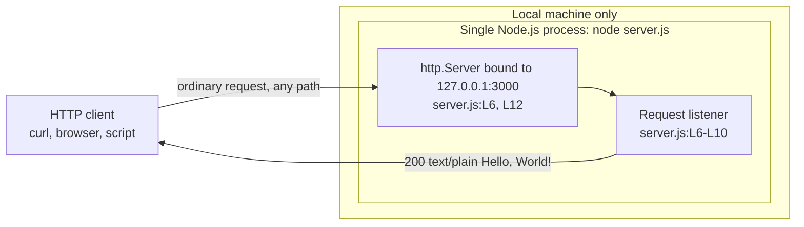
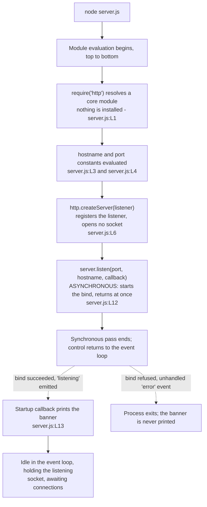
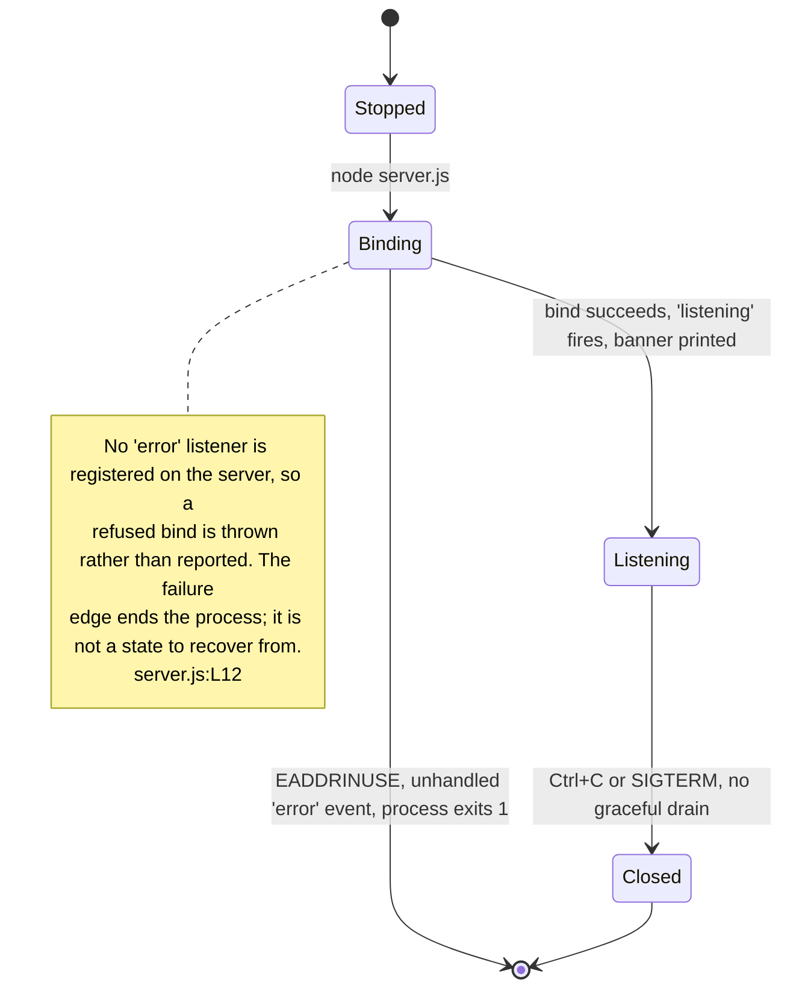

# Architecture overview

The shape of this system, how it starts, what states it can be in, and why it
was built the way it was. This page **owns the component model diagram** for the
whole documentation corpus, and it expands the Architecture at a glance section
of the root [README](../../README.md) rather than replacing it: the README stays
self-sufficient, and the depth lives here.

Source files this page derives from: `server.js:L1-L14`, the whole module. Every
runtime claim below was produced by executing that file, and every transcript is
pasted exactly as the run printed it.

## Architectural style

Four adjectives describe the design. Each is a claim about the source rather
than a label, so each is stated against the lines that support it.

**Single-process.** One `node` invocation is the entire deployment unit. The
module never forks a cluster worker, never constructs a worker thread and never
spawns a child process, so there is nothing to orchestrate, nothing to discover
and no inter-process channel to secure. `Source: server.js:L1-L14`

**Single-file.** The whole application is 14 content lines in one module — 11
lines of code and 3 blank separators — with no framework and no router to read
alongside it. [code-walkthrough.md](code-walkthrough.md) reads all 14 of them,
one at a time.

**Event-driven.** Nothing polls and nothing blocks. `server.listen()` is
asynchronous: it starts the bind, returns immediately, and its callback runs
later, when Node emits the `listening` event. `Source: server.js:L12` From that
point the event loop drives everything — a connection arriving, a request being
parsed, and the *request listener* being dispatched through the server's
`request` event. `Source: server.js:L6`

**Stateless.** No variable is mutated per request. The reply is composed from
source constants on every call, so no request can influence another, two
requests a week apart receive the same answer, and restarting the process loses
nothing: there is no cache to prime, no session to migrate and no warm-up
period. `Source: server.js:L6-L10`

| Property | Value | Consequence |
| --- | --- | --- |
| Deployment unit | One operating-system process | Nothing to orchestrate and nothing to discover |
| Source unit | One file, 14 content lines | The whole system fits on one screen |
| Concurrency model | Event-driven, single-threaded | No locks, no worker pool, no shared-state hazards |
| Application state | None | Every reply is composed from source constants |
| Persistence | None | No database, no cache, no filesystem writes |
| Network exposure | Loopback only | Unreachable from any other machine — `Source: server.js:L3` |
| Runtime dependencies | None | Only Node's built-in `http` module — `Source: server.js:L1` |

## Component model and the process boundary

Three components exist, and that is genuinely all of them: one operating-system
process, one `http.Server` inside it holding the listening socket, and one class
of external actor — an HTTP client, which has to be running on the same machine.

This page is the owning home of the diagram below. It is reproduced in the root
[README](../../README.md) so that file stays readable without following a link,
and the two copies are edited together: a change made here must be applied
there as well.



| Component | Source | Responsibility |
| --- | --- | --- |
| Configuration constants | `Source: server.js:L3`, `Source: server.js:L4` | Supply the bind address and the port, once, when the module is evaluated |
| `http.Server` instance | `Source: server.js:L6`, bound at `Source: server.js:L12` | Own the listening socket and dispatch each request to the listener |
| *Request listener* | `Source: server.js:L6-L10` | Compose the reply: the status, the one header the module sets, and the body |

No fourth component has been left out of that table. There is no database, no
cache, no queue, no load balancer and no second service anywhere in this system,
which is why the diagram shows none.

Both functions in the module are anonymous inline arrow expressions — the
*request listener* and the *startup callback* — so neither has an identifier for
a conventional doc block to bind to. That is why the annotations document them
through the `RequestHandler` and `ServerStartupCallback` callback typedefs,
which are the standards-sanctioned way to give a callback's signature a
referenceable name. The reference detail for both, and for the canonical types
`http.Server`, `http.IncomingMessage` and `http.ServerResponse`, is owned by
[../api/server-module.md](../api/server-module.md).

The process boundary is also the **reachability** boundary. The `hostname`
constant is the IPv4 loopback literal, so the listener accepts connections
arriving over the loopback interface and over no other, and a client on a
different machine cannot reach the service at all. `Source: server.js:L3` That
constraint, its verified evidence and the two ways of changing it are owned by
[../guides/deployment.md](../guides/deployment.md); this page states only that
the boundary exists and where in the source it comes from.

### The module exports nothing, and requiring it binds a port

This belongs in the component model rather than in a footnote, because it is the
property of the component model most likely to catch a reader out. **There is no
`module.exports` and no `exports.*` assignment anywhere in `server.js`.** The
module's entire observable contract is an **import-time side effect**:
evaluating the file constructs the server and binds the listening socket.
`Source: server.js:L1-L14`

The consequence is concrete rather than theoretical. `require('./server.js')`
opens a TCP listener before control returns to the caller, and hands back
nothing but CommonJS's default empty exports object — so a reader who assumes
the module is inert on import **will bind a port by accident**. There is no
exported factory to call, no server object to reach and no configuration to
inject after the fact. The only intended invocation is `node server.js`.

## Startup flow

Everything from process launch to the listening state happens in a single pass
through the file, and two of those steps do not do what their names suggest.



1. **`node server.js`** starts the process, and Node begins evaluating the
   module from the top.
2. **`require('http')` resolves a core module.** It ships with the runtime, so
   nothing is installed to satisfy it, no `npm install` is involved, and it
   appears in no dependency manifest. `Source: server.js:L1`
3. **The two configuration constants are evaluated** — the loopback `hostname`
   and the `port` the listener will bind. Both are plain literals, read once
   here and fixed for the lifetime of the process. `Source: server.js:L3`,
   `Source: server.js:L4`
4. **`http.createServer()` instantiates an `http.Server` and registers the
   *request listener*** that will be invoked once per request. It registers
   without invoking, and it opens no socket: construction alone makes nothing
   reachable. `Source: server.js:L6`
5. **`server.listen(port, hostname, callback)` binds the socket and begins
   accepting connections.** It is asynchronous. The call returns immediately,
   and the *startup callback* is not invoked in line. `Source: server.js:L12`
6. **Node emits the `listening` event** once the bind has succeeded, and that
   event is what invokes the *startup callback*.
7. **The *startup callback* prints the readiness banner**, interpolating
   `hostname` and `port` into a template literal rather than restating their
   values, so the banner always reports the address actually in force.
   `Source: server.js:L13`
8. **The process stays alive** because a listening socket is a live handle: it
   keeps the event loop from draining, so Node never runs out of work to wait
   for and never exits of its own accord.

Captured from a live run. The server is started in the background and stopped by
the PID captured at spawn, and its log is written outside the repository so no
untracked file is left in the working tree:

```bash
node server.js > "${TMPDIR:-/tmp}/startup.log" 2>&1 &
server_pid=$!
sleep 1
cat "${TMPDIR:-/tmp}/startup.log"
kill "$server_pid"
rm -f "${TMPDIR:-/tmp}/startup.log"
```

One line reaches stdout, and it is the only line this process will ever write
there:

```text
Server running at http://127.0.0.1:3000/
```

The counter-intuitive part is worth stating outright: **nothing in this file
waits.** Steps 1 to 5 run to completion in one synchronous pass, after which the
module is finished; steps 6 to 8 happen afterwards, driven by the event loop.
The banner is therefore *proof* that the socket was bound rather than the thing
that caused it — which is why its absence is the most reliable signal that the
bind failed, whatever else the terminal shows.

## Server lifecycle states

The process moves through four states, and only three of the transitions between
them are ones the code performs deliberately.



| State | What is true in it |
| --- | --- |
| Stopped | No process and no socket. Nothing answers on the port |
| Binding | The process exists and `server.listen()` has been called, but the socket is not yet accepting — `Source: server.js:L12` |
| Listening | The banner has been printed, and every request Node dispatches to the *request listener* receives the *catch-all response* — `Source: server.js:L13` |
| Closed | The process was terminated. Immediately, and with no draining: no signal handler is installed and `server.close()` is never called, so in-flight requests are dropped — `Source: server.js:L12-L14` |

There is no Draining state and no recoverable Failed state, and both absences
are the design rather than an omission. Termination drops in-flight requests,
which is what matters when choosing a supervisor —
[../guides/deployment.md](../guides/deployment.md) covers that choice.

### The failure edge out of Binding ends the process

A port conflict makes the bind fail, and the server emits an `'error'` event.
The module registers no `'error'` listener on it: the only call ever made on the
server object is `server.listen`. `Source: server.js:L12` An `'error'` event
with no listener is thrown rather than reported, so **Node rethrows it and the
process terminates.** It does not retry, it does not fall back to another port,
and it never reaches the *startup callback* that would have printed the banner.
`Source: server.js:L12-L14` That is why the edge in the diagram leaves Binding
for a terminal state rather than returning to Stopped: there is no recovery path
inside the process for it to return to.

Reproduced by starting a second instance while the first still holds the port.
The second process exits immediately, so this does not block, and the block is
self-cleaning — the first instance's PID is captured at spawn, and its log is
written outside the repository:

```bash
node server.js > "${TMPDIR:-/tmp}/instance-1.log" 2>&1 &
first_pid=$!
sleep 1
node server.js
echo "exit code: $?"
kill "$first_pid"
rm -f "${TMPDIR:-/tmp}/instance-1.log"
```

The first instance is unaffected and keeps serving. The second writes **nothing
at all to stdout** — the banner never appears — and writes this to stderr,
captured verbatim from the run above:

```text
node:events:497
      throw er; // Unhandled 'error' event
      ^

Error: listen EADDRINUSE: address already in use 127.0.0.1:3000
    at Server.setupListenHandle [as _listen2] (node:net:1941:16)
    at listenInCluster (node:net:1998:12)
    at node:net:2207:7
    at process.processTicksAndRejections (node:internal/process/task_queues:89:21)
Emitted 'error' event on Server instance at:
    at emitErrorNT (node:net:1977:8)
    at process.processTicksAndRejections (node:internal/process/task_queues:89:21) {
  code: 'EADDRINUSE',
  errno: -98,
  syscall: 'listen',
  address: '127.0.0.1',
  port: 3000
}

Node.js v22.23.2
```

`echo` then reported `exit code: 1`. The trailing `{ … }` object is the part
worth matching on — it names the code, the syscall, and the exact address and
port that could not be bound. Everything Node prints against one of its own
sources is volatile: the `node:events` header, the stack-frame positions and the
version line all follow whichever runtime produced them.

**Remediation is not on this page.**
[../guides/troubleshooting.md](../guides/troubleshooting.md) owns the
`EADDRINUSE` transcript, the per-platform commands for finding and freeing the
process that holds the port, and the wider symptom matrix.

## Design rationale

Three properties of this design look like omissions until the reason for each is
stated. None of them is an accident.

### Why zero dependencies

Node's built-in `http` module covers everything the service does, and it is a
**core** module: it ships with the runtime, so nothing is installed to satisfy
the import and it appears in no dependency manifest. `Source: server.js:L1`

The manifest declares no `dependencies` at all. The `devDependencies` it does
declare exist solely for the documentation toolchain, and none of them is in the
runtime path, so the application's runtime dependency tree is genuinely empty
rather than merely small. A framework would have bought a dependency tree, an
install step, a version-compatibility surface and a supply-chain exposure in
exchange for nothing this service needs.
[../getting-started/installation.md](../getting-started/installation.md) owns
the runtime baseline and shows how to verify the empty tree rather than take it
on trust.

### Why hardcoded configuration

Both options are compile-time source constants with no external configuration
surface: no file is read, no environment variable is consulted, and no argument
is parsed. `Source: server.js:L3`, `Source: server.js:L4`

The trade is determinism over flexibility. With two options and one deployment
target, an indirection layer through `process.env` would add code and a new
failure mode — an unparseable port, a missing variable — without adding any
capability. The cost is that changing a value takes an edit and a restart, and
that a reader who expects `PORT=8080` to work will be surprised. The option
matrix, the change procedure and that surprise are owned by
[../getting-started/configuration.md](../getting-started/configuration.md).

### Why a universal response

The *request listener* never reads `req`: not the method, not the URL, not a
header, and not the body. `Source: server.js:L6-L10` Every request Node
dispatches to it therefore receives the same *catch-all response*, which is what
makes the service a stable fixture — any probe gets the same answer, so a test
that fails has failed for a reason outside this module.

Routing would have added branches to exercise without adding anything to what
the service exists to prove: that a request reaches a listener and a reply comes
back. The response contract, including the parts Node frames rather than the
module, is owned by [../api/http-api.md](../api/http-api.md), and
[request-lifecycle.md](request-lifecycle.md) narrates one request through it
step by step.

## What is deliberately absent, and why

Everything in this table is missing on purpose. Each row is a **deliberate
exclusion of the current design**, corroborated as such by the out-of-scope
inventory of the technical specification (§1.3.2), rather than a defect or a
to-do item. The column that matters to a reader is the third one: what the
absence means for you in practice.

| Capability | Status | Consequence for the reader |
| --- | --- | --- |
| Path-based routing | Absent by design | Every path answers identically, including paths that look like private APIs. Do not add one expecting it to be matched — `Source: server.js:L6-L10` |
| HTTP method discrimination | Absent by design | `GET`, `POST` and the rest are treated alike, so there is no `405` code path to test — `Source: server.js:L6-L10` |
| TLS / HTTPS | Absent by design | Traffic is plaintext `http`. The module never requires `https` or `tls` — `Source: server.js:L1` |
| Authentication and authorization | Absent by design | No credential, header or token is ever examined, so anyone who can connect is served — `Source: server.js:L6-L10` |
| Rate limiting | Absent by design | No counter, timer or connection accounting exists; every request is answered immediately — `Source: server.js:L6-L10` |
| Environment-variable configuration | Absent by design | `process.env` is never read, so `PORT` and `HOST` have no effect. Edit the constants and restart instead — `Source: server.js:L3`, `Source: server.js:L4` |
| Graceful shutdown | Absent by design | No signal handler and no `server.close()` call exist, so termination drops in-flight requests — `Source: server.js:L12-L14` |
| Error-handling middleware | Absent by design | There is no `try`/`catch` and no application-defined `4xx` or `5xx` branch, so a listener exception would be unhandled. Node still emits its own protocol-level errors, which no code here chooses — see [../api/http-api.md](../api/http-api.md) |
| Health-check endpoint | Absent by design | No path is distinguished, so a probe can only prove that *something* is listening on the port, never that it is this service — `Source: server.js:L6-L10` |
| Structured logging | Absent by design | The only output the process ever writes is the one startup banner. No request is logged, in any format — `Source: server.js:L13` |
| Build step | Absent by design | The source is run directly. There is nothing to compile, bundle or transpile before `node server.js` |
| Container image | Absent by design | No `Dockerfile` and no `docker-compose.yml` exists, so the process is started on the host |
| CI/CD pipeline | Absent by design | No workflow definition exists, so nothing is built, tested or deployed automatically |

> **This service is not production-ready, and it is not intended to be.** It
> is a **test fixture**: a minimal, deterministic HTTP service for exercising
> tooling. Used as that it is exactly right and nothing above needs fixing.
> Used as a real service, every row of the table above is a gap.
> [../guides/deployment.md](../guides/deployment.md) owns the hardening
> discussion and states the same advisory with its full evidence.

## See also

- [../../README.md](../../README.md) — the canonical overview, whose
  Architecture at a glance section this page expands, and which carries the
  mirrored copy of the component model diagram.
- [../README.md](../README.md) — the documentation index, the glossary of the
  four fixed terms, and which page owns which fact.
- [request-lifecycle.md](request-lifecycle.md) — one request, from socket accept
  to response flush, in the same level of detail this page gives to startup.
- [code-walkthrough.md](code-walkthrough.md) — the line-level reading of all 14
  lines. It sits alongside the module reference below rather than replacing it:
  one is organised by line, the other by symbol.
- [../api/server-module.md](../api/server-module.md) — the code-level reference
  for the components above, the two callback typedefs and the canonical types.
- [../api/http-api.md](../api/http-api.md) — owner of the HTTP response
  contract that a caller gets once it can reach the service.
- [../guides/deployment.md](../guides/deployment.md) — owner of the loopback
  binding constraint, the hardening checklist and the deployment runbook.
- [../guides/troubleshooting.md](../guides/troubleshooting.md) — owner of the
  `EADDRINUSE` remediation and the per-platform port commands.
- [../getting-started/configuration.md](../getting-started/configuration.md) —
  owner of the `hostname` and `port` option matrix and the change procedure.
- [../getting-started/installation.md](../getting-started/installation.md) —
  owner of the runtime baseline, and of the run, verify and stop commands.
