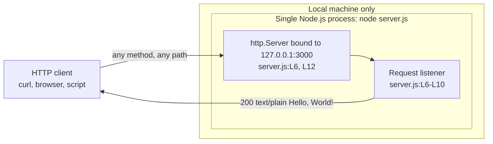
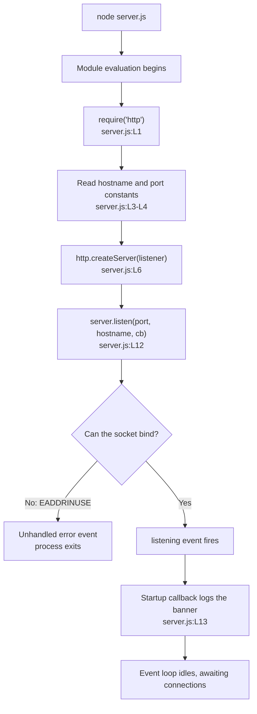
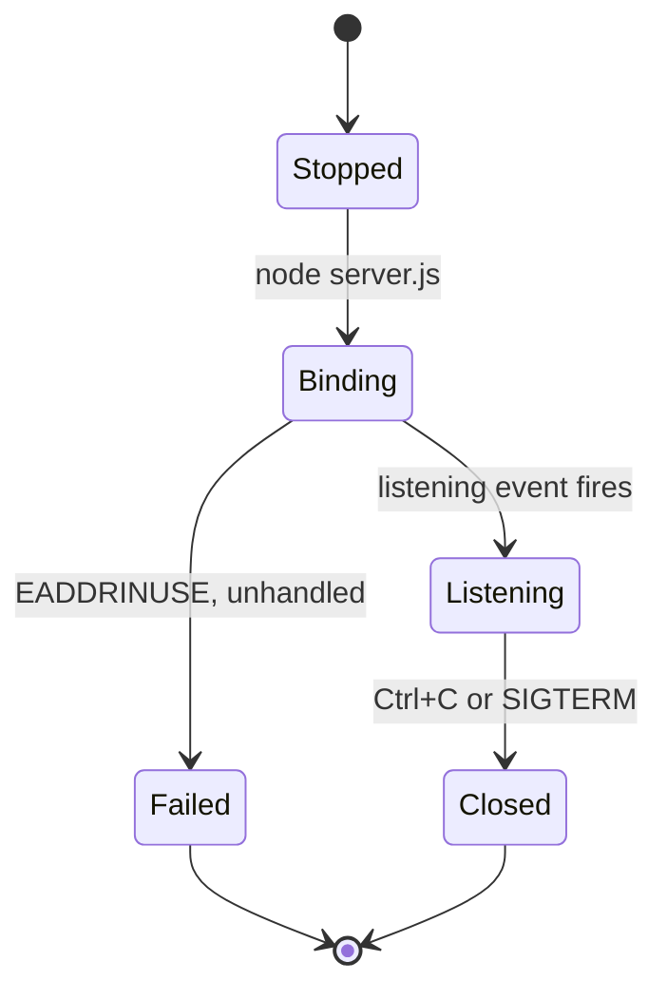

# Architecture overview

The shape of the system, how it starts, what states it can be in, and why it was
built this way. This page owns the **component model diagram** for the whole
documentation corpus.

Source files this page derives from: `server.js:L1-L14`.

## Architectural style

| Property | Value | Why it matters |
| --- | --- | --- |
| Deployment unit | One process | Nothing to orchestrate, nothing to discover |
| Source unit | One file, 14 content lines | The whole system fits on a screen |
| Concurrency model | Event-driven, single-threaded | No locks, no worker pool, no shared-state hazards |
| State | None | Every response is composed from source constants |
| Persistence | None | No database, no cache, no filesystem writes |
| Network exposure | Loopback only | See [../guides/deployment.md](../guides/deployment.md) |
| External dependencies | None at runtime | Only Node's built-in `http` module, at `server.js:L1` |

Statelessness here is total rather than aspirational: two requests a week apart
receive the same answer, restarting the process loses nothing, and there is no
warm-up period, no cache to prime, and no session to migrate.

## Component model

This page owns this diagram. It is reproduced in the root
[README](../../README.md) so that file stays readable without following a link;
edit both copies together.

Three components, and that is genuinely all of them:

| Component | Source | Responsibility |
| --- | --- | --- |
| Configuration constants | `server.js:L3-L4` | Supply the bind address and port, once, at evaluation time |
| `http.Server` instance | `server.js:L6`, bound at `server.js:L12` | Own the listening socket and dispatch each request to the listener |
| Request listener | `server.js:L6-L10` | Compose the reply: status, header, body |

The process boundary is also the system boundary. Nothing crosses it except HTTP
over loopback and one line of standard output.

## Startup flow

Two properties of that flow are easy to miss. First, `http.createServer()` does
not open a socket — it only constructs the server and registers the listener, so
nothing is reachable until `listen()` runs. Second, `listen()` is asynchronous:
it returns immediately and the startup callback fires later, on the `listening`
event, which is why the banner is printed from a callback rather than from the
next statement.

The whole sequence up to the listening state is a side effect of **evaluating**
the module. There is no exported entry point to call, so importing the file from
another module performs all of the above, including binding the socket.

## Lifecycle states

| State | What is true in it |
| --- | --- |
| Stopped | No process, no socket. Nothing answers |
| Binding | The process exists and `listen()` has been called, but the socket is not yet accepting |
| Listening | The banner has been printed and every request receives the catch-all response |
| Failed | The bind was refused, the `error` event went unhandled, and the process exited. The one routine cause is a port conflict |
| Closed | The process was terminated. Immediately, with no draining: no signal handler is installed and `server.close()` is never called |

There is no Draining state, and its absence is the design rather than an
omission: termination drops in-flight requests. That matters when choosing a
supervisor, which is covered in [../guides/deployment.md](../guides/deployment.md).

## Design rationale

**Why zero dependencies.** Node's built-in `http` module covers everything the
service does, so a framework would add a dependency tree, an install step, and a
version-compatibility surface in exchange for nothing. The empty runtime tree is
verifiable rather than claimed — see
[../getting-started/installation.md](../getting-started/installation.md).

**Why hardcoded configuration.** With two options and one deployment target, an
indirection layer through `process.env` would add code and a failure mode
(unparseable port, missing variable) without adding capability. The trade-off is
that changing a value requires an edit and a restart, which
[../getting-started/configuration.md](../getting-started/configuration.md)
documents plainly so nobody debugs a `PORT` variable that is never read.

**Why a universal response.** The service exists to prove that a request reaches
a listener and a reply comes back. Routing would add branches to test without
adding anything to that proof, so the request listener ignores `req` entirely —
which is also what makes the contract in
[../api/http-api.md](../api/http-api.md) so short.

**Why no exports.** The module is an application, not a library. Nothing else in
the repository imports it, and the only intended invocation is `node server.js`.
The consequence — that requiring it binds a port — is documented rather than
engineered away, because engineering it away would mean adding an exported
factory and changing behaviour.

## What is deliberately absent

TLS, authentication, authorisation, routing, rate limiting, request logging,
structured logging, health endpoints, error-handling middleware, graceful
shutdown, environment configuration, tests, containerisation, and CI. Each is
listed with its consequence in the hardening checklist in
[../guides/deployment.md](../guides/deployment.md) and in the non-goals list in
[../../README.md](../../README.md). Documentation describes their absence; it
does not promise them.

## See also

- [../../README.md](../../README.md) — the canonical overview, whose
  Architecture at a glance section this page expands.
- [request-lifecycle.md](request-lifecycle.md) — one request, step by step.
- [code-walkthrough.md](code-walkthrough.md) — the same module read line by line.
- [../api/server-module.md](../api/server-module.md) — the code-level reference
  for the components above.
