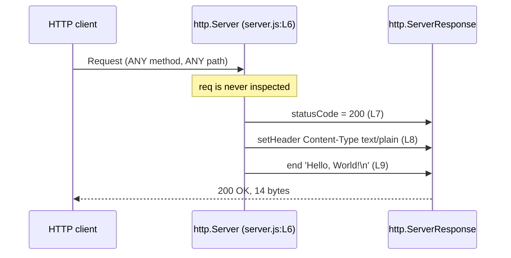

# Request lifecycle

One request, from the moment the socket is accepted to the moment the response is
flushed, with each step tied to the line that performs it.

Source files this page derives from: `server.js:L6-L10`.

## The exchange

The diagram below is reproduced from [../api/http-api.md](../api/http-api.md),
which owns it. Edit both copies together.



## Step 0: before the listener runs

Work happens before any line of `server.js` executes for a given request, and
attributing it correctly matters when something misbehaves:

1. Node accepts the TCP connection on the listening socket bound at
   `server.js:L12`.
2. Node's HTTP parser reads the request line and headers. A malformed request is
   rejected here, by the runtime, and the listener never runs.
3. Node constructs an `http.IncomingMessage` for the request and an
   `http.ServerResponse` for the reply.
4. Node emits the server's `request` event, which invokes the request listener
   registered at `server.js:L6`.

A `CONNECT` request diverges at step 4: Node routes it to a separate `connect`
event that this module does not handle, so the socket is closed without a single
response byte.

## Step 1: the listener is invoked

The request listener receives exactly two arguments, `req` and `res`, and runs
once per request. It is an anonymous inline arrow expression, documented as the
`RequestHandler` callback typedef in
[../api/server-module.md](../api/server-module.md).

| Argument | Type | Used? |
| --- | --- | --- |
| `req` | `http.IncomingMessage` | **No.** Never read at all |
| `res` | `http.ServerResponse` | Yes. Mutated in place across the next three steps |

## Step 2: the status code

```javascript
res.statusCode = 200;
```

Source: `server.js:L7`.

Assigning the property is not the same as sending it. The status line is buffered
as part of the response head and is written to the socket only when the head is
flushed, which is why this assignment must happen **before** any body byte is
written. Assigning it afterwards would be too late: the head would already be on
the wire.

## Step 3: the response header

```javascript
res.setHeader('Content-Type', 'text/plain');
```

Source: `server.js:L8`.

`setHeader()` mutates the pending head, so it carries the same
before-the-first-byte constraint. This is the only header the application sets.
Everything else a client sees — `Date`, `Content-Length`, `Connection`,
`Keep-Alive` — is framed by Node, and the split is spelled out in
[../api/http-api.md](../api/http-api.md).

Note what this step is **not**: there is no combined status-and-headers helper
call anywhere in the module. Status and header are set independently, through the
property and this method, and the head is never written explicitly.

## Step 4: the body, and termination

```javascript
res.end('Hello, World!\n');
```

Source: `server.js:L9`.

One call does three things: it flushes the implicit head — the status from step
2 and the header from step 3 — writes the 14-byte payload, and signals that the
response is complete so Node can frame `Content-Length` and either keep the
connection alive or close it.

For a `HEAD` request, Node discards the payload before it reaches the wire and
frames no `Content-Length`; the listener still runs unchanged, and the
suppression happens beneath it inside the runtime.

## Why `req` is never inspected, and what that means for callers

The listener's first argument is bound and then ignored. There is no `if`, no
`switch`, and no property read on it anywhere in `server.js:L6-L10`.

For a caller, three consequences follow directly:

- **No routing exists.** `/`, `/api/anything`, and `/a/b/c/d` are the same
  request as far as this service is concerned.
- **No method discrimination exists.** A `POST` is answered exactly like a `GET`,
  so there is no `405` and no `Allow` header.
- **Request content is inert.** Headers, query parameters, and bodies cannot
  influence the reply, which also means they cannot cause a failure: there is no
  parsing step to reject them.

The invariance is at the application level. The bytes on the wire still vary,
because `Date` advances and `Connection` framing depends on the request — see
[../api/http-api.md](../api/http-api.md) for the exact split.

## Concurrency and connection reuse

Node's event loop accepts connections and dispatches requests one at a time onto
a single thread. Each invocation of the listener touches only its own `res`
object, so no state is shared between concurrent requests and nothing needs
synchronising. The listener performs no asynchronous work of its own — three
synchronous statements and it is done — so it never yields mid-request and
requests are effectively serialised by the event loop.

Connection reuse is Node's default, and observable: a `keep-alive` response
carries `Keep-Alive: timeout=5`, so an idle connection is closed after five
seconds. Reuse changes nothing about the reply, because the listener runs
identically for every request on a connection, whether it is the first or the
tenth.

## See also

- [../api/http-api.md](../api/http-api.md) — owner of this diagram and of the
  response contract.
- [overview.md](overview.md) — the startup path that precedes any of this, and
  the lifecycle states.
- [code-walkthrough.md](code-walkthrough.md) — the same three statements in the
  context of all 14 lines.
- [../api/server-module.md](../api/server-module.md) — the `RequestHandler`
  typedef that documents this function.
