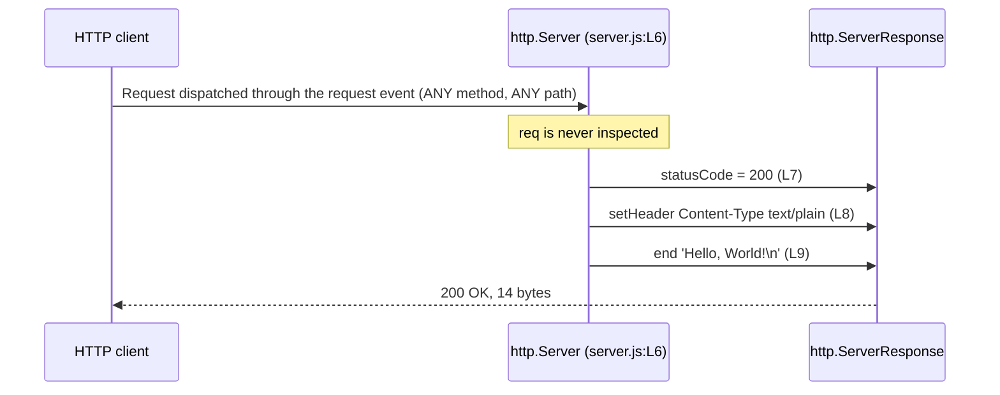

# Request lifecycle

One HTTP request, from the moment Node accepts the socket to the moment the
response is flushed, with every step tied to the line that performs it. This
page expands the API documentation and Code walkthrough sections of the root
[README](../../README.md) rather than replacing them, and it is the request-side
counterpart to [overview.md](overview.md), which covers startup instead.

Source files this page derives from: `server.js:L6-L10`, the *request listener*,
together with runtime evidence captured by executing that file. Every transcript
below is pasted exactly as the run printed it.

## Lifecycle from socket accept to response flush

The arc of a single request is short, and only one step of it is application
code:

1. A client opens a TCP connection to the *loopback binding*, the only address
   the listener accepts on. `Source: server.js:L3`
2. Node's event loop accepts the connection, and its HTTP parser reads the
   request line and headers.
3. Node emits the server's `request` event, which invokes the *request
   listener* — once, for that one request. `Source: server.js:L6`
4. The listener composes the reply in three statements: the status code, the
   one header the module sets, and then the body, whose write flushes the
   response. `Source: server.js:L7-L9`
5. The connection is held open for reuse rather than closed, because connection
   reuse is Node's default for an HTTP/1.1 client that permits it.

Step 4 is the whole of this repository's contribution. Steps 1, 2, 3 and 5 are
the runtime's, which is why a surprise in any of them is looked for in Node's
behaviour rather than in these 14 lines.

Within step 4 the listener is invoked **once per request**, and each invocation
is independent of every other. Nothing is shared between them and nothing is
mutated: the reply is composed from source literals every time, so the service
is stateless and one request cannot influence another. There is no counter, no
cache and no session for it to reach. `Source: server.js:L6-L10`

The diagram below is **owned by [../api/http-api.md](../api/http-api.md)**. This
copy is a mirror, reproduced here so the narrative reads without a detour to
another page, and the root [README](../../README.md) carries a third copy for
the same reason. All copies are identical, and an edit to any one of them must
be applied to both of the others.



### What Node does before the listener runs

Work happens before any line of `server.js` executes for a given request, and
attributing it to the runtime rather than to this module matters when something
misbehaves:

1. Node accepts the TCP connection on the listening socket bound at
   `server.js:L12`.
2. Node's HTTP parser reads the request line and headers. A malformed request is
   rejected here, by the runtime, and the listener never runs.
3. Node constructs an `http.IncomingMessage` for the request and an
   `http.ServerResponse` for the reply.
4. Node emits the server's `request` event, which invokes the *request listener*
   registered at `server.js:L6`.

A `CONNECT` request diverges at step 4: Node routes it to a separate `connect`
event that this module does not handle, so the socket is closed without a single
response byte. The full list of requests that never reach the listener, with
captured evidence, is owned by [../api/http-api.md](../api/http-api.md).

## Step 1 — Listener invocation and its two arguments

`Source: server.js:L6`

```javascript
const server = http.createServer((req, res) => {
```

This line instantiates an `http.Server` and **registers** the listener on it. It
does not call the listener, and it opens no socket: nothing is reachable until
the bind at `server.js:L12`. What calls the listener is the event loop, once for
every request Node dispatches through the server's `request` event.

The listener receives exactly two arguments, under the canonical type names
Node's own documentation uses:

| Argument | Type | How this module treats it |
| --- | --- | --- |
| `req` | `http.IncomingMessage` | **Never read.** Not `method`, not `url`, not `headers`, and the body stream is never consumed |
| `res` | `http.ServerResponse` | Mutated in place across the three statements that follow |

The listener is an anonymous inline arrow expression, so it has no identifier a
conventional doc block could bind to. That is why the annotation layer documents
it as the `RequestHandler` callback typedef, whose full signature is owned by
[../api/server-module.md](../api/server-module.md) and is not restated here.

## Step 2 — Setting the status code before any body byte

`Source: server.js:L7`

```javascript
  res.statusCode = 200;
```

The assignment sets the status line. It does not send it: the status line and
the response headers together form the response **head**, which Node holds
pending until something forces it out.

That pending head is what makes the ordering a mechanism rather than a style
preference. The head is flushed by the first body byte, and once it has gone to
the socket it cannot be recalled — HTTP offers no way to revise a status line a
client has already received. So the assignment comes first because that is the
only point at which it can still matter.

The failure mode of getting the order wrong is worth knowing, because the two
statements fail differently and the more permissive one is the more dangerous.
Verified against this runtime by moving each call after `res.end()` in a
throwaway copy of the handler: assigning `res.statusCode` late is **silently
ignored** — it neither throws nor warns, and the client still receives the
status the response was flushed with — whereas a late `res.setHeader()` throws
`ERR_HTTP_HEADERS_SENT`. A misordered status is therefore invisible, which is
the stronger reason to keep this assignment where it is.

## Step 3 — Declaring the Content-Type header

`Source: server.js:L8`

```javascript
  res.setHeader('Content-Type', 'text/plain');
```

This declares the payload's MIME type. `setHeader()` stages the header on that
same pending head, so it carries the same constraint as Step 2 for the same
reason: it must precede `res.end()`. Unlike the status assignment, breaking that
order here is loud rather than silent — the late call throws, as Step 2 records.

This is the **only** header the module sets. Every other header a client sees is
framed by Node rather than by any line of `server.js`:

- `Date` is a per-request volatile value Node supplies. It records when the
  response was generated, so it advances with the clock.
- `Connection` and `Keep-Alive` are derived from the request, and reflect Node's
  server defaults rather than any setting in this repository.
- `Content-Length` is derived from the body length, which is precisely why the
  module never sets it: the value follows from the string handed to `res.end()`,
  and setting it by hand would only create a second place to keep correct.

The complete split between the three values the module guarantees and everything
Node frames around them is owned by
[../api/http-api.md](../api/http-api.md).

## Step 4 — Writing the body and terminating the response

`Source: server.js:L9`

```javascript
  res.end('Hello, World!\n');
```

One call does three things: it supplies the 14-byte body, it terminates the
response, and it flushes the head assembled in Steps 2 and 3.

That head is **implicit**. No combined status-and-headers helper is called
anywhere in this module — the status arrives through a property assignment and
the one header through a method call, and neither of those writes the head.
`res.end()` is what puts it on the wire, which is the mechanical reason Steps 2
and 3 have to come first.

`res.end()` returning is not a delivery receipt. It means the response is
complete as far as the application is concerned; the bytes are handed to the
socket, and what happens after that belongs to the runtime and the network. For
a `HEAD` request Node discards the payload before it reaches the wire, so the
client receives the head alone — the listener still runs unchanged, and the
suppression happens beneath it.

The line that follows closes both constructs at once: `});` ends the *request
listener* body and the `http.createServer()` invocation.
`Source: server.js:L10`

## Why `req` is never inspected, and what that means for callers

The listener binds its first argument and then ignores it. There is no `if`, no
`switch` and no property read on `req` anywhere in the handler body.
`Source: server.js:L6-L10` Method, path, query string, request headers and
request body are therefore all ignored, and that single omission is the whole
reason every request receives the *catch-all response*.

Four consequences follow, and every one of them is something a reader
reasonably expects to be there:

- **There is no routing.** No path is matched, so adding a path is meaningless:
  `/`, `/api/anything` and `/a/b/c/d` are the same request as far as this
  service is concerned.
- **There is no method discrimination.** A `POST` is answered exactly like a
  `GET`, so no `405` code path exists and no `Allow` header is ever sent.
- **There is no conditional logic, so no `4xx` or `5xx` response exists at
  all.** The handler has no branch, no validation and no `try`/`catch`, so no
  input can make the *application* emit any status other than `200`.
- **Request bodies are never read.** The request stream is never consumed, so a
  `POST` body is simply discarded. It cannot influence the reply, and it cannot
  cause a failure either, because there is no parsing step to reject it.

### The evidence

Three probes establish this, and it takes all three: one alone would only show
that the root path answers. The server was started in the background, probed,
and stopped by the PID captured at spawn, with its log written outside the
repository so no untracked file is left in the working tree:

```bash
node server.js > "${TMPDIR:-/tmp}/lifecycle.log" 2>&1 &
server_pid=$!
sleep 1
curl --noproxy '*' --include --silent --show-error --max-time 5 http://127.0.0.1:3000/
curl --noproxy '*' --include --silent --show-error --max-time 5 http://127.0.0.1:3000/api/anything
curl --noproxy '*' --include --silent --show-error --max-time 5 --request POST http://127.0.0.1:3000/whatever
kill "$server_pid"
rm -f "${TMPDIR:-/tmp}/lifecycle.log"
```

`--noproxy '*'` stops a configured proxy answering on the service's behalf, and
`--max-time 5` bounds each probe so a filtered address fails instead of hanging.

The root path:

```http
HTTP/1.1 200 OK
Content-Type: text/plain
Date: Wed, 05 Aug 2026 02:44:49 GMT
Connection: keep-alive
Keep-Alive: timeout=5
Content-Length: 14

Hello, World!
```

A path that looks like an API route, and is not one:

```http
HTTP/1.1 200 OK
Content-Type: text/plain
Date: Wed, 05 Aug 2026 02:44:49 GMT
Connection: keep-alive
Keep-Alive: timeout=5
Content-Length: 14

Hello, World!
```

A different method, against a path that exists no more than the last one did:

```http
HTTP/1.1 200 OK
Content-Type: text/plain
Date: Wed, 05 Aug 2026 02:44:49 GMT
Connection: keep-alive
Keep-Alive: timeout=5
Content-Length: 14

Hello, World!
```

The three responses are identical apart from `Date`, and that is the empirical
confirmation that `req` is never inspected. In this capture all three requests
were served inside the same second, so even `Date` coincides and the three
transcripts are byte-identical outright; across a second boundary the `Date`
line alone would differ.

What this section deliberately does not carry is the request-matching matrix.
Which methods, paths, query strings, headers and bodies are matched, and how
each is treated, is owned by [../api/http-api.md](../api/http-api.md), together
with the response specification and the requests Node never dispatches here at
all.

None of this is an unimplemented feature. The *catch-all response* is the design
property that makes the service useful as a fixture: any probe gets the same
answer, so a test that fails has failed for a reason outside this module.
[overview.md](overview.md) tabulates every such deliberate absence next to what
it means in practice.

## Concurrency and keep-alive

The observed headers are what to reason from. `Connection: keep-alive` and
`Keep-Alive: timeout=5` are Node's defaults rather than values this module sets,
and they say that a client may reuse the connection for further requests within
roughly a five-second idle window. Each reused request invokes the listener
again, exactly as the first one did.

Captured against a server started as above, from a single `curl` invocation
asked for two URLs, with the connection lines filtered out of its verbose
trace:

```bash
curl --noproxy '*' --silent --show-error --max-time 5 --verbose \
  http://127.0.0.1:3000/first http://127.0.0.1:3000/second 2>&1 \
  | grep -E "Connected to|Re-using|^> GET|^< HTTP|^< Connection|^< Keep-Alive"
```

```text
* Connected to 127.0.0.1 (127.0.0.1) port 3000
> GET /first HTTP/1.1
< HTTP/1.1 200 OK
< Connection: keep-alive
< Keep-Alive: timeout=5
* Re-using existing http: connection with host 127.0.0.1
> GET /second HTTP/1.1
< HTTP/1.1 200 OK
< Connection: keep-alive
< Keep-Alive: timeout=5
```

One connection, two requests, two identical replies. Reuse changes nothing about
the answer, because the listener runs identically whether a request is the first
on a connection or the tenth.

Concurrency needs no synchronising here, and the reason is structural rather
than careful. A **single** process serves everything — no cluster worker, no
worker thread, no child process — and its event loop dispatches every request
onto one thread. Each invocation touches only its own `res` object, the listener
performs no I/O beyond the response write, and it never awaits, so it cannot be
suspended part-way through composing a reply. There is nothing shared for one
request to disturb for another. `Source: server.js:L6-L10`

No throughput figure, connection ceiling or benchmark appears above, because
none was measured; a number invented for a lifecycle narrative would be worse
than no number at all. The process boundary all of this sits inside is owned by
[overview.md](overview.md).

## See also

- [../api/http-api.md](../api/http-api.md) — **owner of the diagram above**, of
  the request-matching matrix and of the full response specification.
- [../api/server-module.md](../api/server-module.md) — owner of the seven
  documented symbols, including the `RequestHandler` typedef that gives this
  listener its documented signature.
- [overview.md](overview.md) — the component model, the startup flow that
  precedes any request, the lifecycle states, and the table of deliberate
  absences.
- [code-walkthrough.md](code-walkthrough.md) — the same statements read line by
  line across all 14 lines. It sits **alongside** the module reference rather
  than replacing it: one is organised by line, the other by symbol.
- [../guides/deployment.md](../guides/deployment.md) — owner of the *loopback
  binding* constraint and of the reverse-proxy guidance.
- [../guides/troubleshooting.md](../guides/troubleshooting.md) — owner of the
  operational failure modes, including a port that is already bound.
- [../README.md](../README.md) — the documentation index, the glossary of the
  four fixed terms, and the fact-ownership table.
- [../../README.md](../../README.md) — the canonical overview, whose API
  documentation and Code walkthrough sections this page expands.
