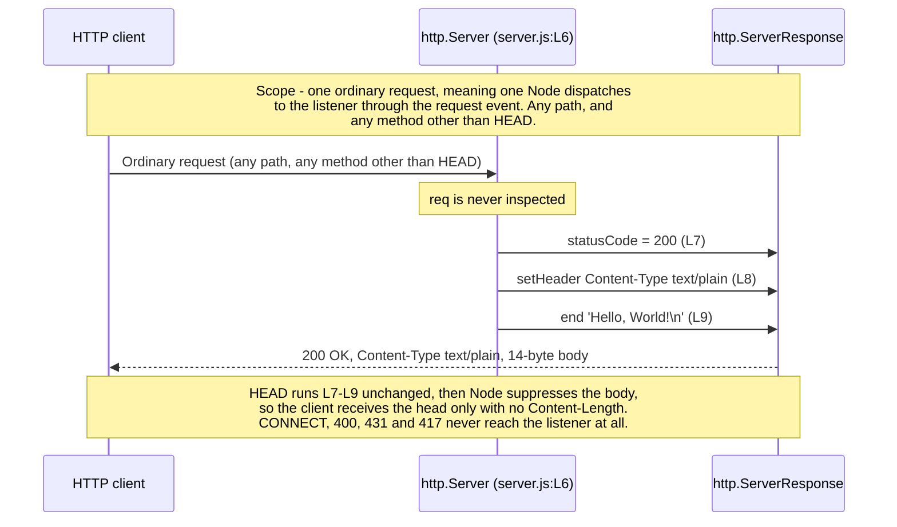

# Request lifecycle

One HTTP request, from the moment Node accepts the socket to the moment the
response is flushed, with every step tied to the line that performs it. This
page expands the API documentation and Code walkthrough sections of the root
[README](../../README.md) rather than replacing them, and it is the request-side
counterpart to [overview.md](overview.md), which covers startup instead.

Source files this page derives from: `server.js:L6-L10` for the *request
listener* itself, `server.js:L12` for the socket it is reached through, and
runtime behaviour captured by executing that file and probing it. Node's own
HTTP documentation is the authority for everything that happens above the
listener, and it is deferred to where it applies. Every transcript below is
pasted exactly as the run printed it.

## Line-number citation basis

Every `Lnn` citation on this page refers to the **original, unannotated
14-line layout** of `server.js` — 11 code lines with blank separators at L2,
L5 and L11 — which is the citation basis the whole documentation corpus
shares. The JSDoc blocks and inline comments now in the file shift where
those statements physically sit without changing that basis, so
`Source: server.js:L7` means "the statement that was on line 7 of the
unannotated file" wherever it lives today. The convention is stated in full
in [code-walkthrough.md](code-walkthrough.md), whose 14-row table is what
every citation resolves against, and restated by the symbol owner at
[../api/server-module.md](../api/server-module.md).

## Lifecycle from socket accept to response flush

The arc of a single request is short, and only one step of it is application
code:

1. A client opens a TCP connection to the *loopback binding*, the only address
   the listener accepts on. `Source: server.js:L3`
2. Node's event loop accepts the connection, and its HTTP parser reads the
   request line and headers.
3. Node emits the server's `request` event, which invokes the *request
   listener* — once, for that one request. `Source: server.js:L6`
4. The listener composes the reply in three statements: the status code, the
   one header the module sets, and then the body, whose write flushes the
   response. `Source: server.js:L7-L9`
5. The connection is held open for reuse rather than closed, because connection
   reuse is Node's default for an HTTP/1.1 client that permits it.

Step 4 is the whole of this repository's contribution. Steps 1, 2, 3 and 5 are
the runtime's, which is why a surprise in any of them is looked for in Node's
behaviour rather than in these 14 lines.

Within step 4 the listener is invoked **once per request**, and each invocation
is independent of every other. Nothing is shared between them and nothing is
mutated: the reply is composed from source literals every time, so the service
is stateless and one request cannot influence another. There is no counter, no
cache and no session for it to reach. `Source: server.js:L6-L10`

The diagram below is **owned by [../api/http-api.md](../api/http-api.md)**. This
copy is a mirror, reproduced here so the narrative reads without a detour to
another page, and the root [README](../../README.md) carries a third copy for
the same reason. All copies are identical, and an edit to any one of them must
be applied to both of the others.



Read the two scope notes as part of the diagram rather than as footnotes, because
the sequence is deliberately narrower than "any request". It describes one
**ordinary** request: one that Node dispatches to the *request listener* through
the server's `request` event, on any path, by any method other than `HEAD`. What
is invariant across that set is the three listener steps and the application-level
reply they compose. Three classes of request sit outside it:

| Request | Why the sequence does not describe it |
| --- | --- |
| `HEAD` | It **is** dispatched and does run L7-L9 unchanged, so the listener behaves identically — but Node then discards the payload and frames no `Content-Length`, so the final arrow's 14-byte body never reaches the client |
| `CONNECT`, a malformed request line, an HTTP/1.1 request with no `Host`, an oversized header block, a header block that never arrives, an unsupported `Expect` header | None of them reaches the listener, so not one line of `server.js` executes. Node closes the socket or answers `400`, `431`, `408`, or `417` itself |
| An announced body that never completes, or a chunked body with an oversized chunk extension | The listener **does** run and the sequence describes its reply exactly — but the request was still arriving after the reply completed, so Node appends `408` or `413` to the same connection once a runtime limit expires. The sequence ends one response too early for these |

Framing around the reply also varies with the request — an HTTP/1.0 request is
answered close-delimited with `Connection: close` and no `Content-Length`, though
the body is still the same 14 bytes. All of this is enumerated with captured
transcripts by
[../api/http-api.md](../api/http-api.md#requests-that-do-not-follow-this-contract),
which owns the contract.

### What Node does before the listener runs

Work happens before any *request-listener* statement executes for that
request, and attributing it to the runtime rather than to this module matters
when something misbehaves. The module's own startup lines have of course
already run — nothing could be accepted otherwise, and
[overview.md](overview.md) covers that path. What follows is per-request
work, all of it Node's:

1. Node accepts the TCP connection on the listening socket bound at
   `server.js:L12`. Because that bind is the *loopback binding*, the
   connection can only have come from this machine — see
   [../guides/deployment.md](../guides/deployment.md).
2. Node's HTTP parser reads the request line and headers. A malformed request is
   rejected here, by the runtime, and the listener never runs. So is a
   well-formed HTTP/1.1 request that carries no `Host` header, and so is a header
   block that exceeds Node's size limit or never arrives at all — the last of
   those is answered `408 Request Timeout` once `headersTimeout` expires.
3. Node constructs an `http.IncomingMessage` for the request and an
   `http.ServerResponse` for the reply.
4. Node emits the server's `request` event, which invokes the *request listener*
   registered at `server.js:L6`.

A `CONNECT` request diverges at step 4: Node routes it to a separate `connect`
event that this module does not handle, so the socket is closed without a single
response byte. The full list of requests that never reach the listener, with
captured evidence, is owned by [../api/http-api.md](../api/http-api.md).

Note what step 2 does **not** guarantee. It reads the request line and headers,
not the body: a body announced by `Content-Length` or `Transfer-Encoding` may
still be arriving when step 4 fires, and this module answers immediately, so the
reply can complete long before the request does. Two runtime limits therefore
apply *after* the sequence below has finished — `requestTimeout` on how long the
whole request may take, and a size limit on chunk extensions — and either one
expiring makes Node append a second status to the same connection. Both are
enumerated with transcripts by
[../api/http-api.md](../api/http-api.md#node-generated-protocol-responses-observed),
and the resource consequences are in
[Concurrency and keep-alive](#concurrency-and-keep-alive).

## Step 1 — Listener invocation and its two arguments

`Source: server.js:L6`

```javascript
const server = http.createServer((req, res) => {
```

This line instantiates an `http.Server` and **registers** the listener on it. It
does not call the listener, and it opens no socket: nothing is reachable until
the bind at `server.js:L12`. What calls the listener is the event loop, once for
every request Node dispatches through the server's `request` event.

The listener receives exactly two arguments, under the canonical type names
Node's own documentation uses:

| Argument | Type | How this module treats it |
| --- | --- | --- |
| `req` | `http.IncomingMessage` | **Never read by application logic.** Not `method`, not `url`, not `headers`, and the body stream is never read here. Node still receives and discards an unread body after the reply |
| `res` | `http.ServerResponse` | Mutated in place across the three statements that follow |

The listener is an anonymous inline arrow expression, so it has no identifier a
conventional doc block could bind to. That is why the annotation layer documents
it as the `RequestHandler` callback typedef, whose full signature is owned by
[../api/server-module.md](../api/server-module.md) and is not restated here.

## Step 2 — Setting the status code before any body byte

`Source: server.js:L7`

```javascript
  res.statusCode = 200;
```

The assignment sets the status line. It does not send it: the status line and
the response headers together form the response **head**, which Node holds
pending until something forces it out.

That pending head is what makes the ordering a mechanism rather than a style
preference. The head is flushed by the first body byte, and once it has gone to
the socket it cannot be recalled — HTTP offers no way to revise a status line a
client has already received. So the assignment comes first because that is the
only point at which it can still matter.

The failure mode of getting the order wrong is worth knowing, because the two
statements fail differently and the more permissive one is the more dangerous.
Verified against this runtime by moving each call after `res.end()` in a
throwaway copy of the handler: assigning `res.statusCode` late is **silently
ignored** — it neither throws nor warns, and the client still receives the
status the response was flushed with — whereas a late `res.setHeader()` throws
`ERR_HTTP_HEADERS_SENT`. A misordered status is therefore invisible, which is
the stronger reason to keep this assignment where it is.

## Step 3 — Declaring the Content-Type header

`Source: server.js:L8`

```javascript
  res.setHeader('Content-Type', 'text/plain');
```

This declares the payload's MIME type. `setHeader()` stages the header on that
same pending head, so it carries the same constraint as Step 2 for the same
reason: it must precede `res.end()`. Unlike the status assignment, breaking that
order here is loud rather than silent — the late call throws, as Step 2 records.

This is the **only** header the module sets. Every other header a client sees is
framed by Node rather than by any line of `server.js`:

- `Date` is a per-request volatile value Node supplies. It records when the
  response was generated, so it advances with the clock.
- `Connection` and `Keep-Alive` are derived from the request, and reflect Node's
  server defaults rather than any setting in this repository.
- `Content-Length` is derived from the body length, which is precisely why the
  module never sets it: the value follows from the string handed to `res.end()`,
  and setting it by hand would only create a second place to keep correct.

The complete split between the three values the module guarantees and everything
Node frames around them is owned by
[../api/http-api.md](../api/http-api.md).

## Step 4 — Writing the body and terminating the response

`Source: server.js:L9`

```javascript
  res.end('Hello, World!\n');
```

One call does three things: it supplies the 14-byte body, it terminates the
response, and it flushes the head assembled in Steps 2 and 3.

That head is **implicit**. No combined status-and-headers helper is called
anywhere in this module — the status arrives through a property assignment and
the one header through a method call, and neither of those writes the head.
`res.end()` is what puts it on the wire, which is the mechanical reason Steps 2
and 3 have to come first.

`res.end()` returning is not a delivery receipt. It means the response is
complete as far as the application is concerned; the bytes are handed to the
socket, and what happens after that belongs to the runtime and the network. For
a `HEAD` request Node discards the payload before it reaches the wire, so the
client receives the head alone — the listener still runs unchanged, and the
suppression happens beneath it.

The line that follows closes both constructs at once: `});` ends the *request
listener* body and the `http.createServer()` invocation.
`Source: server.js:L10`

## Why `req` is never inspected, and what that means for callers

The listener binds its first argument and then ignores it. There is no `if`, no
`switch` and no property read on `req` anywhere in the handler body.
`Source: server.js:L6-L10` Method, path, query string, request headers and
request body are therefore all ignored, and that single omission is the whole
reason every request Node dispatches to the listener receives the same
application-level *catch-all response*.

Four consequences follow, and every one of them is something a reader
reasonably expects to be there. All four are **application-level**, because the
application layer is the only one these 14 lines occupy:

- **There is no routing.** No path is matched, so adding a path is meaningless:
  `/`, `/api/anything` and `/a/b/c/d` are the same request as far as this
  service is concerned.
- **There is no method discrimination.** A `POST` is answered exactly like a
  `GET`, so no `405` code path exists and no `Allow` header is ever sent.
- **There is no conditional logic, so no `4xx` or `5xx` response exists at
  all.** The handler has no branch, no validation and no `try`/`catch`, so no
  input can make the *application* emit any status other than `200`.
- **Request bodies are never read by application code.** Node still receives and
  discards the unread bytes after the reply. Nothing in a `POST` body can
  influence the **application's** reply, because no application code ever looks
  at it.

What does **not** follow is that request content can never cause a failure.
It can, one layer down. As Step 0 sets out, Node's own HTTP parser inspects
the request before the listener is ever invoked, and it answers some
requests itself — `400` for a malformed request line, `431` for an oversized
header block, `417` for an `Expect` header it does not honour on HTTP/1.1.
Those replies are the runtime's, not the application's: no code here selects
them and no code here can suppress them. They are captured, with
transcripts, by the contract owner at
[../api/http-api.md](../api/http-api.md).

The invariance is therefore at the application level in two distinct senses.
The bytes on the wire vary even for a request that does reach the listener,
because `Date` advances and `Connection` framing depends on the request. And
some requests never reach the listener at all, which is the boundary the
same owner tabulates.

### Application-defined failures versus runtime ones

The distinction that the three consequences above depend on is worth stating
outright, because collapsing it is the easiest error to make about this module.
There is no parsing step **in the application**; there is very much one in the
runtime, as Step 0 above describes:

| Layer | Can it reject a request? | What it produces |
| --- | --- | --- |
| The *request listener*, `server.js:L6-L10` | **No.** It contains no conditional of any kind, so there is no code path to a `4xx` or `5xx` | Always the same `200`, one header, 14-byte body |
| Node's HTTP parser and protocol handling, above the listener | **Yes**, and this module can neither choose nor suppress those answers. It registers no `clientError`, `checkExpectation`, `checkContinue`, `connect`, or `upgrade` listener, so Node's defaults apply unchanged | `400 Bad Request` for a malformed request line or an HTTP/1.1 request with no `Host`, `431 Request Header Fields Too Large` for an oversized header block, `408 Request Timeout` for a header block that never arrives, `417 Expectation Failed` for an unsupported `Expect` header. The listener does not run in any of these cases |
| Node's runtime limits, applied while the request is still arriving | **Yes**, after the listener has already answered | `408 Request Timeout` when an announced body does not complete before `requestTimeout`, and `413 Payload Too Large` for an oversized chunk extension. Both are appended to the connection after the module's `200`, so the client receives two responses |

So "request content cannot cause a failure" is true only of the application, and
in two ways rather than one. A sufficiently malformed or oversized request **is**
rejected — by Node, before any *request-listener* statement runs for that request;
the module's startup lines have already run, or no socket could be accepting it.
And a request that is merely too slow, or that breaks a framing limit in its body,
is rejected by Node **after** the module has already answered it, which is why a
caller can see a `200` and a `408` on the same connection. Neither outcome is
reachable from application code, and neither can be suppressed by it. The
captured transcripts and the full enumeration belong to
[../api/http-api.md](../api/http-api.md#no-application-defined-error-responses),
which owns them.

One thing is genuinely serial here, and it is narrower than "requests". The
*request listener* is three synchronous statements with no `await`, no callback,
and no I/O of its own, so **one invocation of it runs to completion before
another can begin** on the single JavaScript thread: two listener bodies never
interleave, which is why each invocation can touch its own `res` without any
synchronisation and why no state is shared between requests.

### The evidence

Three probes establish this, and it takes all three: one alone would only show
that the root path answers. The server was started in the background, probed,
and stopped inside a self-cleaning subshell. Its log lives in a private temporary
directory, and the child is managed through the subshell's own job table rather
than a PID value that could outlive the process it named:

```bash
(
  work="$(mktemp -d)" || exit 1
  cleanup() {
    if jobs %1 >/dev/null 2>&1; then
      kill %1 2>/dev/null || true
      wait %1 2>/dev/null || true
    fi
    rm -rf -- "$work"
  }
  trap cleanup EXIT
  trap 'exit 129' HUP
  trap 'exit 130' INT
  trap 'exit 143' TERM
  node server.js > "$work/lifecycle.log" 2>&1 &
  sleep 1
  if ! grep -q 'Server running at' "$work/lifecycle.log"; then
    cat -- "$work/lifecycle.log"
    wait %1
    exit 1
  fi
  curl --noproxy '*' --include --silent --show-error --max-time 5 http://127.0.0.1:3000/
  curl --noproxy '*' --include --silent --show-error --max-time 5 http://127.0.0.1:3000/api/anything
  curl --noproxy '*' --include --silent --show-error --max-time 5 --request POST http://127.0.0.1:3000/whatever
)
```

`--noproxy '*'` stops a configured proxy answering on the service's behalf, and
`--max-time 5` bounds each probe so a filtered address fails instead of hanging.

The root path:

```http
HTTP/1.1 200 OK
Content-Type: text/plain
Date: Wed, 05 Aug 2026 02:44:49 GMT
Connection: keep-alive
Keep-Alive: timeout=5
Content-Length: 14

Hello, World!
```

A path that looks like an API route, and is not one:

```http
HTTP/1.1 200 OK
Content-Type: text/plain
Date: Wed, 05 Aug 2026 02:44:49 GMT
Connection: keep-alive
Keep-Alive: timeout=5
Content-Length: 14

Hello, World!
```

A different method, against a path that exists no more than the last one did:

```http
HTTP/1.1 200 OK
Content-Type: text/plain
Date: Wed, 05 Aug 2026 02:44:49 GMT
Connection: keep-alive
Keep-Alive: timeout=5
Content-Length: 14

Hello, World!
```

The body length, measured on its own because `Content-Length` is framed by
Node rather than set by any line of this module:

```bash
curl --noproxy '*' --silent --show-error --max-time 5 http://127.0.0.1:3000/ | wc -c
```

```text
14
```

Those **14 bytes** are the payload the listener writes — `Hello, World!`
followed by a trailing newline — and they are where the `Content-Length: 14`
in each of the three heads comes from. `Source: server.js:L9`

The three responses are identical apart from `Date`, and that is the empirical
confirmation that `req` is never inspected. In this capture all three requests
were served inside the same second, so even `Date` coincides and the three
transcripts are byte-identical outright; across a second boundary the `Date`
line alone would differ.

One last thing the transcripts show that prose alone would not. Five headers
reach the wire in the order printed above, and of those five the module sets
exactly one: `Content-Type`. `Source: server.js:L8` `Date`, `Connection`,
`Keep-Alive` and `Content-Length` are Node's framing, which is why they
appear in a transcript that no line of this module put them in.

What this section deliberately does not carry is the request-matching matrix.
Which methods, paths, query strings, headers and bodies are matched, and how
each is treated, is owned by [../api/http-api.md](../api/http-api.md), together
with the response specification and the requests Node never dispatches here at
all.

None of this is an unimplemented feature. The *catch-all response* is the design
property that makes the service useful as a fixture: every ordinary probe Node
dispatches to the listener gets the same application-level answer, so a test that
fails has failed for a reason outside this module.
[overview.md](overview.md) tabulates every such deliberate absence next to what
it means in practice.

## Concurrency and keep-alive

The observed headers are what to reason from. `Connection: keep-alive` and
`Keep-Alive: timeout=5` are Node's defaults rather than values this module sets,
and they say that a client may reuse the connection for further requests within
roughly a five-second idle window. Each reused request invokes the listener
again, exactly as the first one did.

Captured against a server started as above, from a single `curl` invocation
asked for two URLs, with the connection lines filtered out of its verbose
trace:

```bash
curl --noproxy '*' --silent --show-error --max-time 5 --verbose \
  http://127.0.0.1:3000/first http://127.0.0.1:3000/second 2>&1 \
  | grep -E "Connected to|Re-using|^> GET|^< HTTP|^< Connection|^< Keep-Alive"
```

```text
* Connected to 127.0.0.1 (127.0.0.1) port 3000
> GET /first HTTP/1.1
< HTTP/1.1 200 OK
< Connection: keep-alive
< Keep-Alive: timeout=5
* Re-using existing http: connection with host 127.0.0.1
> GET /second HTTP/1.1
< HTTP/1.1 200 OK
< Connection: keep-alive
< Keep-Alive: timeout=5
```

One connection, two requests, two identical replies. Reuse changes nothing about
the answer, because the listener runs identically whether a request is the first
on a connection or the tenth.

Concurrency needs no synchronising here, and the reason is structural rather
than careful. A **single** process serves everything — no cluster worker, no
worker thread, no child process — and its event loop dispatches every
*request-listener* invocation onto one thread. Each invocation touches only its
own `res` object, the listener performs no I/O beyond the response write, and it
never awaits, so it cannot be suspended part-way through composing a reply.
There is no shared application state for one request to disturb for another.
`Source: server.js:L6-L10`

What is *not* serial is everything around that callback. Node accepts connections
and performs socket I/O outside the callback, so **multiple connections, request
lifecycles, and in-flight response writes overlap in time**. Read that as a
statement about scheduling — no lifecycle has to wait for another listener
invocation — and not as a resource-safety claim, which
[What overlapping lifecycles cost](#what-overlapping-lifecycles-cost) takes up
directly. This probe holds three partial requests open at once against the
running server, then completes all three:

```bash
node -e "const net=require('net');const socks=[];let open=0,answered=0;const fail=m=>{console.error('probe inconclusive: '+m);socks.forEach(s=>s.destroy());process.exit(2);};const deadline=setTimeout(()=>fail('did not answer 3 requests within 5000 ms'),5000);for(let i=0;i<3;i++){const s=net.connect(3000,'127.0.0.1',()=>{s.write('GET / HTTP/1.1\r\nHost: 127.0.0.1:3000\r\n');if(++open===3){console.log('sockets connected with a partial request in flight:',socks.filter(x=>!x.destroyed).length);socks.forEach(x=>x.write('\r\n'));}});s.setTimeout(5000,()=>fail('socket '+socks.indexOf(s)+' idle for 5000 ms'));s.on('error',e=>fail('socket '+socks.indexOf(s)+': '+e.code));s.on('data',d=>{console.log('socket',socks.indexOf(s),'answered',d.toString().split('\r\n')[0]);s.destroy();if(++answered===3){clearTimeout(deadline);process.exit(0);}});socks.push(s);}"
```

Captured output, exiting `0`:

```text
sockets connected with a partial request in flight: 3
socket 0 answered HTTP/1.1 200 OK
socket 1 answered HTTP/1.1 200 OK
socket 2 answered HTTP/1.1 200 OK
```

The probe is bounded on purpose, because it deliberately sends incomplete
requests and would otherwise wait forever for a reply that a different server —
or no server — will never send. Three guards cover that: an `error` handler on
each socket, a per-socket idle deadline, and one overall 5 000 ms deadline for
the exchange. Any of them destroys every socket, writes a reason to standard
error, and exits `2`, so an inconclusive run cannot be mistaken for a successful
one. Captured with nothing listening on the port:

```text
probe inconclusive: socket 0: ECONNREFUSED
```

Three request lifecycles were in flight at the same moment. Their listener
invocations still did not overlap. Treating "callbacks do not overlap" as
"requests are processed one at a time" would predict that one unfinished request
stops another from being answered, and these three show that it does not. That is
all the probe establishes — three sockets, answered independently, on one
thread. It says nothing about what happens at three thousand; the resource
analysis below is the place for that question.

No throughput figure, connection ceiling or benchmark appears above, because
none was measured; a number invented for a lifecycle narrative would be worse
than no number at all. The process boundary all of this sits inside is owned by
[overview.md](overview.md).

That is a statement about **application** state, and only about it. The
runtime resources an overlapping request occupies are a separate matter,
and they are neither absent nor bounded by anything in this module.

### What overlapping lifecycles cost

The scheduling result above is easy to over-read into a safety claim, so state the
resource side explicitly. Every overlapping lifecycle occupies things that the
application never sees and never releases on its own:

| Resource | Held by | Released when |
| --- | --- | --- |
| A file descriptor and a kernel socket buffer | Every accepted connection, answered or not | The connection closes |
| Parser state and a header buffer, up to `maxHeaderSize` | Every connection with a request in progress | The request completes or the connection closes |
| Inbound bandwidth, and runtime buffers for a body no one reads | Any request whose body is still arriving after the reply | The body finishes arriving or the connection closes |
| An idle keep-alive slot | Any connection kept open after its reply | `keepAliveTimeout` expires |

None of that is application state, and none of it is bounded by application code:
the module contains no connection accounting, no rate limit, no body-size check
and no queue. `Source: server.js:L1-L14` What bounds it instead is the runtime,
per connection, using the defaults tabulated by
[../api/http-api.md](../api/http-api.md#runtime-bounds-that-do-apply) — on the
Node `v22.23.2` used for verification, `headersTimeout` 60 000 ms,
`requestTimeout` 300 000 ms, `keepAliveTimeout` 5 000 ms and `maxHeaderSize`
16 384 bytes, with a chunk-extension limit rejecting at 16 384 bytes.

Those defaults are why a single slow client cannot hold a socket forever, and
they are also the limit of the protection on offer, because each one is
per-connection. Three of the runtime's other knobs are left wide open:
`maxRequestsPerSocket` is `0`, `maxConnections` is unset, and `server.timeout` is
`0`. So the honest statement of the risk is this: **many** slow or incomplete
clients can hold many descriptors, buffers, parser states and a share of the
bandwidth at once, for as long as the per-connection timers allow, and nothing in
this service refuses the next one (CWE-400, CWE-770). Whether that matters is a
question about the environment, not about the code — and on this service the
answer is bounded only by the *loopback binding*, which restricts callers to
processes on the same host. `Source: server.js:L3`
[../guides/deployment.md](../guides/deployment.md#hardening-checklist) owns the
list of controls that would be needed before that reasoning stopped holding.

A body nobody reads is the case that most often gets miscounted, because
"ignored" sounds free. It is not: the bytes arrive, the runtime buffers and then
discards them once the reply has finished, and the connection stays open while
they do. The measured demonstration and the contract wording belong to
[../api/http-api.md](../api/http-api.md#what-happens-to-a-body-nobody-reads).

Connection reuse is Node's default and is visible in the response: an HTTP/1.1
reply that permits reuse is framed `Connection: keep-alive` with
`Keep-Alive: timeout=5`. Read that header as **observed response framing**, and
resist two tempting over-readings of it:

- **It is not an exact socket-lifetime guarantee.** The header advertises the
  server's five-second idle keep-alive value, but Node adds an internal buffer
  on top of it before actually closing the socket, so the advertised number and
  the observed close are not the same number. This probe measures the gap against
  a running server:

  ```bash
  node -e "const net=require('net');const fail=m=>{console.error('probe inconclusive: '+m);s.destroy();process.exit(2);};const deadline=setTimeout(()=>fail('socket still open after 30000 ms'),30000);const s=net.connect(3000,'127.0.0.1',()=>s.write('GET / HTTP/1.1\r\nHost: 127.0.0.1:3000\r\n\r\n'));s.on('error',e=>fail(e.code));let done=0,buf='';s.on('data',d=>{buf+=d;if(!done&&buf.includes('Hello, World!'))done=Date.now();});s.on('close',()=>{clearTimeout(deadline);const m=/Keep-Alive: (\S+)/.exec(buf);if(!done||!m)return fail('no keep-alive reply was received');console.log('advertised',m[1],'- socket actually closed after',Date.now()-done,'ms idle');process.exit(0);});"
  ```

  Captured output, exiting `0`:

  ```text
  advertised timeout=5 - socket actually closed after 6008 ms idle
  ```

  The advertised `timeout=5` is stable; the measured figure is whatever that run
  took and yours will differ by a few milliseconds. What matters is that it lands
  near six seconds rather than at five. Read the advertised value as advertised,
  and treat any timing you need to depend on as runtime-version-specific rather
  than as a contract of this module.

  This probe waits for the server to close the socket, so it is bounded too: an
  `error` handler, a 30 000 ms overall deadline, and a check that a keep-alive
  reply actually arrived before any timing is printed. Otherwise a reply framed
  `Connection: close`, or a port with nothing behind it, would either hang or
  throw while indexing a match that was never made. Each guard writes a reason to
  standard error and exits `2`. Captured with nothing listening on the port:

  ```text
  probe inconclusive: ECONNREFUSED
  ```

- **It does not promise identical replies across a reused connection.** The
  *application-level* reply is identical for every request on a connection,
  first or tenth, because the listener runs identically. The bytes are not:
  `Date` advances, and the framing itself varies with the request, so an
  HTTP/1.0 request on the same server is answered `Connection: close` with no
  `Content-Length` at all.

Both values come from Node's defaults rather than from anything in `server.js` —
the module sets exactly one header, `Source: server.js:L8` — and the framing
table that owns this split is in
[../api/http-api.md](../api/http-api.md#framing-that-varies-with-the-request-observed-behaviour).

## See also

- [../api/http-api.md](../api/http-api.md) — **owner of the diagram above**, of
  the request-matching matrix and of the full response specification.
- [../api/server-module.md](../api/server-module.md) — owner of the seven
  documented symbols, including the `RequestHandler` typedef that gives this
  listener its documented signature.
- [overview.md](overview.md) — the component model, the startup flow that
  precedes any request, the lifecycle states, and the table of deliberate
  absences.
- [code-walkthrough.md](code-walkthrough.md) — the same statements read line by
  line across all 14 lines. It sits **alongside** the module reference rather
  than replacing it: one is organised by line, the other by symbol.
- [../guides/deployment.md](../guides/deployment.md) — owner of the *loopback
  binding* constraint and of the reverse-proxy guidance.
- [../guides/troubleshooting.md](../guides/troubleshooting.md) — owner of the
  operational failure modes, including a port that is already bound.
- [../README.md](../README.md) — the documentation index, the glossary of the
  four fixed terms, and the fact-ownership table.
- [../../README.md](../../README.md) — the canonical overview, whose API
  documentation and Code walkthrough sections this page expands.
