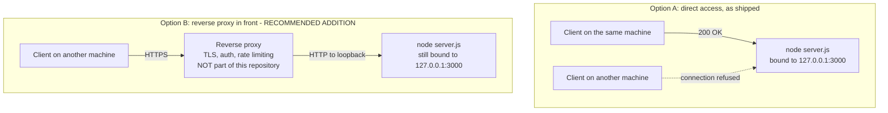

# Deployment

How to run this service somewhere other than a scratch terminal, and what it
lacks before that is a good idea. This page owns the **loopback-binding
constraint** for the whole documentation corpus.

Source files this page derives from: `server.js:L3`, `server.js:L12-L14`.

## Deployment model

| Aspect | Reality |
| --- | --- |
| Process model | A single Node.js process, started by `node server.js` |
| Build step | None. The file runs as written |
| Runtime dependencies | None. Only Node's built-in `http` module, at `server.js:L1` |
| Artefact | The repository itself; there is nothing to package |
| Container image | None is provided, and no `Dockerfile` exists |
| CI/CD pipeline | None is provided, and no workflow definitions exist |
| Configuration at deploy time | None. The two constants are compiled in; see [../getting-started/configuration.md](../getting-started/configuration.md) |

## Local deployment

From the repository root:

```bash
node server.js
```

Captured output, exactly one line:

```text
Server running at http://127.0.0.1:3000/
```

That line means the socket is bound and the listener is accepting connections.
`npm start` runs the identical command; both are documented with their captured
output in [../getting-started/installation.md](../getting-started/installation.md).

## The loopback constraint

**The service is unreachable from every machine except the one running it.** The
`hostname` constant at `server.js:L3` is `127.0.0.1`, the IPv4 loopback address,
so the listener accepts connections only over the loopback interface. A request
from another host is refused at the transport layer: it never reaches Node, so
there is no log line, no response, and nothing in the service's behaviour to hint
at the cause.

This is the single most common source of confusion about this service, so it is
worth showing rather than asserting. Verified from the host running the service,
using that host's own non-loopback address:

```bash
curl -i -m 5 http://10.76.7.8:3000/
```

Captured output:

```text
curl: (7) Failed to connect to 10.76.7.8 port 3000 after 0 ms: Could not connect to server
```

The same request to `http://127.0.0.1:3000/` returns `200` with a 14-byte body,
as shown in [../api/http-api.md](../api/http-api.md). The difference is entirely
the bind address.

### Changing reachability

Two options exist, and they are not equally good.

**Recommended: front the service with a reverse proxy.** Leave the loopback
binding exactly as it is, run a proxy on the externally reachable interface, and
have it forward to `127.0.0.1:3000`. The service stays unreachable except through
the proxy, and the proxy is the right place for TLS termination, access control,
request logging, and rate limiting — every one of which this service lacks.

**Alternative: change the bind address.** Editing `hostname` at `server.js:L3`
to `0.0.0.0` exposes the listener on every interface the host has. That removes
the only access control the service has, so confine it to a network you fully
control, and understand that anything able to route to the host can then reach
the service directly.

### Deployment topology



## Process supervision

The process does not daemonise, does not fork, and does not restart itself. It
runs in the foreground and writes its single banner line to standard output. So:

- Use whatever supervisor the platform already provides — systemd, a container
  restart policy, an init script, or a process manager — so that a crash or a
  reboot does not silently leave the service down.
- Capture standard output wherever your platform collects logs. There is no log
  file, no log rotation, and no structured logging; after the banner, the service
  is silent, including for errors.
- Expect no readiness or liveness endpoint. The catch-all `200` is the only
  signal available, so a supervisor's health check has to use it.

**There is no graceful shutdown.** No `SIGTERM` or `SIGINT` handler is installed
and `server.close()` is never called, so termination is immediate: in-flight
requests are dropped mid-flight and no cleanup runs. A supervisor that expects a
process to drain before exiting will not get that behaviour here.

## Port conflicts

The port is fixed at `3000` by `server.js:L4`. If another process holds it,
`server.listen()` emits an `error` event that nothing handles, and the process
exits:

```text
Error: listen EADDRINUSE: address already in use 127.0.0.1:3000
```

Either free the port or change the constant. The full failure transcript, the
per-platform commands for finding the owning process, and a portable check that
needs nothing but Node are in
[troubleshooting.md](troubleshooting.md).

## Hardening checklist

Everything in this list is **absent**. The list is the checklist you would have
to work through before this service belonged on an untrusted network, and each
item is a deliberate exclusion of the current design rather than an oversight:

| Missing | Consequence |
| --- | --- |
| TLS / HTTPS | Traffic is unencrypted end to end |
| Authentication | Every caller that can connect is served |
| Authorisation | No concept of permissions exists |
| Rate limiting | Request volume is bounded only by the machine |
| Request routing | Every path returns the same body, including paths that look like private APIs |
| Input validation | Nothing is read, so nothing is validated |
| Request logging | Requests leave no trace at all |
| Health endpoint | No dedicated liveness or readiness signal |
| Error-handling middleware | No `4xx` or `5xx` path exists; a listener exception would be unhandled |
| Graceful shutdown | Connections are dropped on termination |
| Security headers | No `Strict-Transport-Security`, `X-Content-Type-Options`, or similar |
| Timeouts and body limits | Node's defaults apply unchanged |

## Advisory: this service is not production-ready

It is a test fixture. It answers one greeting, over plain HTTP, to callers on the
local machine, with no authentication and no logging. Deploying it as a
production service would expose an unauthenticated endpoint with no operational
visibility. Use it as what it is — a fixture for exercising tooling — and if you
need a production HTTP service, treat the hardening checklist above as a
requirements list rather than a set of suggestions.

## See also

- [../../README.md](../../README.md) — the canonical overview, whose Deployment
  guide section this page expands.
- [troubleshooting.md](troubleshooting.md) — symptom-to-remedy matrix, including
  port conflicts and remote unreachability.
- [../getting-started/configuration.md](../getting-started/configuration.md) —
  owner of the two configuration constants.
- [../api/http-api.md](../api/http-api.md) — the contract callers get once they
  can reach the service.
