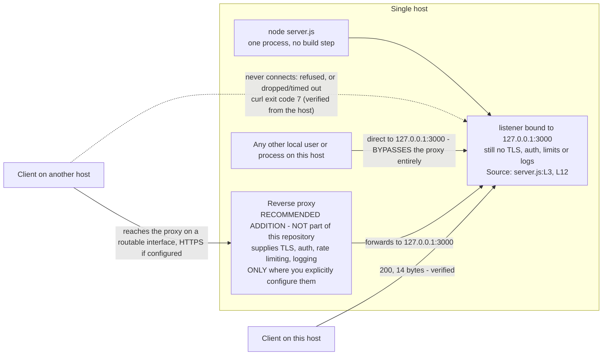

# Deployment guide

How to run this service, why it answers only on the machine running it, and
what it lacks before it belongs anywhere but a scratch terminal. This page owns
the *loopback binding* constraint for the whole documentation corpus, and it
expands the Deployment guide section of the root
[README](../../README.md) rather than replacing it.

Source files this page derives from: `server.js:L1-L14`, the whole module, for
the runtime behaviour — individual claims below cite the narrower range each one
rests on, principally `server.js:L3` for the bind address, `server.js:L4` for
the port, `server.js:L6-L10` for the *request listener* and
`server.js:L12-L14` for the listen call and its banner — and `package.json` for
the `start` script, the engine declaration and the dependency metadata quoted
below.

> **This service is not production-ready. It is a test fixture.** It has no
> TLS, no authentication, no request routing, no error handling and no graceful
> shutdown, and it binds the loopback interface. Every one of those is
> evidenced against the source below rather than asserted. Do not put it on an
> untrusted network: read
> [the advisory at the end of this page](#not-production-ready) before deploying
> it anywhere, and treat the [Hardening checklist](#hardening-checklist) as a
> requirements list rather than as a set of suggestions — it is the work that
> would have to come first.

## The loopback binding constraint

**The service is reachable only from the host that runs it.** The `hostname`
constant is the IPv4 loopback literal `127.0.0.1`, so the listener accepts
connections arriving over the loopback interface and over no other.
`Source: server.js:L3`

A request from another machine does not fail loudly — it does not arrive at
all. The connection is refused beneath Node, so nothing reaches the *request
listener*, nothing is written to the log, and the service emits no signal that
would explain the silence. That combination is the single most likely point of
confusion when deploying this service, so it is shown here rather than
asserted.

### Verified evidence

Both requests below were issued from the host running the service, moments
apart, against the same process. The first uses the loopback address; the
second uses that same host's own non-loopback address.

Loopback — succeeds:

```bash
curl --noproxy '*' --include --silent --show-error --max-time 5 http://127.0.0.1:3000/; echo "curl exit code: $?"
```

```text
HTTP/1.1 200 OK
Content-Type: text/plain
Date: Tue, 04 Aug 2026 18:39:52 GMT
Connection: keep-alive
Keep-Alive: timeout=5
Content-Length: 14

Hello, World!
curl exit code: 0
```

`Date` is a per-request volatile value that Node supplies automatically, so it
advances with the clock and will not match the transcript above; it is kept
exactly as captured rather than trimmed away. The response contract itself —
which headers are stable, what the body is, and why the path and the method
make no difference — is owned by [../api/http-api.md](../api/http-api.md).

Non-loopback — fails to connect. Run this from the host running the service,
against **that host's own** non-loopback address — derive the address rather
than copying one out of this page, because probing an address that is not yours
tests somebody else's machine and tells you nothing about your bind.

Derive it, then **validate it before anything uses it**. The block below rejects
an empty derivation, a loopback address, and anything that is not four
dot-separated numeric groups — an IPv6 address or a hostname included — and then
fails closed rather than continuing with a value it could not validate:

```bash
HOSTIP="$(hostname -I | awk '{print $1}')"
case "$HOSTIP" in
  *[!0-9.]* | 127.*) HOSTIP='' ;;
  [0-9]*.[0-9]*.[0-9]*.[0-9]*) ;;
  *) HOSTIP='' ;;
esac
printf '%s\n' "${HOSTIP:?no usable non-loopback IPv4 address; do not run the probes below}"
```

Captured output on the host these transcripts came from, with the address
redacted for the same reason — yours will be a different one, and that is the
point:

```text
<HOSTIP>
```

Captured output on a host with no non-loopback address, produced by running the
identical block where `hostname -I` printed nothing. The message goes to
standard error and the block exits **1**, so a script stops here instead of
probing `http://:3000/`. The `guard.sh: line 7:` prefix is your shell naming the
file and line it was reading, and it will differ from yours:

```text
guard.sh: line 7: HOSTIP: no usable non-loopback IPv4 address; do not run the probes below
```

`${HOSTIP:?…}` is doing the work. `[ -n "$HOSTIP" ] || echo …` would only print
a warning and let every command after it run against an empty address, which is
how a probe ends up reporting a connection failure that says nothing about the
bind. The same expansion is repeated inside each probe below, so a probe cannot
run on a value that failed validation even if it is pasted on its own.

`hostname -I` is Linux-specific, so the derivation differs by platform:

| Platform | Command that prints a non-loopback IPv4 address |
| --- | --- |
| Linux | `hostname -I \| awk '{print $1}'` |
| macOS | `ipconfig getifaddr en0` — substitute your active interface for `en0` |
| Windows PowerShell | `(Get-NetIPAddress -AddressFamily IPv4 \| Where-Object { $_.IPAddress -ne '127.0.0.1' } \| Select-Object -First 1).IPAddress` |
| Any of the three | the `node -e` command below, which needs only Node |

Only the Linux row and the Node command were executed for this page; the macOS
and PowerShell rows are shown without captured output rather than with invented
output. The Node form behaves the same everywhere:

```bash
node -e "const os=require('os');const a=Object.values(os.networkInterfaces()).flat().filter(i=>i.family==='IPv4'&&!i.internal);if(a.length===0){console.error('no non-loopback IPv4 address on this host');process.exit(1);}console.log(a[0].address);"
```

Captured output on the same host, redacted the same way:

```text
<HOSTIP>
```

Now probe it. The address stays quoted so an unexpected value cannot reshape the
command, and it carries the same `:?` guard so the probe refuses to run at all
on a value that failed validation:

```bash
PROBE=$(curl --noproxy '*' --include --silent --show-error --max-time 5 \
  "http://${HOSTIP:?no usable non-loopback IPv4 address}:3000/" 2>&1)
echo "curl exit code: $?"
echo "${PROBE//$HOSTIP/<HOSTIP>}"
```

The redaction is part of the command rather than something done to its output
afterwards: the address `curl` reports is the host's own private address, which
is environment-specific and of no use to a reader, so the last line substitutes
`<HOSTIP>` for it before printing. `$?` is read directly after the assignment, so
it is `curl`'s own exit status. What that command printed, unedited:

```text
curl exit code: 7
curl: (7) Failed to connect to <HOSTIP> port 3000 after 0 ms: Could not connect to server
```

**Exit code 7 is `curl`'s failed-to-connect status**, and it is the entire
finding: no status line, no header and no body, because no connection was ever
established. Same process, same port, same moment — only the address differs,
and `Source: server.js:L3` is the reason it differs.

Captured output of the same line with `HOSTIP` empty. `curl` is never executed:
the shell fails the expansion first and exits non-zero, so an unvalidated
address cannot produce a transcript that looks like a probe result. The prefix
before the message is your shell's and varies with how the line was run:

```text
bash: line 1: HOSTIP: no usable non-loopback IPv4 address
```

`curl` exited 7. Two of those flags are load-bearing rather than cosmetic.
`--noproxy '*'` stops `curl` honouring `http_proxy`, `https_proxy` and
`all_proxy` from the environment. Without it, a machine with a proxy configured
sends the request to the proxy instead of to your host, and what comes back is
the *proxy's* verdict — frequently a `403` or a `502`. That looks like a reply
from the service and is not one. `--max-time 5` bounds a probe that would
otherwise hang wherever the address is filtered rather than refused. The
loopback transcript above was captured from the same process moments earlier
with the same flags, so the difference between the two is entirely the bind
address.

**Expect the outcome to differ with where the client sits.** The capture above
was taken on the host itself, which is why the refusal came back immediately:
nothing is bound to that address, so the kernel answered at once. A genuinely
remote client can just as easily see a **timeout** instead of a refusal, or
nothing at all, because a firewall, a security group or a NAT boundary in
between may drop the packet rather than reject it. All three outcomes have the
same cause and the same remedy; only the symptom differs, and
[troubleshooting.md](troubleshooting.md) is where the symptoms are catalogued.

Where `curl` is not installed, this Node-only probe reports the same thing —
`ECONNREFUSED` for the non-loopback address, and a status code for one that
answers:

```bash
node -e "const http=require('http');const host=process.argv[1];const r=http.get({host,port:3000,path:'/',timeout:5000},res=>{console.log('reached the service:',res.statusCode);res.resume();});r.on('timeout',()=>{console.log('timed out after 5s: no answer from '+host+':3000');r.destroy();});r.on('error',e=>console.log('refused or unreachable:',e.code));" "${HOSTIP:?no usable non-loopback IPv4 address}"
```

Captured output, with the service running and `HOSTIP` validated as above:

```text
refused or unreachable: ECONNREFUSED
```

### Changing reachability

Two options exist, and they are not equally good. Neither of them adds a single
control to the service itself: every row of the
[hardening checklist](#hardening-checklist) is still absent afterwards.

**Preferred: front the service with a reverse proxy.** Leave the loopback
binding exactly as it is, run a proxy on the externally reachable interface, and
have it forward to `127.0.0.1:3000`.
[Fronting with a reverse proxy](#fronting-with-a-reverse-proxy) below shows the
topology. Be precise about what that buys, because the obvious summary of it is
wrong:

- **It is a remote-access control, and only that.** The loopback binding keeps
  every *other host* out, so traffic arriving from the network can only reach the
  service through the proxy. That is the whole of the guarantee.
- **Local access bypasses the proxy completely.** Any user or process on the
  host — a shell session, a cron job, a container sharing the host network
  namespace, a compromised unrelated service — can connect straight to
  `127.0.0.1:3000` and be answered. That path is not proxied, so it skips TLS
  termination, whatever authentication the proxy enforces, its rate limits, its
  request size and timeout limits, and its access log: the request is served and
  nothing anywhere records it. **A proxy in front therefore does not make the
  service reachable "only through the proxy".** It restricts *remote* callers
  and leaves local callers unmediated (CWE-284).
- **So decide explicitly who has local access.** Every account and every process
  on that host is effectively fully authorised against this service. If that is
  not acceptable, isolation has to come from somewhere else — a dedicated host or
  VM, a network namespace the proxy alone can enter, or at minimum a host where
  no untrusted workload runs.
- **A proxy supplies nothing until it is configured to.** TLS, authentication,
  authorisation, rate limits, request-body limits, timeouts and access logging
  are each things you have to turn on and get right; an unconfigured proxy simply
  forwards, and then adds a network path without adding a control. This
  repository ships no proxy configuration and adding one is outside its scope, so
  whatever you deploy is yours to configure, review and keep patched.
- **Sanitise forwarded headers at ingress.** Today the *request listener* reads
  nothing from the request at all, so `X-Forwarded-For`, `X-Forwarded-Proto` and
  `X-Forwarded-Host` cannot influence anything. `Source: server.js:L6-L10` If
  code is ever added that reads them, the proxy must **overwrite** those headers
  rather than append to them, because a client can send them itself and would
  otherwise choose the values your logs and your logic believe.

**Alternative: change the bind address.** Editing `hostname` at `server.js:L3`
to `0.0.0.0` exposes the listener on every interface the host has. That removes
the only access control the service has, so anything able to route to the host
can then reach it directly, unauthenticated and unlogged. Treat this as the
option of last resort, and put all of the following in place **before** the bind
changes — not afterwards:

| Before binding beyond loopback | Why |
| --- | --- |
| Restrict reachability at the network layer — host firewall, security group, or ACL allowing only known sources | The service refuses nothing itself, so this becomes the only access control that exists |
| Terminate TLS in front of it | The listener speaks plain HTTP, so without this every request and response is on the wire in clear text |
| Require authentication in front of it | Otherwise every caller that can route to the host is anonymous and authorised |
| Run it as a dedicated unprivileged account | Limits what a fault in the runtime or a compromise of the process can reach — see [Process supervision](#process-supervision) |
| Log requests somewhere outside the service | The process records nothing after its banner, so absent this there is no audit trail at all |
| Set connection and read timeouts, and a request-body limit | Nothing in the module bounds a slow or oversized request |
| Confirm the runtime is a maintained Node.js line | An end-of-life runtime is unpatched; [../getting-started/installation.md](../getting-started/installation.md) owns that requirement |

Work through the [hardening checklist](#hardening-checklist) as well. Every
control in it is absent from this service whichever of the two options you pick,
and no proxy configuration or firewall rule changes that.

The option matrix for both constants, and the edit-and-restart procedure they
require, are owned by
[../getting-started/configuration.md](../getting-started/configuration.md).

## Deployment model

| Aspect | Reality | Evidence |
| --- | --- | --- |
| Process model | A single Node.js process, started by `node server.js` — or by `npm start`, which the manifest defines as exactly that command | `Source: server.js:L12`, `Source: package.json` (`scripts.start`) |
| Supported runtime | Node.js `>=18`, declared as `engines.node`. The baseline is owned by [../getting-started/installation.md](../getting-started/installation.md) | `Source: package.json` (`engines`) |
| Build step | None. Nothing is compiled, bundled or transpiled; the file runs exactly as written | `package.json` declares no build script |
| Runtime dependencies | None. Only Node's built-in `http` module, which ships with the runtime | `Source: server.js:L1` |
| Artefact | The repository itself. There is nothing to package or publish | `package.json` declares no `dependencies` at all |
| Container image | None. No `Dockerfile`, `Containerfile` or compose file exists | Each probed individually; all absent |
| Process manifest | None. No `Procfile` exists | Probed; absent |
| CI/CD pipeline | None. No `.github/`, `.gitlab-ci.yml`, `.travis.yml` or `Jenkinsfile` exists | Each probed individually; all absent |
| Deploy-time configuration | None. Both values are source constants, read once when the module loads | `Source: server.js:L3`, `Source: server.js:L4` |

Deployment is therefore the whole of it: put the repository on a host with a
supported Node.js runtime and start the process. There is no artefact to build,
no image to publish and no pipeline to trigger. The three `devDependencies` the
manifest does declare belong to the documentation toolchain, and the service
loads none of them.

## Local deployment

Run it from the repository root:

```bash
node server.js
```

```text
Server running at http://127.0.0.1:3000/
```

Exactly one line, and seeing it means the socket is bound and the listener is
accepting connections. It is emitted by the *startup callback*, which Node
invokes once the bind succeeds, and its text is interpolated from the
`hostname` and `port` constants rather than written out literally — so the
address in the banner is always the address actually bound.
`Source: server.js:L12-L14`, `Source: server.js:L13`

`npm start` is the same command by another route, because `package.json`
declares `scripts.start` as `node server.js`:

```bash
npm start
```

```text

> hello_world@1.0.0 start
> node server.js

Server running at http://127.0.0.1:3000/
```

The two extra lines are npm echoing the script before it runs; the banner
underneath is identical because the process underneath is identical.

Both forms run in the **foreground** and hold the terminal, so the prompt does
not return until the process stops. The runtime this needs — the declared floor
and the version every transcript on this page was captured against — is owned
by [../getting-started/installation.md](../getting-started/installation.md).

## Fronting with a reverse proxy

This is the recommended way to reach the service from anywhere but its own
host, and it is recommended precisely because it changes nothing about the
service. The proxy listens on a routable interface, terminates the external
connection there, and forwards each request to `127.0.0.1:3000`. The listener
keeps its *loopback binding* and stays unmodified, the proxy becomes the only
path in, and the proxy is where the capabilities this service has none of —
TLS, authentication, rate limiting, request logging — are actually implemented.

**No proxy exists in this repository.** No proxy configuration file is created
by this documentation change, none is committed, and none is deployed. The
proxy in the diagram below is a recommended addition, drawn only to show where
it would sit if someone added one.



Reading the diagram: the solid edge from the local client is the verified
working path, the dotted edge is the verified failure — `curl` exit code 7,
captured above — and the two edges through the proxy are the arrangement this
section recommends rather than anything the repository ships. The proxy node
carries its label for exactly that reason: it is a recommended addition and not
part of the current system. The remaining edge is the one that is easiest to
forget: any other local user or process reaches the listener directly and
bypasses the proxy entirely, so nothing the proxy enforces applies to it.

## Process supervision

The process does not daemonise, does not fork and does not restart itself. It
runs in the foreground, writes one line to standard output, and is then silent
for the rest of its life. Supervision is therefore entirely external — and
external in a specific sense worth stating plainly: **nothing in this
repository supervises anything.** No `Procfile`, no service unit, no container
manifest and no restart policy is added by this documentation change, and each
was probed for and found absent.

- Use whatever supervisor the platform already provides — systemd, a container
  restart policy, an init script, or a process manager — so that a crash or a
  reboot does not silently leave the service down.
- Capture **both** standard output and standard error wherever your platform
  collects logs. See [What does and does not get logged](#what-does-and-does-not-get-logged)
  below for what each stream carries.
- Expect no dedicated readiness or liveness endpoint. See
  [Health checking without a health endpoint](#health-checking-without-a-health-endpoint).

What a deployer could adopt, all of it outside this repository:

- A system service manager, so the process starts at boot and is restarted if
  it exits.
- A process supervisor or manager, for the same reason plus log capture.
- A terminal multiplexer, which is enough for a demonstration but survives
  neither a reboot nor a crash.

Whichever is chosen, two properties of the process constrain it. Standard
output is the only log stream that exists — no log file, no rotation and no
request logging — so whatever collects logs has to collect stdout. The banner is
the module's only write to standard output `Source: server.js:L13`, and no other
write exists anywhere in the file `Source: server.js:L1-L14`, so no request is
logged and no second **application** line is ever produced. That is not the same
as the process being silent whatever happens: an unhandled error at the process
level still writes to **standard error** and terminates the process, which is
exactly what a port conflict does. Capture stderr as well as stdout, or the one
message that explains a crash is the one you will not have. And there is no
readiness or liveness endpoint to probe, which the
[Hardening checklist](#hardening-checklist) covers.

### What does and does not get logged

The module implements **no application logging**: no request logging, no
structured logging, no log file, and no log rotation. Its entire logging
behaviour is one `console.log` in the *startup callback*, which writes a single
line to stdout when the bind succeeds and is never written again.
`Source: server.js:L13`

That is not the same as the process being silent, and the distinction matters
when you decide which streams to capture:

| Stream | What it carries |
| --- | --- |
| stdout | Exactly one line, the startup banner, and only if the bind succeeded — `Source: server.js:L13` |
| stderr | Nothing from this module, but Node's own fatal diagnostics still land here. A failed bind, for example, produces an unhandled `error` event and Node prints the full stack trace and error object to stderr before the process exits non-zero. The captured trace is in [troubleshooting.md](troubleshooting.md) |

So capture stderr too. Discarding it is how a crash becomes a service that
"just stopped" with no explanation, when the explanation was printed.

What genuinely leaves no trace is **request activity**. No line is written when
a request arrives, is served, or fails, because no code in the module writes
one. `Source: server.js:L6-L10` If you need request logs they have to come from
something in front of the service, and a reverse proxy is the natural place —
it is recommended above for other reasons anyway.

### Health checking without a health endpoint

There is no `/health`, no `/ready`, and no dedicated status route — the module
serves one *catch-all response* and nothing else. `Source: server.js:L6-L10`
That leaves three checks a supervisor can actually use, in increasing order of
strength:

| Check | What it establishes | What it misses |
| --- | --- | --- |
| The process is alive | The `node` process has not exited | Says nothing about whether the socket ever bound. A process can be alive with a failed bind only briefly — the failure is fatal here — but "alive" alone is still the weakest signal |
| A TCP connection to `127.0.0.1:3000` succeeds | Something is listening on the port | Does not establish that the listener is this service, or that it answers HTTP |
| An HTTP `GET` returns `200` with a 14-byte `text/plain` body | The service is answering, and its reply matches the documented contract | This is generic liveness, not readiness: the module has no dependency to be ready for, and a matching reply is not proof of process identity, since anything could serve the same bytes |

Use the HTTP check if you want one signal, because it is the strongest of the
three — but choose it knowingly rather than because it is the only option. The
commands for all three, and their exact captured output, are in
[troubleshooting.md](troubleshooting.md).

### Run it as an unprivileged user

**This service needs no privilege at all, so do not give it any.** Port 3000 is
above 1024, so binding it requires no elevated capability on any supported
platform; the process reads no protected path, writes no file, and loads no
native module. Every requirement it has is satisfied by an ordinary account that
can read the repository directory and execute `node`.

Configure your supervisor accordingly: a dedicated service account that owns
nothing else, `User=` in a systemd unit, or a non-root `USER` in a container
image. Run it under a personal login for local development if you like, but
never as `root` — a root-owned process turns any fault in the runtime into a
host-level problem, and it has no compensating benefit here (CWE-250).

Some transcripts elsewhere in this documentation show `USER root` in `lsof` and
`ps` output. That reflects the container these pages were captured in, and it is
neither a requirement nor a recommendation:
[troubleshooting.md](troubleshooting.md) repeats the point where those captures
appear. If `ps` shows `root` against your own deployment, treat it as something
to change rather than as confirmation that you match the documentation.

### The absence of graceful shutdown

`Ctrl+C` in the foreground terminal stops it, and that is an **immediate
termination rather than a drain**. The module registers no `SIGINT` and no
`SIGTERM` handler and never calls `server.close()`: `server.listen` is handed a
*startup callback* and nothing else, and no shutdown path exists anywhere in
the file. `Source: server.js:L12-L14`

The consequences are concrete. A request in flight when the signal arrives is
dropped rather than allowed to finish, no cleanup runs, and a supervisor that
expects a process to stop accepting connections and drain before exiting will
not get that behaviour here. Nothing needs undoing afterwards, though: the
process holds no lock file and writes no state, and the port is released as it
exits.

## Port conflicts at deploy time

The port is the source constant `3000`, so every instance tries to bind the
same port and two instances cannot coexist on one host.
`Source: server.js:L4`

**A bind collision is fatal.** No `'error'` listener is registered on the
server, so a failed bind surfaces as an unhandled `error` event: the process
crashes at startup and exits non-zero, without retrying, without falling back
to another port, and without ever printing the banner.
`Source: server.js:L12` The missing banner is the signal — if that first line
never appears, the service is not listening, whatever else the terminal shows.

Two remediations exist at deployment level:

- Free the port, by stopping whatever holds it.
- Change the `port` constant and restart, following
  [../getting-started/configuration.md](../getting-started/configuration.md).
  The banner reports whichever port is actually in force, so the restart
  confirms the change immediately.

The verbatim crash transcript, the per-platform commands for identifying the
process holding the port, and a portable check needing nothing but Node are
owned by [troubleshooting.md](troubleshooting.md) and are deliberately not
repeated here.

## Hardening checklist

Everything in this table is **absent**, and the table is the work that would
have to be done before this service belonged on an untrusted network. Each
"No" is evidenced against the source rather than assumed.

| Capability | Present? | Evidence |
| --- | --- | --- |
| TLS / HTTPS | No | The server is a plain `http.Server`; the module requires only core `http`, never `https` or `tls`. `Source: server.js:L1`, `Source: server.js:L6` |
| Authentication | No | The *request listener* never reads `req`, so no credential, header or token is ever examined. `Source: server.js:L6-L10` |
| Authorization | No | No identity is established and the handler contains no conditional logic, so there is nothing to authorise against. `Source: server.js:L6-L10` |
| Rate limiting | No | No counter, timer or connection accounting exists; every request is answered immediately. `Source: server.js:L6-L10` |
| Request routing | No | `req.url` and `req.method` are never read, so every request that reaches the *request listener* receives the same *catch-all response*, including on paths that look like private APIs. The exact contract, and the requests Node answers before the listener, are owned by [../api/http-api.md](../api/http-api.md). `Source: server.js:L6-L10` |
| Input validation | No | Nothing is read from the request, so nothing is validated. `Source: server.js:L6-L10` |
| Structured logging | No | The only output the process ever writes is the single `console.log` startup banner. No request is logged, in any format. `Source: server.js:L13` |
| Health-check endpoint | No | No path is distinguished from any other, so no dedicated liveness or readiness route exists. `Source: server.js:L6-L10` |
| Error-handling middleware | No | There is no `try`/`catch`, no **application-defined** `4xx` or `5xx` branch, and no `'error'` listener on the server, so a listener exception would be unhandled. Node still generates its own protocol errors — a malformed request gets `400`, an oversized header block `431`, an unsupported `Expect` header `417` — which no code here chooses or can suppress; see [Error responses](../api/http-api.md#no-application-defined-error-responses). `Source: server.js:L6-L10`, `Source: server.js:L12` |
| Graceful shutdown | No | No `SIGINT` or `SIGTERM` handler and no `server.close()` call exists anywhere in the module, so connections are dropped on termination. `Source: server.js:L12-L14` |
| Security headers | No | Nothing sets `Strict-Transport-Security`, `X-Content-Type-Options` or any similar hardening header; the only header the module sets is `Content-Type`. `Source: server.js:L8` |
| Timeouts and body limits | No | The module configures neither, so Node's defaults apply unchanged and nothing bounds a slow or oversized request. `Source: server.js:L1-L14` |

Two of those rows combine into a consequence worth spelling out, because it
defeats the obvious workaround. Since every path returns `200`, an HTTP health
probe cannot distinguish a healthy service from any other condition: it proves
only that *a* process is listening on the port. It cannot establish that the
process is this service, and there is no degraded state it could ever report,
because no code path produces one.

Each of these is a **deliberate exclusion of the current design** rather than
an oversight, and the technical specification corroborates every one of them
as such in its out-of-scope inventory (§1.3.2).
**This page describes their absence; it does not remedy it.** Adding any of
them would be feature work, which this documentation change deliberately does
not do.

## Not production ready

Stated plainly, and for the second time on purpose: **this service is not
production-ready, and it is not intended to be.**

The reasons are the ones evidenced above rather than a matter of taste. It
serves one hardcoded greeting over unencrypted HTTP to anyone who can connect,
with no authentication, no authorisation, no rate limiting, no routing, no
request logging, no health endpoint, no error handling and no graceful
shutdown. Deploying it as a real service would place an unauthenticated
endpoint with effectively no operational visibility on a network: you would
learn that it started, you would see Node's stack trace if it died, and you
would learn nothing whatsoever about the traffic in between. The only reason
that is not already dangerous is the *loopback binding* — which is precisely the
constraint a careless deployment removes first.

It is a **test fixture**: a minimal, deterministic HTTP service for exercising
tooling. Used as that, it is exactly right and nothing here needs fixing. If
what you need is a production HTTP service, read the
[Hardening checklist](#hardening-checklist) above as a requirements list rather
than as a set of suggestions.

## See also

- [../../README.md](../../README.md) — the canonical project overview, whose
  Deployment guide section this page expands.
- [../README.md](../README.md) — the documentation index, the glossary of the
  four fixed terms, and which page owns which fact.
- [../getting-started/installation.md](../getting-started/installation.md) —
  owner of the runtime baseline, and of the run, verify and stop commands.
- [../getting-started/configuration.md](../getting-started/configuration.md) —
  owner of the `hostname` and `port` option matrix and the change procedure.
- [../api/http-api.md](../api/http-api.md) — owner of the HTTP response
  contract that callers get once they can reach the service.
- [troubleshooting.md](troubleshooting.md) — owner of the `EADDRINUSE`
  transcript, the per-platform port commands, and the symptom matrix.
- [../architecture/overview.md](../architecture/overview.md) — the component
  model, startup flow and lifecycle states behind this runbook.
