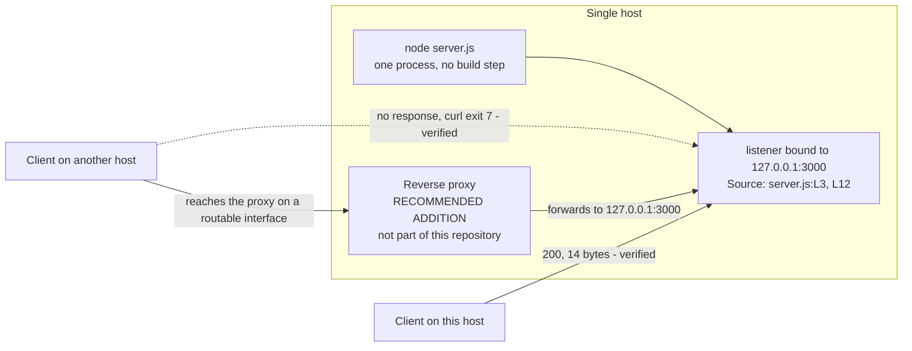

# Deployment guide

How to run this service, why it answers only on the machine running it, and
what it lacks before it belongs anywhere but a scratch terminal. This page owns
the *loopback binding* constraint for the whole documentation corpus, and it
expands the Deployment guide section of the root
[README](../../README.md) rather than replacing it.

Source files this page derives from: `server.js`, `package.json`.

> **This service is not production-ready. It is a test fixture.** It has no
> TLS, no authentication, no request routing, no error handling and no graceful
> shutdown, and it binds the loopback interface. Every one of those is
> evidenced against the source below rather than asserted. Do not put it on an
> untrusted network: the [Hardening checklist](#hardening-checklist) is the
> work that would have to come first.

## The loopback binding constraint

**The service is reachable only from the host that runs it.** The `hostname`
constant is the IPv4 loopback literal `127.0.0.1`, so the listener accepts
connections arriving over the loopback interface and over no other.
`Source: server.js:L3`

A request from another machine does not fail loudly — it does not arrive at
all. The connection is refused beneath Node, so nothing reaches the *request
listener*, nothing is written to the log, and the service emits no signal that
would explain the silence. That combination is the single most likely point of
confusion when deploying this service, so it is shown here rather than
asserted.

### Verified evidence

Both requests below were issued from the host running the service, moments
apart, against the same process. The first uses the loopback address; the
second uses that same host's own non-loopback address.

Loopback — succeeds:

```bash
curl -sS -i http://127.0.0.1:3000/; echo "curl exit code: $?"
```

```text
HTTP/1.1 200 OK
Content-Type: text/plain
Date: Tue, 04 Aug 2026 18:39:52 GMT
Connection: keep-alive
Keep-Alive: timeout=5
Content-Length: 14

Hello, World!
curl exit code: 0
```

`Date` is a per-request volatile value that Node supplies automatically, so it
advances with the clock and will not match the transcript above; it is kept
exactly as captured rather than trimmed away. The response contract itself —
which headers are stable, what the body is, and why the path and the method
make no difference — is owned by [../api/http-api.md](../api/http-api.md).

Non-loopback — fails to connect:

```bash
HOSTIP=$(hostname -I | awk '{print $1}')
curl -sS -i --max-time 5 "http://$HOSTIP:3000/"; echo "curl exit code: $?"
```

```text
curl: (7) Failed to connect to 10.76.7.8 port 3000 after 0 ms: Could not connect to server
curl exit code: 7
```

`10.76.7.8` is the address `hostname -I` resolved on the verification host;
yours will differ. **Exit code 7 is `curl`'s failed-to-connect status**, and it
is the entire finding: no status line, no header and no body, because no
connection was ever established. Same process, same port, same moment — only
the address differs, and `Source: server.js:L3` is the reason it differs.

### Changing reachability

Two options exist, and they are not equally good.

**Recommended — front the process with a reverse proxy.** Leave the binding
exactly as it is, run a proxy on a routable interface, and have it forward to
`127.0.0.1:3000`. The service stays loopback-bound and unchanged, the proxy
becomes the only route in, and the proxy is where TLS termination, access
control, request logging and rate limiting belong — every one of which this
service lacks. [Fronting with a reverse proxy](#fronting-with-a-reverse-proxy)
below shows the topology.

**Second choice — widen the bind address.** Editing the `hostname` constant to
a routable address, or to `0.0.0.0` for every interface, makes the listener
reachable from the network. Be clear about what that does: the *loopback
binding* is the only thing currently limiting who can reach this service, and
removing it exposes an unhardened service — no TLS, no authentication, no rate
limiting — to everything that can route to the host. That is why it is the
second choice. If you do widen it, confine the host to a network you fully
control.

The option matrix for both constants, and the edit-and-restart procedure they
require, are owned by
[../getting-started/configuration.md](../getting-started/configuration.md).

## Deployment model

| Aspect | Reality | Evidence |
| --- | --- | --- |
| Process model | A single Node.js process, started directly by the runtime | `Source: server.js:L12` |
| Build step | None. Nothing is compiled, bundled or transpiled; the file runs exactly as written | `package.json` declares no build script |
| Runtime dependencies | None. Only Node's built-in `http` module, which ships with the runtime | `Source: server.js:L1` |
| Artefact | The repository itself. There is nothing to package or publish | `package.json` declares no `dependencies` at all |
| Container image | None. No `Dockerfile`, `Containerfile` or compose file exists | Each probed individually; all absent |
| Process manifest | None. No `Procfile` exists | Probed; absent |
| CI/CD pipeline | None. No `.github/`, `.gitlab-ci.yml`, `.travis.yml` or `Jenkinsfile` exists | Each probed individually; all absent |
| Deploy-time configuration | None. Both values are source constants, read once when the module loads | `Source: server.js:L3`, `Source: server.js:L4` |

Deployment is therefore the whole of it: put the repository on a host with a
supported Node.js runtime and start the process. There is no artefact to build,
no image to publish and no pipeline to trigger. The three `devDependencies` the
manifest does declare belong to the documentation toolchain, and the service
loads none of them.

## Local deployment

Run it from the repository root:

```bash
node server.js
```

```text
Server running at http://127.0.0.1:3000/
```

Exactly one line, and seeing it means the socket is bound and the listener is
accepting connections. It is emitted by the *startup callback*, which Node
invokes once the bind succeeds, and its text is interpolated from the
`hostname` and `port` constants rather than written out literally — so the
address in the banner is always the address actually bound.
`Source: server.js:L12-L14`, `Source: server.js:L13`

`npm start` is the same command by another route, because `package.json`
declares `scripts.start` as `node server.js`:

```bash
npm start
```

```text

> hello_world@1.0.0 start
> node server.js

Server running at http://127.0.0.1:3000/
```

The two extra lines are npm echoing the script before it runs; the banner
underneath is identical because the process underneath is identical.

Both forms run in the **foreground** and hold the terminal, so the prompt does
not return until the process stops. The runtime this needs — the declared floor
and the version every transcript on this page was captured against — is owned
by [../getting-started/installation.md](../getting-started/installation.md).

## Fronting with a reverse proxy

This is the recommended way to reach the service from anywhere but its own
host, and it is recommended precisely because it changes nothing about the
service. The proxy listens on a routable interface, terminates the external
connection there, and forwards each request to `127.0.0.1:3000`. The listener
keeps its *loopback binding* and stays unmodified, the proxy becomes the only
path in, and the proxy is where the capabilities this service has none of —
TLS, authentication, rate limiting, request logging — are actually implemented.

**No proxy exists in this repository.** No proxy configuration file is created
by this documentation change, none is committed, and none is deployed. The
proxy in the diagram below is a recommended addition, drawn only to show where
it would sit if someone added one.



Reading the diagram: the solid edge from the local client is the verified
working path, the dotted edge is the verified failure — `curl` exit code 7,
captured above — and the two edges through the proxy are the arrangement this
section recommends rather than anything the repository ships. The proxy node
carries its label for exactly that reason: it is a recommended addition and not
part of the current system.

## Process supervision

The process does not daemonise, does not fork and does not restart itself. It
runs in the foreground, writes one line to standard output, and is then silent
for the rest of its life. Supervision is therefore entirely external — and
external in a specific sense worth stating plainly: **nothing in this
repository supervises anything.** No `Procfile`, no service unit, no container
manifest and no restart policy is added by this documentation change, and each
was probed for and found absent.

What a deployer could adopt, all of it outside this repository:

- A system service manager, so the process starts at boot and is restarted if
  it exits.
- A process supervisor or manager, for the same reason plus log capture.
- A terminal multiplexer, which is enough for a demonstration but survives
  neither a reboot nor a crash.

Whichever is chosen, two properties of the process constrain it. Standard
output is the only log stream that exists — no log file, no rotation and no
request logging — so whatever collects logs has to collect stdout.
`Source: server.js:L13` And there is no readiness or liveness endpoint to
probe, which the [Hardening checklist](#hardening-checklist) covers.

### The absence of graceful shutdown

`Ctrl+C` in the foreground terminal stops it, and that is an **immediate
termination rather than a drain**. The module registers no `SIGINT` and no
`SIGTERM` handler and never calls `server.close()`: `server.listen` is handed a
*startup callback* and nothing else, and no shutdown path exists anywhere in
the file. `Source: server.js:L12-L14`

The consequences are concrete. A request in flight when the signal arrives is
dropped rather than allowed to finish, no cleanup runs, and a supervisor that
expects a process to stop accepting connections and drain before exiting will
not get that behaviour here. Nothing needs undoing afterwards, though: the
process holds no lock file and writes no state, and the port is released as it
exits.

## Port conflicts at deploy time

The port is the source constant `3000`, so every instance tries to bind the
same port and two instances cannot coexist on one host.
`Source: server.js:L4`

**A bind collision is fatal.** No `'error'` listener is registered on the
server, so a failed bind surfaces as an unhandled `error` event: the process
crashes at startup and exits non-zero, without retrying, without falling back
to another port, and without ever printing the banner.
`Source: server.js:L12` The missing banner is the signal — if that first line
never appears, the service is not listening, whatever else the terminal shows.

Two remediations exist at deployment level:

- Free the port, by stopping whatever holds it.
- Change the `port` constant and restart, following
  [../getting-started/configuration.md](../getting-started/configuration.md).
  The banner reports whichever port is actually in force, so the restart
  confirms the change immediately.

The verbatim crash transcript, the per-platform commands for identifying the
process holding the port, and a portable check needing nothing but Node are
owned by [troubleshooting.md](troubleshooting.md) and are deliberately not
repeated here.

## Hardening checklist

Everything in this table is **absent**, and the table is the work that would
have to be done before this service belonged on an untrusted network. Each
"No" is evidenced against the source rather than assumed.

| Capability | Present? | Evidence |
| --- | --- | --- |
| TLS / HTTPS | No | The server is a plain `http.Server`; the module requires only core `http`, never `https` or `tls`. `Source: server.js:L1`, `Source: server.js:L6` |
| Authentication | No | The *request listener* never reads `req`, so no credential, header or token is ever examined. `Source: server.js:L6-L10` |
| Authorization | No | No identity is established and the handler contains no conditional logic, so there is nothing to authorise against. `Source: server.js:L6-L10` |
| Rate limiting | No | No counter, timer or connection accounting exists; every request is answered immediately. `Source: server.js:L6-L10` |
| Request routing | No | `req.url` and `req.method` are never read, so every path and every method receives the same *catch-all response*. `Source: server.js:L6-L10` |
| Structured logging | No | The only output the process ever writes is the single `console.log` startup banner. No request is logged, in any format. `Source: server.js:L13` |
| Health-check endpoint | No | No path is distinguished from any other, so no dedicated liveness or readiness route exists. `Source: server.js:L6-L10` |
| Error-handling middleware | No | There is no `try`/`catch`, no `4xx` or `5xx` branch, and no `'error'` listener on the server. `Source: server.js:L6-L10`, `Source: server.js:L12` |
| Graceful shutdown | No | No `SIGINT` or `SIGTERM` handler and no `server.close()` call exists anywhere in the module. `Source: server.js:L12-L14` |

Two of those rows combine into a consequence worth spelling out, because it
defeats the obvious workaround. Since every path returns `200`, an HTTP health
probe cannot distinguish a healthy service from any other condition: it proves
only that *a* process is listening on the port. It cannot establish that the
process is this service, and there is no degraded state it could ever report,
because no code path produces one.

Each of these is a **deliberate exclusion of the current design** rather than
an oversight, and the technical specification corroborates every one of them
as such in its out-of-scope inventory (§1.3.2).
**This page describes their absence; it does not remedy it.** Adding any of
them would be feature work, which this documentation change deliberately does
not do.

## Not production ready

Stated plainly, and for the second time on purpose: **this service is not
production-ready, and it is not intended to be.**

The reasons are the ones evidenced above rather than a matter of taste. It
serves one hardcoded greeting over unencrypted HTTP to anyone who can connect,
with no authentication, no authorisation, no rate limiting, no routing, no
request logging, no health endpoint, no error handling and no graceful
shutdown. Deploying it as a real service would place an unauthenticated
endpoint with no operational visibility on a network, and the only reason that
is not already dangerous is the *loopback binding* — which is precisely the
constraint a careless deployment removes first.

It is a **test fixture**: a minimal, deterministic HTTP service for exercising
tooling. Used as that, it is exactly right and nothing here needs fixing. If
what you need is a production HTTP service, read the
[Hardening checklist](#hardening-checklist) above as a requirements list rather
than as a set of suggestions.

## See also

- [../../README.md](../../README.md) — the canonical project overview, whose
  Deployment guide section this page expands.
- [../README.md](../README.md) — the documentation index, the glossary of the
  four fixed terms, and which page owns which fact.
- [../getting-started/installation.md](../getting-started/installation.md) —
  owner of the runtime baseline, and of the run, verify and stop commands.
- [../getting-started/configuration.md](../getting-started/configuration.md) —
  owner of the `hostname` and `port` option matrix and the change procedure.
- [../api/http-api.md](../api/http-api.md) — owner of the HTTP response
  contract that callers get once they can reach the service.
- [troubleshooting.md](troubleshooting.md) — owner of the `EADDRINUSE`
  transcript, the per-platform port commands, and the symptom matrix.
- [../architecture/overview.md](../architecture/overview.md) — the component
  model, startup flow and lifecycle states behind this runbook.
