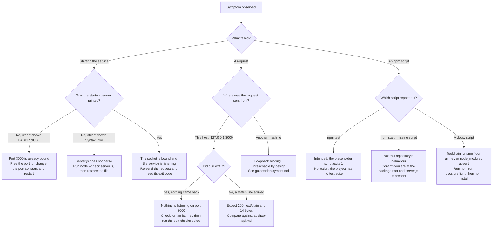

# Troubleshooting

The failures this service and its documentation tooling produce most often, what
causes each one, and what to do about it. This is a guide to the common symptoms
rather than an exhaustive catalogue of everything that could go wrong, and
several of its entries are **intended behaviour** rather than defects — each of
those is marked as such where it appears.

Source files this page derives from: `server.js`, `package.json`.

This page expands the Troubleshooting section of the root
[README](../../README.md) rather than replacing it, and it owns the verbatim
crash transcript, the per-platform port commands and the symptom matrix for
the whole documentation corpus. Every transcript below was captured by running
the command shown above it, on Node.js `v22.23.2` with npm `11.18.0`. Where a
command could not be executed on the verification platform it is shown
**without output** rather than with invented output, and the platform it
targets is named.

## How to use this page

Two entry points lead into the same material, and which one to use depends on
what you already know:

- **Start with the symptom matrix** if you have an error message or an observable
  behaviour in front of you. It is an index rather than an explanation: one row
  per symptom, each naming the cause in a phrase and linking to the section that
  carries the captured evidence and the remedy.
- **Start with the decision tree** if the failure is vague, or if you are not
  sure which symptom you have. It branches only on facts you can observe without
  instrumenting anything — did the process start, what does the trace say, and
  where is the failing request coming from — and every branch ends in a concrete
  remedy or in the page that owns it.

Rows marked **Intended** are working as designed: the remedy is to stop treating
them as failures, not to change anything.

Start from what you can actually observe: whether the process printed its
startup banner, where the failing request was sent from, and which command
reported the error. The tree below routes those observations to a remediation;
the [Symptom matrix](#symptom-matrix) is the same routing in table form, and
each row links to the section that carries the evidence.



## Symptom matrix

Each cell is deliberately one line. The evidence, the verbatim transcripts and
the per-platform commands are in the sections that follow.

| Symptom | Cause | Remediation | Details |
| --- | --- | --- | --- |
| `Error: listen EADDRINUSE: address already in use 127.0.0.1:3000`, no banner, process exits 1 | Another process already holds TCP port 3000 | Free the port, or change the `port` constant and restart | [EADDRINUSE on start](#eaddrinuse-on-start) |
| Answers on `127.0.0.1` but a request from another machine gets no response at all | The *loopback binding* — the `hostname` constant is `127.0.0.1`. `Source: server.js:L3` | **Expected.** Front the process rather than widening the bind address | [Reachable on this host but not from another machine](#reachable-on-this-host-but-not-from-another-machine) |
| `npm test` prints `Error: no test specified` and exits 1 | The unmodified npm-init placeholder; this project has no test suite | **Intended.** Nothing to do, and nothing to change | [npm test fails](#npm-test-fails) |
| `npm error Missing script: "start"` | **Does not occur in this repository.** It requires either no `server.js` at the package root, or a working directory that is not the package root | Run from the repository root, and confirm `server.js` is present there | [npm start reported as missing](#npm-start-reported-as-missing) |
| An unexpected `SyntaxError` while the process starts | `server.js` does not parse — it has been edited or truncated. It is **not** evidence of an old runtime: the source uses no syntax newer than the `>=18` floor, which is a functional floor and not a statement that Node 18 is still supported | Run `node --check server.js`, then restore the file | [An unexpected SyntaxError on startup](#an-unexpected-syntaxerror-on-startup) |
| `npm warn EBADENGINE` or `npm error code EBADENGINE` | The runtime does not satisfy a declared `engines` range | Compare `node --version` against the declared floor | [Unsupported Node.js version](#unsupported-nodejs-version) |
| **No error at all**, but `node --version` reports 18 or 20 | Those lines satisfy `engines.node` and are end-of-life, so they receive no security patches. Nothing warns you | Move to a maintained LTS line | [Unsupported Node.js version](#unsupported-nodejs-version) |
| `PORT=8080 node server.js` still serves on 3000 | No environment variable is read anywhere | **Intended.** Edit the constant instead | [../getting-started/configuration.md](../getting-started/configuration.md) |
| A `docs:*` script exits 1 before doing anything | Node.js below the `devEngines.runtime` floor of `>=22.12.0` | Upgrade Node.js for documentation work; the service itself still runs on `>=18`, though only a maintained LTS line should be used | [Unsupported Node.js version](#unsupported-nodejs-version) |
| `npm run docs:api` cannot find `jsdoc` | `node_modules` is absent, so the declared devDependency was never installed | Run `npm install` (or `npm ci`) first | [../getting-started/installation.md](../getting-started/installation.md) |
| `npm run docs:md` cannot install its generator | The optional renderer lives in `tools/docs-md`, so the script runs `npm ci` there first; the install needs registry access or a populated npm cache | Restore registry access or supply the locked tarballs through npm's cache. The install is lockfile-pinned, so retrying is deterministic | [npm run docs:md cannot install its generator](#npm-run-docsmd-cannot-install-its-generator) |

## `EADDRINUSE` on start

The port is the source constant `3000`, and nothing overrides it at runtime, so
every instance tries to bind the same port and two instances cannot coexist on
one host. `Source: server.js:L4` The bind itself happens in the `server.listen`
call. `Source: server.js:L12`

Reproduce it by starting a second instance while the first still holds the port.
The second process exits immediately, so this does not block, and the block
cleans up after itself — which matters in a guide you are reading while something
is already wrong. Run it from the repository root:

```bash
(
  work="$(mktemp -d)" || exit 1
  cleanup() {
    if jobs %1 >/dev/null 2>&1; then
      kill %1 2>/dev/null || true
      wait %1 2>/dev/null || true
    fi
    rm -rf -- "$work"
  }
  trap cleanup EXIT
  trap 'exit 129' HUP
  trap 'exit 130' INT
  trap 'exit 143' TERM
  node server.js > "$work/instance-1.log" 2>&1 &
  sleep 1
  if ! grep -q 'Server running at' "$work/instance-1.log"; then
    echo "the first instance never printed its banner, so it is not holding the port:"
    cat -- "$work/instance-1.log"
    wait %1
    echo "first instance exit status: $?"
    exit 1
  fi
  node server.js
  echo "second instance exit code: $?"
  kill %1
  wait %1
  echo "first instance stopped, exit status $?"
)
```

Every line of that is load-bearing, and four of them are there for safety rather
than for the demonstration:

| Line | Why it is written that way |
| --- | --- |
| `work="$(mktemp -d)"` | A **fresh, unguessable** directory, created with owner-only permissions (`rwx------`). A fixed path such as `/tmp/instance-1.log` would be *truncated* by the redirect, so an existing file of that name — yours or another user's — is destroyed rather than appended to; and on a shared `/tmp` that name could already be a symlink, in which case the redirect writes through it to whatever it points at. Both were reproduced while writing this page (CWE-377, CWE-59) |
| `cleanup`, the `EXIT` trap and the three signal traps | `EXIT` always runs the cleanup, including after the early `grep` branch. The signal traps convert `HUP`, `INT` and `TERM` to exits with their conventional `128 + signal` statuses, so `EXIT` also stops and reaps the child on interruption instead of merely deleting its log. A `rm` on the last line would run only when everything before it succeeded. `rm -rf` is safe here precisely because the path was just created by `mktemp` and is not a name anyone can predict |
| `kill %1` and `wait %1` | `%1` is the shell's **job spec** for the child this block started, not a number that happens to identify it. The `( … )` subshell has its own, initially empty, job table, so `%1` cannot resolve to a job that already existed in your interactive shell, and bash resolves it against a child it has not yet reaped — so it cannot land on an unrelated process that inherited a recycled PID. `wait` then reaps that child and reports its real exit status, which is also what guarantees the port is released before the block returns |
| the `grep`/`wait`/`exit 1` branch | The one case where a naive version does real damage. If port 3000 was **already** taken before you started, instance 1 dies on the same `EADDRINUSE` you are trying to reproduce, and there is nothing to signal. This branch detects that from the absent banner, shows you instance 1's own log, reaps it, and **signals nothing at all** |

On the happy path — port 3000 free when you start — three things print. The
second `node server.js` writes the trace reproduced below to **stderr**, and two
lines go to **stdout**:

```text
second instance exit code: 1
first instance stopped, exit status 143
```

`143` is `128 + 15`: the first instance was ended by `SIGTERM`, which is the
signal plain `kill` sends. Because the background job belongs to the subshell
rather than to your shell, no `[1]+ Terminated` job-control line appears, and
the output is the same whether you paste the block into an interactive shell or
run it from a script. Both were verified.

If the port was already occupied, the block takes the other branch instead. Its
stdout, captured with an unrelated process holding `127.0.0.1:3000`, is the
sentence above the log, then instance 1's own trace, then its status:

```text
the first instance never printed its banner, so it is not holding the port:
```

```text
first instance exit status: 1
```

That is the honest answer to a question you did not ask: the port is in use, but
by something this block did not start, so the remediation is the discovery
procedure below rather than anything in this block. Note the asymmetry with the
happy path — **here nothing is signalled at all.** A PID captured at spawn is not
special, and it is worth being explicit about that because it is easy to assume
otherwise: once the child has exited and been reaped, the kernel is free to hand
its number to something unrelated, so a version that stored the PID in a variable
and then ran `kill` on it unconditionally could signal a stranger — and this is
exactly the branch on which it would, because instance 1 is already dead. That is
the same PID-reuse hazard that [Clearing it](#clearing-it) works around by hand
(CWE-367), and it is why the block above manages the child by job spec and reaps
it with `wait` instead of trusting a number.

### What is stable, and what is not

Read this before the trace, because only some of what Node prints is worth
matching against. These parts are stable and are what identify the failure:

| Detail | Value |
| --- | --- |
| Error code | `EADDRINUSE` |
| Address and port | `127.0.0.1:3000` — from `Source: server.js:L3` and `Source: server.js:L4` |
| `syscall` | `listen` |
| `errno` | Platform-specific (`-98` on Linux; it differs on macOS and Windows) |
| Exit behaviour | Fatal. The process exits **1** and the startup banner is never printed |

**Nothing the runtime prints against one of its own sources is stable.** Read
that as a class rather than as a list: any line number printed against a
`node:*` source is volatile, whatever the module prefix. In the trace below that
covers the `node:events:NNN` header on the first line, the `node:net` frames,
the `node:internal` frame, the caret column marking where the throw happened,
and the trailing `Node.js vX.Y.Z` line — all of them come from the runtime's own
source, so they change between Node versions and can differ between platforms.
Match on the error code, the address and the port; never on a line number.

### The captured failure

The first process is unaffected — it keeps the port and keeps serving. The
second writes **nothing at all to stdout**, so the startup banner never
appears, and writes this trace to stderr, captured on **Linux x86_64 with Node
v22.23.2** — all twenty lines of it, nothing elided:

```text
node:events:497
      throw er; // Unhandled 'error' event
      ^

Error: listen EADDRINUSE: address already in use 127.0.0.1:3000
    at Server.setupListenHandle [as _listen2] (node:net:1941:16)
    at listenInCluster (node:net:1998:12)
    at node:net:2207:7
    at process.processTicksAndRejections (node:internal/process/task_queues:89:21)
Emitted 'error' event on Server instance at:
    at emitErrorNT (node:net:1977:8)
    at process.processTicksAndRejections (node:internal/process/task_queues:89:21) {
  code: 'EADDRINUSE',
  errno: -98,
  syscall: 'listen',
  address: '127.0.0.1',
  port: 3000
}

Node.js v22.23.2
```

The first four lines are Node's unhandled-`'error'` preamble rather than
anything this module wrote: the runtime source position, the `throw er;`
statement that rethrows the unhandled event, a caret marking the column it was
thrown from, and a blank line. The failure proper begins on the fifth line, at
`Error: listen EADDRINUSE`.

It then exits with status 1, which is what the block above reports on stdout as
`second instance exit code: 1`. The final `{ ... }` block is the error object,
and it is the most useful part: it names the code, the syscall, and the exact
address and port that could not be bound.

The second instance exited with status 1. The `node:events:NNN` header, the
stack-frame line numbers and the trailing version line follow your runtime; the
`code`, `errno`, `syscall`, `address` and `port` fields are the stable part.

The stack trace is unhandled because the module registers no `error` handler on
the server; the `listen()` call at `server.js:L12` fails and the process exits.

Match on `code` rather than on `errno`: `errno` is platform-specific and was
`-98` on the Linux host this was captured on, while `code` is `'EADDRINUSE'`
everywhere.

The missing banner is the signal worth remembering: if the banner line never
appears on stdout, the socket was never bound, whatever else the terminal shows.

### Why the failure is fatal rather than recoverable

No `'error'` listener is registered on the server object anywhere in the
module — the only call ever made on it is `server.listen`.
`Source: server.js:L12` An `'error'` event with no listener is thrown rather
than reported, which is precisely what the second line of the transcript above
records: `throw er; // Unhandled 'error' event`.

So the process dies during startup. It does not retry, it does not fall back to
another port, and it never reaches the *startup callback* that would have
printed the banner. `Source: server.js:L12-L14`

That is why the remediation is to **free the port** rather than to retry: there
is no recovery path inside the process to retry with, and re-running the same
command against the same occupied port reproduces the identical crash.

### Remediation 1 — free the port

Ask a narrow question: **which process holds a listening TCP socket on port
3000?** An unrestricted query answers a wider one. `lsof -i :3000` also matches
established connections to port 3000 and connections whose *remote* port is
3000, so its output can name client processes that have nothing to do with the
conflict — and acting on those PIDs stops unrelated software.

On Linux and macOS, restrict the query to the listening socket:

```bash
lsof -nP -iTCP:3000 -sTCP:LISTEN
```

Captured output while this service was running, started under an unprivileged
account:

```text
COMMAND    PID   USER FD   TYPE  DEVICE SIZE/OFF NODE NAME
node    630171 nobody 21u  IPv4 1479229      0t0  TCP 127.0.0.1:3000 (LISTEN)
```

Read the whole row before acting on it: `COMMAND` should be `node`, `USER`
should be an account you own, and `NAME` should end in
`127.0.0.1:3000 (LISTEN)`. The `PID`, `FD`, `DEVICE` and `NODE` values are
per-process and differ on every run, so match the shape, not the numbers.

`USER` is `nobody` above because **this service needs no privilege**: port 3000
is above 1024, so binding it requires no elevated capability, and the process
reads no protected path and writes no file. Start it under an ordinary account
rather than `root` (CWE-250); [deployment.md](deployment.md) owns that guidance.
If you see `root` against your own service here, that is a property of how it was
started and worth changing, not something this page is recommending.

`ss` is the modern Linux equivalent and takes the same filter:

```bash
ss -ltnp '( sport = :3000 )'
```

Captured output for the same process:

```text
State  Recv-Q Send-Q Local Address:Port Peer Address:PortProcess
LISTEN 0      511        127.0.0.1:3000      0.0.0.0:*    users:(("node",pid=630171,fd=21))
```

On Windows, filter for the listening state explicitly. `netstat -ano` reports
PIDs for active connections as well as listening ones, so the unfiltered form
has the same over-matching problem as `lsof -i :3000`. Both blocks below are
Windows `cmd`, so they are shown as plain text rather than as `bash`:

```text
netstat -ano | findstr "LISTENING" | findstr ":3000"
```

The PID is the last column of the matching row. Assign it, then identify it
before doing anything with it — **replace `4321` with the number `netstat`
printed on your machine**:

```text
set PID=4321
tasklist /FI "PID eq %PID%"
```

Those Windows commands are shown without captured output because this
documentation was verified on Linux; run them on Windows to see yours. The
PowerShell equivalents are `Get-NetTCPConnection -LocalPort 3000 -State Listen`
and `Get-Process -Id $TargetPid`. Name that variable something other than
`$PID`: in PowerShell `$PID` is an automatic variable holding the PID of the
PowerShell session itself, so reusing it aims the commands at your own shell.

None of these tools is guaranteed to be installed — minimal container images
frequently ship without `lsof`, `ss`, and `netstat` alike. This check needs
nothing but Node, and works everywhere the service itself works:

```bash
node -e '
const net = require("net");
const socket = net.connect(3000, "127.0.0.1");
socket.setTimeout(2000);
socket.on("connect", () => {
  console.log("port 3000 on 127.0.0.1: IN USE");
  socket.destroy();
});
socket.on("timeout", () => {
  console.error("port 3000 on 127.0.0.1: INCONCLUSIVE (connect timed out after 2000 ms)");
  socket.destroy();
  process.exitCode = 2;
});
socket.on("error", (err) => {
  if (err.code === "ECONNREFUSED") {
    console.log("port 3000 on 127.0.0.1: FREE (connection refused)");
    return;
  }
  console.error(`port 3000 on 127.0.0.1: INCONCLUSIVE (${err.code || err.message})`);
  process.exitCode = 2;
});
'
```

It is longer than a one-liner for a reason worth stating, because the short
version of this check is actively misleading. **Only `ECONNREFUSED` means the
port is free.** Every other failure — a permission denial, an unreachable route,
a resource limit, a timeout — says nothing about whether the port is bound, so
reporting "free" for any error invites you to act on a conclusion the evidence
does not support. This version therefore inspects `err.code`, reports only
`ECONNREFUSED` as free, sends anything else to **stderr** as `INCONCLUSIVE`, and
sets a non-zero exit code so a script cannot mistake uncertainty for a clean
result. The two-second timeout bounds the wait so it cannot hang.

Three captured runs of that exact command, one per branch. With the service
running it reports the port as in use, on standard output, exiting `0`:

```text
port 3000 on 127.0.0.1: IN USE
```

With nothing listening, `ECONNREFUSED` is reported as free — also on standard
output, also exiting `0`:

```text
port 3000 on 127.0.0.1: FREE (connection refused)
```

The third branch needs a connection that neither completes nor is refused, so
this run was captured with packets to `127.0.0.1:3000` dropped by a local
firewall rule; the command itself was run unmodified. This branch writes to
**standard error** and exits **2**:

```text
port 3000 on 127.0.0.1: INCONCLUSIVE (connect timed out after 2000 ms)
```

So `2` is the code to branch on in a script: `0` means the probe reached a
conclusion and printed it on standard output, and `2` means it did not reach
one at all.

A shorter one-liner makes the same three distinctions when you would rather read
the outcome from the exit code than from the printed line. It keeps everything
that makes the version above trustworthy — it treats only `ECONNREFUSED` as free,
it bounds the wait with the same two-second socket timeout, and it reports
anything else as inconclusive — and it adds a distinct exit status per branch:

```bash
node -e "const s=require('net').connect(3000,'127.0.0.1');s.setTimeout(2000);s.on('connect',()=>{console.log('127.0.0.1:3000 is accepting connections');s.end();process.exit(0);});s.on('timeout',()=>{console.error('127.0.0.1:3000 is not accepting connections: connect timed out after 2000 ms');s.destroy();process.exit(2);});s.on('error',e=>{if(e.code==='ECONNREFUSED'){console.log('127.0.0.1:3000 refused the connection: nothing is listening');process.exit(1);}console.error('127.0.0.1:3000 is not accepting connections: '+e.code);process.exit(2);});"
```

The `setTimeout` call and its `timeout` handler are not decoration. Without them
a connection that is neither accepted nor refused — one dropped by a firewall, or
aimed at an unreachable route — waits on the kernel's own connect timeout, which
on Linux runs to roughly two minutes. That is the opposite of what you want from
a probe you are about to put in a script, so this form bounds the wait itself and
destroys the socket rather than letting it hang.

Three captured runs, one per branch. With the service running:

```text
127.0.0.1:3000 is accepting connections
```

With nothing listening:

```text
127.0.0.1:3000 refused the connection: nothing is listening
```

And with packets to `127.0.0.1:3000` dropped by a local firewall rule, so the
connection can neither complete nor be refused — the command itself was run
unmodified. This branch writes to **standard error** and exits `2`, and it is
the branch the deadline exists for:

```text
127.0.0.1:3000 is not accepting connections: connect timed out after 2000 ms
```

It sets an exit code as well as printing, so it can be used in a script:

| Exit code | Meaning |
| --- | --- |
| `0` | The connection was accepted — something is listening on `127.0.0.1:3000` |
| `1` | `ECONNREFUSED` — nothing is listening, so the port is free |
| `2` | Everything else, which is **not** the same as a free port: the two-second connect deadline expiring, or any other error code. Both go to standard error, with the code or the timeout named so it can be read — for example a filtered port or a permission failure |

The distinction in exit code `2` matters. A probe that reported "free" for every
error would call a filtered or unreachable port free and send you looking for the
wrong problem.

Both forms now reach the same three judgements, then, and what separates them is
how they report. The longer one splits the streams — conclusions on standard
output, uncertainty on standard error — which suits reading by eye; this one gives
every branch its own exit status, which suits reading by script.

### Clearing it

Terminate exactly one process — the one you just identified — and only after
confirming that it is yours and that it is the listener.

**Do not write `kill $(lsof -t -i:3000)`.** That one line contains three
separate hazards: the query is not restricted to a listening socket, so it can
return the PID of an unrelated client; it can return nothing, in which case
`kill` is invoked with no argument and reports a usage error instead of telling
you the port is free; and it can return several PIDs, all of which are
terminated without being shown to you first.

On Linux and macOS, capture the PID once so the value you inspect is the value
you act on:

```bash
PID="$(lsof -nP -iTCP:3000 -sTCP:LISTEN -t)"
```

Deal with the two answers that are not a single PID before going further. An
empty result means nothing is listening, so the port is already free and the
failure has another cause. Several PIDs mean several processes share the socket
— a cluster, or a parent and a child — and stopping one will not free the port:

```bash
[ -n "$PID" ] || echo "nothing is listening on port 3000"
[ "$(printf '%s\n' "$PID" | wc -l)" -eq 1 ] || echo "several PIDs hold port 3000: $PID"
```

Captured output when the port was already free — and after a successful
termination, re-running the portable probe above should report
`FREE (connection refused)`:

```text
nothing is listening on port 3000
```

Then look at the process itself, and continue only if the owner and the command
line are what you expect. Ask for the start time as well as the owner and the
command: those three values together are the process's identity, and you will
need them again after signalling it:

```bash
ps -p "$PID" -o pid,user,lstart,args
```

Captured output for this service, running under an unprivileged account:

```text
    PID USER                      STARTED COMMAND
 630171 nobody   Tue Aug  4 21:52:57 2026 node server.js
```

`USER` is `nobody` in that capture because the service needs no privilege to run:
port 3000 is above 1024, so binding it requires no elevated capability, and the
process reads no protected path and writes no file. **Run it as an ordinary
account rather than as `root`** — a root-owned process turns any fault in the
runtime into a host-level problem and buys nothing here (CWE-250).
[deployment.md](deployment.md) owns that guidance. Whatever account you use, the
value you should expect in this column is one you own; `root` appearing here for
your own service is a reason to change how it is started, not a target to match.

Ask for a clean exit first. Plain `kill` sends `SIGTERM`, which ends *this*
service immediately — it installs no signal handler — while giving any other
program the chance to shut down properly:

```bash
kill "$PID"
```

Then **re-identify the process rather than only asking whether the number is
still alive.** A PID is a reusable label: the process you signalled can exit and
the kernel can hand the same number to something unrelated before your next
command runs, so a liveness test on its own tells you that *a* process exists,
not that it is still *your* process (CWE-367). Compare identities instead:

```bash
sleep 1
ps -p "$PID" -o pid,user,lstart,args
```

Captured output for this service one second after the `SIGTERM`. Only the header
is printed and `ps` exits 1, which means the PID no longer exists — stop here,
because the port is free and that number may already belong to something else:

```text
    PID USER                      STARTED COMMAND
```

If a row is printed instead, compare `USER`, `STARTED` and `COMMAND` against the
row you captured before signalling. All three matching means it is the same
process, still running. A different owner, a later start time or a different
command line means the PID has been reused, and signalling it again would hit an
unrelated program.

Confirm the socket too, so that a reused PID cannot be mistaken for the process
holding your port:

```bash
LISTENER="$(lsof -nP -iTCP:3000 -sTCP:LISTEN -t)"
if [ -z "$LISTENER" ]; then echo "port 3000 is free; nothing left to signal"
elif [ "$LISTENER" = "$PID" ]; then echo "PID $PID still holds port 3000"
else echo "port 3000 is now held by $LISTENER, not $PID: do not signal $PID"; fi
```

Captured output for this service, after the `SIGTERM` above:

```text
port 3000 is free; nothing left to signal
```

**Escalate only when every check agrees** — the identity row matches, the PID
still holds the listening socket, and you have decided the process is yours to
end. `SIGKILL` cannot be caught, blocked or deferred, so a wrong target has no
recovery. Send it as its own command and check whether it actually succeeded,
rather than assuming it did:

```bash
if kill -9 "$PID"; then
  echo "SIGKILL delivered to $PID"
else
  echo "SIGKILL was not delivered to $PID: it has already exited, or you lack permission"
fi
```

```bash
if ps -p "$PID" >/dev/null 2>&1; then echo "PID $PID is still running"; else echo "PID $PID is no longer running"; fi
```

Those two captures come from a stand-in process that deliberately ignores
`SIGTERM`, because this service cannot reach this branch: `server.js` installs no
handler, so the first `SIGTERM` always ends it. The stand-in held port 3000,
survived the `SIGTERM`, and was still the listener when the checks were repeated:

```text
SIGKILL delivered to 631665
```

```text
PID 631665 is no longer running
```

**Do not compress this into a one-line chain.** The form to avoid is
`sleep 1; kill -0 "$PID" 2>/dev/null && kill -9 "$PID" || echo "process $PID terminated"`,
and it has two independent defects:

- **It reports success it never checked.** In `A && B || C`, the `C` branch runs
  whenever `A` or `B` fails, so the "terminated" message is printed when the
  process is gone, when `kill -0` was refused, and when `SIGKILL` failed — all
  three look identical on the terminal. `2>/dev/null` then hides the diagnostic
  that would have distinguished them (CWE-252).
- **It decides with a liveness test and acts on a number.** `kill -0` proves only
  that some process holds that PID at that instant. Between it and `kill -9` the
  target can exit and the PID be reused, and `SIGKILL` will then land on whatever
  inherited the number.

The first defect is not theoretical. Captured by running that exact chain as an
unprivileged user against a `root`-owned process it had no permission to signal:

```text
process 631064 terminated
```

The process was still running the moment afterwards, which is what the chain had
just claimed it had ended:

```text
    PID USER     COMMAND
 631064 root     sleep 300
```

The checked form, run by the same user against the same process, reports the
truth instead — and `kill` prints the reason to standard error rather than having
it discarded:

```text
SIGKILL was not delivered to 631064: it has already exited, or you lack permission
```

```text
bash: line 1: kill: (631064) - Operation not permitted
```

For automation rather than a terminal, prefer tooling that refers to the process
itself instead of to a number: a pidfd obtained with `pidfd_open(2)` and signalled
with `pidfd_send_signal(2)` on Linux, or a supervisor that owns the process — a
systemd unit stopped with `systemctl stop`, or a container runtime stopping the
container. None of those can be redirected onto a recycled PID, which is the
whole class of mistake the checks above are working around by hand.

On Windows, do the same in the same order: identify, ask, verify, then force.
These are Windows `cmd` commands, not shell, so they are shown as plain text
rather than in a `bash` block — pasting them into a POSIX shell does not work,
and `taskkill /PID <pid>` in particular is a shell syntax error rather than a
command. Assign the PID once so the value you inspect is the value you signal,
and **replace `4321` with the PID from the `netstat` output above** — it is a
number from one machine at one moment and will not be yours:

```text
set PID=4321
tasklist /FI "PID eq %PID%"
```

Read that row before signalling anything: the image name should be `node.exe`,
and the process should be one you own. Then request a close:

```text
taskkill /PID %PID%
```

Re-run `tasklist /FI "PID eq %PID%"` before escalating. If the row is gone, stop:
the process has exited and the number may since have been reused. Only if the
same process is still listed, force it:

```text
taskkill /PID %PID% /F
```

The Windows commands are shown without captured output because this page was
verified on Linux; run them on Windows to see yours. In PowerShell the
equivalents are `Get-Process -Id $TargetPid`, `Stop-Process -Id $TargetPid` and
`Stop-Process -Id $TargetPid -Force`, with the same inspect-before-force order —
and again, not `$PID`, which PowerShell reserves for the shell's own process.

If the process holding the port is not yours to stop — a shared machine, or
another user's service — do not stop it. Change `port` at `server.js:L4`
instead and restart. The banner reports whichever port is actually in force.

### Remediation 2 — change the port and restart

If the process holding the port is not yours to stop, change the `port`
constant instead and restart. `Source: server.js:L4` The option matrix and the
edit-and-restart procedure are owned by
[../getting-started/configuration.md](../getting-started/configuration.md) and
are deliberately not repeated here. The banner reports whichever port is
actually in force, so the restart confirms the change immediately.
`Source: server.js:L13`

## Reachable on this host but not from another machine

**This is expected, not broken.** The listener is bound to the IPv4 loopback
literal, so it accepts connections arriving over the loopback interface and
over no other. `Source: server.js:L3`

The failure is silent rather than loud: the connection is refused beneath Node,
so nothing reaches the *request listener*, nothing is written to the log, and
the service emits no signal that would explain it. `Source: server.js:L6-L10`

```bash
HOSTIP="$(hostname -I | awk '{print $1}')"
PROBE=$(curl --noproxy '*' --include --silent --show-error --max-time 5 \
  "http://${HOSTIP:?no usable non-loopback IPv4 address}:3000/" 2>&1)
echo "curl exit code: $?"
echo "${PROBE//$HOSTIP/<HOSTIP>}"
```

The redaction is part of the command rather than something done to its output
afterwards: the address `curl` reports is the host's own private address, which
is environment-specific and of no use to a reader, so the last line substitutes
`<HOSTIP>` for it before printing. `$?` is read directly after the assignment, so
it is `curl`'s own exit status. What that command printed, unedited:

```text
curl exit code: 7
curl: (7) Failed to connect to <HOSTIP> port 3000 after 0 ms: Could not connect to server
```

**Exit code 7 is curl's failed-to-connect status**, and the absence of
everything else is the finding: no status line, no header and no body, because no
connection was ever established. `deployment.md` owns the validated derivation of
that address and the platform-by-platform equivalents.

### Exit code 7 alone does not tell you which problem you have

A request to `127.0.0.1:3000` while the service is **not running** fails in
exactly the same way — same status, same message shape, only the address
differs:

```text
curl: (7) Failed to connect to 127.0.0.1 port 3000 after 0 ms: Could not connect to server
curl exit code: 7
```

So exit code 7 cannot on its own distinguish *the service is not running* from
*the service is running but loopback-bound*. Two observations separate them,
and both are cheap:

| Observation | Not running | Running, loopback-bound |
| --- | --- | --- |
| The startup banner in the service's own terminal or log | Absent | Present |
| A listening socket on port 3000 (`lsof -i :3000`, or the portable probe below) | No row; `lsof` exits 1 with no output | One `LISTEN` row on `127.0.0.1:3000` |

Confirm which side the problem is on by testing both addresses from the host
running the service:
`curl --noproxy '*' --include --silent --show-error --max-time 5 http://127.0.0.1:3000/`
returns `200`, while the same request to the host's own non-loopback address
fails with `curl: (7) … Could not connect to server`. The outcomes a genuinely remote
client may see instead of an immediate refusal are catalogued there too.

The explanation of the constraint itself, the validated derivation of that
non-loopback address, and the two ways to change reachability are owned by
[deployment.md](deployment.md).

## `npm test` fails

**This is intended.** `scripts.test` is still the placeholder npm generates for
a new project, and this project has no test suite. `Source: package.json`

```bash
npm test
```

```text
> hello_world@1.0.0 test
> echo "Error: no test specified" && exit 1

Error: no test specified
```

The command exits 1 and writes nothing to stderr. That is the placeholder doing
exactly what it was written to do — **not** a broken environment, **not** a
failed install and **not** a failing test. Nothing in this repository is
exercised by `npm test`, so read the non-zero exit as documentation of an
absence.

The script is deliberately left as it is. Replacing it would be test work
rather than documentation work, so it stays, and its exit code stays 1. The
commands that do verify something are the documentation gates:

```bash
npm run docs:check
```

[Verifying the toolchain](#verifying-the-toolchain) below carries that command's
captured output and how to read it.

## `npm start` reported as missing

**`npm start` works in this repository, and always has.** If you are looking
for this symptom, the cause is almost certainly the working directory rather
than the manifest.

With the explicit `start` script the manifest declares:

```bash
npm start
```

```text
> hello_world@1.0.0 start
> node server.js

Server running at http://127.0.0.1:3000/
```

It worked before that script existed, too. npm's built-in default `start`
script is `node server.js` whenever a `server.js` is present at the package
root, so no `start` key is required for the command to resolve. Verified by
reconstructing the earlier manifest — whose `scripts` block contained only
`test` — in an isolated scratch package beside a copy of `server.js`, then
running the same command: the output was identical to the transcript above,
`> node server.js` line included.

The genuine error, when it does occur, looks like this. It was captured from a
scratch package with no `start` key **and** no `server.js` at the package root,
which is the condition that actually produces it:

```text
npm error Missing script: "start"
npm error
npm error Did you mean one of these?
npm error   npm star # Mark your favorite packages
npm error   npm stars # View packages marked as favorites
npm error
npm error To see a list of scripts, run:
npm error   npm run
```

One further line naming a host-specific npm debug-log path follows in the real
output. It is elided here rather than pasted because the path differs on every
machine; nothing else was removed.

Two conditions produce that error, and neither holds in an intact checkout:

| Condition | Why it resolves normally here |
| --- | --- |
| No `server.js` at the package root, because it was renamed or moved | `server.js` is present at the root, which is what npm's default `start` resolves to |
| `npm start` run outside any package, or inside a *different* package | npm walks upward from the working directory looking for a `package.json`; if it finds none it reports on a package that does not exist, and if it finds another project's manifest that manifest answers instead. Running from a **subdirectory of this repository** is *not* one of these cases — npm walks up to the package root, finds this manifest and runs the script from there. Verified |
| The tree is not this repository at all | Neither this manifest nor this fallback file is present, so there is nothing for npm to resolve |

Check where you are and what is there before looking any further:

```bash
pwd
ls server.js
```

## An unexpected `SyntaxError` on startup

A `SyntaxError` means the runtime could not parse `server.js`. Diagnose that
claim directly instead of inferring a cause from it:

```bash
node --check server.js
```

On an intact file the command prints nothing and exits 0. When it fails it names
the file, the line, and the token it stopped on. This is the shape, captured
from a deliberately broken scratch file rather than from this repository's
`server.js`, which parses:

```text
/tmp/parse-check/broken.js:1
const x = ;
          ^

SyntaxError: Unexpected token ';'
    at wrapSafe (node:internal/modules/cjs/loader:1713:18)
    at checkSyntax (node:internal/main/check_syntax:78:3)

Node.js v22.23.2
```

**A syntax error is not evidence of an old Node.js.** The module uses nothing
newer than the `>=18` floor — `require`, `const`, one arrow function, and one
template literal, all of which long predate Node 18.
`Source: server.js:L1`, `Source: server.js:L6-L10`, `Source: server.js:L12-L14`
So the parser is not what changed; the file is. An edit, a truncated copy, or a
merge conflict left in the file will all produce this. Restore `server.js` from
version control and re-run the check.

A related failure is easy to mistake for this one. The `docs:*` scripts hold a
separate, higher runtime floor than the service does, and they enforce it by
failing closed before any tool runs:

```bash
npm run docs:preflight
```

```text
> hello_world@1.0.0 docs:preflight
> node tools/check-doc-runtime.js

documentation toolchain runtime check: node v22.23.2 satisfies devEngines.runtime ">=22.12.0"
```

Below that floor the same command exits non-zero and names the version it found
alongside the range it needed, so a documentation build reports the reason
instead of emitting broken output. That floor governs only the `docs:*`
scripts — `npm start` and `npm test` are unaffected by it — and both floors are
documented together in
[../getting-started/installation.md](../getting-started/installation.md).

## Unsupported Node.js version

Two declared floors exist and they fail differently, and there is a third
requirement that no floor expresses at all.

| Requirement | Declared as | Applies to | Failure mode when unmet |
| --- | --- | --- | --- |
| `>=18` | `engines.node` | Running `server.js` | A support statement, not a parser gate. npm reports `EBADENGINE` for the mismatch; Node itself refuses nothing, and this source happens to run on older runtimes |
| `>=22.12.0` | `devEngines.runtime` | The `docs:*` scripts | The preflight check fails closed with an explicit message before the tool runs |
| A maintained LTS line | Nowhere — it is a security requirement, not a manifest field | Any run you care about | **Silent.** Nothing warns you, because the version satisfies `engines.node`. An end-of-life runtime simply stops receiving security patches |

**The third row is the one that produces no error message, so look for it
deliberately.** Node 18 and Node 20 both satisfy `>=18` and both reached
end-of-life, so a runtime can pass every check this repository performs and still
be unpatched: a vulnerability disclosed against an end-of-life line is never
fixed upstream. Treat an end-of-life runtime as unsupported for any
security-sensitive or network-reachable use of this service, regardless of what
`engines.node` allows.
[../getting-started/installation.md](../getting-started/installation.md) owns the
baseline and carries the support dates in
[Which Node.js line to run](../getting-started/installation.md#which-nodejs-line-to-run);
`node --version` compared against that table is the whole check.

`engines` is enforced by npm, not by Node. On a runtime outside the declared
range, npm prints a warning and continues — this is the shape, captured from a
scratch package that declares an unsatisfiable range:

```text
npm warn EBADENGINE Unsupported engine {
npm warn EBADENGINE   package: 'probe-engine@1.0.0',
npm warn EBADENGINE   required: { node: '>=99.0.0' },
npm warn EBADENGINE   current: { node: 'v22.23.2', npm: '11.18.0' }
npm warn EBADENGINE }
```

With `npm install --engine-strict` the same mismatch becomes a hard failure
instead:

```text
npm error code EBADENGINE
npm error engine Unsupported engine
npm error engine Not compatible with your version of node/npm: probe-engine@1.0.0
npm error notsup Not compatible with your version of node/npm: probe-engine@1.0.0
npm error notsup Required: {"node":">=99.0.0"}
npm error notsup Actual:   {"node":"v22.23.2","npm":"11.18.0"}
```

That transcript also ends with npm's machine-specific debug-log path, omitted
here for the same reason as above.

Either way the message names the range it wanted and the version it found, which
is the diagnostic — `node --version` compared against the floor confirms it in
one step. Note what `EBADENGINE` does **not** cover: it fires only on a declared
range, so it stays silent on an end-of-life runtime that satisfies `>=18`. A
clean install is not evidence of a supported runtime.

Check the documentation floor directly:

```bash
npm run docs:preflight
```

Captured output on a supported runtime:

```text
documentation toolchain runtime check: node v22.23.2 satisfies devEngines.runtime ">=22.12.0"
```

Below that floor the same command exits 1 and names both the version it found and
the range it needed, so a documentation build never half-succeeds on an
unsupported runtime.

The service floor has no equivalent gate. npm treats `engines` as advisory, and
the manifest's `devEngines` policy is `warn`, which is what keeps `npm start` and
`npm test` usable on an older runtime while the documentation gates stay strict.
A runtime below the service floor is therefore unsupported rather than blocked —
and see
[An unexpected `SyntaxError` on startup](#an-unexpected-syntaxerror-on-startup)
for why an
unsupported runtime is not the diagnosis for a `SyntaxError`.

## Verifying the toolchain

These checks are about the repository and its documentation tooling. None of them
needs the service to be running, and none of them says anything about whether it
is.

| Check | Command | What a pass proves |
| --- | --- | --- |
| Source parseability | `node --check server.js` | The module parses on this runtime |
| Documentation runtime floor | `npm run docs:preflight` | The `docs:*` scripts will run at all |
| Documentation gates | `npm run docs:check` | Markdown lint and link integrity both pass |

`node --check server.js` prints nothing when it succeeds, so pair it with its
exit code:

```bash
node --check server.js; echo "exit code: $?"
```

```text
exit code: 0
```

`npm run docs:check` runs both gates in sequence — `docs:lint` for markdown style,
then `docs:links` for link integrity. Its closing lines, captured. One edit was
made and nothing else: the per-link listing above these lines is elided, because
every one of its lines says the same thing, and no absolute path from the
capturing machine appears in what is shown:

```text
INVENTORY: the authored corpus is exactly the 13 planned documentation pages.

Link check summary
    files checked   : 13
    links checked   : 149
    alive           : 149
    ignored         : 0
    dead            : 0
    errored         : 0
    rejected        : 0
    unchecked files : 0
    missing pages   : 0
    unexpected pages: 0

PASS: the corpus matches the plan exactly, and every link in it was checked and is reachable.
```

The two lines worth reading are the `PASS` and the four zero counters. Read the
totals as a comparison against your own run rather than as figures to match:
`links checked` counts distinct targets per page, so it moves whenever any page
gains or loses a link. What must hold is that `dead`, `errored`, `missing pages`
and `unexpected pages` are all `0` and that the run ends in `PASS`. If the
command exits non-zero, the half that failed is named immediately above the
failure — a lint violation reports a file, a line and the rule it broke, while a
link failure reports the page and the target that could not be resolved.

## npm run docs:md cannot install its generator

`docs:md` is the one script that does not run from the root `node_modules`. Its
renderer is optional tooling with a manifest and lockfile of its own, so the
script installs that closure first and then runs the local binary:

```bash
npm ci --ignore-scripts --prefix tools/docs-md
node tools/docs-md/node_modules/.bin/jsdoc2md --files server.js
```

The install therefore needs registry access or an npm cache already containing
the locked tarballs. Later runs can reuse that cache, but `npm ci` still removes
and rebuilds `tools/docs-md/node_modules`; it does not promise to avoid every
registry check. An offline machine with a cold cache, or a proxy that blocks the
registry, produces an install failure from the first command instead of a
rendering. Three things are worth knowing.

**It is optional, so nothing else is blocked.** The committed reference is
[../api/server-module.md](../api/server-module.md), the HTML reference comes
from `docs:api`, and neither `docs:lint` nor `docs:links` calls `docs:md`. A
failed install fails no gate.

**Retrying is safe and deterministic.** `npm ci` installs exactly what
`tools/docs-md/package-lock.json` names — 82 packages, every one pinned to an
exact version with an integrity hash and a registry tarball — so a retry cannot
pull a different closure than the last successful run. That is the point of
committing the lockfile: the earlier form of this script fetched the renderer with
`npx`, which pinned the top-level package only and resolved its dependencies fresh
on every machine, executing third-party code that could differ between runs
(CWE-494).

**Diagnose it as an install failure, not a fetch failure.** Read the error npm
prints from the first command. `ENOTFOUND` or a proxy error means the registry is
unreachable; `EINTEGRITY` means what arrived did not match the recorded hash and
should be investigated rather than retried around; a missing
`tools/docs-md/package-lock.json` means the manifest and lock were not checked out
together, and `npm ci` correctly refuses to invent a resolution. If you would
rather not install into the repository, run the same two commands inside a
container — the lockfile makes the result identical.
[../api/server-module.md](../api/server-module.md) documents the mechanism in
full.

## Verifying the port binding and the running process

Three questions, in increasing order of specificity: is anything listening, is
it this service, and is the source even parseable. Output is shown only for the
commands that were executed on the verification platform, which was Linux.

| Question | Platform | Command | Output shown |
| --- | --- | --- | --- |
| Is anything listening on port 3000? | Linux, macOS | `lsof -i :3000` | Yes, below |
| Is anything listening on port 3000? | Linux, where `lsof` is absent | `ss -ltnp "sport = :3000"` | Yes, in Remediation 1 above |
| Is anything listening on port 3000? | Windows | `netstat -an \| findstr 3000` | No — not executable on Linux |
| Is anything listening on port 3000? | Any platform with Node | The portable probe below | Yes, below |
| Which process holds the port? | Linux, macOS | `lsof -t -i:3000` | Yes, below |
| Which process holds the port? | Linux, macOS | `pgrep -af 'node server.js'` | Yes, below |
| Which process holds the port? | Windows | `netstat -ano \| findstr :3000`, then `tasklist /FI "PID eq <pid>"` | No — not executable on Linux |

### Is anything listening, and which process holds the port?

Captured while the service was running — the PID is this run's and yours will
differ:

```bash
lsof -t -i:3000
pgrep -af 'node server.js'
```

```text
436694
436694 node server.js
```

With nothing listening, both commands print no output and exit 1. That pair of
empty results is the positive confirmation that the port is free and the
service is stopped, so treat the empty output as the answer rather than as a
failed command.

The portable check needs nothing but Node, which makes it the one that works on
a minimal image with no `lsof`, no `ss` and no `netstat`. It is defined once, with
its three captured outcomes and its exit codes, under
[Remediation 1 — free the port](#remediation-1--free-the-port); use that
definition rather than a shorter one, because a probe that reports "free" for
every socket error will call a filtered or unreachable port free.

### Is the thing on port 3000 actually this service?

```bash
curl --noproxy '*' --include --silent --show-error --max-time 5 http://127.0.0.1:3000/
```

```text
HTTP/1.1 200 OK
Content-Type: text/plain
Date: Tue, 04 Aug 2026 19:15:19 GMT
Connection: keep-alive
Keep-Alive: timeout=5
Content-Length: 14

Hello, World!
```

`Date` is a per-request volatile value that Node supplies automatically, so it
advances with the clock and will not match the transcript above; it is kept
exactly as captured rather than trimmed away. Every request receives that same
*catch-all response*, so the path you probe makes no difference to this check.
The contract itself — which headers are stable, what the body is, and why
neither the path nor the method changes it — is owned by
[../api/http-api.md](../api/http-api.md).

**What that response proves, and what it does not.** A `200` with
`Content-Type: text/plain` and the 14-byte `Hello, World!` body means whatever
holds port 3000 **satisfies this service's documented contract**. It does not
prove that the process is this service: any process returning the same response
is indistinguishable over HTTP. Read it as evidence of contract compatibility,
and when process identity actually matters, establish it from the
listening-socket listing under
[Remediation 1 — free the port](#remediation-1--free-the-port) — command name,
owning user, PID — rather than from the reply.

The readiness check is the banner, which is emitted once the socket is bound
and reads exactly:

```text
Server running at http://127.0.0.1:3000/
```

`Source: server.js:L12-L14`, with the interpolated template literal at
`Source: server.js:L13`. Stopping the service is `Ctrl+C`, which is an
immediate termination rather than a drain because no shutdown handler exists
anywhere in the module; that behaviour is owned by
[../getting-started/installation.md](../getting-started/installation.md).

### Is the source even parseable?

```bash
node --check server.js
echo "exit code: $?"
```

```text
exit code: 0
```

It prints nothing and exits 0, which is the whole result: the module parses.
A non-zero exit with a `SyntaxError` means the file will not parse at all, and
no amount of port checking will help until that is fixed.

`--noproxy '*'` belongs on the third check for the same reason it belongs on
every probe in this corpus: with a proxy configured in the environment, `curl`
sends the request to the proxy, and the proxy's answer looks exactly like a reply
from `127.0.0.1:3000` in this transcript. A check that a proxy answered confirms
nothing about the service. `--max-time 5` bounds it, and
`--silent --show-error` prints the response without the progress meter while
keeping any error visible. Captured output while the service was running:

```http
HTTP/1.1 200 OK
Content-Type: text/plain
Date: Tue, 04 Aug 2026 21:57:09 GMT
Connection: keep-alive
Keep-Alive: timeout=5
Content-Length: 14

Hello, World!
```

## See also

- [../../README.md](../../README.md) — the canonical project overview, whose
  Troubleshooting section this page expands.
- [../README.md](../README.md) — the documentation index, the glossary of the
  four fixed terms, and which page owns which fact.
- [deployment.md](deployment.md) — owner of the *loopback binding* constraint,
  reverse-proxy fronting and process supervision.
- [../getting-started/installation.md](../getting-started/installation.md) —
  owner of the runtime baseline and of the run, verify and stop commands.
- [../getting-started/configuration.md](../getting-started/configuration.md) —
  owner of the `hostname` and `port` option matrix and the change procedure.
- [../api/http-api.md](../api/http-api.md) — owner of the HTTP response
  contract a healthy service satisfies.
