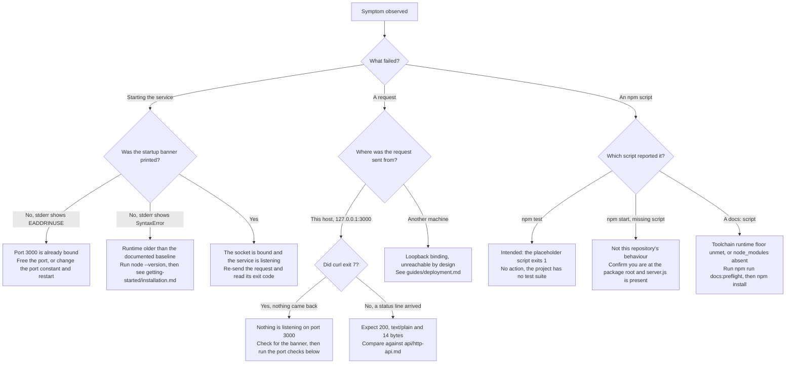

# Troubleshooting

What you see when this service misbehaves, what causes it, and what to do
about it. Five symptoms are covered. Two of them are **intended behaviour**
rather than defects, and one is a symptom that **does not occur in this
repository** at all — each is labelled as such, because a reader who "fixes"
one of those has changed something that was never broken.

Source files this page derives from: `server.js`, `package.json`.

This page expands the Troubleshooting section of the root
[README](../../README.md) rather than replacing it, and it owns the verbatim
crash transcript, the per-platform port commands and the symptom matrix for
the whole documentation corpus. Every transcript below was captured by running
the command shown above it, on Node.js `v22.23.2` with npm `11.18.0`. Where a
command could not be executed on the verification platform it is shown
**without output** rather than with invented output, and the platform it
targets is named.

## How to use this page

Start from what you can actually observe: whether the process printed its
startup banner, where the failing request was sent from, and which command
reported the error. The tree below routes those observations to a remediation;
the [Symptom matrix](#symptom-matrix) is the same routing in table form, and
each row links to the section that carries the evidence.



## Symptom matrix

Each cell is deliberately one line. The evidence, the verbatim transcripts and
the per-platform commands are in the sections that follow.

| Symptom | Cause | Remediation | Details |
| --- | --- | --- | --- |
| `Error: listen EADDRINUSE: address already in use 127.0.0.1:3000`, no banner, process exits 1 | Another process already holds TCP port 3000 | Free the port, or change the `port` constant and restart | [EADDRINUSE on start](#eaddrinuse-on-start) |
| Answers on `127.0.0.1` but a request from another machine gets no response at all | The *loopback binding* — the `hostname` constant is `127.0.0.1`. `Source: server.js:L3` | **Expected.** Front the process rather than widening the bind address | [Reachable on this host but not from another machine](#reachable-on-this-host-but-not-from-another-machine) |
| `npm test` prints `Error: no test specified` and exits 1 | The unmodified npm-init placeholder; this project has no test suite | **Intended.** Nothing to do, and nothing to change | [npm test fails](#npm-test-fails) |
| `npm error Missing script: "start"` | **Does not occur in this repository.** It requires either no `server.js` at the package root, or a working directory that is not the package root | Run from the repository root, and confirm `server.js` is present there | [npm start reported as missing](#npm-start-reported-as-missing) |
| An unexpected `SyntaxError` while the process starts | A runtime older than the documented baseline | Run `node --version` and compare it against the baseline | [An unexpected SyntaxError on startup](#an-unexpected-syntaxerror-on-startup) |

## `EADDRINUSE` on start

The port is the source constant `3000`, and nothing overrides it at runtime, so
every instance tries to bind the same port and two instances cannot coexist on
one host. `Source: server.js:L4` The bind itself happens in the `server.listen`
call. `Source: server.js:L12`

Reproduce it by starting a second instance while the first still holds the port.
The second process exits immediately, so this does not block:

```bash
node server.js > instance-1.log 2>&1 &
sleep 1
node server.js
echo "exit code: $?"
```

The first process is unaffected — it keeps the port and keeps serving. The
second writes **nothing at all to stdout**, so the startup banner never
appears, and writes this to stderr:

```text
node:events:497
      throw er; // Unhandled 'error' event
      ^

Error: listen EADDRINUSE: address already in use 127.0.0.1:3000
    at Server.setupListenHandle [as _listen2] (node:net:1941:16)
    at listenInCluster (node:net:1998:12)
    at node:net:2207:7
    at process.processTicksAndRejections (node:internal/process/task_queues:89:21)
Emitted 'error' event on Server instance at:
    at emitErrorNT (node:net:1977:8)
    at process.processTicksAndRejections (node:internal/process/task_queues:89:21) {
  code: 'EADDRINUSE',
  errno: -98,
  syscall: 'listen',
  address: '127.0.0.1',
  port: 3000
}

Node.js v22.23.2
```

It then exits with `exit code: 1`.

The missing banner is the signal worth remembering: if that first line never
appears, the socket was never bound, whatever else the terminal shows.

### Why the failure is fatal rather than recoverable

No `'error'` listener is registered on the server object anywhere in the
module — the only call ever made on it is `server.listen`.
`Source: server.js:L12` An `'error'` event with no listener is thrown rather
than reported, which is precisely what the second line of the transcript above
records: `throw er; // Unhandled 'error' event`.

So the process dies during startup. It does not retry, it does not fall back to
another port, and it never reaches the *startup callback* that would have
printed the banner. `Source: server.js:L12-L14`

That is why the remediation is to **free the port** rather than to retry: there
is no recovery path inside the process to retry with, and re-running the same
command against the same occupied port reproduces the identical crash.

### Remediation 1 — free the port

Identify the owning process first. On Linux and macOS:

```bash
lsof -i :3000
```

```text
COMMAND    PID USER FD   TYPE  DEVICE SIZE/OFF NODE NAME
node    436694 root 21u  IPv4 1184457      0t0  TCP localhost:3000 (LISTEN)
```

On Linux where `lsof` is absent, `ss` answers the same question. This is the
alternative actually used on the verification platform, so its output is real:

```bash
ss -ltnp "sport = :3000"
```

```text
State  Recv-Q Send-Q Local Address:Port Peer Address:PortProcess                           
LISTEN 0      511        127.0.0.1:3000      0.0.0.0:*    users:(("node",pid=436694,fd=21))
```

On Windows. This command targets Windows and so could not be executed on the
verification platform, which was Linux. It is therefore shown without output
rather than with invented output:

```bash
netstat -ano | findstr :3000
```

Then stop the process. On Linux and macOS:

```bash
kill $(lsof -t -i:3000)
```

On Windows, take the PID from the `netstat` output above:

```bash
taskkill /PID <pid> /F
```

Minimal container images frequently ship without `lsof`, `ss` and `netstat`
alike. Where none of them is installed, the portable check in
[Verifying the port binding and the running process](#verifying-the-port-binding-and-the-running-process)
needs nothing but Node and works everywhere the service itself works.

### Remediation 2 — change the port and restart

If the process holding the port is not yours to stop, change the `port`
constant instead and restart. `Source: server.js:L4` The option matrix and the
edit-and-restart procedure are owned by
[../getting-started/configuration.md](../getting-started/configuration.md) and
are deliberately not repeated here. The banner reports whichever port is
actually in force, so the restart confirms the change immediately.
`Source: server.js:L13`

## Reachable on this host but not from another machine

**This is expected, not broken.** The listener is bound to the IPv4 loopback
literal, so it accepts connections arriving over the loopback interface and
over no other. `Source: server.js:L3`

The failure is silent rather than loud: the connection is refused beneath Node,
so nothing reaches the *request listener*, nothing is written to the log, and
the service emits no signal that would explain it. `Source: server.js:L6-L10`

```bash
curl -sS -i --max-time 5 "http://$(hostname -I | awk '{print $1}'):3000/"
echo "curl exit code: $?"
```

```text
curl: (7) Failed to connect to 10.76.7.8 port 3000 after 0 ms: Could not connect to server
curl exit code: 7
```

The address in that message is whatever `hostname -I` resolved on the
verification host; yours will differ. **Exit code 7 is curl's
failed-to-connect status**, and the absence of everything else is the finding:
no status line, no header and no body, because no connection was ever
established.

### Exit code 7 alone does not tell you which problem you have

A request to `127.0.0.1:3000` while the service is **not running** fails in
exactly the same way — same status, same message shape, only the address
differs:

```text
curl: (7) Failed to connect to 127.0.0.1 port 3000 after 0 ms: Could not connect to server
curl exit code: 7
```

So exit code 7 cannot on its own distinguish *the service is not running* from
*the service is running but loopback-bound*. Two observations separate them,
and both are cheap:

| Observation | Not running | Running, loopback-bound |
| --- | --- | --- |
| The startup banner in the service's own terminal or log | Absent | Present |
| A listening socket on port 3000 (`lsof -i :3000`, or the portable probe below) | No row; `lsof` exits 1 with no output | One `LISTEN` row on `127.0.0.1:3000` |

The explanation of the constraint itself, and the two ways to change
reachability, are owned by [deployment.md](deployment.md).

## `npm test` fails

**This is intended.** `scripts.test` is still the placeholder npm generates for
a new project, and this project has no test suite. `Source: package.json`

```bash
npm test
```

```text
> hello_world@1.0.0 test
> echo "Error: no test specified" && exit 1

Error: no test specified
```

The command exits 1 and writes nothing to stderr. That is the placeholder doing
exactly what it was written to do — **not** a broken environment, **not** a
failed install and **not** a failing test. Nothing in this repository is
exercised by `npm test`, so read the non-zero exit as documentation of an
absence.

The script is deliberately left as it is. Replacing it would be test work
rather than documentation work, so it stays, and its exit code stays 1. The
commands that do verify something are the documentation gates:

```bash
npm run docs:check
```

## `npm start` reported as missing

**`npm start` works in this repository, and always has.** If you are looking
for this symptom, the cause is almost certainly the working directory rather
than the manifest.

With the explicit `start` script the manifest declares:

```bash
npm start
```

```text
> hello_world@1.0.0 start
> node server.js

Server running at http://127.0.0.1:3000/
```

It worked before that script existed, too. npm's built-in default `start`
script is `node server.js` whenever a `server.js` is present at the package
root, so no `start` key is required for the command to resolve. Verified by
reconstructing the earlier manifest — whose `scripts` block contained only
`test` — in an isolated scratch package beside a copy of `server.js`, then
running the same command: the output was identical to the transcript above,
`> node server.js` line included.

The genuine error, when it does occur, looks like this. It was captured from a
scratch package with no `start` key **and** no `server.js` at the package root,
which is the condition that actually produces it:

```text
npm error Missing script: "start"
npm error
npm error Did you mean one of these?
npm error   npm star # Mark your favorite packages
npm error   npm stars # View packages marked as favorites
npm error
npm error To see a list of scripts, run:
npm error   npm run
```

One further line naming a host-specific npm debug-log path follows in the real
output. It is elided here rather than pasted because the path differs on every
machine; nothing else was removed.

Two conditions produce that error, and neither holds in an intact checkout:

| Condition | Why it resolves normally here |
| --- | --- |
| No `server.js` at the package root, because it was renamed or moved | `server.js` is present at the root, which is what npm's default `start` resolves to |
| `npm start` run from a directory that is not the package root | The command must be run from the repository root, where `package.json` sits |

Check both before looking any further:

```bash
pwd
ls server.js
```

## An unexpected `SyntaxError` on startup

A `SyntaxError` raised while the process starts means the runtime cannot parse
the module, which points at a Node.js older than the documented baseline. The
diagnostic is one command:

```bash
node --version
```

```text
v22.23.2
```

**This failure was not reproducible on the verification runtime, so no
transcript of it is shown** — inventing one would be worse than omitting it.
It is also worth knowing how unlikely it is: the newest syntax the module uses
is arrow functions and template literals, both ES2015.
`Source: server.js:L6`, `Source: server.js:L13` A runtime merely somewhat below
the baseline will therefore usually parse and run this module without
complaint, and a genuine `SyntaxError` from it implies something far older than
the baseline rather than marginally older.

The baseline itself, and what to do when your runtime is below it, are owned by
[../getting-started/installation.md](../getting-started/installation.md).

A related failure is easy to mistake for this one. The `docs:*` scripts hold a
separate, higher runtime floor than the service does, and they enforce it by
failing closed before any tool runs:

```bash
npm run docs:preflight
```

```text
> hello_world@1.0.0 docs:preflight
> node tools/check-doc-runtime.js

documentation toolchain runtime check: node v22.23.2 satisfies devEngines.runtime ">=22.12.0"
```

Below that floor the same command exits non-zero and names the version it found
alongside the range it needed, so a documentation build reports the reason
instead of emitting broken output. That floor governs only the `docs:*`
scripts — `npm start` and `npm test` are unaffected by it — and both floors are
documented together in
[../getting-started/installation.md](../getting-started/installation.md).

## Verifying the port binding and the running process

Three questions, in increasing order of specificity: is anything listening, is
it this service, and is the source even parseable. Output is shown only for the
commands that were executed on the verification platform, which was Linux.

| Question | Platform | Command | Output shown |
| --- | --- | --- | --- |
| Is anything listening on port 3000? | Linux, macOS | `lsof -i :3000` | Yes, below |
| Is anything listening on port 3000? | Linux, where `lsof` is absent | `ss -ltnp "sport = :3000"` | Yes, in Remediation 1 above |
| Is anything listening on port 3000? | Windows | `netstat -an \| findstr 3000` | No — not executable on Linux |
| Is anything listening on port 3000? | Any platform with Node | The portable probe below | Yes, below |
| Which process holds the port? | Linux, macOS | `lsof -t -i:3000` | Yes, below |
| Which process holds the port? | Linux, macOS | `pgrep -af 'node server.js'` | Yes, below |
| Which process holds the port? | Windows | `netstat -ano \| findstr :3000`, then `tasklist /FI "PID eq <pid>"` | No — not executable on Linux |

### Is anything listening, and which process holds the port?

Captured while the service was running — the PID is this run's and yours will
differ:

```bash
lsof -t -i:3000
pgrep -af 'node server.js'
```

```text
436694
436694 node server.js
```

With nothing listening, both commands print no output and exit 1. That pair of
empty results is the positive confirmation that the port is free and the
service is stopped, so treat the empty output as the answer rather than as a
failed command.

The portable check needs nothing but Node, which makes it the one that works on
a minimal image with no `lsof`, no `ss` and no `netstat`:

```bash
node -e "const s=require('net').connect(3000,'127.0.0.1');s.on('connect',()=>{console.log('port 3000 on 127.0.0.1 is in use');s.end();});s.on('error',()=>console.log('port 3000 on 127.0.0.1 is free'));"
```

Captured with nothing listening, and again while the service was running:

```text
port 3000 on 127.0.0.1 is free
port 3000 on 127.0.0.1 is in use
```

### Is the thing on port 3000 actually this service?

```bash
curl -sS -i http://127.0.0.1:3000/
```

```text
HTTP/1.1 200 OK
Content-Type: text/plain
Date: Tue, 04 Aug 2026 19:15:19 GMT
Connection: keep-alive
Keep-Alive: timeout=5
Content-Length: 14

Hello, World!
```

`Date` is a per-request volatile value that Node supplies automatically, so it
advances with the clock and will not match the transcript above; it is kept
exactly as captured rather than trimmed away. Every request receives that same
*catch-all response*, so the path you probe makes no difference to this check.
The contract itself — which headers are stable, what the body is, and why
neither the path nor the method changes it — is owned by
[../api/http-api.md](../api/http-api.md). Anything else answering on port 3000
is a different process, however plausible its response looks.

The readiness check is the banner, which is emitted once the socket is bound
and reads exactly:

```text
Server running at http://127.0.0.1:3000/
```

`Source: server.js:L12-L14`, with the interpolated template literal at
`Source: server.js:L13`. Stopping the service is `Ctrl+C`, which is an
immediate termination rather than a drain because no shutdown handler exists
anywhere in the module; that behaviour is owned by
[../getting-started/installation.md](../getting-started/installation.md).

### Is the source even parseable?

```bash
node --check server.js
echo "exit code: $?"
```

```text
exit code: 0
```

It prints nothing and exits 0, which is the whole result: the module parses.
A non-zero exit with a `SyntaxError` means the file will not parse at all, and
no amount of port checking will help until that is fixed.

## See also

- [../../README.md](../../README.md) — the canonical project overview, whose
  Troubleshooting section this page expands.
- [../README.md](../README.md) — the documentation index, the glossary of the
  four fixed terms, and which page owns which fact.
- [deployment.md](deployment.md) — owner of the *loopback binding* constraint,
  reverse-proxy fronting and process supervision.
- [../getting-started/installation.md](../getting-started/installation.md) —
  owner of the runtime baseline and of the run, verify and stop commands.
- [../getting-started/configuration.md](../getting-started/configuration.md) —
  owner of the `hostname` and `port` option matrix and the change procedure.
- [../api/http-api.md](../api/http-api.md) — owner of the HTTP response
  contract a healthy service satisfies.
