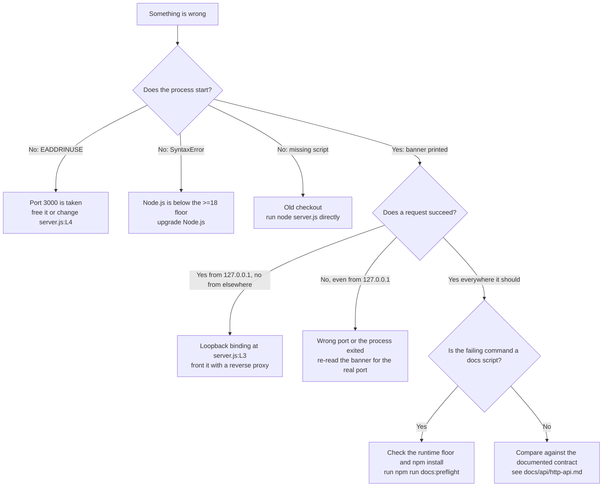

# Troubleshooting

Every failure this service and its tooling produce in normal use, what causes
each one, and what to do about it. Two of the entries are **intended
behaviour** rather than defects, and they are marked as such.

Source files this page derives from: `server.js`, `package.json`.

## Symptom matrix

| Symptom | Cause | Remedy |
| --- | --- | --- |
| `Error: listen EADDRINUSE: address already in use 127.0.0.1:3000` at startup | Another process holds port 3000 | Free the port, or change `port` at `server.js:L4`. See [Port already in use](#port-already-in-use) |
| Works on `127.0.0.1`, refused from another machine | The loopback binding at `server.js:L3` | Expected. See [Unreachable from another machine](#unreachable-from-another-machine) |
| `npm test` exits 1 with `Error: no test specified` | The npm-init placeholder script; this project has no test suite | **Intended.** See [npm test fails](#npm-test-fails) |
| `npm start` reports a missing script | A checkout from before the `start` script was added | Run `node server.js`, or update the checkout |
| A syntax error on startup | Node.js older than the `>=18` floor | Upgrade Node.js. See [Unsupported Node.js version](#unsupported-nodejs-version) |
| `PORT=8080 node server.js` still serves on 3000 | No environment variable is read anywhere | **Intended.** See [../getting-started/configuration.md](../getting-started/configuration.md) |
| A `docs:*` script exits 1 before doing anything | Node.js below the `devEngines.runtime` floor of `>=22.12.0` | Upgrade Node.js for documentation work; the service itself still runs on `>=18` |
| `npm run docs:md` or `docs:api` cannot find its generator | `node_modules` is absent | Run `npm install` (or `npm ci`) first |

## Decision tree



## Port already in use

The full failure, captured:

```text
node:events:497
      throw er; // Unhandled 'error' event
      ^

Error: listen EADDRINUSE: address already in use 127.0.0.1:3000
    at Server.setupListenHandle [as _listen2] (node:net:1941:16)
    at listenInCluster (node:net:1998:12)
    at node:net:2207:7
```

The stack trace is unhandled because the module registers no `error` handler on
the server; the `listen()` call at `server.js:L12` fails and the process exits.

### Finding the owning process

Use your platform's tooling. On Linux and macOS:

```bash
lsof -i :3000
```

On Windows:

```bash
netstat -ano | findstr :3000
```

Neither tool is guaranteed to be installed — minimal container images frequently
ship without `lsof`, `ss`, and `netstat` alike. This check needs nothing but
Node, and works everywhere the service itself works:

```bash
node -e "const s=require('net').connect(3000,'127.0.0.1');s.on('connect',()=>{console.log('port 3000 on 127.0.0.1 is in use');s.end();});s.on('error',()=>console.log('port 3000 on 127.0.0.1 is free'));"
```

Captured output while the service was running:

```text
port 3000 on 127.0.0.1 is in use
```

### Clearing it

On Linux and macOS:

```bash
kill $(lsof -t -i:3000)
```

On Windows, take the PID from the `netstat` output above and then:

```bash
taskkill /PID <pid> /F
```

If the process holding the port is not yours to stop, change `port` at
`server.js:L4` instead and restart. The banner reports whichever port is
actually in force.

## Unreachable from another machine

This is expected, not broken. The listener is bound to the loopback address at
`server.js:L3`, so a connection from another host is refused at the transport
layer with no log line and no response.

Confirm which side the problem is on by testing both addresses from the host
running the service: `curl -i http://127.0.0.1:3000/` returns `200`, while the
same request to the host's own non-loopback address fails with
`curl: (7) … Could not connect to server`. Both transcripts, and the two ways to
change reachability, are in [deployment.md](deployment.md), which owns this
constraint.

## npm test fails

**This is intended.** `scripts.test` in `package.json` is still the placeholder
npm generates for a new project, and the project has no test suite:

```bash
npm test
```

Captured output:

```text
> hello_world@1.0.0 test
> echo "Error: no test specified" && exit 1

Error: no test specified
```

The command exits 1. That is the placeholder doing exactly what it was written to
do, not a broken environment and not a failing test. Nothing in the repository is
tested by `npm test`, and replacing the placeholder would be test work rather
than documentation work, so it is deliberately left as it is. The commands that
do verify something are the documentation gates:

```bash
npm run docs:check
```

## Unsupported Node.js version

Two floors exist, and they fail differently.

| Floor | Declared as | Applies to | Failure mode when unmet |
| --- | --- | --- | --- |
| `>=18` | `engines.node` | Running `server.js` | Advisory to npm, so usually a later `SyntaxError` or a runtime error rather than a clear refusal |
| `>=22.12.0` | `devEngines.runtime` | The `docs:*` scripts | The preflight check fails closed with an explicit message before the tool runs |

Check the documentation floor directly:

```bash
npm run docs:preflight
```

Captured output on a supported runtime:

```text
documentation toolchain runtime check: node v22.23.2 satisfies devEngines.runtime ">=22.12.0"
```

Below the floor the same command exits 1 and names the version it found and the
range it needed, so a documentation build never half-succeeds on an unsupported
runtime. Note that the manifest's own `devEngines` policy is `warn`, which is
what keeps `npm start` and `npm test` usable on an older runtime while the
documentation gates stay strict.

## Verifying the running service

Three checks, in increasing order of specificity:

```bash
npm run docs:preflight
```

```bash
node -e "const s=require('net').connect(3000,'127.0.0.1');s.on('connect',()=>{console.log('port 3000 on 127.0.0.1 is in use');s.end();});s.on('error',()=>console.log('port 3000 on 127.0.0.1 is free'));"
```

```bash
curl -i http://127.0.0.1:3000/
```

The first confirms the toolchain runtime, the second that something is listening,
and the third that what is listening is this service — a `200` with
`Content-Type: text/plain` and a 14-byte `Hello, World!` body. Anything else on
port 3000 is a different process, however plausible its response looks.

## See also

- [../../README.md](../../README.md) — the canonical overview, whose
  Troubleshooting section this page expands.
- [deployment.md](deployment.md) — owner of the loopback-binding constraint and
  the deployment runbook.
- [../getting-started/installation.md](../getting-started/installation.md) —
  owner of the runtime baseline.
- [../api/http-api.md](../api/http-api.md) — the contract a healthy service
  satisfies.
